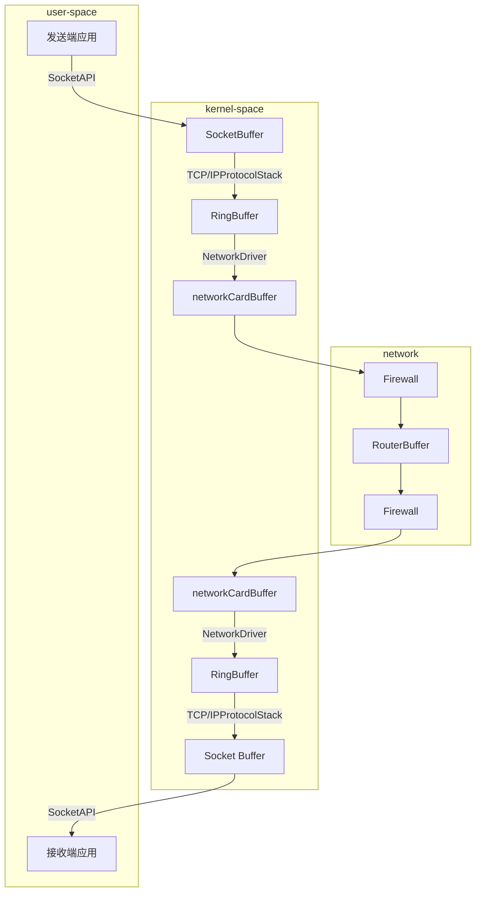

```mermaid
graph TD

subgraph user-space
sender[发送端应用]
end

subgraph kernel-space
sender-socket-buffer[SocketBuffer]
sender-ring-buffer[RingBuffer]
sender-network-card-buffer[networkCardBuffer]
end

subgraph network
sender-router-firewall[Firewall]
router-buffer[RouterBuffer]
receiver-outer-firewall[Firewall]
end

subgraph kernel-space
receiver-network-card-buffer[networkCardBuffer]
receiver-ring-buffer[RingBuffer]
receiver-socket-buffer[Socket Buffer]
end

subgraph user-space
receiver[接收端应用]
end

sender -- SocketAPI --> sender-socket-buffer
sender-socket-buffer -- TCP/IPProtocolStack --> sender-ring-buffer
sender-ring-buffer -- NetworkDriver --> sender-network-card-buffer
sender-network-card-buffer --> sender-router-firewall
sender-router-firewall --> router-buffer
router-buffer --> receiver-outer-firewall
receiver-outer-firewall --> receiver-network-card-buffer
receiver-network-card-buffer -- NetworkDriver --> receiver-ring-buffer
receiver-ring-buffer -- TCP/IPProtocolStack --> receiver-socket-buffer
receiver-socket-buffer -- SocketAPI --> receiver

```
