# MongoDB Cluster 分片部署
## 分片部署架构示意图
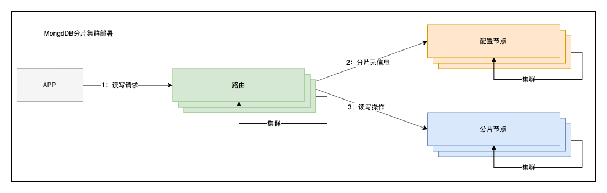
随着数据的增长，单机实例的瓶颈是很明显的。可以通过复制的机制应对压力，但mongodb中单个集群的 节点数量限制到了12个以内，所以需要通过分片进一步横向扩展。此外分片也可节约磁盘的存储。

MongoDB分片+副本集集群环境搭建

## 1分片中的节点说明

* 路由节点\(mongos\)：用于分发用户的请求，起到反向代理的作用。
* 配置节点\(config\)：用于存储分片的元数据信息，路由节基于元数据信息 决定把请求发给哪个分片。（3.4版本之后，该节点，必须使用复制集。）
* 分片节点\(shard\):用于实际存储的节点，其每个数据块默认为64M，满了之后就会产生新的数据库。

开启分片功能
分片有三部分组成，路由，配置信息，分片；数据存储在分片上，在配置信息上记录数据存储的节点，在路由上访问时选择分片。
每个分片的大小可以配置默认64M


## 集群部署规划
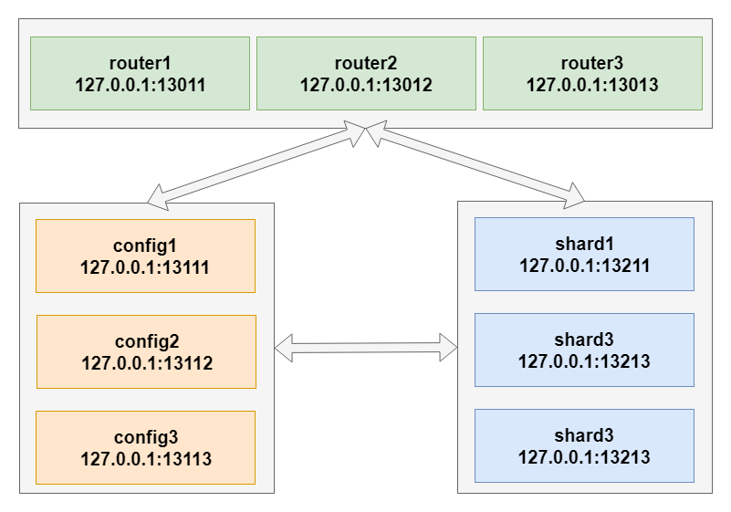

### 准备工作
[准备工作参考](chapter0.md)

### shard节点集群(2个起步)
#### 配置

1. shard-13211.conf
> dbpath=/home/mongodb/shard/shard-13211
>
> logpath=/home/mongodb/logs/shard-13211.log
>
> port=13211
>
> fork=true
>
> logappend=true
>
> maxConns=5000
>
> storageEngine=mmapv1
>
> replSet=shard1
>
> shardsvr=true

2. shard-13212.conf
> dbpath=/home/mongodb/shard/shard-13212
>
> logpath=/home/mongodb/logs/shard-13212.log
>
> port=13212
>
> fork=true
>
> logappend=true
>
> maxConns=5000
>
> storageEngine=mmapv1
>
> replSet=shard1
>
> shardsvr=true

3. shard-13213.conf
> dbpath=/home/mongodb/shard/shard-13213
>
> logpath=/home/mongodb/logs/shard-13213.log
>
> port=13213
>
> fork=true
>
> logappend=true
>
> maxConns=5000
>
> storageEngine=mmapv1
>
> replSet=shard1
>
> shardsvr=true

#### 启动
```
mongod -f /home/mongodb/shard/shard-13211.conf
mongod -f /home/mongodb/shard/shard-13212.conf
mongod -f /home/mongodb/shard/shard-13213.conf
```

### config节点集群（3个起步）
#### 配置
1. config-13111.conf
> dbpath=/home/mongodb/config/config-13111
> 
> logpath=/home/mongodb/logs/config-13111.log
>
> port=13111
>
> fork=true
>
> replSet=configCluster
>
> configsvr=true

2. config-13112.conf
> dbpath=/home/mongodb/config/config-13112
> 
> logpath=/home/mongodb/logs/config-13112.log
>
> port=13112
>
> fork=true
>
> replSet=configCluster
>
> configsvr=true

3. config-13113.conf
> dbpath=/home/mongodb/config/config-13113
> 
> logpath=/home/mongodb/logs/config-13113.log
>
> port=13113
>
> fork=true
>
> replSet=configCluster
>
> configsvr=true

#### 启动
```
mongod -f /home/mongodb/config/config-13111.conf
mongod -f /home/mongodb/config/config-13112.conf
mongod -f /home/mongodb/config/config-13113.conf
```

#### 集群
使用客户端连接任意config节点
```
mongo --port 13111
rs.status();
```
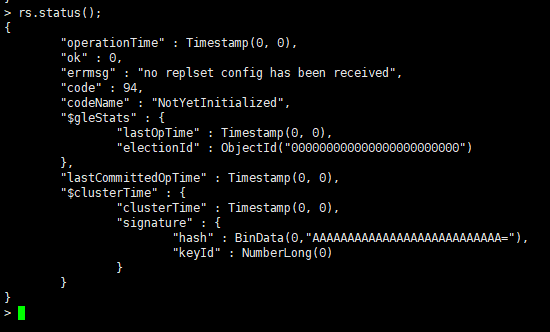
```
var cfg ={"_id":"configCluster","protocolVersion" : 1,"members":[{"_id":0,"host":"127.0.0.1:13111"},{"_id":1,"host":"127.0.0.1:13112"},{"_id":2,"host":"127.0.0.1:13113"}]}
rs.initiate(cfg)
rs.status()
```
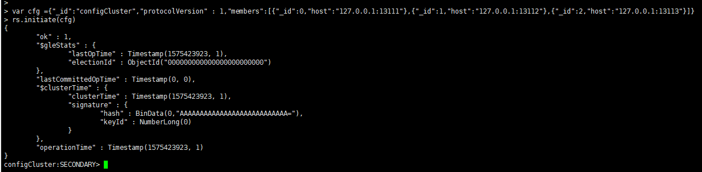
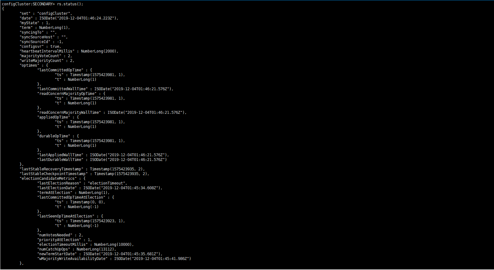
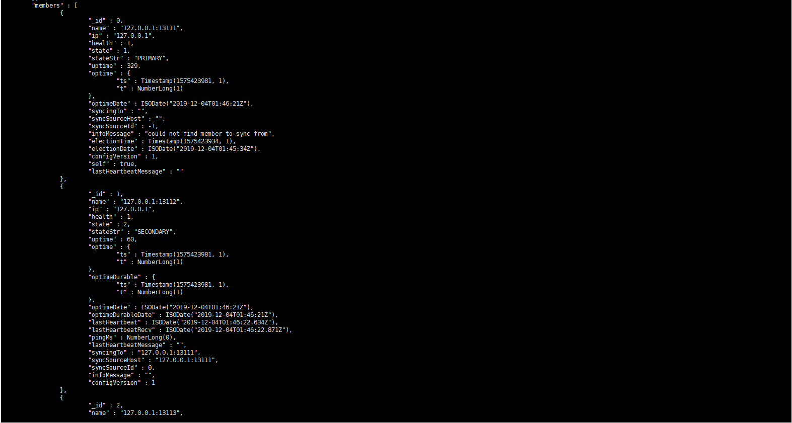
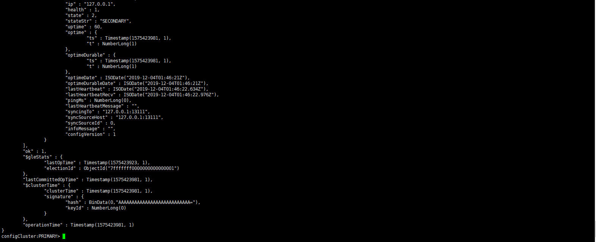

### router节点集群（1个起步）
#### 配置
1. route-13011.conf
> port=13011
>
> fork=true
>
> bind\_ip=0.0.0.0
> 
> logpath=/home/mongodb/logs/route-13011.log
>
> configdb=configCluster/127.0.0.1:13111,127.0.0.1:13112,127.0.0.1:13113

2. route-13012.conf
> port=13012
>
> bind\_ip=0.0.0.0
> 
> fork=true
>
> logpath=/home/mongodb/logs/route-13012.log
>
> configdb=configCluster/127.0.0.1:13111,127.0.0.1:13112,127.0.0.1:13113

3. route-13013.conf
> port=13013
>
> bind\_ip=0.0.0.0
> 
> fork=true
>
> logpath=/home/mongodb/logs/route-13013.log
>
> configdb=configCluster/127.0.0.1:13111,127.0.0.1:13112,127.0.0.1:13113

#### 启动
```
mongos -f /home/mongodb/routers/route-13011.conf
mongos -f /home/mongodb/routers/route-13012.conf
mongos -f /home/mongodb/routers/route-13013.conf
```
#### 添加分片节点
登录任意路由节点
```
mongo --port 13011
sh.status()
```
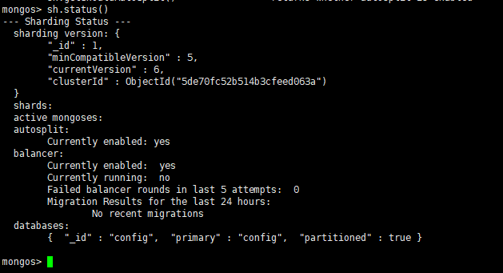
```
sh.addShard("127.0.0.1:13211")
sh.addShard("127.0.0.1:13212")
sh.addShard("127.0.0.1:13213")
sh.status()
```
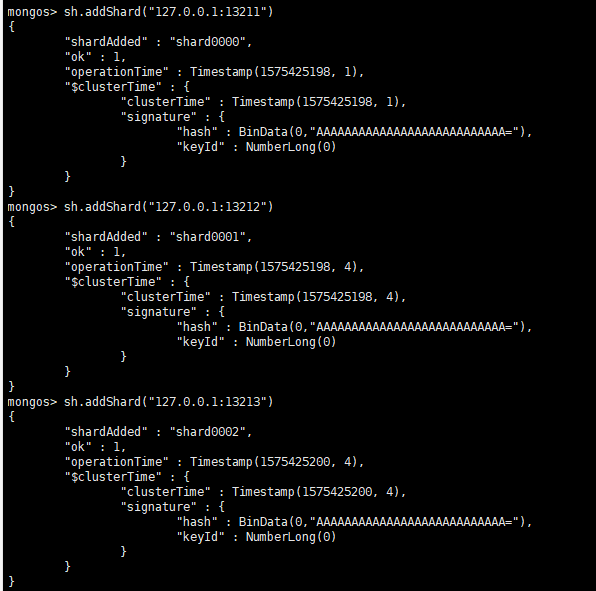
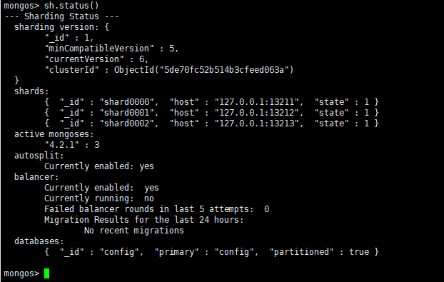

集群部署完毕
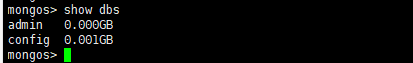

#### [为分片添加副本集](chapter1.md)

## 业务设置
### 为数据库开启分片功能
```
sh.enableSharding("cluster_test")
``` 
### 为数据集开启分片功能 
```
use cluster_test
db.cluster_test.createIndex({"id":1}) # 以"id"作为索引
sh.shardCollection("cluster_test.collection_shard_test,{"_id":1}")
```
### 修改分片大小（测试可选操作，单位M）
```
use config
db.settings.find()
db.settings.save({_id:"chunksize",value:1})
```

### 插入测试数据
```
use cluster_test
for(i=1;i<=50000;i++){db.collection_shard_test.insert({"id":i,"name":"DingPengwei"+i,"email":"www.dingPengwei@foxmail"+i})}
```

###  #################################################################################################


## 用户管理与数据集验证

创建管理员用户

> use admin;
>
> db.createUser\({"user":"admin","pwd":"123456","roles":\["root"\]}\)
>
> \#验证用户信息
>
> db.auth\("admin","123456"\)
>
> \#查看用户信息
>
> db.getUsers\(\) 
>
> \# 修改密码
>
> db.changeUserPassword\("admin","123456"\)

以auth 方式启动mongod，需要添加auth=true 参数 ，mongdb 的权限体系才会起作用：

> \#以auth 方向启动mongod （也可以在mongo.conf 中添加auth=true 参数）
>
> ./bin/mongod -f conf/mongo.conf --auth
>
> \# 验证用户
>
> use admin;
>
> db.auth\("admin","123456"\)

创建只读用户

> db.createUser\({"user":"dev","pwd":"123456","roles":\["read"\]}\)

重新登陆 验证用户权限

> use test  ;
>
> db.auth\("dev","123456"\)


https://www.cnblogs.com/wangshouchang/p/6920390.html


https://cloud.tencent.com/developer/article/1509156

https://www.cnblogs.com/littleatp/p/8563273.html
