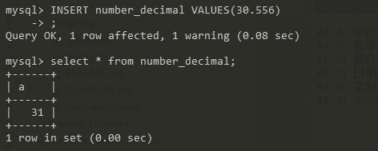
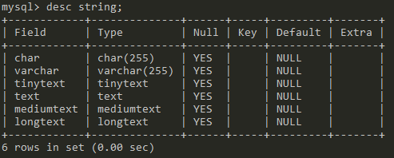
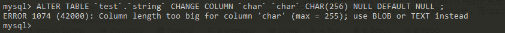
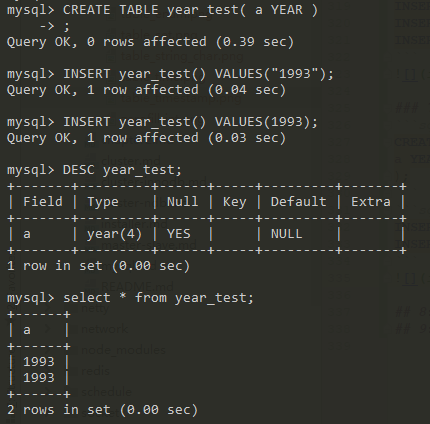

## 1：数据类型  

MySQL支持的数据类型有：数值类型，字符串类型，枚举类型，集合类型，日期时间类型，空间类型，JSON类型，其中作为常用的是数值类型，字符串类型，日期时间类型。

数据类型描述使用以下约定：

+ M表示整数类型的最大显示宽度。
+ 对于浮点和定点类型M是可以存储的总位数。
+ 对于字符串类型M是最大长度。
+ 允许的最大值M取决于数据类型。
+ D适用于浮点和定点类型，指示小数点后面的位数。最大可能值为30，但不应大于 M-2。
+ [ ]表示类型定义的可选部分。    
## 2：约束条件

约束条件就是在给字段加一些约束，使该字段存储的值更加符合我们的预期。

常用约束条件有以下这些

+ UNSIGNED ：无符号，值从0开始，无负数
+ ZEROFILL：零填充，当数据的显示长度不够的时候可以使用前补0的效果填充至指定长度,字段会自动添加UNSIGNED
+ NOT NULL：非空约束，表示该字段的值不能为空
+ DEFAULT：表示如果插入数据时没有给该字段赋值，那么就使用默认值
+ PRIMARY KEY：主键约束，表示唯一标识，不能为空，且一个表只能有一个主键。一般都是用来约束id
+ AUTO_INCREMENT：自增长，只能用于数值列，而且配合索引使用,默认起始值从1开始，每次增长1
+ UNIQUE KEY：唯一值，表示该字段下的值不能重复，null除外。比如身份证号是一人一号的，一般都会用这个进行约束
+ FOREIGN KEY：外键约束，目的是为了保证数据的完成性和唯一性，以及实现一对一或一对多关系

### ZEROFILL 
使用该约束后当数据的长度比我们指定的显示宽度小的时候会使用前补0的效果填充至指定长度,字段会自动添加UNSIGNED

下面我们新建个表试一下，这次我们来指定一下显示宽度
```
CREATE TABLE zerofill_int(
a TINYINT(8) ZEROFILL,
b INT(12)
);
```
插入一条记录然后查询：
```
INSERT zerofill_int() VALUES(12,12);
SELECT * FROM zerofill_int;
```


可以看到，12变成了00000012，自动在前面补了0，这是因为指定的显示宽度是8，但是12只有两位，所以在前面补0，使长度为8。这就是ZEROFILL的效果

## 3：数值类型

数值类型包括整数型、浮点型、定点型

### 3.1：整数型

+ TINYINT[(M)] [UNSIGNED] [ZEROFILL] 范围非常小的整数，有符号的范围是 -128到127，无符号的范围是0到 255
+ SMALLINT[(M)] [UNSIGNED] [ZEROFILL] 范围较小的整数，有符号的范围是 -32768到32767，无符号的范围是0到 65535
+ MEDIUMINT[(M)] [UNSIGNED] [ZEROFILL] 中等大小的整数，有符号的范围是 -8388608到8388607，无符号的范围是0到 16777215。
+ INT[(M)] [UNSIGNED] [ZEROFILL] 正常大小的整数，有符号的范围是 -2147483648到 2147483647。无符号的范围是 0到4294967295。
+ BIGINT[(M)] [UNSIGNED] [ZEROFILL] 大整数，有符号的范围是 -9223372036854775808到 9223372036854775807，无符号的范围是0到 18446744073709551615。

|类型|字节|有符号最小值|有符号最大值|无符号最小值|无符号最大值|
|---|---|---|---|---|---|
|TINYINT|1|-128|127|0|255|
|SMALLINT|2|-32768|32767|0|65535|
|MEDIUMINT|3|-8399608|8388607|0|16777215|
|INT|4|-2147483648|2147483647|0|4294967295|
|BIGINT|8|-9223372036854775808|9223372036854775807|0|18446744073709551615|

如果不手动指定UNSIGNED，那么默认就是有符号的

验证整数型数据，首先创建一个表
```
CREATE TABLE number_int(
a TINYINT,
b SMALLINT,
c MIDDLEINT,
d INT,
e BIGINT
);
```
查看表结构
```
desc number_int
```


可以看到，每个字段类型后面都有一个括号，括号里面的有个数值，这个数值实际上就是字段的显示宽度，也就是M的值，M表示整数类型的最大显示宽度。最大显示宽度为255.显示宽度与类型可包含的值范围无关

我们在创建表的时候并没有指定字段类型的显示宽度，那么，默认的显示宽度则是该字段类型最大的显示宽度

例如字段a的显示宽度为4，是因为TINYINT有符号值的范围是-128到127， 
-128的长度为4（负号、1、2、8共四位），所以默认的显示宽度最大为4，其他的以此类推

下面我们再新建一个表，将字段a的修改为无符号类型的。再看看a字段的默认显示宽度 
```
CREATE TABLE number_int_unsigned(
a TINYINT UNSIGNED,
b SMALLINT UNSIGNED,
c MIDDLEINT UNSIGNED,
d INT UNSIGNED,
e BIGINT UNSIGNED
);
```

可以看到相对于有符号，无符号的显示宽度就减少了一位； // TODO BIGINT 怎么没有变化

### 3.2：浮点型

+ FLOAT[(M,D)] [UNSIGNED] [ZEROFILL]   
一个小的（单精度）浮点数。允许值是-3.402823466E+38 到-1.175494351E-38， 0以及1.175494351E-38 到3.402823466E+38,M是总位数，D是小数点后面的位数。
+ DOUBLE[(M,D)] [UNSIGNED] [ZEROFILL]  
正常大小（双精度）浮点数。允许值是 -1.7976931348623157E+308到-2.2250738585072014E-308，0以及 2.2250738585072014E-308到 1.7976931348623157E+308。M是总位数，D是小数点后面的位数

下面我们来用一下浮点型，创建表指定a字段为FLOAT类型，总长度为3，小数点后两位为2,b字段总长度为5，小数点后两位长度为3
```sql
CREATE TABLE number_float(
a FLOAT(3,2),
b DOUBLE(5,3)
);
```
查看一下结构
```sql
DESC number_float;
```


插入数据
```sql
INSERT number_float VALUES(1.345,2.2345);
INSERT number_float VALUES(1.456,2.3456);
```

查看一下数据，超出范围的小数会被截取，存在精度丢失问题。
```sql
select * from number_float;
```


### 3.3：定点型

+ DECIMAL[(M[,D])] [UNSIGNED] [ZEROFILL] 
常用于存储精确的小数，M是总位数，D是小数点后的位数。小数点和（负数） -符号不计入 M。如果 D为0，则值没有小数点或小数部分。最大位数（M）为 65. 最大支持小数（D）为30.如果D省略，则默认值为0.如果M省略，则默认值为10。M的范围是1到65。D范围为0到30，且不得大于M。  

首先创建表，指定M和D，查看结构
```sql
CREATE TABLE number_decimal(a DECIMAL);
```
  

可以看到，默认的总长度（M）为10，小数点位数(D)默认为0.  
插入一条数据
```sql
INSERT number_decimal VALUES(30.556)
```
  

可以看到，存进去的数值被四舍五入阶段了，也就是说，DECIMAL也在存储时存在精度丢失的问题。

### 3.3：超出范围和溢出处理
+ 当MySQL将值存储在超出列数据类型允许范围的数值列中时，结果取决于当时生效的SQL模式： 
+ 如果启用了严格的SQL模式，则MySQL会根据SQL标准拒绝带有错误的超出范围的值，并且插入失败。 
+ 如果未启用限制模式，MySQL会将值截断到列数据类型范围的相应端点，并存储结果值，并产生一个警告
+ [SQL模式文档](https://dev.mysql.com/doc/refman/8.0/en/sql-mode.html)
         
## 4：字符串类型
+ CHAR[(M)] 一个固定长度的字符串，在存储时始终用空格填充指定长度。 M表示以字符为单位的最大列长度。M的范围为0到255.如果M省略，则长度为1，存储时根据编码计算占用字节数，utf8为3M
+ VARCHAR(M)可变长度的字符串，M 表示字符的最大列长度，M的范围是0到65,535，存储时占用L+1（L<=M,L为实际字符的长度，1个字节记录实际长度）个字节
+ TINYTEXT[(M)] 不能有默认值，占用L+1个字节，L<2^8
+ TEXT[(M)] 不能有默认值，占用L+2个字节，L<2^16
+ MEDIUMTEXT[(M)] 不能有默认值，占用L+3个字节，L<2^24
+ LONGTEXT[(M)] 不能有默认值，占用L+4个字节，L<2^32

```mysql
CREATE TABLE `string` (
  `char` char(255) DEFAULT NULL,
  `varchar` varchar(255) DEFAULT NULL,
  `tinytext` tinytext,
  `text` text,
  `mediumtext` mediumtext,
  `longtext` longtext
) ENGINE=InnoDB DEFAULT CHARSET=utf8;
```

变更char长度
```mysql
ALTER TABLE `test`.`string` CHANGE COLUMN `char` `char` CHAR(256) NULL DEFAULT NULL ;
```

变更varchar长度
```mysql
 ALTER TABLE `test`.`string` CHANGE COLUMN `varchar` `varchar` VARCHAR(2560000) NULL DEFAULT NULL ;
```


由于使用utf8编码故21845*3=65535，实际只能放置21575个字符，21575*3-21845*8=-810（这些字节去哪里了？）


|类型|设定长度M|实际占用长度L|最大容量|最大容量|最大容量|
|---|---|---|---|---|---|
|CHAR|M|M|255|255 bytes||
|VARCHAR|M|L+1|65536|65,536 bytes||
|TINYTEXT|M|L+1|L<2^8|256 bytes|256B|
|TEXT|M|L+2|L<2^16|65,535 bytes|64K|
|MEDIUMTEXT|M|L+3|L<2^24| 16,777,215 bytes|16M|
|LONGTEXT|M|L+4|L<2^32|4,294,967,295 bytes|4GB|

### 4.1 CHAR和VARCHAR
创建表
```sql
CREATE TABLE string_char(
a CHAR(4),
b VARCHAR(4));
```
插入数据
```sql
INSERT string_char() VALUES("","");
INSERT string_char() VALUES("ab","ab");
INSERT string_char() VALUES("abcd","abcd");
INSERT string_char() VALUES("abcdefg","abcdefg");//在严格模式下，改条数据会插入失败，非严格模式则会对数据进行截取
```
查询结果


我们看到查询的结果是一样的，但实际上他们存储时占用的长度是不一样的。 
CHAR类型不管存储的值的长度是多少，都会占用M个字节，而VARCHAR则占用实际长度+1个字节。

|值|CHAR(4)|实际占用|VARCHAR(4)|实际占用|
|---|---|---|---|---|
|''|'    '|4字节|''|1字节|
|'ab'|'ab  '|4字节|'ab'|3字节|
|'abcd'|'abcd'|4字节|'abcd'|5字节|

但是CHAR的查询效果要高于VARCHAR，所以说，如果字段的长度能够确定的话，比如手机号，身份证号之类的字段，可以用CHAR类型，像地址，邮箱之类的就用VARCHAR

### 4.2 TEXT系列
TEXT系列的存储范围比VARCHAR要大，当VARCHAR不满足时可以用TEXT系列中的类型。需要注意的是TEXT系列类型的字段不能有默认值，在检索的时候不存在大小写转换，没有CHAR和VARCHAR的效率高

|类型|设定长度M|实际占用长度L|最大容量|最大容量|最大容量|
|---|---|---|---|---|---|
|CHAR|M|M|255|255 bytes||
|VARCHAR|M|L+1|65536|65,536 bytes||
|TINYTEXT|M|L+1|L<2^8|256 bytes|256B|
|TEXT|M|L+2|L<2^16|65,535 bytes|64K|
|MEDIUMTEXT|M|L+3|L<2^24| 16,777,215 bytes|16M|
|LONGTEXT|M|L+4|L<2^32|4,294,967,295 bytes|4GB|

## 5：枚举类型ENUM
+ ENUM('value1','value2',...) ENUM是一个字符串对象，其值从允许值列表中选择，它只能有一个值，从值列表中选择,最多可包含65,535个不同的元素
```sql
CREATE TABLE enum_test(gender ENUM("男","女"));
```
```sql
DESC enum_test;
```
```sql
INSERT enum_test() VALUES("男");
INSERT enum_test() VALUES(1); // 也可以使用编号插入值，等同于"男"，序号从1开始
INSERT enum_test() VALUES("女");
INSERT enum_test() VALUES(2); // 等同于"女"
```
```sql
SELECT * from enum_test;
```


ENUM只能从允许值列表中给字段插入一个值，插入一条不是枚举集合中的数据则会失败。

## 6：集合类型SET
+ SET('value1','value2',...) 字符串对象，该对象可以有零个或多个值，最多可包含64个不同的成员
```sql
CREATE TABLE set_test(
a SET('1','2','3','4','5')
);
```
```sql
INSERT set_test() VALUES('1');
INSERT set_test() VALUES('1,2,3');
```
```sql
SELECT * from set_test;
```


## 7：日期时间类型
+ TIME 范围是’-838:59:59.000000’ 到’838:59:59.000000’
+ DATE 支持的范围是 ‘1000-01-01’到 ‘9999-12-31’
+ DATETIME 日期和时间组合。支持的范围是 ‘1000-01-01 00:00:00.000000’到 ‘9999-12-31 23:59:59.999999’。
+ TIMESTAMP 时间戳。范围是’1970-01-01 00:00:01.000000’UTC到’2038-01-19 03:14:07.999999’UTC。
+ YEAR 范围是 1901到2155

### 7.1：DATE
```sql
CREATE TABLE date_test( 
a DATE);
```
```sql
INSERT date_test() VALUES(20180813); 
INSERT date_test() VALUES("2018-06-1"); 
INSERT date_test() VALUES("2018-4-1"); 
INSERT date_test() VALUES("2018-04-07");
```

### 7.2：TIME
TIME类型不仅可以用于表示一天中的时间（，还可以用于表示两个事件之间的经过时间或时间间隔。
TIME的完整的显示为 D HH:MM:SS。 
+ D：表示天数，当指定该值时，存储时小时会先乘以该值 
+ HH：表示小时 
+ MM：表示分钟 
+ SS:表示秒

```sql
CREATE TABLE time_test(
a TIME
);
```
```sql
INSERT time_test() VALUES('22:14:16');
--   -2表示间隔了2两天
INSERT time_test() VALUES('-2 22:14:16');
-- 有冒号从小时开始
INSERT time_test() VALUES('14:16');
-- 没有冒号且没有天数则数据从秒开始
INSERT time_test() VALUES('30');
-- 有天数也从小时开始
INSERT time_test() VALUES('3 10');
-- 直接使用数字代替也可以
INSERT time_test() VALUES(253621);
```

### 7.1：DATETIME
```sql
CREATE TABLE datetime_test(
a DATETIME
);
```
```sql
INSERT datetime_test() VALUES(20180102235432);
INSERT datetime_test() VALUES("2015-04-21 21:14:32");
INSERT datetime_test() VALUES("2015-04-23");
```


### 7.1：TIMESTAMP
TIMESTAMP和DATETIME使用上差不多，但是范围相对较小。
```sql
CREATE TABLE timestamp_test(
a TIMESTAMP
);
```
```sql
INSERT timestamp_test() VALUES(20020121);
INSERT timestamp_test() VALUES(20020121142554);
INSERT timestamp_test() VALUES("2015-12-16 21:14:15");
INSERT timestamp_test() VALUES("2015-12-17");
INSERT timestamp_test() VALUES(NULL);
INSERT timestamp_test() VALUES(CURRENT_TIMESTAMP);
INSERT timestamp_test() VALUES();
```


### 7.1：YEAR
```sql
CREATE TABLE year_test(
a YEAR
);
```
```sql
INSERT year_test() VALUES("1993");
INSERT year_test() VALUES(1993);
```


## 8：空间类型
## 9：JSON类型
