# Mysql数据库锁
## 定义
锁是计算机协调多个进程或线程并发访问某一资源的机制。

在数据库中，除了传统的计算资源（如CPU、RAM、I/O等）的争用以外，数据也是一种供需要用户共享的资源。如何保证数据并发访问的一致性、有效性是所有数据库必须解决的一个问题，锁冲突也是影响数据库并发访问性能的一个重要因素。从这个角度来说，锁对数据库而言显得尤其重要，也更加复杂。

## 锁的分类
- 从对数据操作的粒度分，分为表锁和行锁
- 从性能上分为乐观锁(用版本对比来实现)和悲观锁
- 从对数据库操作的类型分，分为读锁和写锁(都属于悲观锁)
  - 读锁（共享锁）：针对同一份数据，多个读操作可以同时进行而不会互相影响，写则等待读的完成。
  - 写锁（排它锁）：当前写操作没有完成前，它会阻断其他写锁和读锁。

## 表锁（使用场景偏向读特别多于写）
MyIASAM使用表级锁。表锁开销小，加锁快，不会出现死锁；但是锁的粒度大，发生锁冲突的概率高，并发访问效率比较低。

### 基本操作
- 建表SQL
```mysql
CREATE TABLE `mylock` (
`id` INT (11) NOT NULL AUTO_INCREMENT,
`NAME` VARCHAR (20) DEFAULT NULL,
PRIMARY KEY (`id`)
) ENGINE = MyISAM DEFAULT CHARSET = utf8;
``` 
- 插入数据
```mysql
INSERT INTO`test`.`mylock` (`id`, `NAME`) VALUES ('1', 'a');
INSERT INTO`test`.`mylock` (`id`, `NAME`) VALUES ('2', 'b');
INSERT INTO`test`.`mylock` (`id`, `NAME`) VALUES ('3', 'c');
INSERT INTO`test`.`mylock` (`id`, `NAME`) VALUES ('4', 'd');
```
- 手动增加表锁
```mysql
lock table 表名称 read(write),表名称2 read(write);
```
- 查看表上加过的锁
```mysql
show open tables;
```
- 删除表锁
```mysql
unlock tables;
```
- 加读锁
```mysql
lock table mylock read;
```
当前session和其他session都可以读该表

当前session中插入或者更新锁定的表都会报错，其他session插入或更新则会等待

- 加写锁
```mysql
lock table mylock write;
```
当前session对该表的增删改查都没有问题，其他session对该表的所有操作被阻塞


### MyIASAM引擎锁
MyISAM在执行查询语句(SELECT)前,会自动给涉及的所有表加读锁,在执行增删改操作前,会自动给涉及的表加写锁。

1、对MyISAM表的读操作(加读锁) ,不会阻寒其他进程对同一表的读请求,但会阻赛对同一表的写请求。只有当读锁释放后,才会执行其它进程的写操作。

2、对MylSAM表的写操作(加写锁) ,会阻塞其他进程对同一表的读和写操作,只有当写锁释放后,才会执行其它进程的读写操作

总结：简而言之，就是读锁会阻塞写，但是不会阻塞读。而写锁则会把读和写都阻塞。

## 行锁（使用场景偏向写比较频繁）
行锁偏向InnoDB存储引擎，开销大，加锁慢，会出现死锁，锁定粒度最小，发生锁冲突的概率最低，并发度也最高。

InnoDB与MYISAM的最大不同有两点：
1. 支持事务（TRANSACTION）
1. 采用了行级锁

### [MySQL行锁事务](chapter05.md)

### 行锁案例分析
用下面的表演示，需要开启事务，Session_1更新某一行，Session_2更新同一行被阻塞，但是更新其他行正常
```mysql
CREATE TABLE `account` (
  `id` int(11) NOT NULL AUTO_INCREMENT,
  `name` varchar(255) DEFAULT NULL,
  `balance` int(11) DEFAULT NULL,
  PRIMARY KEY (`id`)
) ENGINE=InnoDB DEFAULT CHARSET=utf8;
INSERT INTO `test`.`account` (`name`, `balance`) VALUES ('lilei', '450');
INSERT INTO `test`.`account` (`name`, `balance`) VALUES ('hanmei', '16000');
INSERT INTO `test`.`account` (`name`, `balance`) VALUES ('lucy', '2400');
```
#### 读未提交
- 打开一个客户端A，并设置当前事务模式为read uncommitted（未提交读），查询表account的初始值：
```mysql
set tx_isolation='read-uncommitted';
```
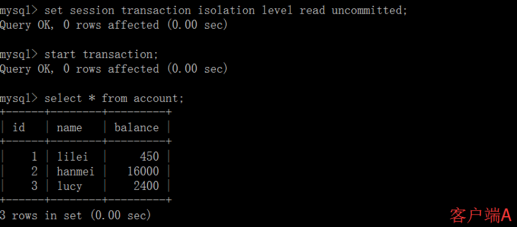
- 在客户端A的事务提交之前，打开另一个客户端B，更新表account：
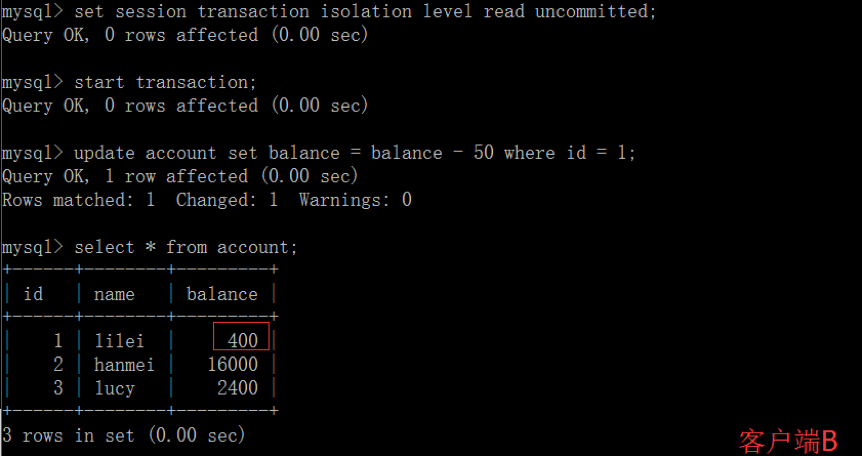
- 这时，虽然客户端B的事务还没提交，但是客户端A就可以查询到B已经更新的数据：
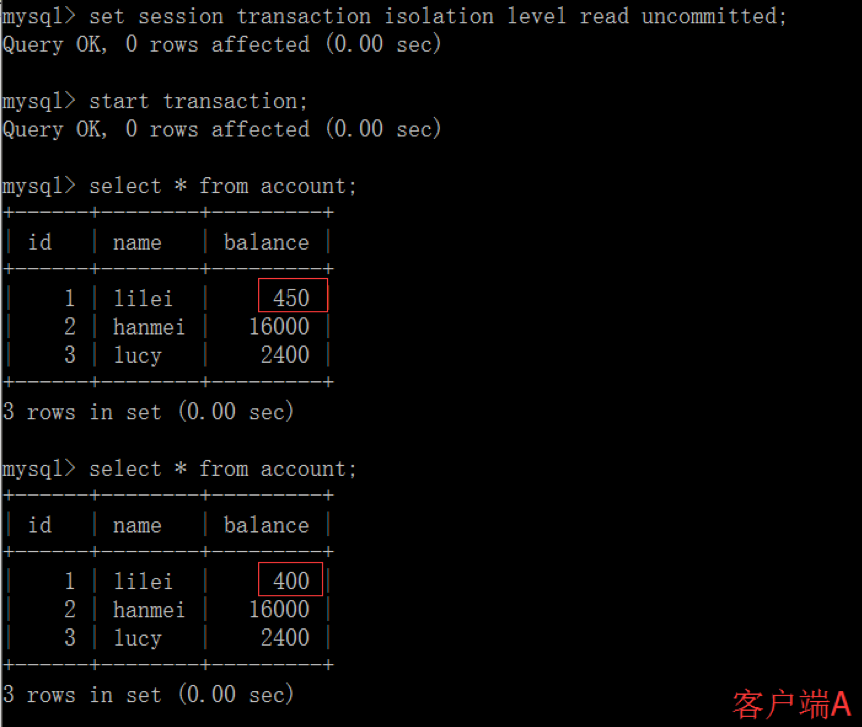
- 一旦客户端B的事务因为某种原因回滚，所有的操作都将会被撤销，那客户端A查询到的数据其实就是脏数据：
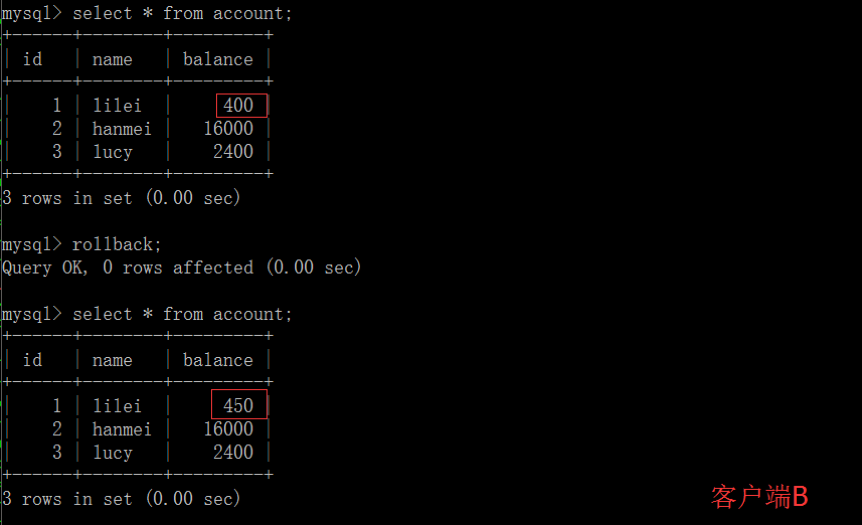
- 在客户端A执行更新语句update account set balance = balance - 50 where id =1，lilei的balance没有变成350，居然是400，是不是很奇怪，数据不一致啊，如果你这么想就太天真 了，在应用程序中，我们会用400-50=350，并不知道其他会话回滚了，要想解决这个问题可以采用读已提交的隔离级别


#### 读已提交
- 打开一个客户端A，并设置当前事务模式为read committed（未提交读），查询表account的所有记录：
```mysql
set tx_isolation='read-committed';
```
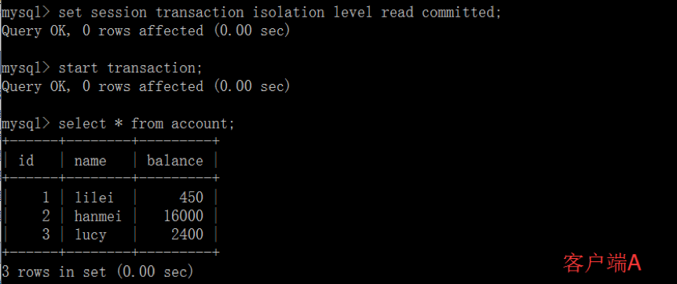
- 在客户端A的事务提交之前，打开另一个客户端B，更新表account：
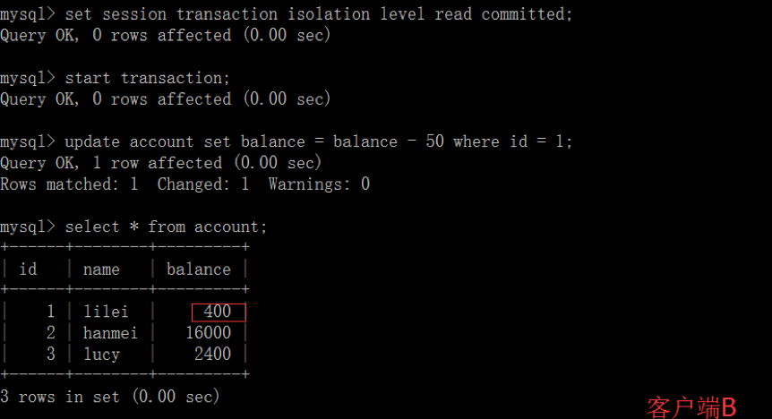
- 这时，客户端B的事务还没提交，客户端A不能查询到B已经更新的数据，解决了脏读问题：

- 客户端B的事务提交
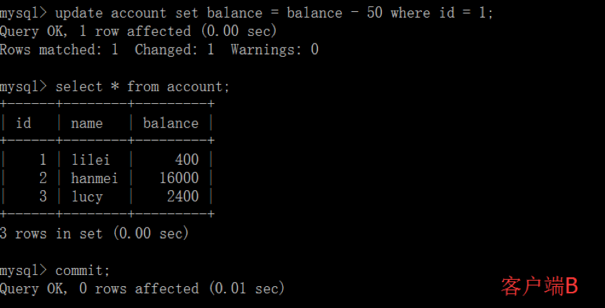
- 客户端A执行与上一步相同的查询，结果 与上一步不一致，即产生了不可重复读的问题
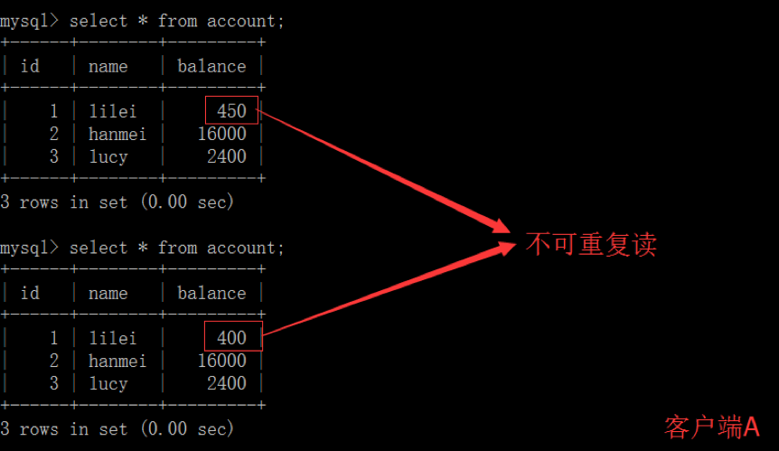

#### 可重复读
- 打开一个客户端A，并设置当前事务模式为repeatable read，查询表account的所有记录
```mysql
set tx_isolation='repeatable-read';
```
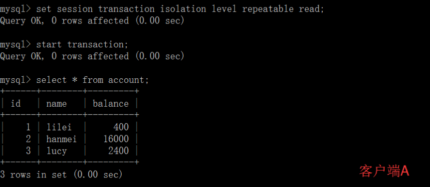
- 在客户端A的事务提交之前，打开另一个客户端B，更新表account并提交
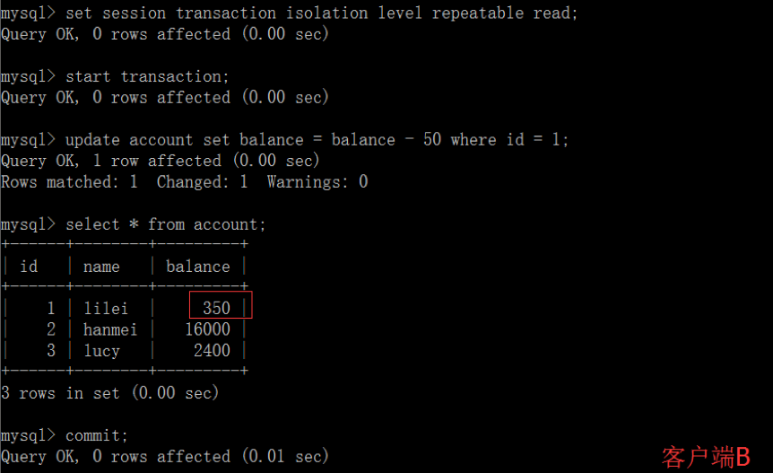
- 在客户端A查询表account的所有记录，与步骤（1）查询结果一致，没有出现不可重复读的问题
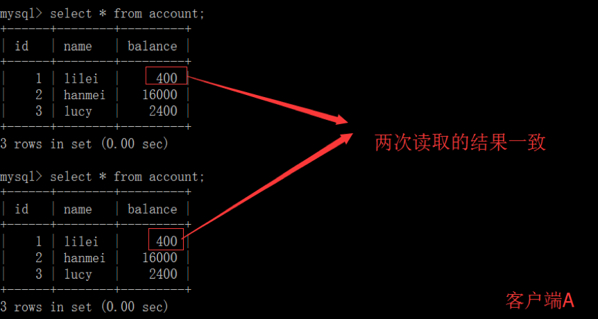
- 在客户端A，接着执行update balance = balance - 50 where id = 1，balance没有变成400-50=350，lilei的balance值用的是步骤（2）中的350来算的，所以是300，数据的一致性倒是没有被破坏。可重复读的隔离级别下使用了MVCC机制，select操作不会更新版本号，是快照读（历史版本）；insert、update和delete会更新版本号，是当前读（当前版本）。
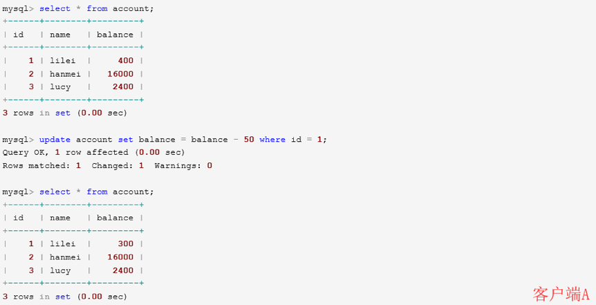
- 重新打开客户端B，插入一条新数据后提交

- 在客户端A查询表account的所有记录，没有 查出 新增数据，所以没有出现幻读

- 验证幻读,在客户端A执行update account set balance=888 where id = 4;能更新成功，再次查询能查到客户端B新增的数据
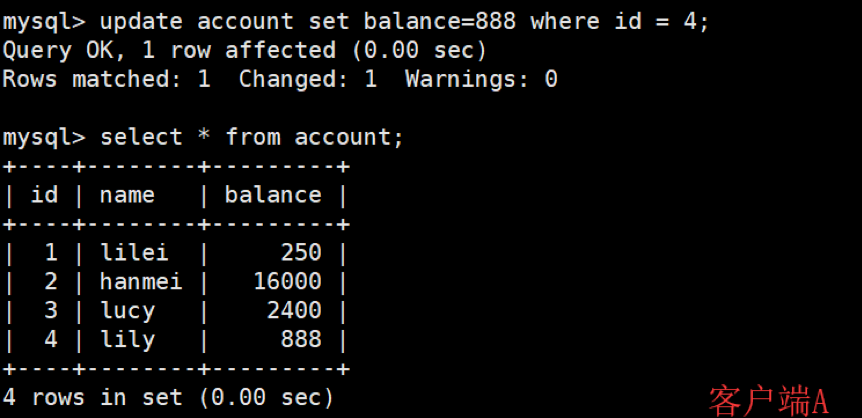

#### 串行化
打开一个客户端A，并设置当前事务模式为serializable，查询表account的初始值：
```mysql
set tx_isolation='serializable';

mysql> set session transaction isolation level serializable; 
Query OK, 0 rows affected (0.00 sec)  
mysql> start transaction; Query OK, 0 rows affected (0.00 sec)  
mysql> select * from account; 
+------+--------+---------+
| id   | name   | balance |
+------+--------+---------+
|    1 | lilei  |   10000 |
|    2 | hanmei |   10000 |
|    3 | lucy   |   10000 |
|    4 | lily   |   10000 |
+------+--------+---------+
4 rows in set (0.00 sec)
```

打开一个客户端B，并设置当前事务模式为serializable，插入一条记录报错，表被锁了插入失败，mysql中事务隔离级别为serializable时会锁表，因此不会出现幻读的情况，这种隔离级别并发性极低，开发中很少会用到。
```mysql
mysql> set session transaction isolation level serializable; 
Query OK, 0 rows affected (0.00 sec)  
mysql> start transaction; 
Query OK, 0 rows affected (0.00 sec)  
mysql> insert into account values(5,'tom',0); 
ERROR 1205 (HY000): Lock wait timeout exceeded; try restarting transaction
```

### Mysql InnoDB引擎默认事务级别 
Mysql默认级别是repeatable-read，

### 有办法解决幻读问题吗？
间隙锁在某些情况下可以解决幻读问题
要避免幻读可以用间隙锁在Session_1下面执行
```mysql
update account set name = 'zhuge' where id > 10 and id <=20;
```
则其他Session没法插入这个范围内的数据

###  Innodb行锁综述
Innodb存储引擎由于实现了行级锁定，虽然在锁定机制的实现方面所带来的性能损耗可能比表级锁定会要更高一下，但是在整体并发处理能力方面要远远优于MYISAM的表级锁定的。当系统并发量高的时候，Innodb的整体性能和MYISAM相比就会有比较明显的优势了。

但是，Innodb的行级锁定同样也有其脆弱的一面，当我们使用不当的时候，可能会让Innodb的整体性能表现不仅不能比MYISAM高，甚至可能会更差。

## 共享锁
共享锁也就是读锁，其他事务可以读，但不能写。MySQL可以通过Lock In Share Mode语句显示使用共享锁。
## 排它锁
排他锁就是写锁，其他事务不能读取，也不能写。对于Update、Delete和INSERT语句，InnoDB会自动给涉及的数据集加排他锁，或者使用select for update显示使用排他锁。
## 间隙锁
带范围的排它锁

## 运行时锁分析
通过检查InnoDB_row_lock状态变量来分析系统上的行锁的争夺情况
```mysql
show status like'innodb_row_lock%';
```
对各个状态量的说明如下：

- Innodb_row_lock_current_waits: 当前正在等待锁定的数量
- Innodb_row_lock_time: 从系统启动到现在锁定总时间长度
- Innodb_row_lock_time_avg: 每次等待所花平均时间
- Innodb_row_lock_time_max：从系统启动到现在等待最长的一次所花时间
- Innodb_row_lock_waits:系统启动后到现在总共等待的次数

对于这5个状态变量，比较重要的主要是：

- Innodb_row_lock_time_avg （等待平均时长）
- Innodb_row_lock_waits （等待总次数）
- Innodb_row_lock_time（等待总时长）

尤其是当等待次数很高，而且每次等待时长也不小的时候，我们就需要分析系统中为什么会有如此多的等待，然后根据分析结果着手制定优化计划。

## 死锁模拟
两个session都做如下设置
```mysql
set tx_isolation='repeatable-read';
```
操作步骤
- Session_1执行：select * from account where id=1 for update;
- Session_2执行：select * from account where id=2 for update;
- Session_1执行：select * from account where id=2 for update;
- Session_2执行：select * from account where id=1 for update;

查看近期死锁日志信息：
```mysql
show engine innodb status\G;
```
大多数情况mysql可以自动检测死锁并回滚产生死锁的那个事务，但是有些情况mysql没法自动检测死锁


## 优化建议
-	尽可能让所有数据检索都通过索引来完成，避免无索引行锁升级为表锁
-	合理设计索引，尽量缩小锁的范围
-	尽可能减少检索条件，避免间隙锁
-	尽量控制事务大小，减少锁定资源量和时间长度
-	尽可能低级别事务隔离


