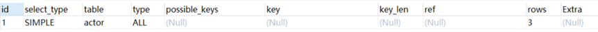

## 1.硬件/系统方面
对硬件设备和操作系统设置进行优化，例如调整操作系统参数、禁用Swap、增加内存、升级固态硬盘等等。

## 2.服务进程方面
对mysql服务的配置进行优化，例如对链接数的管理，对索引缓存、查询缓存、排序缓存等各种缓存大小进行优化;

## 3.SQL语句方面
对业务中使用的SQL语句进行优化，例如调整Where查询条件；
+ 第1个原则：要找的最需要优化的SQL语句。要么是使用最频繁的语句，要么是优化后提高最明显的语句，可以通过查询MySQL的慢查询日志来发现需要进行优化的SQL语句；
+ 第2个原则：要学会利用MySQL提供的分析工具。例如使用Explain来分析语句的执行计划，看看是否使用了索引，使用了哪个索引，扫描了多少记录，是否使用文件排序等等。或者利用Profile命令来分析某个语句执行过程中各个分步的耗时；
+ 第3个原则：要注意使用查询语句是要避免使用Select *，而是应该指定具体需要获取的字段。原因一是可以避免查询出不需要使用的字段，二是可以避免查询列字段的元信息；
+ 第4个原则：是尽量使用Prepared Statements，一个是性能更好，另一个是可以防止SQL注入；
+ 第5个原则：是尽量使用索引扫描来进行排序，也就是尽量在有索引的字段上进行排序操作。

### 3.1 explain查询计划
在 select 语句之前增加 explain 关键字，MySQL 会在查询上设置一个标记，执行查询时，会返回执行计划的信息，而不是执行这条SQL（如果 from 中包含子查询，仍会执行该子查询，将结果放入临时表中）

测试使用到的表

```mysql
DROP TABLE IF EXISTS `actor`;
CREATE TABLE `actor` (
  `id` int(11) NOT NULL,
  `name` varchar(45) DEFAULT NULL,
  `update_time` datetime DEFAULT NULL,
  PRIMARY KEY (`id`)
) ENGINE=InnoDB DEFAULT CHARSET=utf8;

INSERT INTO `actor` (`id`, `name`, `update_time`) VALUES (1,'a','2017-12-22 15:27:18'), (2,'b','2017-12-22 15:27:18'), (3,'c','2017-12-22 15:27:18');

DROP TABLE IF EXISTS `film`;
CREATE TABLE `film` (
  `id` int(11) NOT NULL AUTO_INCREMENT,
  `name` varchar(10) DEFAULT NULL,
  PRIMARY KEY (`id`),
  KEY `idx_name` (`name`)
) ENGINE=InnoDB DEFAULT CHARSET=utf8;

INSERT INTO `film` (`id`, `name`) VALUES (3,'film0'),(1,'film1'),(2,'film2');

DROP TABLE IF EXISTS `film_actor`;
CREATE TABLE `film_actor` (
  `id` int(11) NOT NULL,
  `film_id` int(11) NOT NULL,
  `actor_id` int(11) NOT NULL,
  `remark` varchar(255) DEFAULT NULL,
  PRIMARY KEY (`id`),
  KEY `idx_film_actor_id` (`film_id`,`actor_id`)
) ENGINE=InnoDB DEFAULT CHARSET=utf8;

INSERT INTO `film_actor` (`id`, `film_id`, `actor_id`) VALUES (1,1,1),(2,1,2),(3,2,1); 
```
- 示例
```mysql
explain select * from actor; 
```

在查询中的每个表会输出一行，如果有两个表通过 join 连接查询，那么会输出两行。表的意义相当广泛：可以是子查询、一个 union 结果等。

explain 有两个变种：
    
    1. explain extended：会在 explain  的基础上额外提供一些查询优化的信息。紧随其后通过 show warnings 命令可以 得到优化后的查询语句，从而看出优化器优化了什么。额外还有 filtered 列，是一个半分比的值，rows * filtered/100 可以估算出将要和 explain 中前一个表进行连接的行数（前一个表指 explain 中的id值比当前表id值小的表）。
    2. 

```mysql
CREATE TABLE `test` (
  `id` int(11) NOT NULL,
  `num` int(11) NOT NULL,
  `day` int(11) NOT NULL,
  PRIMARY KEY (`id`),
  KEY `index_name` (`day`)
) ENGINE=InnoDB DEFAULT CHARSET=utf8
```
```mysql
INSERT INTO `test` VALUES (1, 1, 1);
INSERT INTO `test` VALUES (2, 2, 2);
INSERT INTO `test` VALUES (3, 3, 3);
INSERT INTO `test` VALUES (4, 4, 4);
```
```mysql
EXPLAIN SELECT * FROM test;
```
explain执行计划包含的信息

其中最重要的字段为：id、type、key、rows、Extra

#### 3.1.1 ID
select查询的序列号，包含一组数字，表示查询中执行select子句或操作表的顺序，包含三种情况： 
+ 1、id相同：执行顺序由上至下
+ 2、id不同：如果是子查询，id的序号会递增，id值越大优先级越高，越先被执行 
+ 1、id相同又不同（两种情况同时存在）：id如果相同，可以认为是一组，从上往下顺序执行；在所有组中，id值越大，优先级越高，越先执行 

#### 3.1.5 Type
访问类型，sql查询优化中一个很重要的指标，结果值从好到坏依次是：
system > const > eq_ref > ref > fulltext > ref_or_null > index_merge > unique_subquery > index_subquery > range > index > ALL
一般来说，好的sql查询至少达到range级别，最好能达到ref
+ 1、system：表只有一行记录（等于系统表），这是const类型的特例，平时不会出现，可以忽略不计

+ 2、const：表示通过索引一次就找到了，const用于比较primary key 或者 unique索引。因为只需匹配一行数据，所有很快。如果将主键置于where列表中，mysql就能将该查询转换为一个const 

+ 3、eq_ref：唯一性索引扫描，对于每个索引键，表中只有一条记录与之匹配。常见于主键 或 唯一索引扫描。 

+ 4、ref：非唯一性索引扫描，返回匹配某个单独值的所有行。本质是也是一种索引访问，它返回所有匹配某个单独值的行，然而他可能会找到多个符合条件的行，所以它应该属于查找和扫描的混合体 

+ 5、range：只检索给定范围的行，使用一个索引来选择行。key列显示使用了那个索引。一般就是在where语句中出现了bettween、<、>、in等的查询。这种索引列上的范围扫描比全索引扫描要好。只需要开始于某个点，结束于另一个点，不用扫描全部索引 
 
+ 6、index：Full Index Scan，index与ALL区别为index类型只遍历索引树。这通常为ALL块，应为索引文件通常比数据文件小。（Index与ALL虽然都是读全表，但index是从索引中读取，而ALL是从硬盘读取）
 
+ 7、ALL：Full Table Scan，遍历全表以找到匹配的行 


https://blog.csdn.net/wuseyukui/article/details/71512793

 
## 4.结构/索引方面
针对数据库设计、表结构设计以及索引设置纬度进行的优化；
+ 第1个原则：要在设计表结构时，考虑数据库的水平与垂直扩展能力，提前规划好未来1年的数据量、读写量的增长，规划好分库分表方案。比如设计用户信息表，预计1年后用户数据10亿条，写QPS约5000，读QPS30000，可以设计按UID纬度进行散列，分为4个库每个库32张表，单表数据量控制在KW级别；
+ 第2个原则：要为字段选择合适的数据类型，在保留扩展能力的前提下，优先选用较小的数据结构。例如保存年龄的字段，要使用TINYINT而不要使用INT；
+ 第3个原则：可以将字段多的表分解成多个表，必要时增加中间表进行关联。假如一张表有4、50个字段显然不是一个好的设计；
+ 第4个原则：是设计关系数据库时需要满足第三范式，但为了满足第三范式，我们可能会拆分出多张表。而在进行查询时需要对多张表进行关联查询，有时为了提高查询效率，会降低范式的要求，在表中保存一定的冗余信息，也叫做反范式。但要注意反范式一定要适度；
+ 第5个原则：要擅用索引，比如为经常作为查询条件的字段创建索引、创建联合索引时要根据最左原则考虑索引的复用能力，不要重复创建索引；要为保证数据不能重复的字段创建唯一索引等等。不过要注意索引对插入、更新等写操作是有代价的，不要滥用索引。比如像性别这样唯一很差的字段就不适合建立索引；
+ 第6个原则：列字段尽量设置为Not Null，MySQL难以对使用Null的列进行查询优化，允许Null会使索引、索引统计和值更加复杂。允许Null值的列需要更多的存储空间，还需要MySQL内部进行特殊处理。


