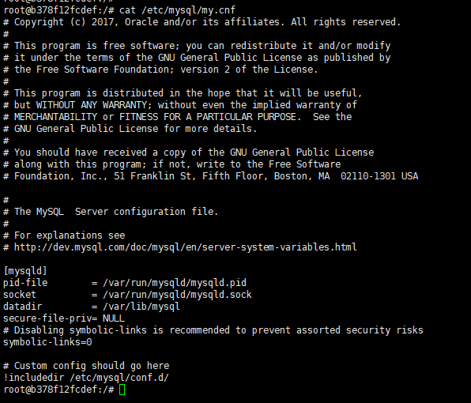

# 安装

## 安装mysql-server以及client

sudo apt-get install mysql-server

sudo apt-get install mysql-client

sudo apt-get install libmysqlclient-dev

## 检测

sudo netstat -tap \| grep mysql

或

sudo service mysql status

## 异常处理

### 安装过程如果没有设置密码

cd etc/mysql

cat debian.cnf  
使用文件中的user和password登陆

设定密码

show databases;

use mysql;

update user set authentication\_string=PASSWORD\("自定义密码"\) where user='root';

update user set plugin="mysql\_native\_password";

flush privileges;

quit;

重启服务

/etc/init.d/mysql restart;

## 卸载

sudo apt purge mysql-\*

sudo rm -rf /etc/mysql/ /var/lib/mysql

sudo apt autoremove

# [Docker部署mysql](https://dev.mysql.com/doc/refman/5.7/en/docker-mysql-getting-started.html#docker-starting-mysql-server)
[MySQL Docker镜像](https://hub.docker.com/_/mysql)

根据镜像说明可知：
- 默认的配置文件是：/etc/mysql/my.cnf
- 默认的数据目录是：/var/lib/mysql
1. 拉取mysql镜像
```
docker pull mysql　
或者
docker pull mysql/mysql-server:5.7
```
2. 查看镜像
```
docker images
```
3. 创建MySQL容器
```
docker run -di --name standalone -p 33306:3306 -e MYSQL_ROOT_PASSWORD=root mysql
```
- -p 代表端口映射，格式为  宿主机映射端口:容器运行端口
- -e 代表添加环境变量  MYSQL_ROOT_PASSWORD是root用户的登陆密码
4. 进入MySQL容器
```
docker exec -it standalone /bin/bash
```
5. 登陆mysql
```
mysql -u root -p
```
6. 远程连接调整
容器中登录mysql,查看mysql的版本
```
status;
```
注意mysql 8.0跟之前的授权方式不同，需要进行如下调整，才能远程连接
```
GRANT ALL ON *.* TO 'root'@'%';
flush privileges;
```
此时,还不能远程访问,因为Navicat只支持旧版本的加密,需要更改mysql的加密规则
```
ALTER USER 'root'@'localhost' IDENTIFIED BY 'password' PASSWORD EXPIRE NEVER;
ALTER USER 'root'@'%' IDENTIFIED WITH mysql_native_password BY 'root';
flush privileges;
```
设置完成，再次使用 Navicat 连接数据库

## 自定义配置
1. 进入MySQL容器查看my.cnf
```
docker exec -it standalone /bin/bash
cat /etc/mysql/my.cnf
```

可以发现，主配置文件 my.cnf 加载了 /etc/mysql/conf.d 文件夹下所有的配置（后缀必须是 .cnf），我们只需映射 conf.d 文件夹即可。
宿主机中创建文件夹 mysql，并分别创建 data 目录和 conf 目录。新建配置文件 my.cnf：
```
mkdir /home/mysql/standalone/data
mkdir /home/mysql/standalone/conf
mkdir /home/mysql/standalone/mysqld
mkdir /home/mysql/standalone/logger
```
my.cnf
```
[mysqld]
# 服务Id唯一
server-id=1   
port=33306
# 只能用IP地址
skip_name_resolve 
# 表名不区分大小写
lower_case_table_names=1 
# 数据库默认字符集
character-set-server=utf8mb4
# 数据库字符集对应一些排序等规则
collation-server=utf8mb4_general_ci
# 设置client连接mysql时的字符集,防止乱码
init_connect='SET NAMES utf8mb4'
# 最大连接数
max_connections=300
[mysqld_safe]
log-error=/home/mysql/standalone/logger/mysqld.log
pid-file=/home/mysql/standalone//mysqld/mysqld.pid
```
接下来分别映射数据库目录和配置文件目录，启动容器：
```
docker run --name standalone -d --rm \
-v /home/mysql/standalone/conf:/etc/mysql/conf.d \
-v /home/mysql/standalone/data:/var/lib/mysql \
-p 33306:3306 -e MYSQL_ROOT_PASSWORD=root mysql
```
