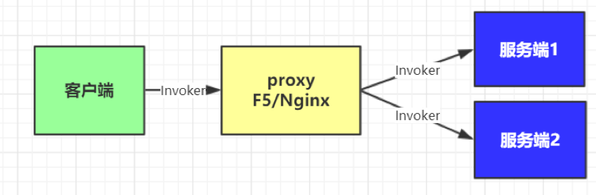
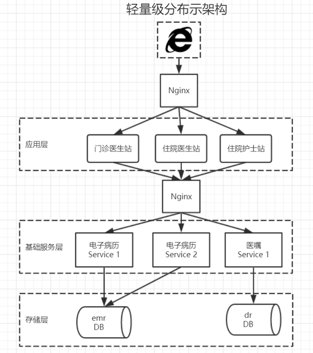
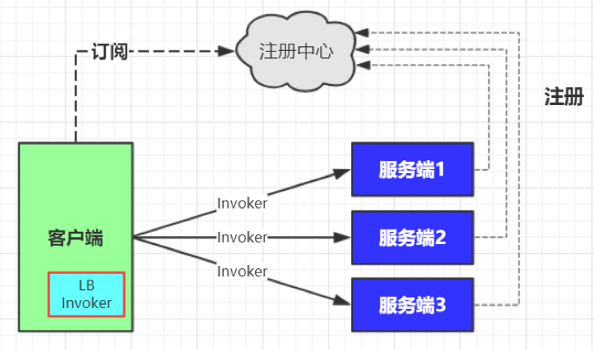
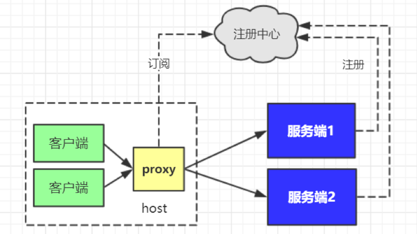

# 分布式概述
## 服务架构的发展史
1. 单体式架构：应用程序，静态文件，数据库都在一台机器上
1. 垂直架构：把单体式架构按照业务垂直拆分，业务之间相互独立
1. 分布式架构：在垂直架构的基础上抽象出公共的服务层
1. 微服务架构：在分布式基础上更细粒度的拆分服务

## 分布式架构所带来的成本与风险
1. 分布式事务：分布式事物是指一个操作，分成几个小操作在多个服务器上执行，要么多成功，要么多失败这些分布事物要做的
1. 不允许服务有状态（stateless service）：无状态服务是指对单次请求的处理，不依赖其他请求，也就是说，处理一次请求所需的全部信息，要么都包含在这个请求里，要么可以从外部获取到（比如说数据库），服务器本身不存储任何信息。
1. 服务依懒关系复杂：服务 A依赖B，B依赖C那么服务C的修改 就可能会影响 B 和C，事实上当服务越来 越多的时候，C的变动将会越来越困难。
1. 开发部署运维成本增加：原本一套或几套源码现在拆分成几十个源码库，其中分支、tag都要进行相应管理。
1. 分布式会话管理：此仅针对应用层服务，不能将Session 存储在一个服务器上
1. 分布式JOB：通常定时任务只需要在一台机器上触发执行，分布式的情况下在哪台执行呢

## 分布式架构最核心功能RPC
|协议|描述|	优点	|缺点|
|---|---|---|---|
|RMI|JAVA| 远程方法调用、使用原生二进制方式进行序列化|	简单易用、SDK支持，提高开发效率|	不支持跨语言|
|Web |Service|比较早系统调用解决方案 ，跨语言, 其基于WSDL 生成 SOAP 进行消息的传递。|	SDK支持、跨语言|	实现较重，发布繁琐|
|Http|http +json| 实现	简单、轻量、跨语言|	不支持SDK|

### 谁对RPC的请求做出响应
1. 负载均衡：这么多个机器调用哪一台?
1. 服务发现：样发现新的服务地址呢？
1. 健康检测：服务关宕机或恢复后怎么办？
1. 容错：如果调用其中一台调用出错了怎么办？

上述问题有没有现成的方案可以直接借鉴呢？

## 分布式架构问题的三种解决方案
1. 基于反向代理的中心化架构
1. 嵌入应用内部的去中心化架构
1. 基于独立代理进程的Service Mesh架构

### 基于反向代理的中心化架构
这是最简单和传统做法，在服务消费者和生产者之间，代理作为独立一层集中部署，由独立团队(一般是运维或框架)负责治理和运维。常用的集中式代理有硬件负载均衡器(如F5)，或者软件负载均衡器(如Nginx)，这种软硬结合两层代理也是业内常见做法，兼顾配置的灵活性(Nginx比F5易于配置)。

Http+Nginx  方案总结：

优点：简单快速、几乎没有学习成本

适用场景：轻量级分布式系统、局部分布式架构。

瓶颈：Nginx中心负载、Http传输、JSON序列化、开发效率、运维效率。

### 嵌入应用内部的去中心化架构
这是很多互联网公司比较流行的一种做法，代理(包括服务发现和负载均衡逻辑)以客户库的形式嵌入在应用程序中。这种模式一般需要独立的服务注册中心组件配合，服务启动时自动注册到注册中心并定期报心跳，客户端代理则发现服务并做负载均衡。我们所熟悉的 duboo 和spring cloud Eureka +Ribbon 都是这种方式实现。

相比第一代架构它有以下特点几点：

1. 去中心化，客户端直连服务端
1. 动态注册和发现服务
1. 高效稳定的网络传输
1. 高效可容错的序列化

### 基于独立代理进程的架构(Service Mesh)
这种做法是上面两种模式的一个折中，代理既不是独立集中部署，也不嵌入在客户应用程序中，而是作为独立进程部署在每一个主机上，一个主机上的多个消费者应用可以共用这个代理，实现服务发现和负载均衡，如下图所示。这个模式一般也需要独立的服务注册中心组件配合，作用同第二代架构。

### 三种架构的比较
|模式	|优点	|缺点	|适应场景	|案例|
|---|---|---|---|---|
|集中式负载架构	|简单 集中式治理 与语言无关	|配置维护成本高 多了一层IO 单点问题	|大部分公司都适用，对运维有要求	|亿贝、携程、早期互联网公司|
|客户端嵌入式架构 |	无单点 性能更好	|客户端复杂 语言栈要求|	中大规模公司、语言栈统一	|Dubbo 、Twitter finagle、Spring Cloud Ribbon|
|独立进程代理架构	|无单点 性能更好 与语言无关	|运维部署复杂 开发联调复杂	|中大规模公司 对运维有要求	|Smart Stack Service Mesh|

## 读写分离 
降低主库的查询、业务：读多写少、主从同步

Proxy：mycat、altas、mysql-proxy

Jdbc：tddl、sharding-jdbc

换数据库

分库分表 不要把鸡蛋放在一个篮子里，本质：热点数据的问题

垂直/水平 

Proxy：mycat、altas

Jdbc：tddl、sharding-jdbc

云数据库（Tidb pingcap）
## 服务化
周四：商品部门上新、会员部门改bug

上线步骤：开发、测试、预演、生产

还有问题 回滚  会员回滚

业务垂直

RPC：远程调用

框架：dubbo、motan（分布式）

如果更多的应用

调用之间更复杂了

排查bug问题：elk（分布式专题）

依赖配置也是个问题：分布式配置中心 disconf（zk）  diamond（zk）（分布式专题）

消息中间件：异步、解耦、消峰

Kafka、rocketmq、activemq、rabbitmq
