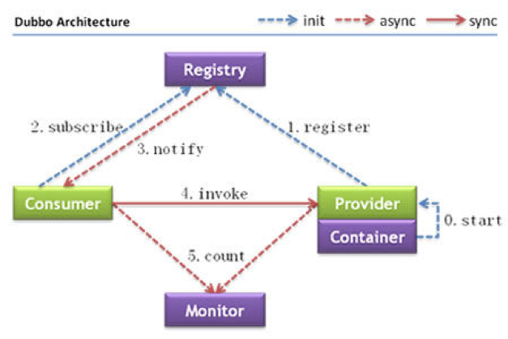
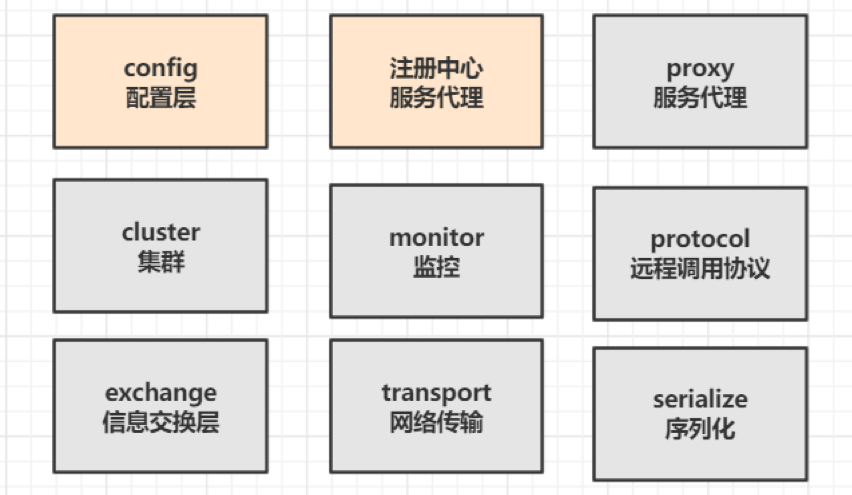
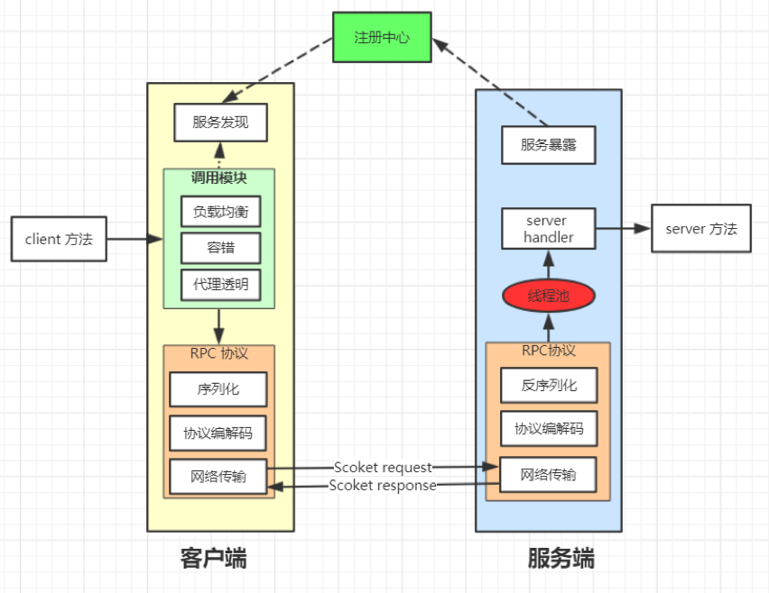
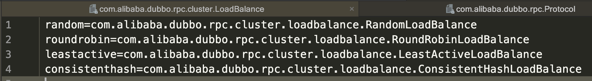
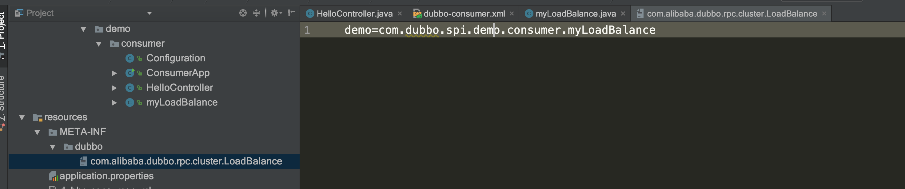
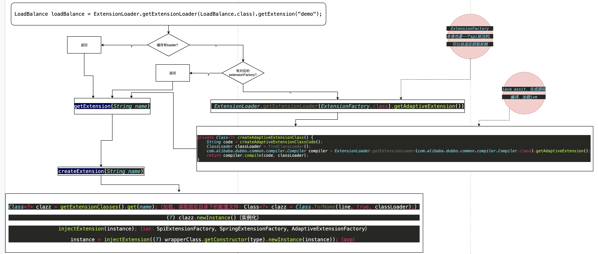

# Dubbo 架构与设计说明 
## dubbo架构简要讲解
架构图



## 流程说明
1.	Provider(提供者)绑定指定端口并启动服务
2.	指供者连接注册中心，并发本机IP、端口、应用信息和提供服务信息发送至注册中心存储
3.	Consumer(消费者），连接注册中心 ，并发送应用信息、所求服务信息至注册中心
4.	注册中心根据 消费 者所求服务信息匹配对应的提供者列表发送至Consumer 应用缓存。
5.	Consumer 在发起远程调用时基于缓存的消费者列表择其一发起调用。
6.	Provider 状态变更会实时通知注册中心、在由注册中心实时推送至Consumer

这么设计的意义：
1.	Consumer 与Provider 解偶，双方都可以横向增减节点数。
2.	注册中心对本身可做对等集群，可动态增减节点，并且任意一台宕掉后，将自动切换到另一台
3.	去中心化，双方不直接依懒注册中心，即使注册中心全部宕机短时间内也不会影响服务的调用
4.	服务提供者无状态，任意一台宕掉后，不影响使用


## Dubbo 整体设计



-	config 配置层：对外配置接口，以 ServiceConfig, ReferenceConfig 为中心，可以直接初始化配置类，也可以通过 spring 解析配置生成配置类
-	proxy 服务代理层：服务接口透明代理，生成动态代理 扩展接口为 ProxyFactory
-	registry 注册中心层：封装服务地址的注册与发现，以服务 URL 为中心，扩展接口为 RegistryFactory, Registry, RegistryService
-	cluster 路由层：封装多个提供者的路由及负载均衡，并桥接注册中心，以 Invoker 为中心，扩展接口为 Cluster, Directory, Router, LoadBalance
-	monitor 监控层：RPC 调用次数和调用时间监控，以 Statistics 为中心，扩展接口为 MonitorFactory, Monitor, MonitorService
-	protocol 远程调用层：封装 RPC 调用，以 Invocation, Result 为中心，扩展接口为 Protocol, Invoker, Exporter
-	exchange 信息交换层：封装请求响应模式，同步转异步，以 Request, Response 为中心，扩展接口为 Exchanger, ExchangeChannel, ExchangeClient, ExchangeServer
-	transport 网络传输层：抽象 mina 和 netty 为统一接口，以 Message 为中心，扩展接口为 Channel, Transporter, Client, Server, Codec
-	serialize 数据序列化层：可复用的一些工具，扩展接口为 Serialization, ObjectInput, ObjectOutput, ThreadPool

其协作流程如下



## [Dubbo 中的SPI机制](../../../java/spi.md)
dubbo作为一个高度可扩展的rpc框架，也依赖于java的spi，并且dubbo对java原生的spi机制作出了一定的扩展，使得其功能更加强大。

首先，从上面的java spi的原理中可以了解到，java的spi机制有着如下的弊端：
- 只能遍历所有的实现，并全部实例化。
- 配置文件中只是简单的列出了所有的扩展实现，而没有给他们命名。导致在程序中很难去准确的引用它们。
- 扩展如果依赖其他的扩展，做不到自动注入和装配。
- 扩展很难和其他的框架集成，比如扩展里面依赖了一个Spring bean，原生的Java SPI不支持。

### dubbo的spi有如下几个概念
- 扩展点：一个接口。
- 扩展：扩展（接口）的实现。
- 扩展自适应实例：其实就是一个Extension的代理，它实现了扩展点接口。在调用扩展点的接口方法时，会根据实际的参数来决定要使用哪个扩展。dubbo会根据接口中的参数，自动地决定选择哪个实现。
- @SPI:该注解作用于扩展点的接口上，表明该接口是一个扩展点。
- @Adaptive：@Adaptive注解用在扩展接口的方法上。表示该方法是一个自适应方法。Dubbo在为扩展点生成自适应实例时，如果方法有@Adaptive注解，会为该方法生成对应的代码。

dubbo的spi也会从某些固定的路径下去加载配置文件，并且配置的格式与java原生的不一样，类似于property文件的格式：



下面将基于dubbo去实现一个简单的扩展实现。首先，要实现LoadBalance这个接口，当然这个接口是被注解标注的可以扩展的：

```java
@SPI("random")
public interface LoadBalance {
    @Adaptive({"loadbalance"})
    <T> Invoker<T> select(List<Invoker<T>> var1, URL var2, Invocation var3) throws RpcException;
}

public class DemoLoadBalance implements LoadBalance {

    @Override
    public <T> Invoker<T> select(List<Invoker<T>> invokers, URL url, Invocation invocation) throws RpcException {
        System.out.println("my demo loadBalance is used, hahahahh");
        return invokers.get(0);//选择第一个
    }
}
```

然后，需要在duboo SPI的扫描目录下，添加配置文件，注意配置文件的名称要和扩展点的接口名称对应起来：



还需要在dubbo的spring配置中显式的声明，使用上面自己实现的负载均衡策略：
```xml
 <dubbo:reference id="helloService" interface="com.dubbo.spi.demo.api.IHelloService" loadbalance="demo" />
```
然后，启动dubbo，调用service，就可以发现确实是使用了自定义的负载策略：

dubbo spi的原理和jdk的实现稍有不同，大概流程如下图


