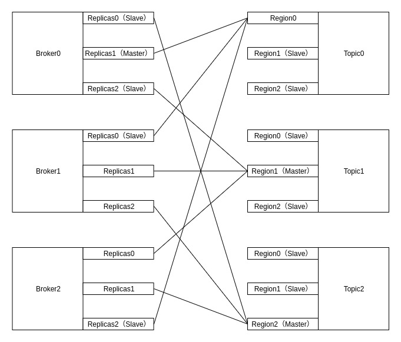
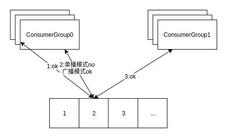
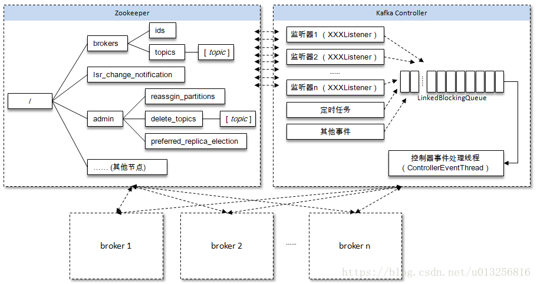

# Kafka角色
## Kafka体系架构


如上图所示，一个典型的Kafka体系架构包括若干Producer（可以是服务器日志，业务数据，页面前端产生的page view等等），若干broker（Kafka支持水平扩展，一般broker数量越多，集群吞吐率越高），若干Consumer (Group)，以及一个Zookeeper集群。Kafka通过Zookeeper管理集群配置，选举leader，以及在consumer group发生变化时进行rebalance。Producer使用push(推)模式将消息发布到broker，Consumer使用pull(拉)模式从broker订阅并消费消息。

##名词解释：

|名称|解释|
|---|---|
|Broker	|消息中间件处理节点，一个Kafka节点就是一个broker，一个或者多个Broker可以组成一个Kafka集群|
|Topic	|Kafka根据topic对消息进行归类，发布到Kafka集群的每条消息都需要指定一个topic|
|Partition	|物理上的概念，一个topic可以分为多个partition，每个partition内部是有序的|
|Producer	|消息生产者，向Broker发送消息的客户端|
|Consumer	|消息消费者，从Broker读取消息的客户端|
|ConsumerGroup	|每个Consumer属于一个特定的Consumer Group，一条消息可以发送到多个不同的Consumer Group，但是一个Consumer Group中只能有一个Consumer能够消费该消息|
|Controller|---|
|ControllerContext|---|
## Broker

## Topic & Partition

一个topic可以认为一个一类消息，每个topic将被分成多个partition，每个partition在存储层面是append log文件，物理上每个Partition对应的是一个文件夹。任何发布到此partition的消息都会被追加到log文件的尾部，每条消息在文件中的位置称为offset(偏移量)，offset为一个long型的数字，它唯一标记一条消息。每条消息都被append到partition中，是顺序写磁盘，因此效率非常高（经验证，顺序写磁盘效率比随机写内存还要高，这是Kafka高吞吐率的一个很重要的保证）。

```text
# The default number of log partitions per topic. More partitions allow greater
# parallelism for consumption, but this will also result in more files across
# the brokers.
num.partitions=3
```
在发送一条消息时，可以指定这个消息的key，producer根据这个key和partition机制来判断这个消息发送到哪个partition。partition机制可以通过指定producer的partition.class这一参数来指定，该class必须实现kafka.producer.Partitioner接口。


一个Topic包含一个或多个Partition，建Topic的时候可以手动指定Partition个数，个数与服务器个数相当


每一条消息被发送到broker中，会根据partition规则选择被存储到哪一个partition。如果partition规则设置的合理，所有消息可以均匀分布到不同的partition里，这样就实现了水平扩展。（如果一个topic对应一个文件，那这个文件所在的机器I/O将会成为这个topic的性能瓶颈，而partition解决了这个问题）。在创建topic时可以在$KAFKA_HOME/config/server.properties中指定这个partition的数量（如下所示），当然可以在topic创建之后去修改partition的数量。

Topic是Kafka数据写入操作的基本单元，可以指定副本，broker，topic，replication也可用下图表示







## kafka磁盘读写高性能分析

如果把读写分开来说的话，我们可能会得出不同的结论。

对于写来说，Kafka的设计确实有助于实现顺序写的模式。每个topic有不同的分区，而每个分区下包含若干个只能追加写的提交日志：新消息被追加到文件的最末端。最直接的证明就是Kafka源码中只调用了FileChannel.write(ByteBuffer)，而没有调用过带offset参数的write方法，说明它不会执行随机写操作。对于其他分布式系统而言，只要你是这种基于消息或事件的设计（不同领域对这种模式有不同的说法，比如数据库领域可能叫changelog/binlog，也可有叫event sourcing或者就是简单地称之为logging、journaling等），再辅一个随时间单调增加的字段（通常是时间戳），基本上都可以保证顺序消息写入。   
 
对于读来说，其实我个人并不赞同所谓顺序读的提法——我猜网上文章想强调的是它与“随机读”的区别吧——也就是说Kafka consumer定位到读取位置后顺序地读取消息，从而避免磁头的过度寻道移动，但其实用户使用consumer API也能实现在日志文件中的来回跳跃读取，所以顺序读的提法有待商榷。    

我始终认为，如果说Kafka性能还不错的话，应该是多个设计因素共同叠加(比如结合java NIO、pagecache和Zerocopy)的结果，不太可能只是因为顺序读写带来的。    

比如在producer端，FileChannel.write底层调用了pwrite，虽然pwrite系统调用会使用inode的信号量从而造成多线程竞争，但由于pwrite仅仅是写入数据到pagecache，延时非常短，所以这种争用并不是很明显——应该说这是producer实现高TPS的原因之一。另外producer端batch的设计也有助于提升TPS，因为它间接地改善了写操作模型，将部分随机写整编成顺序写；    

而在consumer端，如果消费的数据是最近刚刚生产的，那么它们有很大概率依然在page cache中，所以Kafka源码中的FileChannel.transferTo直接调用底层sendfile实现Zero copy，将数据直接从page cache传输到socket buffer然后再通过网络传给consumer——这是consumer高TPS的原因之一。

[以上参考](https://www.zhihu.com/question/309414875/answer/576557880)

## kafka在zookeeper中的数据结构


kafka选举是发生在切片之间的，依托的是Zookeeper分布式锁实现，故分片在ZK中的注册都是临时节点，以保证不会在选举时候产生死锁。


7：Partition包含多个Segment，每个Segment对应一个文件，Segment可以手动指定大小，当Segment达到阈值时，将不再写数据，每个Segment都是大小相同的

8：Segment由多个不可变的记录组成，记录只会被append到Segment中，不会被单独删除或者修改，每个Segment中的Message数量不一定相等

9：Kafka默认使用的是hash进行分区，所以会出现不同的分区数据不一样的情况，但是partitioner是可以override的

10：Region = Partition

11：清除过期日志时，支持删除一个或多个Segment，默认保留7天的数据

12：Kafka实际是用先写内存映射的文件，磁盘顺序读写的技术来提高性能的。Producer生产的消息按照一定的分组策略被发送到broker中的partition中的时候，这些消息如果在内存中放不下了，就会放在partition目录下的文件中，partition目录名是topic的名称加上一个序号。在这个目录下有两类文件，一类是以log为后缀的文件，另一类是以index为后缀的文件，每一个log文件和一个index文件相对应，这一对文件就是一个Segment File，其中的log文件就是数据文件，里面存放的就是Message，而index文件是索引文件。Index文件记录了元数据信息，指向对应的数据文件中Message的物理偏移量。

13：LogSegment文件命名的规则是，partition全局的第一个Segment从0（20个0）开始，后续的每一个文件的文件名是上一个文件的最后一条消息的offset值，这样命名的好处是什么呢？假如我们有一个Consumer已经消费到了offset=x，那么如果要继续消费的话，就可以使用二分查找法来进行查找，对LogSegment文件进行查找，就可以定位到某个文件，然后拿x值去对应的index文件中去找第x条数据所在的位置。Consumer读数据的时候，实际是读Index的offset，并且会记录上次读到哪里。


# 震惊的KAFKA
kafka是一个分布式消息队列。具有高性能、持久化、多副本备份、横向扩展能力。生产者往队列里写消息，消费者从队列里取消息进行业务逻辑。一般在架构设计中起到解耦、削峰、异步处理的作用。

kafka对外使用topic的概念，生产者往topic里写消息，消费者从读消息。为了做到水平扩展，一个topic实际是由多个partition组成的，遇到瓶颈时，可以通过增加partition的数量来进行横向扩容。单个parition内是保证消息有序。

每新写一条消息，kafka就是在对应的文件append写，所以性能非常高。

kafka的总体数据流是这样的：


大概用法就是，Producers往Brokers里面的指定Topic中写消息，Consumers从Brokers里面拉去指定Topic的消息，然后进行业务处理。
图中有两个topic，topic 0有两个partition，topic 1有一个partition，三副本备份。可以看到consumer gourp 1中的consumer 2没有分到partition处理，这是有可能出现的，下面会讲到。

关于broker、topics、partitions的一些元信息用zk来存，监控和路由啥的也都会用到zk。

## 生产
基本流程是这样的：


创建一条记录，记录中一个要指定对应的topic和value，key和partition可选。 先序列化，然后按照topic和partition，放进对应的发送队列中。kafka produce都是批量请求，会积攒一批，然后一起发送，不是调send()就进行立刻进行网络发包。
如果partition没填，那么情况会是这样的：

key有填
按照key进行哈希，相同key去一个partition。（如果扩展了partition的数量那么就不能保证了）
key没填
round-robin来选partition
这些要发往同一个partition的请求按照配置，攒一波，然后由一个单独的线程一次性发过去。

## API
有high level api，替我们把很多事情都干了，offset，路由啥都替我们干了，用以来很简单。
还有simple api，offset啥的都是要我们自己记录。

## partition

当存在多副本的情况下，会尽量把多个副本，分配到不同的broker上。kafka会为partition选出一个leader，之后所有该partition的请求，实际操作的都是leader，然后再同步到其他的follower。当一个broker歇菜后，所有leader在该broker上的partition都会重新选举，选出一个leader。（这里不像分布式文件存储系统那样会自动进行复制保持副本数）

然后这里就涉及两个细节：怎么分配partition，怎么选leader。

关于partition的分配，还有leader的选举，总得有个执行者。在kafka中，这个执行者就叫controller。kafka使用zk在broker中选出一个controller，用于partition分配和leader选举。

## partition分配

- 将所有Broker（假设共n个Broker）和待分配的Partition排序
- 将第i个Partition分配到第（i mod n）个Broker上 （这个就是leader）
- 将第i个Partition的第j个Replica分配到第（(i + j) mode n）个Broker上

## leader容灾
controller会在Zookeeper的/brokers/ids节点上注册Watch，一旦有broker宕机，它就能知道。当broker宕机后，controller就会给受到影响的partition选出新leader。controller从zk的/brokers/topics/[topic]/partitions/[partition]/state中，读取对应partition的ISR（in-sync replica已同步的副本）列表，选一个出来做leader。
选出leader后，更新zk，然后发送LeaderAndISRRequest给受影响的broker，让它们改变知道这事。为什么这里不是使用zk通知，而是直接给broker发送rpc请求，我的理解可能是这样做zk有性能问题吧。

如果ISR列表是空，那么会根据配置，随便选一个replica做leader，或者干脆这个partition就是歇菜。如果ISR列表的有机器，但是也歇菜了，那么还可以等ISR的机器活过来。

## 多副本同步
这里的策略，服务端这边的处理是follower从leader批量拉取数据来同步。但是具体的可靠性，是由生产者来决定的。
生产者生产消息的时候，通过request.required.acks参数来设置数据的可靠性。

|acks|	what happen|
|---|---|
|0	|which means that the producer never waits for an acknowledgement from the broker.发过去就完事了，不关心broker是否处理成功，可能丢数据。|
|1	|which means that the producer gets an acknowledgement after the leader replica has received the data. 当写Leader成功后就返回,其他的replica都是通过fetcher去同步的,所以kafka是异步写，主备切换可能丢数据。|
|-1	|which means that the producer gets an acknowledgement after all in-sync replicas have received the data. 要等到isr里所有机器同步成功，才能返回成功，延时取决于最慢的机器。强一致，不会丢数据。|

在acks=-1的时候，如果ISR少于min.insync.replicas指定的数目，那么就会返回不可用。

这里ISR列表中的机器是会变化的，根据配置replica.lag.time.max.ms，多久没同步，就会从ISR列表中剔除。以前还有根据落后多少条消息就踢出ISR，在1.0版本后就去掉了，因为这个值很难取，在高峰的时候很容易出现节点不断的进出ISR列表。

从ISA中选出leader后，follower会从把自己日志中上一个高水位后面的记录去掉，然后去和leader拿新的数据。因为新的leader选出来后，follower上面的数据，可能比新leader多，所以要截取。这里高水位的意思，对于partition和leader，就是所有ISR中都有的最新一条记录。消费者最多只能读到高水位；

从leader的角度来说高水位的更新会延迟一轮，例如写入了一条新消息，ISR中的broker都fetch到了，但是ISR中的broker只有在下一轮的fetch中才能告诉leader。

也正是由于这个高水位延迟一轮，在一些情况下，kafka会出现丢数据和主备数据不一致的情况，0.11开始，使用leader epoch来代替高水位。（https://cwiki.apache.org/confluence/display/KAFKA/KIP-101+-+Alter+Replication+Protocol+to+use+Leader+Epoch+rather+than+High+Watermark+for+Truncation#KIP-101-AlterReplicationProtocoltouseLeaderEpochratherthanHighWatermarkforTruncation-Scenario1:HighWatermarkTruncationfollowedbyImmediateLeaderElection）

思考：
当acks=-1时

- 是follwers都来fetch就返回成功，还是等follwers第二轮fetch？
- leader已经写入本地，但是ISR中有些机器失败，那么怎么处理呢？

## 消费
订阅topic是以一个消费组来订阅的，一个消费组里面可以有多个消费者。同一个消费组中的两个消费者，不会同时消费一个partition。换句话来说，就是一个partition，只能被消费组里的一个消费者消费，但是可以同时被多个消费组消费。因此，如果消费组内的消费者如果比partition多的话，那么就会有个别消费者一直空闲。


## API
订阅topic时，可以用正则表达式，如果有新topic匹配上，那能自动订阅上。

## offset的保存
一个消费组消费partition，需要保存offset记录消费到哪，以前保存在zk中，由于zk的写性能不好，以前的解决方法都是consumer每隔一分钟上报一次。这里zk的性能严重影响了消费的速度，而且很容易出现重复消费。
在0.10版本后，kafka把这个offset的保存，从zk总剥离，保存在一个名叫__consumeroffsets topic的topic中。写进消息的key由groupid、topic、partition组成，value是偏移量offset。topic配置的清理策略是compact。总是保留最新的key，其余删掉。一般情况下，每个key的offset都是缓存在内存中，查询的时候不用遍历partition，如果没有缓存，第一次就会遍历partition建立缓存，然后查询返回。

确定consumer group位移信息写入__consumers_offsets的哪个partition，具体计算公式：

```
__consumers_offsets partition =
           Math.abs(groupId.hashCode() % groupMetadataTopicPartitionCount)   
//groupMetadataTopicPartitionCount由offsets.topic.num.partitions指定，默认是50个分区。
```

思考：
如果正在跑的服务，修改了offsets.topic.num.partitions，那么offset的保存是不是就乱套了

## 分配partition--reblance
生产过程中broker要分配partition，消费过程这里，也要分配partition给消费者。类似broker中选了一个controller出来，消费也要从broker中选一个coordinator，用于分配partition。
下面从顶向下，分别阐述一下

- 怎么选coordinator。
- 交互流程。
- reblance的流程。

## 选coordinator
- 看offset保存在那个partition
- 该partition leader所在的broker就是被选定的coordinator
这里我们可以看到，consumer group的coordinator，和保存consumer group offset的partition leader是同一台机器。

## 交互流程
把coordinator选出来之后，就是要分配了
整个流程是这样的：

- consumer启动、或者coordinator宕机了，consumer会任意请求一个broker，发送ConsumerMetadataRequest请求，broker会按照上面说的方法，选出这个consumer对应coordinator的地址。
- consumer 发送heartbeat请求给coordinator，返回IllegalGeneration的话，就说明consumer的信息是旧的了，需要重新加入进来，进行reblance。返回成功，那么consumer就从上次分配的partition中继续执行。


## reblance流程
1. consumer给coordinator发送JoinGroupRequest请求。
1. 这时其他consumer发heartbeat请求过来时，coordinator会告诉他们，要reblance了。
1. 其他consumer发送JoinGroupRequest请求。
1. 所有记录在册的consumer都发了JoinGroupRequest请求之后，coordinator就会在这里consumer中随便选一个leader。然后回JoinGroupRespone，这会告诉consumer你是follower还是leader，对于leader，还会把follower的信息带给它，让它根据这些信息去分配partition
1. consumer向coordinator发送SyncGroupRequest，其中leader的SyncGroupRequest会包含分配的情况。
1. coordinator回包，把分配的情况告诉consumer，包括leader。

当partition或者消费者的数量发生变化时，都得进行reblance。
列举一下会reblance的情况：

1. 增加partition
1. 增加消费者
1. 消费者主动关闭
1. 消费者宕机了
1. coordinator自己也宕机了

## 消息投递语义
kafka支持3种消息投递语义
At most once：最多一次，消息可能会丢失，但不会重复
At least once：最少一次，消息不会丢失，可能会重复
Exactly once：只且一次，消息不丢失不重复，只且消费一次（0.11中实现，仅限于下游也是kafka）

在业务中，常常都是使用At least once的模型，如果需要可重入的话，往往是业务自己实现。

## At least once
先获取数据，再进行业务处理，业务处理成功后commit offset。  
1. 生产者生产消息异常，消息是否成功写入不确定，重做，可能写入重复的消息  
1. 消费者处理消息，业务处理成功后，更新offset失败，消费者重启的话，会重复消费 

## At most once
先获取数据，再commit offset，最后进行业务处理。  
1. 生产者生产消息异常，不管，生产下一个消息，消息就丢了  
1. 消费者处理消息，先更新offset，再做业务处理，做业务处理失败，消费者重启，消息就丢了  

## Exactly once
思路是这样的，首先要保证消息不丢，再去保证不重复。所以盯着At least once的原因来搞。 首先想出来的：
1. 生产者重做导致重复写入消息----生产保证幂等性
1. 消费者重复消费---消灭重复消费，或者业务接口保证幂等性重复消费也没问题

由于业务接口是否幂等，不是kafka能保证的，所以kafka这里提供的exactly once是有限制的，消费者的下游也必须是kafka。所以一下讨论的，没特殊说明，消费者的下游系统都是kafka（注:使用kafka conector，它对部分系统做了适配，实现了exactly once）。

生产者幂等性好做，没啥问题。

解决重复消费有两个方法：
1. 下游系统保证幂等性，重复消费也不会导致多条记录。
1. 把commit offset和业务处理绑定成一个事务。

本来exactly once实现第1点就ok了。

但是在一些使用场景下，我们的数据源可能是多个topic，处理后输出到多个topic，这时我们会希望输出时要么全部成功，要么全部失败。这就需要实现事务性。既然要做事务，那么干脆把重复消费的问题从根源上解决，把commit offset和输出到其他topic绑定成一个事务。

## 生产幂等性
思路是这样的，为每个producer分配一个pid，作为该producer的唯一标识。producer会为每一个<topic,partition>维护一个单调递增的seq。类似的，broker也会为每个<pid,topic,partition>记录下最新的seq。当req_seq == broker_seq+1时，broker才会接受该消息。因为：

1. 消息的seq比broker的seq大超过时，说明中间有数据还没写入，即乱序了。
1. 消息的seq不比broker的seq小，那么说明该消息已被保存。


## 事务性/原子性广播
场景是这样的：

1. 先从多个源topic中获取数据。
1. 做业务处理，写到下游的多个目的topic。
1. 更新多个源topic的offset。

其中第2、3点作为一个事务，要么全成功，要么全失败。这里得益与offset实际上是用特殊的topic去保存，这两点都归一为写多个topic的事务性处理。


基本思路是这样的：
引入tid（transaction id），和pid不同，这个id是应用程序提供的，用于标识事务，和producer是谁并没关系。就是任何producer都可以使用这个tid去做事务，这样进行到一半就死掉的事务，可以由另一个producer去恢复。
同时为了记录事务的状态，类似对offset的处理，引入transaction coordinator用于记录transaction log。在集群中会有多个transaction coordinator，每个tid对应唯一一个transaction coordinator。
注：transaction log删除策略是compact，已完成的事务会标记成null，compact后不保留。

做事务时，先标记开启事务，写入数据，全部成功就在transaction log中记录为prepare commit状态，否则写入prepare abort的状态。之后再去给每个相关的partition写入一条marker（commit或者abort）消息，标记这个事务的message可以被读取或已经废弃。成功后在transaction log记录下commit/abort状态，至此事务结束。

数据流：


1. 首先使用tid请求任意一个broker（代码中写的是负载最小的broker），找到对应的transaction coordinator。 
1. 请求transaction coordinator获取到对应的pid，和pid对应的epoch，这个epoch用于防止僵死进程复活导致消息错乱，当消息的epoch比当前维护的epoch小时，拒绝掉。tid和pid有一一对应的关系，这样对于同一个tid会返回相同的pid。
1. client先请求transaction coordinator记录<topic,partition>的事务状态，初始状态是BEGIN，如果是该事务中第一个到达的<topic,partition>，同时会对事务进行计时；client输出数据到相关的partition中；client再请求transaction coordinator记录offset的<topic,partition>事务状态；client发送offset commit到对应offset partition。
1. client发送commit请求，transaction coordinator记录prepare commit/abort，然后发送marker给相关的partition。全部成功后，记录commit/abort的状态，最后这个记录不需要等待其他replica的ack，因为prepare不丢就能保证最终的正确性了。

这里prepare的状态主要是用于事务恢复，例如给相关的partition发送控制消息，没发完就宕机了，备机起来后，producer发送请求获取pid时，会把未完成的事务接着完成。

当partition中写入commit的marker后，相关的消息就可被读取。所以kafka事务在prepare commit到commit这个时间段内，消息是逐渐可见的，而不是同一时刻可见。

详细细节可看：https://cwiki.apache.org/confluence/display/KAFKA/KIP-98+-+Exactly+Once+Delivery+and+Transactional+Messaging#KIP-98-ExactlyOnceDeliveryandTransactionalMessaging-TransactionalGuarantees

## 消费事务
前面都是从生产的角度看待事务。还需要从消费的角度去考虑一些问题。

消费时，partition中会存在一些消息处于未commit状态，即业务方应该看不到的消息，需要过滤这些消息不让业务看到，kafka选择在消费者进程中进行过来，而不是在broker中过滤，主要考虑的还是性能。kafka高性能的一个关键点是zero copy，如果需要在broker中过滤，那么势必需要读取消息内容到内存，就会失去zero copy的特性。

## 文件组织
kafka的数据，实际上是以文件的形式存储在文件系统的。topic下有partition，partition下有segment，segment是实际的一个个文件，topic和partition都是抽象概念。

在目录/${topicName}-{$partitionid}/下，存储着实际的log文件（即segment），还有对应的索引文件。

每个segment文件大小相等，文件名以这个segment中最小的offset命名，文件扩展名是.log；segment对应的索引的文件名字一样，扩展名是.index。有两个index文件，一个是offset index用于按offset去查message，一个是time index用于按照时间去查，其实这里可以优化合到一起，下面只说offset index。总体的组织是这样的：


为了减少索引文件的大小，降低空间使用，方便直接加载进内存中，这里的索引使用稀疏矩阵，不会每一个message都记录下具体位置，而是每隔一定的字节数，再建立一条索引。 索引包含两部分，分别是baseOffset，还有position。

baseOffset：意思是这条索引对应segment文件中的第几条message。这样做方便使用数值压缩算法来节省空间。例如kafka使用的是varint。

position：在segment中的绝对位置。

查找offset对应的记录时，会先用二分法，找出对应的offset在哪个segment中，然后使用索引，在定位出offset在segment中的大概位置，再遍历查找message。

## 常用配置项

### broker配置

|配置项|作用|
|---|---|
|broker.id|	broker的唯一标识|
|auto.create.topics.auto	|设置成true，就是遇到没有的topic自动创建topic。|
|log.dirs	|log的目录数，目录里面放partition，当生成新的partition时，会挑目录里partition数最少的目录放。|

### topic配置

|配置项|	作用|
|---|---|
|num.partitions	|新建一个topic，会有几个partition。|
|log.retention.ms	|对应的还有minutes，hours的单位。日志保留时间，因为删除是文件维度而不是消息维度，看的是日志文件的mtime。|
|log.retention.bytes	|partion最大的容量，超过就清理老的。注意这个是partion维度，就是说如果你的topic有8个partition，配置1G，那么平均分配下，topic理论最大值8G。|
|log.segment.bytes	|一个segment的大小。超过了就滚动。|
|log.segment.ms	|一个segment的打开时间，超过了就滚动。|
|message.max.bytes	|message最大多大|


关于日志清理，默认当前正在写的日志，是怎么也不会清理掉的。
还有0.10之前的版本，时间看的是日志文件的mtime，但这个指是不准确的，有可能文件被touch一下，mtime就变了。因此在0.10版本开始，改为使用该文件最新一条消息的时间来判断。
按大小清理这里也要注意，Kafka在定时任务中尝试比较当前日志量总大小是否超过阈值至少一个日志段的大小。如果超过但是没超过一个日志段，那么就不会删除。


# Controller
在Kafka集群中会有一个或者多个broker，其中有一个broker会被选举为控制器（Kafka Controller），它负责管理整个集群中所有分区和副本的状态。当某个分区的leader副本出现故障时，由控制器负责为该分区选举新的leader副本。当检测到某个分区的ISR集合发生变化时，由控制器负责通知所有broker更新其元数据信息。当使用kafka-topics.sh脚本为某个topic增加分区数量时，同样还是由控制器负责分区的重新分配。

Kafka中的控制器选举的工作依赖于Zookeeper，成功竞选为控制器的broker会在Zookeeper中创建/controller这个临时（EPHEMERAL）节点，此临时节点的内容参考如下：

```json
{"version":1,"brokerid":0,"timestamp":"1529210278988"}
```

其中version在目前版本中固定为1，brokerid表示称为控制器的broker的id编号，timestamp表示竞选称为控制器时的时间戳。

在任意时刻，集群中有且仅有一个控制器。每个broker启动的时候会去尝试去读取/controller节点的brokerid的值，如果读取到brokerid的值不为-1，则表示已经有其它broker节点成功竞选为控制器，所以当前broker就会放弃竞选；如果Zookeeper中不存在/controller这个节点，或者这个节点中的数据异常，那么就会尝试去创建/controller这个节点，当前broker去创建节点的时候，也有可能其他broker同时去尝试创建这个节点，只有创建成功的那个broker才会成为控制器，而创建失败的broker则表示竞选失败。每个broker都会在内存中保存当前控制器的brokerid值，这个值可以标识为activeControllerId。

Zookeeper中还有一个与控制器有关的/controller_epoch节点，这个节点是持久（PERSISTENT）节点，节点中存放的是一个整型的controller_epoch值。controller_epoch用于记录控制器发生变更的次数，即记录当前的控制器是第几代控制器，我们也可以称之为“控制器的纪元”。controller_epoch的初始值为1，即集群中第一个控制器的纪元为1，当控制器发生变更时，每选出一个新的控制器就将该字段值加1。每个和控制器交互的请求都会携带上controller_epoch这个字段，如果请求的controller_epoch值小于内存中的controller_epoch值，则认为这个请求是向已经过期的控制器所发送的请求，那么这个请求会被认定为无效的请求。如果请求的controller_epoch值大于内存中的controller_epoch值，那么则说明已经有新的控制器当选了。由此可见，Kafka通过controller_epoch来保证控制器的唯一性，进而保证相关操作的一致性。

具备控制器身份的broker需要比其他普通的broker多一份职责，具体细节如下：

1. 监听partition相关的变化。为Zookeeper中的/admin/reassign_partitions节点注册PartitionReassignmentListener，用来处理分区重分配的动作。为Zookeeper中的/isr_change_notification节点注册IsrChangeNotificetionListener，用来处理ISR集合变更的动作。为Zookeeper中的/admin/preferred-replica-election节点添加PreferredReplicaElectionListener，用来处理优先副本的选举动作。
1. 监听topic相关的变化。为Zookeeper中的/brokers/topics节点添加TopicChangeListener，用来处理topic增减的变化；为Zookeeper中的/admin/delete_topics节点添加TopicDeletionListener，用来处理删除topic的动作。
1. 监听broker相关的变化。为Zookeeper中的/brokers/ids/节点添加BrokerChangeListener，用来处理broker增减的变化。
1. 从Zookeeper中读取获取当前所有与topic、partition以及broker有关的信息并进行相应的管理。对于所有topic所对应的Zookeeper中的/brokers/topics/[topic]节点添加PartitionModificationsListener，用来监听topic中的分区分配变化。
1. 启动并管理分区状态机和副本状态机。
1. 更新集群的元数据信息。
1. 如果参数auto.leader.rebalance.enable设置为true，则还会开启一个名为“auto-leader-rebalance-task”的定时任务来负责维护分区的优先副本的均衡。


# ControllerContext
控制器在选举成功之后会读取Zookeeper中各个节点的数据来初始化上下文信息（ControllerContext），并且也需要管理这些上下文信息，比如为某个topic增加了若干个分区，控制器在负责创建这些分区的同时也要更新上下文信息，并且也需要将这些变更信息同步到其他普通的broker节点中。不管是监听器触发的事件，还是定时任务触发的事件，亦或者是其他事件（比如ControlledShutdown）都会读取或者更新控制器中的上下文信息，那么这样就会涉及到多线程间的同步，如果单纯的使用锁机制来实现，那么整体的性能也会大打折扣。针对这一现象，Kafka的控制器使用单线程基于事件队列的模型，将每个事件都做一层封装，然后按照事件发生的先后顺序暂存到LinkedBlockingQueue中，然后使用一个专用的线程（ControllerEventThread）按照FIFO（First Input First Output, 先入先出）的原则顺序处理各个事件，这样可以不需要锁机制就可以在多线程间维护线程安全。




在Kafka的早期版本中，并没有采用Kafka Controller这样一个概念来对分区和副本的状态进行管理，而是依赖于Zookeeper，每个broker都会在Zookeeper上为分区和副本注册大量的监听器（Watcher）。当分区或者副本状态变化时，会唤醒很多不必要的监听器，这种严重依赖于Zookeeper的设计会有脑裂、羊群效应以及造成Zookeeper过载的隐患。在目前的新版本的设计中，只有Kafka Controller在Zookeeper上注册相应的监听器，其他的broker极少需要再监听Zookeeper中的数据变化，这样省去了很多不必要的麻烦。不过每个broker还是会对/controller节点添加监听器的，以此来监听此节点的数据变化（参考ZkClient中的IZkDataListener）。

当/controller节点的数据发生变化时，每个broker都会更新自身内存中保存的activeControllerId。如果broker在数据变更前是控制器，那么如果在数据变更后自身的brokerid值与新的activeControllerId值不一致的话，那么就需要“退位”，关闭相应的资源，比如关闭状态机、注销相应的监听器等。有可能控制器由于异常而下线，造成/controller这个临时节点会被自动删除；也有可能是其他原因将此节点删除了。

当/controller节点被删除时，每个broker都会进行选举，如果broker在节点被删除前是控制器的话，在选举前还需要有一个“退位”的动作。如果有特殊需要，可以手动删除/controller节点来触发新一轮的选举。当然关闭控制器所对应的broker以及手动向/controller节点写入新的brokerid的所对应的数据同样可以触发新一轮的选举。


# PARTITION
在Kafka中Partition的四种状态：

1. NonExistentPartition —— 这个状态表示该分区要么没有被创建过或曾经被创建过但后面被删除了。
1. NewPartition —— 分区创建之后就处于NewPartition状态。在这个状态中，分区应该已经分配了副本，但是还没有选举出leader和ISR。
1. OnlinePartition —— 一旦分区的leader被推选出来，它就处于OnlinePartition状态。
1. OfflinePartition —— 如果leader选举出来后，leader broker宕机了，那么该分区就处于OfflinePartition状态。

四种状态的转换关系如下：

1. NonExistentPartition -> NewPartition
    1. 首先将第一个可用的副本broker作为leader broker并把所有可用的副本对象都装入ISR，然后写leader和ISR信息到zookeeper中保存
    1. 对于这个分区而言，发送LeaderAndIsr请求到每个可用的副本broker，以及UpdateMetadata请求到每个可用的broker上
2. OnlinePartition, OfflinePartition -> OnlinePartition
    1. 为该分区选取新的leader和ISR以及接收LeaderAndIsr请求的一组副本，然后写入leader和ISR信息到zookeeper中保存。
3. NewPartition, OnlinePartition -> OfflinePartition
    1. 标记分区状态为离线(offline)。
4. OfflinePartition -> NonExistentPartition
    1. 离线状态标记为不存在分区，表示该分区失败或者被删除。

# PartitionLeaderSelector
KafkaController.scala
```text
class KafkaController(val config : KafkaConfig, zkClient: ZkClient, val brokerState: BrokerState) extends Logging with KafkaMetricsGroup {
  this.logIdent = "[Controller " + config.brokerId + "]: "
  private var isRunning = true
  private val stateChangeLogger = KafkaController.stateChangeLogger
  val controllerContext = new ControllerContext(zkClient, config.zkSessionTimeoutMs)
  val partitionStateMachine = new PartitionStateMachine(this)
  val replicaStateMachine = new ReplicaStateMachine(this)
  private val controllerElector = new ZookeeperLeaderElector(controllerContext, ZkUtils.ControllerPath, onControllerFailover,
    onControllerResignation, config.brokerId)
  // have a separate scheduler for the controller to be able to start and stop independently of the
  // kafka server
  private val autoRebalanceScheduler = new KafkaScheduler(1)
  var deleteTopicManager: TopicDeletionManager = null
  val offlinePartitionSelector = new OfflinePartitionLeaderSelector(controllerContext, config)
  private val reassignedPartitionLeaderSelector = new ReassignedPartitionLeaderSelector(controllerContext)
  private val preferredReplicaPartitionLeaderSelector = new PreferredReplicaPartitionLeaderSelector(controllerContext)
  private val controlledShutdownPartitionLeaderSelector = new ControlledShutdownLeaderSelector(controllerContext)
  private val brokerRequestBatch = new ControllerBrokerRequestBatch(this)
 
  private val partitionReassignedListener = new PartitionsReassignedListener(this)
  private val preferredReplicaElectionListener = new PreferredReplicaElectionListener(this)
```

在KafkaController类（KafkaController.scala）中定义了很多属性，我们先重点了解下面的PartitionLeaderSelector对象，主要是为分区选举出leader broker，该trait只定义了一个方法selectLeader，接收一个TopicAndPartition对象和一个LeaderAndIsr对象。TopicAndPartition表示要选leader的分区，而第二个参数表示zookeeper中保存的该分区的当前leader和ISR记录。该方法会返回一个元组包括了推举出来的leader和ISR以及需要接收LeaderAndISr请求的一组副本。    
```
trait PartitionLeaderSelector {  
    def selectLeader(topicAndPartition: TopicAndPartition, currentLeaderAndIsr: LeaderAndIsr): (LeaderAndIsr, Seq[Int])
}
```   
 通过我们上面的代码，可以看到在KafkaController中共定义了五种selector选举器：
 
1. NoOpLeaderSelector
   - 原则上不做任何事情，返回当前的leader和isr。
1. OfflinePartitionLeaderSelector
   - 从活着的ISR中选择一个broker作为leader，如果ISR中没有活着的副本，则从assignedReplicas中选择一个副本作为leader，leader选举成功后注册到Zookeeper中，并更新所有的缓存。
1. ReassignedPartitionLeaderSelector
   - 从可用的ISR中选取第一个作为leader，把当前的ISR作为新的ISR，将重分配的副本集合作为接收LeaderAndIsr请求的副本集合。   
1. PreferredReplicaPartitionLeaderSelector
   - 如果从assignedReplicas取出的第一个副本就是分区leader的话，则抛出异常，否则将第一个副本设置为分区leader。
1. ControlledShutdownLeaderSelector
   - 将ISR中处于关闭状态的副本从集合中去除掉，返回一个新新的ISR集合，然后选取第一个副本作为leader，然后令当前AR作为接收LeaderAndIsr请求的副本。
 
所有的leader选择完成后，都要通过请求把具体的request路由到对应的handler处理。目前kafka并没有把handler抽象出来，而是每个handler都是一个函数，混在KafkaApi类中。  
   
    
# kafka的高吞吐率

Kafka的消息是保存或缓存在磁盘上的，Apache Kafka基准测试：每秒写入2百万（在三台廉价机器上）。轻松支持每秒百万级的写入请求，超过了大部分的消息中间件，这种特性也使得Kafka在日志处理等海量数据场景广泛应用。

## **下面从数据写入和读取两方面分析，为什么Kafka速度这么快。**

## **一、写入数据**

Kafka会把收到的消息都写入到硬盘中，它绝对不会丢失数据。为了优化写入速度Kafka采用了两个技术， 顺序写入和MMFile 。


## 参考资料
https://www.zhihu.com/question/309414875/answer/576557880
https://www.jianshu.com/p/d3e963ff8b70
