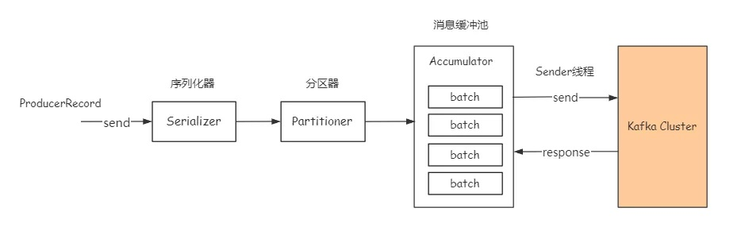
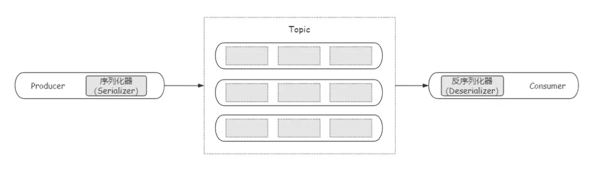
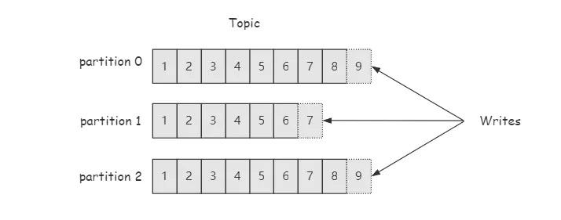

# 生产者参数配置详解
Producer端消息发送的基本流程，如下图：



总的来说，Kafka生产端发送数据过程涉及到序列化器Serializer、分区器Partitioner，消息缓存池Accumulator，还可能会涉及到拦截器Interceptor（这部分暂不做介绍）。由于篇幅有限这里尽量做到言简意赅。

## 连接Broker
Kafka 0.8.2引入了新版本Producer客户端，并自0.9.0版本开始稳定并建议生产使用

新版本Producer
> org.apache.kafka.clients.producer.KafkaProducer<K,V>

旧版本Producer
> kafka.javaapi.producer.Producer<K,V>

与旧版本相比，新版本Producer不同
- 一是连接Kafka方式上，旧版本连接的是Zookeeper，而新版本Producer连接的则是Broker；
- 二是新版本Producer采用异步方式发送消息，与之前同步发送消息相对性能上大幅提升。


## 消息数据结构
Kafka将一条待发送的消息抽象为ProducerRecord对象，其数据结构是：
```text
public class ProducerRecord<K, V> {
    private final String topic; //目标topic
    private final Integer partition; //目标partition
    private final Headers headers;//消息头信息
    private final K key;   //消息key
    private final V value; //消息体
    private final Long timestamp; //消息时间戳
    //省略构造方法与成员方法
}
```
目前消息结构包括6个核心属性，分别是topic，partition，headers，key，value与timestamp，各属性含义如上也比较好理解，其中headers属性是Kafka 0.11.x 版本引入的，可以用它存储一些应用或业务相关的信息。

## 序列化机制
Kafka遵守生产者消费者模式，这中间涉及到序列化与反序列化。Producer发送消息要通过序列化器（Serializer）将消息对象转换成字节数组，才能通过网络传输到服务端，消费端则需要通过反序列化器（Deserializer）从服务端拉取字节数组转成消息对象。可以用下图表示：



生产端使用序列化器的方式非常简单，只要指定key.serializer与value.serializer即可，如下示例：
```text
props.put("key.serializer", "org.apache.kafka.common.serialization.StringSerializer");
props.put("value.serializer", "org.apache.kafka.common.serialization.StringSerializer");
```

消费端使用的反序列化器要和生产端的序列化器要一一对应，否则将无法解析出想要的数据。

### 基本序列化器
- ByteArraySerializer // 序列化Byte数组，本质上什么都不用做。
- ByteBufferSerializer // 序列化ByteBuffer。
- BytesSerializer // 序列化Kafka自定义的Bytes类。
- StringSerializer // 序列化String类型。
- LongSerializer   // 序列化Long类型。
- IntegerSerializer // 序列化Integer类型。
- ShortSerializer  // 序列化Short类型。
- DoubleSerializer // 序列化Double类型。
- FloatSerializer  // 序列化Float类型

除了使用Kafka自带的基本序列化器，我们也可以自定义序列化器，只要实现Kafka Serializer接口并实现序列化逻辑即可，不过一般自带序列化器已经够用了。

## 消息分区机制
### Topic分区
首先简单说一下分区的概念，可以用下图表示：



分区（Partition)是Kafka中非常重要的概念，分区的作用主要是为Kafka提供负载均衡的能力，同时也是Kafka高吞吐量的保证。生产端要将数据发送到具体topic的某一个分区中，并且消息只在分区内有序。

### 分区器
消息通过send方法发送过程中，可能会经过分区器（Partitioner）的作用才能发往broker端。如果消息ProducerRecord中指定了partition字段，那么就不需要分区器的作用，因为partition代表的就是所要发往的分区号。

Kafka提供了默认分区器o.a.k.clients.producer.internals.DefaultPartitioner，并通过其partition()定义主要的分区分配逻辑。接下来我们看一下Kafka相关的分区策略。

### 分区策略
所谓分区策略就是决定消息发往具体分区所采用的算法或逻辑。目前Kafka主要提供两种分区策略：哈希策略与轮询策略。

当没有为消息指定key即key为null时，消息会以轮询的方式发送到各个分区（各个版本实现可能不一样，还有一种随机策略，有待考证）；

当key不为null时，默认分区器会使用key的哈希值（采用Murmur2Hash算法）对partition数量取模，决定要把消息发送到哪个partition上。

## 消息缓冲池
### 缓存池介绍
生产端ProducerRecord经过序列化器、分区器处理后，并不是直接发往broker端，而是发送到客户端的消息缓冲池（Accumulator） 中，最后交由Sender线程发往broker端。

缓冲池最大大小由参数buffer.memory控制，默认是32M，当生产消息的速度过快导致buffer满了的时候，将阻塞max.block.ms时间，超时抛异常，所以buffer的大小可以根据实际的业务情况进行适当调整。

### 批量发送
发送到缓冲池中消息将会被分为一个一个的batch，分批次的发送到broker 端，批次大小由参数batch.size控制，默认16KB。这就意味着正常情况下消息会攒够16KB时才会批量发送到broker端，所以一般减小batch大小有利于降低消息延时，增加batch大小有利于提升吞吐量。

但是消息并不是必须要达到一个batch尺寸才会批量发送到服务端呢，Producer端提供了另一个重要参数linger.ms，用来控制batch最大的空闲时间，超过该时间的batch也会被发送到broker端。


## 生产端核心参数
###  acks
参数说明：这是一个非常重要的参数，表示指定分区中成功写入消息的副本数量，这是Kafka生产端消息的持久性（durability）保证。只有当leader确认已成功写入消息的副本数后，才会给Producer发送响应，此时消息才可以认为“已提交”。该参数影响着消息的可靠性以及生产端的吞吐量，并且两者往往相向而驰，通常消息可靠性越高则生产端的吞吐量越低，反之亦然。acks有3个取值：

- acks = 0：表示生产端发送消息后立即返回，不等待broker端的响应结果。通常此时生产端吞吐量最高，消息发送的可靠性最低。
- acks = 1: 表示leader副本成功写入就会响应Producer，而无需等待ISR（同步副本）集合中的其他副本写入成功。这种方案提供了适当的持久性，保证了一定的吞吐量。默认值即是1。
- acks = all或-1: 表示不仅要等leader副本成功写入，还要求ISR中的其他副本成功写入，才会响应Producer。这种方案提供了最高的持久性，但也提供了最差的吞吐量。

调优建议：建议根据实际情况设置，如果要严格保证消息不丢失，请设置为all或-1；如果允许存在丢失，建议设置为1；一般不建议设为0，除非无所谓消息丢不丢失。

### max.request.size
     
参数说明：这个参数比较重要，表示生产端能够发送的最大消息大小，默认值为1048576，即1M。
     
调优建议：一般而言，这个配置有点小，为了避免因消息过大导致发送失败，建议适当调大，比如调到10485760即10M。

### retries
参数说明：表示生产端消息发送失败时的重试次数，默认值为0，表示不进行重试。这个参数一般是为了解决因瞬时故障导致的消息发送失败，比如网络抖动、leader换主，其中瞬时的leader重选举是比较常见的。因此这个参数的设置显得非常重要。

另外为了避免频繁重试的影响，两次重试之间都会停顿一段时间，受参数retry.backoff.ms，默认为100ms，通常可以不调整。

调优建议：这里要尽量避免消息丢失，建议设置为一个大于0的值，比如3或者更大值。

### compression.type
参数说明：表示生产端是否对消息进行压缩，默认值为none，即不压缩消息。压缩可以显著减少网络IO传输、磁盘IO以及磁盘空间，从而提升整体吞吐量，但也是以牺牲CPU开销为代价的。当前Kafka支持4种压缩方式，分别是gzip、snappy、lz4 及 zstd（Kafka 2.1.0开始支持）。

调优建议：出于提升吞吐量的考虑，建议在生产端对消息进行压缩。对于Kafka而已，综合考虑吞吐量与压缩比，建议选择lz4压缩。如果追求最高的压缩比则推荐zstd压缩。

### buffer.memory
参数说明：表示生产端消息缓冲池或缓冲区的大小，默认值为33554432，即32M。这个参数基本可以认为是Producer程序所使用的内存大小。

当前版本中，如果生产消息的速度过快导致buffer满了的时候，将阻塞max.block.ms（默认60000即60s）配置的时间，超时将会抛TimeoutException异常。在Kafka 0.9.0及之前版本，建议设置另一个参数block.on.buffer.full为true，该参数表示当buffer填满时Producer处于阻塞状态并停止接收新消息而不是抛异常。

调优建议：通常我们应尽量保证生产端整体吞吐量，建议适当调大该参数，也意味着生产客户端会占用更多的内存。也可以选择不调整。

### batch.size
参数说明：发送到缓冲区中的消息会被分为一个一个的batch，分批次的发送到broker 端，这个参数就表示batch批次大小，默认值为16384，即16KB。因此减小batch大小有利于降低消息延时，增加batch大小有利于提升吞吐量。

调优建议：通常合理调大该参数值，能够显著提升生产端吞吐量，比如可以调整到32KB，调大也意味着消息会有相对较大的延时。


### linger.ms
参数说明：用来控制batch最大的空闲时间，超过该时间的batch也会被发送到broker端。这实际上是一种权衡，即吞吐量与延时之间的权衡。默认值为0，表示消息需要被立即发送，无需关系batch是否被填满。

调优建议：通常为了减少请求次数、提升整体吞吐量，建议设置一个大于0的值，比如设置为100，此时会在负载低的情况下带来100ms的延时。

### request.timeout.ms
参数说明：这个参数表示生产端发送请求后等待broker端响应的最长时间，默认值为30000，即30s，超时生产端可能会选择重试（如果配置了retries）。

调优建议：该参数默认值一般够用了。如果生产端负载很大，可以适当调大以避免超时，比如可以调到60000。


### max.in.fight.requests.per.connection
参数说明：这个参数非常重要，表示生产端与broker之间的每个连接最多缓存的请求数，默认值为5，即每个连接最多可以缓存5个未响应的请求。这个参数通常用来解决分区乱序的问题。

调优建议：为了避免消息乱序问题，建议将该参数设置为1，表示生产端在某个broker响应之前将无法再向该broker发送消息请求，这能够有效避免同一分区下的消息乱序问题。

## 生产端无消息丢失配置
本文开始我们提到，Producer既要保证吞吐量，又要确保无消息丢失。结合上面的参数介绍，这里给出消息无丢失的配置列表，如下：

- acks = all or -1
- retries = 3
- max.in.fight.requests.per.connection = 1
- 使用带回调机制的send方法即send(record, callback)发送消息，并对失败消息进行处理
- unclean.leader.election.enable = false
- replication.factor = 3
- min.insync.replicas = 2
- enable.auto.commit = false

前3个参数本文已介绍。最后一个是消费端参数，表示禁用自动提交，后面我们再介绍。其他几个属于broker端的参数。

其中比较难理解的是min.insync.replicas，这个参数表示ISR集合中的最少副本数，默认值是1，并只有在acks=all或-1时才有效。acks与min.insync.replicas搭配使用，才能为消息提供最高的持久性保证。我们知道leader副本默认就包含在ISR中，如果ISR中只有1个副本，acks=all也就相当于acks=1了，引入min.insync.replicas的目的就是为了保证下限：不能只满足于ISR全部写入，还要保证ISR中的写入个数不少于min.insync.replicas。常见的场景是创建一个三副本（即replication.factor=3）的topic，最少同步副本数设为2（即min.insync.replicas=2），acks设为all，以保证最高的消息持久性。

## 参考资料
https://zhuanlan.zhihu.com/p/136705624
https://mp.weixin.qq.com/s?__biz=MzUxOTU5Mjk2OA==&mid=2247485857&idx=1&sn=c00aa6fc62be86cb26ee4fe9438b86fb&chksm=f9f604c6ce818dd002244a2798e5a60a2369037f1720ae4719b48082b9b9eaf07e6edb275f2c&scene=21#wechat_redirect
