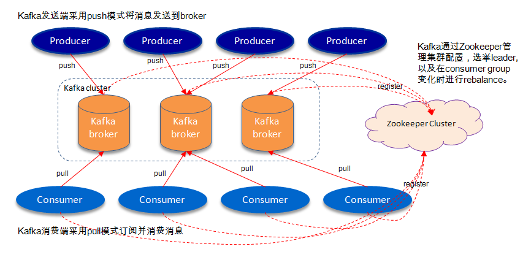
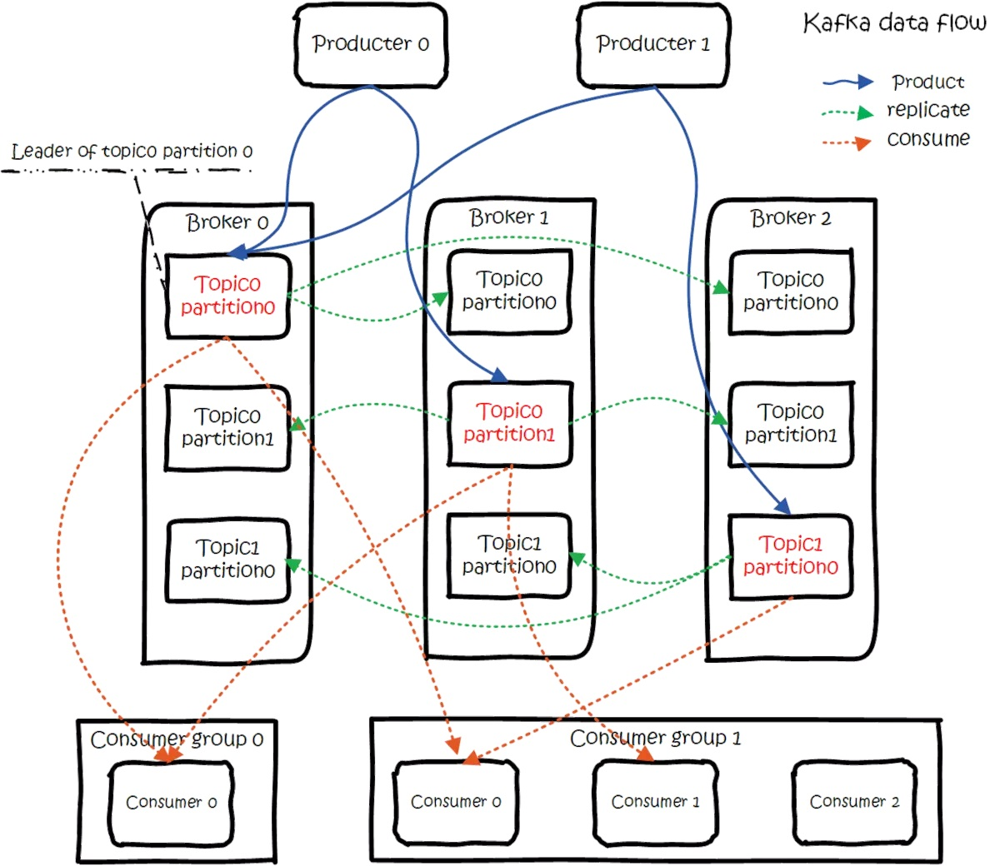
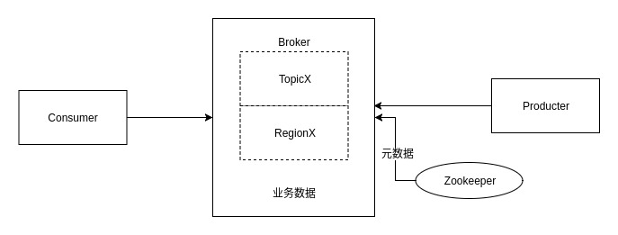
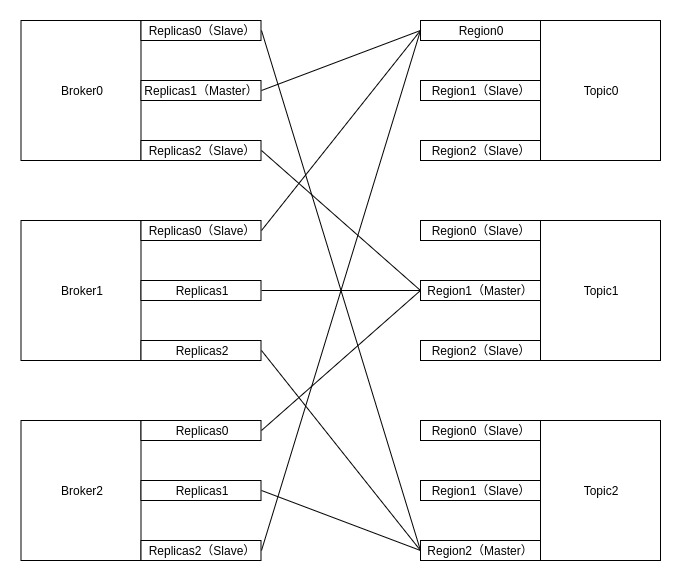
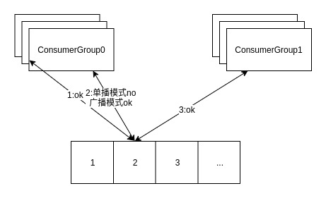
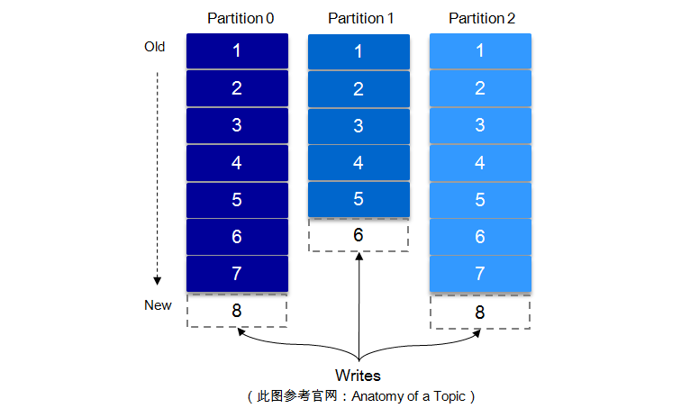
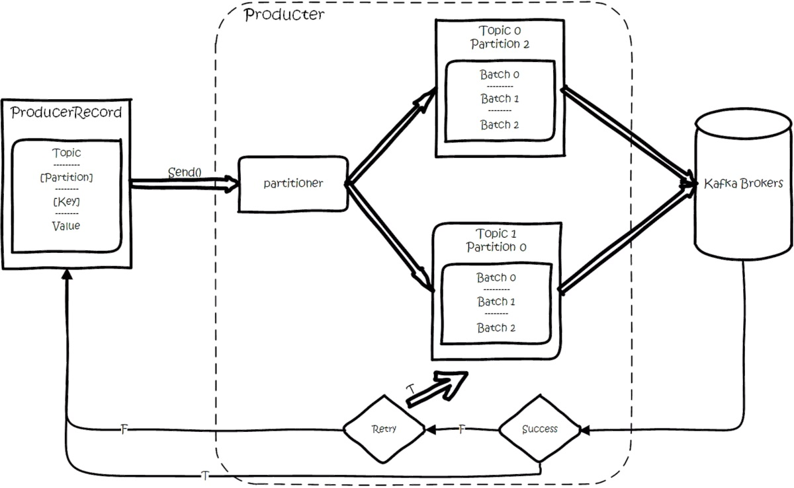
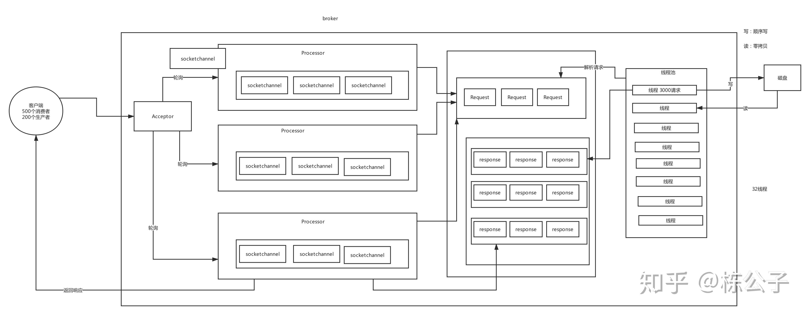

# Kafka角色
kafka是一个分布式消息队列。具有高性能、持久化、多副本备份、横向扩展能力。生产者往队列里写消息，消费者从队列里取消息进行业务逻辑。一般在架构设计中起到解耦、削峰、异步处理的作用。

kafka对外使用topic的概念，生产者往topic里写消息，消费者从读消息。为了做到水平扩展，一个topic实际是由多个partition组成的，遇到瓶颈时，可以通过增加partition的数量来进行横向扩容。单个parition内是保证消息有序。


## Kafka体系架构

一个典型的Kafka体系架构包括如下宏观角色
- 若干Producer（可以是服务器日志，业务数据，页面前端产生的page view等等），Producer使用push(推)模式将消息发布到broker。
- 若干Broker（Kafka支持水平扩展，一般broker数量越多，集群吞吐率越高），
- 若干Consumer (Group)，Consumer使用pull(拉)模式从broker订阅并消费消息。
- 一个Zookeeper服务[集群]，Kafka通过Zookeeper管理集群配置以及broker、topics、partitions的一些元信息、监控和路由等也都会托管到zk，leader的选举，以及在consumer group发生变化时进行rebalance也是托管给zk。



kafka的总体数据流是这样的：



上图中：
- 三个broker:broker0,broker1,broker2
- 两个topic:topic0,topic1
- topic0有两个partition：partition0，partition1，每个partition是三个副本
- topic1有一个partition：partition0，每个partition是三个副本
- 两个producer：producer0，producer1，往Brokers里面的指定Topic中写消息。
- 两个消费者组：group0,group1，从Brokers里面拉去指定Topic的消息，然后进行业务处理。

可以看到ConsumerGroup1中的consumer 2没有分到partition处理，这是有可能出现的，下面会讲到。

## kafka中名词解释：

|名称|解释|
|---|---|
|Broker	|消息中间件处理节点，一个Kafka节点就是一个broker，一个或者多个Broker可以组成一个Kafka集群|
|Topic	|Kafka根据topic对消息进行归类，发布到Kafka集群的每条消息都需要指定一个topic|
|Partition	|物理上的概念，一个topic可以分为多个partition，每个partition内部是有序的|
|Segment	|---|
|Producer	|消息生产者，向Broker发送消息的客户端|
|Consumer	|消息消费者，从Broker读取消息的客户端|
|ConsumerGroup	|每个Consumer属于一个特定的Consumer Group，一条消息可以发送到多个不同的Consumer Group，但是一个Consumer Group中只能有一个Consumer能够消费该消息|

## Broker
[配置参数详解](chapter03-1.md)

## Topic & Partition

Topic是Kafka数据写入操作的基本单元，broker，topic，replication也可用下图表示







每一条消息被发送到broker中，会根据partition规则选择被存储到哪一个partition。如果partition规则设置的合理，所有消息可以均匀分布到不同的partition里，这样就实现了水平扩展。（如果一个topic对应一个文件，那这个文件所在的机器I/O将会成为这个topic的性能瓶颈，而partition解决了这个问题）。

一个topic可以认为一个一类消息，每个topic将被分成多个partition，每个partition在存储层面是append log文件，物理上每个Partition对应的是一个文件夹。任何发布到此partition的消息都会被追加到log文件的尾部，每条消息在文件中的位置称为offset(偏移量)，offset为一个long型的数字，它唯一标记一条消息。每条消息都被append到partition中，是顺序写磁盘，因此效率非常高（经验证，顺序写磁盘效率比随机写内存还要高，这是Kafka高吞吐率的一个很重要的保证）。

一个Topic包含一个或多个Partition，参考[配置参数详解](chapter03-1.md)，新建Topic的时候也可以手动指定Partition个数，当然可以在topic创建之后去修改partition的数量，建议Partition个数与Broker个数相当。

在Producer发送一条消息时，可以指定这个消息的key和Partition。producer根据这个key和partition机制来判断这个消息发送到哪个partition。

重写Partition机制可以通过指定Producer的partition.class这一参数来指定，该class必须实现kafka.producer.Partitioner接口。



分区（Partition)是Kafka中非常重要的概念，分区的作用主要是为Kafka提供负载均衡的能力，同时也是Kafka高吞吐量的保证。生产端要将数据发送到具体topic的某一个分区中，并且消息只在分区内有序。


### partition分配

当存在多副本的情况下，会尽量把多个副本，分配到不同的broker上。kafka会为partition选出一个leader，之后所有该partition的请求，实际操作的都是leader，然后再同步到其他的follower。当一个broker歇菜后，所有leader在该broker上的partition都会重新选举，选出一个leader。（这里不像分布式文件存储系统那样会自动进行复制保持副本数）

然后这里就涉及两个细节：怎么分配partition，怎么选leader。

关于partition的分配，还有leader的选举，总得有个执行者。在kafka中，这个执行者就叫controller。kafka使用zk在broker中选出一个controller，用于partition分配和leader选举。

- 将所有Broker（假设共n个Broker）和待分配的Partition排序
- 将第i个Partition分配到第（i mod n）个Broker上 （这个就是leader）
- 将第i个Partition的第j个Replica分配到第（(i + j) mode n）个Broker上

更多分配详情请见[kafka高可用详解](chapter04.md)

partition四种状态以及转换详情请见[kafka高可用详解](chapter04.md)

## Segment
Kafka中消息是以topic进行分类的，生产者通过topic向Kafka broker发送消息，消费者通过topic读取数据。然而topic在物理层面又能以partition为分组，一个topic可以分成若干个partition，那么topic以及partition又是怎么存储的呢？partition还可以细分为segment，一个partition物理上由多个segment组成。

在Kafka文件存储中，同一个topic下有多个不同的partition，每个partiton为一个目录，partition的名称规则为：topic名称+有序序号，第一个序号从0开始计，最大的序号为partition数量减1，partition是实际物理上的概念，而topic是逻辑上的概念。

Partition包含多个Segment，每个Segment对应一个文件，Segment可以手动指定大小，当Segment达到阈值时，将不再写数据，每个Segment都是大小相同的，（每个segment 文件中消息数量不一定相等）这种特性也方便old segment的删除，即方便已被消费的消息的清理，提高磁盘的利用率。

清除过期日志时，支持删除一个或多个Segment，默认保留7天的数据，segment的文件生命周期由服务端配置参数（log.segment.bytes，log.roll.{ms,hours}等若干参数）决定。

为了便于说明问题，假设这里只有一个Kafka集群，且这个集群只有一个Kafka broker，即只有一台物理机。在这个Kafka broker中配置（$KAFKA_HOME/config/server.properties中）log.dirs=/tmp/kafka-logs，以此来设置Kafka消息文件存储目录，与此同时创建一个topic：topic_zzh_test，partition的数量为4（$KAFKA_HOME/bin/kafka-topics.sh --create --zookeeper localhost:2181 --partitions 4 --topic topic_zzh_test --replication-factor 1）。那么我们此时可以在/tmp/kafka-logs目录中可以看到生成了4个目录：
```text
drwxr-xr-x 2 root root 4096 Apr 10 16:10 topic_zzh_test-0
drwxr-xr-x 2 root root 4096 Apr 10 16:10 topic_zzh_test-1
drwxr-xr-x 2 root root 4096 Apr 10 16:10 topic_zzh_test-2
drwxr-xr-x 2 root root 4096 Apr 10 16:10 topic_zzh_test-3
```

segment文件由两部分组成，分别为“.index”文件和“.log”文件，分别表示为segment索引文件和数据文件。这两个文件的命令规则为：partition全局的第一个segment从0开始，后续每个segment文件名为上一个segment文件最后一条消息的offset值，数值大小为64位，20位数字字符长度，没有数字用0填充，这样命名的好处是什么呢？假如我们有一个Consumer已经消费到了offset=x，那么如果要继续消费的话，就可以使用二分查找法来进行查找，对LogSegment文件进行查找，就可以定位到某个文件，然后拿x值去对应的index文件中去找第x条数据所在的位置。Consumer读数据的时候，实际是读Index的offset，并且会记录上次读到哪里。如下：
```text
00000000000000000000.index
00000000000000000000.log
00000000000000170410.index
00000000000000170410.log
00000000000000239430.index
00000000000000239430.log
```
以上面的segment文件为例，展示出segment：00000000000000170410的“.index”文件和“.log”文件的对应的关系，如下图：

如上图，“.index”索引文件存储大量的元数据，“.log”数据文件存储大量的消息，索引文件中的元数据指向对应数据文件中message的物理偏移地址。其中以“.index”索引文件中的元数据[3, 348]为例，在“.log”数据文件表示第3个消息，即在全局partition中表示170410+3=170413个消息，该消息的物理偏移地址为348。

那么如何从partition中通过offset查找message呢？
以上图为例，读取offset=170418的消息，首先查找segment文件，其中00000000000000000000.index为最开始的文件，第二个文件为00000000000000170410.index（起始偏移为170410+1=170411），而第三个文件为00000000000000239430.index（起始偏移为239430+1=239431），所以这个offset=170418就落到了第二个文件之中。其他后续文件可以依次类推，以其实偏移量命名并排列这些文件，然后根据二分查找法就可以快速定位到具体文件位置。其次根据00000000000000170410.index文件中的[8,1325]定位到00000000000000170410.log文件中的1325的位置进行读取。

要是读取offset=170418的消息，从00000000000000170410.log文件中的1325的位置进行读取，那么怎么知道何时读完本条消息，否则就读到下一条消息的内容了？这个就需要联系到消息的物理结构了，消息都具有固定的物理结构，包括：offset（8 Bytes）、消息体的大小（4 Bytes）、crc32（4 Bytes）、magic（1 Byte）、attributes（1 Byte）、key length（4 Bytes）、key（K Bytes）、payload(N Bytes)等等字段，可以确定一条消息的大小，即读取到哪里截止。


## Producer
基本流程是这样的：



创建一条记录，记录中一个要指定对应的topic和value，key和partition可选。 先序列化，然后按照topic和partition，放进对应的发送队列中。kafka produce都是批量请求，会积攒一批，然后一起发送，不是调send()就进行立刻进行网络发包。
如果partition没填，那么情况会是这样的：

key有填
按照key进行哈希，相同key去一个partition。（如果扩展了partition的数量那么就不能保证了）
key没填
round-robin来选partition
这些要发往同一个partition的请求按照配置，攒一波，然后由一个单独的线程一次性发过去。

## Consumer

## ConsumerGroup


## API
有high level api，替我们把很多事情都干了，offset，路由啥都替我们干了，用以来很简单。
还有simple api，offset啥的都是要我们自己记录。

## kafka在zookeeper中的数据结构

## kafka搞吞吐率以及读写高性能分析

Kafka的消息是保存或缓存在磁盘上的，Apache Kafka基准测试：每秒写入2百万（在三台廉价机器上）。轻松支持每秒百万级的写入请求，超过了大部分的消息中间件，这种特性也使得Kafka在日志处理等海量数据场景广泛应用。

如果把读写分开来说的话，我们可能会得出不同的结论。

对于写来说，Kafka的设计确实有助于实现顺序写的模式。每个topic有不同的分区，而每个分区下包含若干个只能追加写的提交日志：新消息被追加到文件的最末端。最直接的证明就是Kafka源码中只调用了FileChannel.write(ByteBuffer)，而没有调用过带offset参数的write方法，说明它不会执行随机写操作。对于其他分布式系统而言，只要你是这种基于消息或事件的设计（不同领域对这种模式有不同的说法，比如数据库领域可能叫changelog/binlog，也可有叫event sourcing或者就是简单地称之为logging、journaling等），再辅一个随时间单调增加的字段（通常是时间戳），基本上都可以保证顺序消息写入。   
 
对于读来说，其实我个人并不赞同所谓顺序读的提法——我猜网上文章想强调的是它与“随机读”的区别吧——也就是说Kafka consumer定位到读取位置后顺序地读取消息，从而避免磁头的过度寻道移动，但其实用户使用consumer API也能实现在日志文件中的来回跳跃读取，所以顺序读的提法有待商榷。    

我始终认为，如果说Kafka性能还不错的话，应该是多个设计因素共同叠加(比如结合java NIO、pagecache和Zerocopy)的结果，不太可能只是因为顺序读写带来的。    

比如在producer端，FileChannel.write底层调用了pwrite，虽然pwrite系统调用会使用inode的信号量从而造成多线程竞争，但由于pwrite仅仅是写入数据到pagecache，延时非常短，所以这种争用并不是很明显——应该说这是producer实现高TPS的原因之一。另外producer端batch的设计也有助于提升TPS，因为它间接地改善了写操作模型，将部分随机写整编成顺序写；    

而在consumer端，如果消费的数据是最近刚刚生产的，那么它们有很大概率依然在page cache中，所以Kafka源码中的FileChannel.transferTo直接调用底层sendfile实现Zero copy，将数据直接从page cache传输到socket buffer然后再通过网络传给consumer——这是consumer高TPS的原因之一。

[以上参考](https://www.zhihu.com/question/309414875/answer/576557880)

Kafka实际是用先写内存映射的文件，磁盘顺序读写的技术来提高性能的。Producer生产的消息按照一定的分组策略被发送到broker中的partition中的时候，这些消息如果在内存中放不下了，就会放在partition目录下的文件中，partition目录名是topic的名称加上一个序号。在这个目录下有两类文件，一类是以log为后缀的文件，另一类是以index为后缀的文件，每一个log文件和一个index文件相对应，这一对文件就是一个Segment File，其中的log文件就是数据文件，里面存放的就是Message，而index文件是索引文件。Index文件记录了元数据信息，指向对应的数据文件中Message的物理偏移量。

附kafka网络传输过程



## 参考资料
https://www.zhihu.com/question/309414875/answer/576557880
https://www.jianshu.com/p/d3e963ff8b70
