# kafka 高可用原理

## Broker

### Partition分配

当Partition存在多副本的情况下，会尽量把多个副本，分配到不同的broker上。kafka会为partition选出一个leader，之后所有该partition的请求，实际操作的都是leader，然后再同步到其他的follower。当一个broker歇菜后，所有leader在该broker上的partition都会重新选举，选出一个leader。（这里不像分布式文件存储系统那样会自动进行复制保持副本数）

然后这里就涉及两个细节：怎么分配partition，怎么选leader。

关于partition的分配，还有leader的选举，总得有个执行者。在kafka中，这个执行者就叫controller。kafka使用zk在broker中选出一个controller，用于partition分配和leader选举。

- 将所有Broker（假设共n个Broker）和待分配的Partition排序
- 将第i个Partition分配到第（i mod n）个Broker上 （这个就是leader）
- 将第i个Partition的第j个Replica分配到第（(i + j) mode n）个Broker上

### Partition Leader容灾
controller会在Zookeeper的/brokers/ids节点上注册Watch，一旦有broker宕机，它就能知道。当broker宕机后，controller就会给受到影响的partition选出新leader。controller从zk的/brokers/topics/[topic]/partitions/[partition]/state中，读取对应partition的ISR（in-sync replica已同步的副本）列表，选一个出来做leader。
选出leader后，更新zk，然后发送LeaderAndISRRequest给受影响的broker，让它们改变知道这事。为什么这里不是使用zk通知，而是直接给broker发送rpc请求，我的理解可能是这样做zk有性能问题吧。

如果ISR列表是空，那么会根据配置，随便选一个replica做leader，或者干脆这个partition就是歇菜。如果ISR列表的有机器，但是也歇菜了，那么还可以等ISR的机器活过来。

### 多副本同步
Kafka中topic的每个partition有一个预写式的日志文件，虽然partition可以继续细分为若干个segment文件，但是对于上层应用来说可以将partition看成最小的存储单元（一个有多个segment文件拼接的“巨型”文件），每个partition都由一些列有序的、不可变的消息组成，这些消息被连续的追加到partition中。

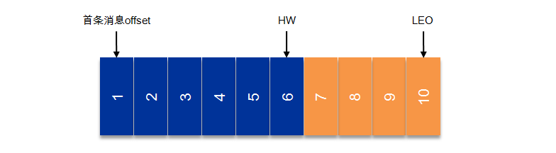

上图中有两个新名词：HW和LEO。这里先介绍下LEO，LogEndOffset的缩写，表示每个partition的log最后一条Message的位置。HW是HighWatermark的缩写，是指consumer能够看到的此partition的位置，这个涉及到多副本的概念，这里先提及一下，下节再详表。

言归正传，为了提高消息的可靠性，Kafka每个topic的partition有N个副本（replicas），其中N(大于等于1)是topic的复制因子（replica fator）的个数。Kafka通过多副本机制实现故障自动转移，当Kafka集群中一个broker失效情况下仍然保证服务可用。在Kafka中发生复制时确保partition的日志能有序地写到其他节点上，N个replicas中，其中一个replica为leader，其他都为follower, leader处理partition的所有读写请求，与此同时，follower会被动定期地去复制leader上的数据。

如下图所示，Kafka集群中有4个broker, 某topic有3个partition,且复制因子即副本个数也为3：

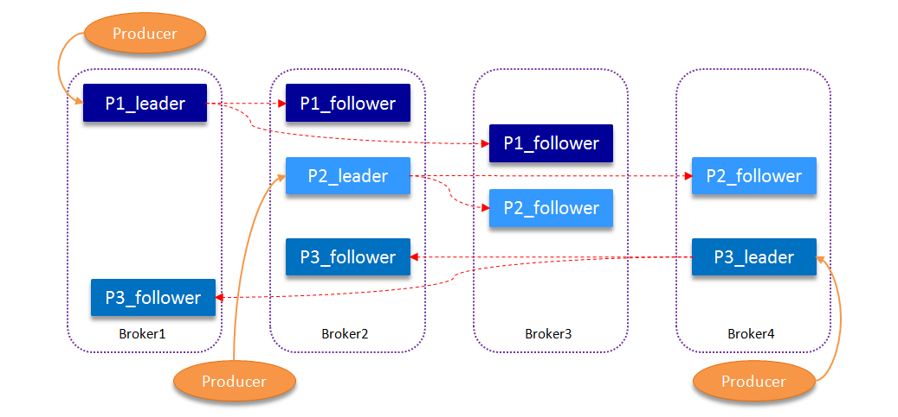

Kafka提供了数据复制算法保证，如果leader发生故障或挂掉，一个新leader被选举并被接受客户端的消息成功写入。Kafka确保从同步副本列表中选举一个副本为leader，或者说follower追赶leader数据。leader负责维护和跟踪ISR(In-Sync Replicas的缩写，表示副本同步队列，具体可参考下节)中所有follower滞后的状态。当producer发送一条消息到broker后，leader写入消息并复制到所有follower。消息提交之后才被成功复制到所有的同步副本。消息复制延迟受最慢的follower限制，重要的是快速检测慢副本，如果follower“落后”太多或者失效，leader将会把它从ISR中删除。

### ISR
上节我们涉及到ISR (In-Sync Replicas)，这个是指副本同步队列。副本数对Kafka的吞吐率是有一定的影响，但极大的增强了可用性。默认情况下Kafka的replica数量为1，即每个partition都有一个唯一的leader，为了确保消息的可靠性，通常应用中将其值(由broker的参数offsets.topic.replication.factor指定)大小设置为大于1，比如3。 所有的副本（replicas）统称为Assigned Replicas，即AR。ISR是AR中的一个子集，由leader维护ISR列表，follower从leader同步数据有一些延迟（包括延迟时间replica.lag.time.max.ms和延迟条数replica.lag.max.messages两个维度, 当前最新的版本0.10.x中只支持replica.lag.time.max.ms这个维度），任意一个超过阈值都会把follower剔除出ISR, 存入OSR（Outof-Sync Replicas）列表，新加入的follower也会先存放在OSR中。AR=ISR+OSR。ISR中包括：leader和follower。

Kafka 0.9.0.0版本后移除了replica.lag.max.messages参数，只保留了replica.lag.time.max.ms作为ISR中副本管理的参数。为什么这样做呢？replica.lag.max.messages表示当前某个副本落后leader的消息数量超过了这个参数的值，那么leader就会把follower从ISR中删除。假设设置replica.lag.max.messages=4，那么如果producer一次传送至broker的消息数量都小于4条时，因为在leader接受到producer发送的消息之后而follower副本开始拉取这些消息之前，follower落后leader的消息数不会超过4条消息，故此没有follower移出ISR，所以这时候replica.lag.max.message的设置似乎是合理的。但是producer发起瞬时高峰流量，producer一次发送的消息超过4条时，也就是超过replica.lag.max.messages，此时follower都会被认为是与leader副本不同步了，从而被踢出了ISR。但实际上这些follower都是存活状态的且没有性能问题。那么在之后追上leader,并被重新加入了ISR。于是就会出现它们不断地剔出ISR然后重新回归ISR，这无疑增加了无谓的性能损耗。而且这个参数是broker全局的。设置太大了，影响真正“落后”follower的移除；设置的太小了，导致follower的频繁进出。无法给定一个合适的replica.lag.max.messages的值，故此，新版本的Kafka移除了这个参数。

上面一节还涉及到一个概念，即HW。HW俗称高水位，HighWatermark的缩写，取一个partition对应的ISR中最小的LEO作为HW，consumer最多只能消费到HW所在的位置。另外每个replica都有HW,leader和follower各自负责更新自己的HW的状态。对于leader新写入的消息，consumer不能立刻消费，leader会等待该消息被所有ISR中的replicas同步后更新HW，此时消息才能被consumer消费。这样就保证了如果leader所在的broker失效，该消息仍然可以从新选举的leader中获取。对于来自内部broker的读取请求，没有HW的限制。

下图详细的说明了当producer生产消息至broker后，ISR以及HW和LEO的流转过程：

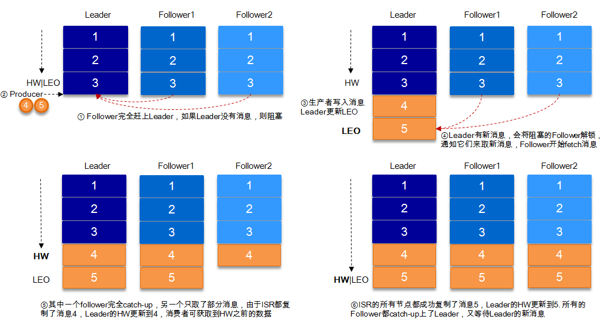

由此可见，Kafka的复制机制既不是完全的同步复制，也不是单纯的异步复制。事实上，同步复制要求所有能工作的follower都复制完，这条消息才会被commit，这种复制方式极大的影响了吞吐率。而异步复制方式下，follower异步的从leader复制数据，数据只要被leader写入log就被认为已经commit，这种情况下如果follower都还没有复制完，落后于leader时，突然leader宕机，则会丢失数据。而Kafka的这种使用ISR的方式则很好的均衡了确保数据不丢失以及吞吐率。

Kafka的ISR的管理最终都会反馈到Zookeeper节点上。具体位置为：/brokers/topics/[topic]/partitions/[partition]/state。目前有两个地方会对这个Zookeeper的节点进行维护：

- Controller来维护：Kafka集群中的其中一个Broker会被选举为Controller，主要负责Partition管理和副本状态管理，也会执行类似于重分配partition之类的管理任务。在符合某些特定条件下，Controller下的LeaderSelector会选举新的leader，ISR和新的leader_epoch及controller_epoch写入Zookeeper的相关节点中。同时发起LeaderAndIsrRequest通知所有的replicas。
- leader来维护：leader有单独的线程定期检测ISR中follower是否脱离ISR, 如果发现ISR变化，则会将新的ISR的信息返回到Zookeeper的相关节点中。

### Leader选举
一条消息只有被ISR中的所有follower都从leader复制过去才会被认为已提交。这样就避免了部分数据被写进了leader，还没来得及被任何follower复制就宕机了，而造成数据丢失。而对于producer而言，它可以选择是否等待消息commit，这可以通过request.required.acks来设置。这种机制确保了只要ISR中有一个或者以上的follower，一条被commit的消息就不会丢失。

有一个很重要的问题是当leader宕机了，怎样在follower中选举出新的leader，因为follower可能落后很多或者直接crash了，所以必须确保选择“最新”的follower作为新的leader。一个基本的原则就是，如果leader不在了，新的leader必须拥有原来的leader commit的所有消息。这就需要做一个折中，如果leader在一个消息被commit前等待更多的follower确认，那么在它挂掉之后就有更多的follower可以成为新的leader，但这也会造成吞吐率的下降。

一种非常常用的选举leader的方式是“少数服从多数”，Kafka并不是采用这种方式。这种模式下，如果我们有2f+1个副本，那么在commit之前必须保证有f+1个replica复制完消息，同时为了保证能正确选举出新的leader，失败的副本数不能超过f个。这种方式有个很大的优势，系统的延迟取决于最快的几台机器，也就是说比如副本数为3，那么延迟就取决于最快的那个follower而不是最慢的那个。“少数服从多数”的方式也有一些劣势，为了保证leader选举的正常进行，它所能容忍的失败的follower数比较少，如果要容忍1个follower挂掉，那么至少要3个以上的副本，如果要容忍2个follower挂掉，必须要有5个以上的副本。也就是说，在生产环境下为了保证较高的容错率，必须要有大量的副本，而大量的副本又会在大数据量下导致性能的急剧下降。这种算法更多用在Zookeeper这种共享集群配置的系统中而很少在需要大量数据的系统中使用的原因。HDFS的HA功能也是基于“少数服从多数”的方式，但是其数据存储并不是采用这样的方式。

实际上，leader选举的算法非常多，比如Zookeeper的Zab、Raft以及Viewstamped Replication。而Kafka所使用的leader选举算法更像是微软的PacificA算法。

Kafka在Zookeeper中为每一个partition动态的维护了一个ISR，这个ISR里的所有replica都跟上了leader，只有ISR里的成员才能有被选为leader的可能（unclean.leader.election.enable=false）。在这种模式下，对于f+1个副本，一个Kafka topic能在保证不丢失已经commit消息的前提下容忍f个副本的失败，在大多数使用场景下，这种模式是十分有利的。事实上，为了容忍f个副本的失败，“少数服从多数”的方式和ISR在commit前需要等待的副本的数量是一样的，但是ISR需要的总的副本的个数几乎是“少数服从多数”的方式的一半。

上文提到，在ISR中至少有一个follower时，Kafka可以确保已经commit的数据不丢失，但如果某一个partition的所有replica都挂了，就无法保证数据不丢失了。这种情况下有两种可行的方案：

- 等待ISR中任意一个replica“活”过来，并且选它作为leader
- 选择第一个“活”过来的replica（并不一定是在ISR中）作为leader

这就需要在可用性和一致性当中作出一个简单的抉择。如果一定要等待ISR中的replica“活”过来，那不可用的时间就可能会相对较长。而且如果ISR中所有的replica都无法“活”过来了，或者数据丢失了，这个partition将永远不可用。选择第一个“活”过来的replica作为leader,而这个replica不是ISR中的replica,那即使它并不保障已经包含了所有已commit的消息，它也会成为leader而作为consumer的数据源。默认情况下，Kafka采用第二种策略，即unclean.leader.election.enable=true，也可以将此参数设置为false来启用第一种策略。

unclean.leader.election.enable这个参数对于leader的选举、系统的可用性以及数据的可靠性都有至关重要的影响。下面我们来分析下几种典型的场景。

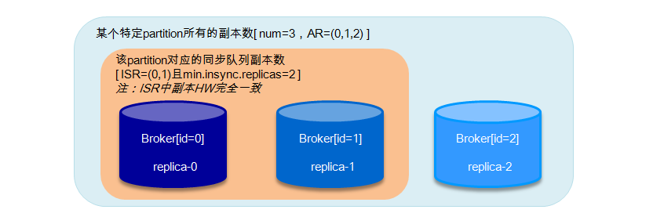

如果上图所示，假设某个partition中的副本数为3，replica-0, replica-1, replica-2分别存放在broker0, broker1和broker2中。AR=(0,1,2)，ISR=(0,1)。

设置request.required.acks=-1, min.insync.replicas=2，unclean.leader.election.enable=false。这里将broker0中的副本也称之为broker0起初broker0为leader，broker1为follower。

- 当ISR中的replica-0出现crash的情况时，broker1选举为新的leader[ISR=(1)]，因为受min.insync.replicas=2影响，write不能服务，但是read能继续正常服务。此种情况恢复方案：
  - 尝试恢复(重启)replica-0，如果能起来，系统正常；
  - 如果replica-0不能恢复，需要将min.insync.replicas设置为1，恢复write功能。
- 当ISR中的replica-0出现crash，紧接着replica-1也出现了crash, 此时[ISR=(1),leader=-1],不能对外提供服务，此种情况恢复方案：
  - 尝试恢复replica-0和replica-1，如果都能起来，则系统恢复正常；
  - 如果replica-0起来，而replica-1不能起来，这时候仍然不能选出leader，因为当设置unclean.leader.election.enable=false时，leader只能从ISR中选举，当ISR中所有副本都失效之后，需要ISR中最后失效的那个副本能恢复之后才能选举leader, 即replica-0先失效，replica-1后失效，需要replica-1恢复后才能选举leader。保守的方案建议把unclean.leader.election.enable设置为true,但是这样会有丢失数据的情况发生，这样可以恢复read服务。同样需要将min.insync.replicas设置为1，恢复write功能；
  - replica-1恢复，replica-0不能恢复，这个情况上面遇到过，read服务可用，需要将min.insync.replicas设置为1，恢复write功能；
  - replica-0和replica-1都不能恢复，这种情况可以参考情形2.
- 当ISR中的replica-0, replica-1同时宕机,此时[ISR=(0,1)],不能对外提供服务，此种情况恢复方案：尝试恢复replica-0和replica-1，当其中任意一个副本恢复正常时，对外可以提供read服务。直到2个副本恢复正常，write功能才能恢复，或者将将min.insync.replicas设置为1。


===========


这里的策略，服务端这边的处理是follower从leader批量拉取数据来同步。但是具体的可靠性，是由生产者来决定的。
生产者生产消息的时候，通过request.required.acks参数来设置数据的可靠性。

|acks|	what happen|
|---|---|
|0	|which means that the producer never waits for an acknowledgement from the broker.发过去就完事了，不关心broker是否处理成功，可能丢数据。|
|1	|which means that the producer gets an acknowledgement after the leader replica has received the data. 当写Leader成功后就返回,其他的replica都是通过fetcher去同步的,所以kafka是异步写，主备切换可能丢数据。|
|-1	|which means that the producer gets an acknowledgement after all in-sync replicas have received the data. 要等到isr里所有机器同步成功，才能返回成功，延时取决于最慢的机器。强一致，不会丢数据。|

在acks=-1的时候，如果ISR少于min.insync.replicas指定的数目，那么就会返回不可用。

这里ISR列表中的机器是会变化的，根据配置replica.lag.time.max.ms，多久没同步，就会从ISR列表中剔除。以前还有根据落后多少条消息就踢出ISR，在1.0版本后就去掉了，因为这个值很难取，在高峰的时候很容易出现节点不断的进出ISR列表。

从ISA中选出leader后，follower会从把自己日志中上一个高水位后面的记录去掉，然后去和leader拿新的数据。因为新的leader选出来后，follower上面的数据，可能比新leader多，所以要截取。这里高水位的意思，对于partition和leader，就是所有ISR中都有的最新一条记录。消费者最多只能读到高水位；

从leader的角度来说高水位的更新会延迟一轮，例如写入了一条新消息，ISR中的broker都fetch到了，但是ISR中的broker只有在下一轮的fetch中才能告诉leader。

也正是由于这个高水位延迟一轮，在一些情况下，kafka会出现丢数据和主备数据不一致的情况，0.11开始，使用leader epoch来代替高水位。（https://cwiki.apache.org/confluence/display/KAFKA/KIP-101+-+Alter+Replication+Protocol+to+use+Leader+Epoch+rather+than+High+Watermark+for+Truncation#KIP-101-AlterReplicationProtocoltouseLeaderEpochratherthanHighWatermarkforTruncation-Scenario1:HighWatermarkTruncationfollowedbyImmediateLeaderElection）

思考：
当acks=-1时

- 是follwers都来fetch就返回成功，还是等follwers第二轮fetch？
- leader已经写入本地，但是ISR中有些机器失败，那么怎么处理呢？

### 文件组织
kafka的数据，实际上是以文件的形式存储在文件系统的。topic下有partition，partition下有segment，segment是实际的一个个文件，topic和partition都是抽象概念。

在目录/${topicName}-{$partitionid}/下，存储着实际的log文件（即segment），还有对应的索引文件。

每个segment文件大小相等，文件名以这个segment中最小的offset命名，文件扩展名是.log；segment对应的索引的文件名字一样，扩展名是.index。有两个index文件，一个是offset index用于按offset去查message，一个是time index用于按照时间去查，其实这里可以优化合到一起，下面只说offset index。总体的组织是这样的：

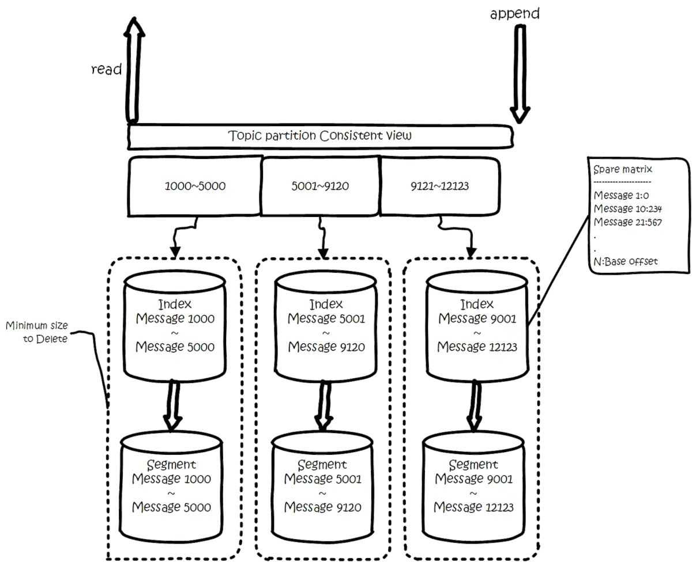

为了减少索引文件的大小，降低空间使用，方便直接加载进内存中，这里的索引使用稀疏矩阵，不会每一个message都记录下具体位置，而是每隔一定的字节数，再建立一条索引。 索引包含两部分，分别是baseOffset，还有position。

baseOffset：意思是这条索引对应segment文件中的第几条message。这样做方便使用数值压缩算法来节省空间。例如kafka使用的是varint。

position：在segment中的绝对位置。

查找offset对应的记录时，会先用二分法，找出对应的offset在哪个segment中，然后使用索引，在定位出offset在segment中的大概位置，再遍历查找message。


### Controller
在Kafka集群中会有一个或者多个broker，其中有一个broker会被选举为控制器（Kafka Controller），它负责管理整个集群中所有分区和副本的状态。当某个分区的leader副本出现故障时，由控制器负责为该分区选举新的leader副本。当检测到某个分区的ISR集合发生变化时，由控制器负责通知所有broker更新其元数据信息。当使用kafka-topics.sh脚本为某个topic增加分区数量时，同样还是由控制器负责分区的重新分配。

Kafka中的控制器选举的工作依赖于Zookeeper，成功竞选为控制器的broker会在Zookeeper中创建/controller这个临时（EPHEMERAL）节点，此临时节点的内容参考如下：

```json
{"version":1,"brokerid":0,"timestamp":"1529210278988"}
```

其中version在目前版本中固定为1，brokerid表示称为控制器的broker的id编号，timestamp表示竞选称为控制器时的时间戳。

在任意时刻，集群中有且仅有一个控制器。每个broker启动的时候会去尝试去读取/controller节点的brokerid的值，如果读取到brokerid的值不为-1，则表示已经有其它broker节点成功竞选为控制器，所以当前broker就会放弃竞选；如果Zookeeper中不存在/controller这个节点，或者这个节点中的数据异常，那么就会尝试去创建/controller这个节点，当前broker去创建节点的时候，也有可能其他broker同时去尝试创建这个节点，只有创建成功的那个broker才会成为控制器，而创建失败的broker则表示竞选失败。每个broker都会在内存中保存当前控制器的brokerid值，这个值可以标识为activeControllerId。

Zookeeper中还有一个与控制器有关的/controller_epoch节点，这个节点是持久（PERSISTENT）节点，节点中存放的是一个整型的controller_epoch值。controller_epoch用于记录控制器发生变更的次数，即记录当前的控制器是第几代控制器，我们也可以称之为“控制器的纪元”。controller_epoch的初始值为1，即集群中第一个控制器的纪元为1，当控制器发生变更时，每选出一个新的控制器就将该字段值加1。每个和控制器交互的请求都会携带上controller_epoch这个字段，如果请求的controller_epoch值小于内存中的controller_epoch值，则认为这个请求是向已经过期的控制器所发送的请求，那么这个请求会被认定为无效的请求。如果请求的controller_epoch值大于内存中的controller_epoch值，那么则说明已经有新的控制器当选了。由此可见，Kafka通过controller_epoch来保证控制器的唯一性，进而保证相关操作的一致性。

具备控制器身份的broker需要比其他普通的broker多一份职责，具体细节如下：

1. 监听partition相关的变化。为Zookeeper中的/admin/reassign_partitions节点注册PartitionReassignmentListener，用来处理分区重分配的动作。为Zookeeper中的/isr_change_notification节点注册IsrChangeNotificetionListener，用来处理ISR集合变更的动作。为Zookeeper中的/admin/preferred-replica-election节点添加PreferredReplicaElectionListener，用来处理优先副本的选举动作。
1. 监听topic相关的变化。为Zookeeper中的/brokers/topics节点添加TopicChangeListener，用来处理topic增减的变化；为Zookeeper中的/admin/delete_topics节点添加TopicDeletionListener，用来处理删除topic的动作。
1. 监听broker相关的变化。为Zookeeper中的/brokers/ids/节点添加BrokerChangeListener，用来处理broker增减的变化。
1. 从Zookeeper中读取获取当前所有与topic、partition以及broker有关的信息并进行相应的管理。对于所有topic所对应的Zookeeper中的/brokers/topics/[topic]节点添加PartitionModificationsListener，用来监听topic中的分区分配变化。
1. 启动并管理分区状态机和副本状态机。
1. 更新集群的元数据信息。
1. 如果参数auto.leader.rebalance.enable设置为true，则还会开启一个名为“auto-leader-rebalance-task”的定时任务来负责维护分区的优先副本的均衡。


### ControllerContext
控制器在选举成功之后会读取Zookeeper中各个节点的数据来初始化上下文信息（ControllerContext），并且也需要管理这些上下文信息，比如为某个topic增加了若干个分区，控制器在负责创建这些分区的同时也要更新上下文信息，并且也需要将这些变更信息同步到其他普通的broker节点中。不管是监听器触发的事件，还是定时任务触发的事件，亦或者是其他事件（比如ControlledShutdown）都会读取或者更新控制器中的上下文信息，那么这样就会涉及到多线程间的同步，如果单纯的使用锁机制来实现，那么整体的性能也会大打折扣。针对这一现象，Kafka的控制器使用单线程基于事件队列的模型，将每个事件都做一层封装，然后按照事件发生的先后顺序暂存到LinkedBlockingQueue中，然后使用一个专用的线程（ControllerEventThread）按照FIFO（First Input First Output, 先入先出）的原则顺序处理各个事件，这样可以不需要锁机制就可以在多线程间维护线程安全。

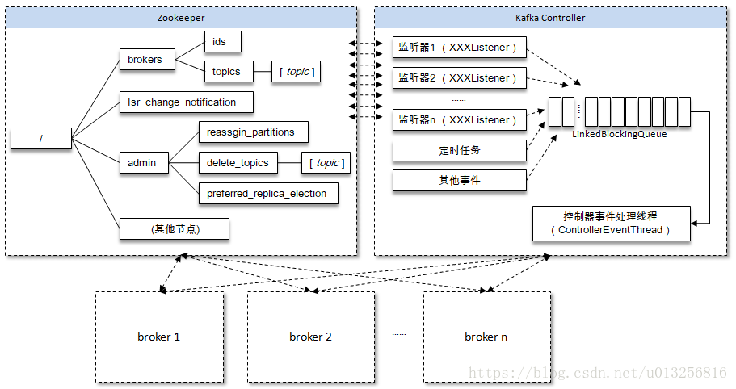


在Kafka的早期版本中，并没有采用Kafka Controller这样一个概念来对分区和副本的状态进行管理，而是依赖于Zookeeper，每个broker都会在Zookeeper上为分区和副本注册大量的监听器（Watcher）。当分区或者副本状态变化时，会唤醒很多不必要的监听器，这种严重依赖于Zookeeper的设计会有脑裂、羊群效应以及造成Zookeeper过载的隐患。在目前的新版本的设计中，只有Kafka Controller在Zookeeper上注册相应的监听器，其他的broker极少需要再监听Zookeeper中的数据变化，这样省去了很多不必要的麻烦。不过每个broker还是会对/controller节点添加监听器的，以此来监听此节点的数据变化（参考ZkClient中的IZkDataListener）。

当/controller节点的数据发生变化时，每个broker都会更新自身内存中保存的activeControllerId。如果broker在数据变更前是控制器，那么如果在数据变更后自身的brokerid值与新的activeControllerId值不一致的话，那么就需要“退位”，关闭相应的资源，比如关闭状态机、注销相应的监听器等。有可能控制器由于异常而下线，造成/controller这个临时节点会被自动删除；也有可能是其他原因将此节点删除了。

当/controller节点被删除时，每个broker都会进行选举，如果broker在节点被删除前是控制器的话，在选举前还需要有一个“退位”的动作。如果有特殊需要，可以手动删除/controller节点来触发新一轮的选举。当然关闭控制器所对应的broker以及手动向/controller节点写入新的brokerid的所对应的数据同样可以触发新一轮的选举。


### PARTITION
在Kafka中Partition的四种状态：

1. NonExistentPartition —— 这个状态表示该分区要么没有被创建过或曾经被创建过但后面被删除了。
1. NewPartition —— 分区创建之后就处于NewPartition状态。在这个状态中，分区应该已经分配了副本，但是还没有选举出leader和ISR。
1. OnlinePartition —— 一旦分区的leader被推选出来，它就处于OnlinePartition状态。
1. OfflinePartition —— 如果leader选举出来后，leader broker宕机了，那么该分区就处于OfflinePartition状态。

四种状态的转换关系如下：

1. NonExistentPartition -> NewPartition
    1. 首先将第一个可用的副本broker作为leader broker并把所有可用的副本对象都装入ISR，然后写leader和ISR信息到zookeeper中保存
    1. 对于这个分区而言，发送LeaderAndIsr请求到每个可用的副本broker，以及UpdateMetadata请求到每个可用的broker上
2. OnlinePartition, OfflinePartition -> OnlinePartition
    1. 为该分区选取新的leader和ISR以及接收LeaderAndIsr请求的一组副本，然后写入leader和ISR信息到zookeeper中保存。
3. NewPartition, OnlinePartition -> OfflinePartition
    1. 标记分区状态为离线(offline)。
4. OfflinePartition -> NonExistentPartition
    1. 离线状态标记为不存在分区，表示该分区失败或者被删除。

### PartitionLeaderSelector
KafkaController.scala
```text
class KafkaController(val config : KafkaConfig, zkClient: ZkClient, val brokerState: BrokerState) extends Logging with KafkaMetricsGroup {
  this.logIdent = "[Controller " + config.brokerId + "]: "
  private var isRunning = true
  private val stateChangeLogger = KafkaController.stateChangeLogger
  val controllerContext = new ControllerContext(zkClient, config.zkSessionTimeoutMs)
  val partitionStateMachine = new PartitionStateMachine(this)
  val replicaStateMachine = new ReplicaStateMachine(this)
  private val controllerElector = new ZookeeperLeaderElector(controllerContext, ZkUtils.ControllerPath, onControllerFailover,
    onControllerResignation, config.brokerId)
  // have a separate scheduler for the controller to be able to start and stop independently of the
  // kafka server
  private val autoRebalanceScheduler = new KafkaScheduler(1)
  var deleteTopicManager: TopicDeletionManager = null
  val offlinePartitionSelector = new OfflinePartitionLeaderSelector(controllerContext, config)
  private val reassignedPartitionLeaderSelector = new ReassignedPartitionLeaderSelector(controllerContext)
  private val preferredReplicaPartitionLeaderSelector = new PreferredReplicaPartitionLeaderSelector(controllerContext)
  private val controlledShutdownPartitionLeaderSelector = new ControlledShutdownLeaderSelector(controllerContext)
  private val brokerRequestBatch = new ControllerBrokerRequestBatch(this)
 
  private val partitionReassignedListener = new PartitionsReassignedListener(this)
  private val preferredReplicaElectionListener = new PreferredReplicaElectionListener(this)
```

在KafkaController类（KafkaController.scala）中定义了很多属性，我们先重点了解下面的PartitionLeaderSelector对象，主要是为分区选举出leader broker，该trait只定义了一个方法selectLeader，接收一个TopicAndPartition对象和一个LeaderAndIsr对象。TopicAndPartition表示要选leader的分区，而第二个参数表示zookeeper中保存的该分区的当前leader和ISR记录。该方法会返回一个元组包括了推举出来的leader和ISR以及需要接收LeaderAndISr请求的一组副本。    
```
trait PartitionLeaderSelector {  
    def selectLeader(topicAndPartition: TopicAndPartition, currentLeaderAndIsr: LeaderAndIsr): (LeaderAndIsr, Seq[Int])
}
```   
 通过我们上面的代码，可以看到在KafkaController中共定义了五种selector选举器：
 
1. NoOpLeaderSelector
   - 原则上不做任何事情，返回当前的leader和isr。
1. OfflinePartitionLeaderSelector
   - 从活着的ISR中选择一个broker作为leader，如果ISR中没有活着的副本，则从assignedReplicas中选择一个副本作为leader，leader选举成功后注册到Zookeeper中，并更新所有的缓存。
1. ReassignedPartitionLeaderSelector
   - 从可用的ISR中选取第一个作为leader，把当前的ISR作为新的ISR，将重分配的副本集合作为接收LeaderAndIsr请求的副本集合。   
1. PreferredReplicaPartitionLeaderSelector
   - 如果从assignedReplicas取出的第一个副本就是分区leader的话，则抛出异常，否则将第一个副本设置为分区leader。
1. ControlledShutdownLeaderSelector
   - 将ISR中处于关闭状态的副本从集合中去除掉，返回一个新新的ISR集合，然后选取第一个副本作为leader，然后令当前AR作为接收LeaderAndIsr请求的副本。
 
所有的leader选择完成后，都要通过请求把具体的request路由到对应的handler处理。目前kafka并没有把handler抽象出来，而是每个handler都是一个函数，混在KafkaApi类中。  


## Producer
### Kafka的发送模式
Kafka的发送模式由producer端的配置参数producer.type来设置，这个参数指定了在后台线程中消息的发送方式是同步的还是异步的，默认是同步的方式，即producer.type=sync。如果设置成异步的模式，即producer.type=async，可以是producer以batch的形式push数据，这样会极大的提高broker的性能，但是这样会增加丢失数据的风险。如果需要确保消息的可靠性，必须要将producer.type设置为sync。

对于异步模式，还有4个配套的参数，如下：

|Property	|Description|
|---|---|
|queue.buffering.max.ms	|默认值：5000。启用异步模式时，producer缓存消息的时间。比如我们设置成1000时，它会缓存1s的数据再一次发送出去，这样可以极大的增加broker吞吐量，但也会造成时效性的降低。|
|queue.buffering.max.messages	|默认值：10000。启用异步模式时，producer缓存队列里最大缓存的消息数量，如果超过这个值，producer就会阻塞或者丢掉消息。|
|queue.enqueue.timeout.ms	|默认值：-1。当达到上面参数时producer会阻塞等待的时间。如果设置为0，buffer队列满时producer不会阻塞，消息直接被丢掉；若设置为-1，producer会被阻塞，不会丢消息。|
|batch.num.messages	|默认值：200。启用异步模式时，一个batch缓存的消息数量。达到这个数值时，producer才会发送消息。（每次批量发送的数量）|

以batch的方式推送数据可以极大的提高处理效率，kafka producer可以将消息在内存中累计到一定数量后作为一个batch发送请求。batch的数量大小可以通过producer的参数（batch.num.messages）控制。通过增加batch的大小，可以减少网络请求和磁盘IO的次数，当然具体参数设置需要在效率和时效性方面做一个权衡。在比较新的版本中还有batch.size这个参数。

### 数据可靠性和持久性保证
Kafka支持3种消息投递语义：当producer向leader发送数据时，可以通过request.required.acks参数来设置数据可靠性的级别：

- 0：这意味着producer无需等待来自broker的确认而继续发送下一批消息。这种情况下数据传输效率最高，但是数据可靠性确是最低的。
- 1（默认）：这意味着producer在ISR中的leader已成功收到数据并得到确认。如果leader宕机了，则会丢失数据。
- -1：producer需要等待ISR中的所有follower都确认接收到数据后才算一次发送完成，可靠性最高。但是这样也不能保证数据不丢失，比如当ISR中只有leader时（前面ISR那一节讲到，ISR中的成员由于某些情况会增加也会减少，最少就只剩一个leader），这样就变成了acks=1的情况

如果要提高数据的可靠性，在设置request.required.acks=-1的同时，也要min.insync.replicas这个参数(可以在broker或者topic层面进行设置)的配合，这样才能发挥最大的功效。min.insync.replicas这个参数设定ISR中的最小副本数是多少，默认值为1，当且仅当request.required.acks参数设置为-1时，此参数才生效。如果ISR中的副本数少于min.insync.replicas配置的数量时，客户端会返回异常：org.apache.kafka.common.errors.NotEnoughReplicasExceptoin: Messages are rejected since there are fewer in-sync replicas than required。

接下来对acks=1和-1的两种情况进行详细分析：

#### 1. request.required.acks=1
producer发送数据到leader，leader写本地日志成功，返回客户端成功；此时ISR中的副本还没有来得及拉取该消息，leader就宕机了，那么此次发送的消息就会丢失。

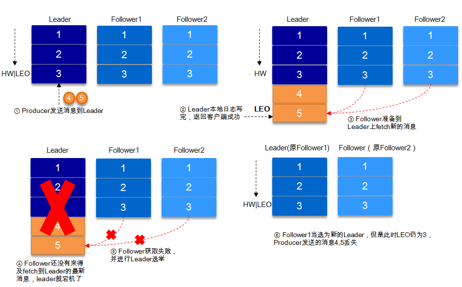

#### 2. request.required.acks=-1
同步（Kafka默认为同步，即producer.type=sync）的发送模式，replication.factor>=2且min.insync.replicas>=2的情况下，不会丢失数据。

有两种典型情况。acks=-1的情况下（如无特殊说明，以下acks都表示为参数request.required.acks），数据发送到leader, ISR的follower全部完成数据同步后，leader此时挂掉，那么会选举出新的leader，数据不会丢失。

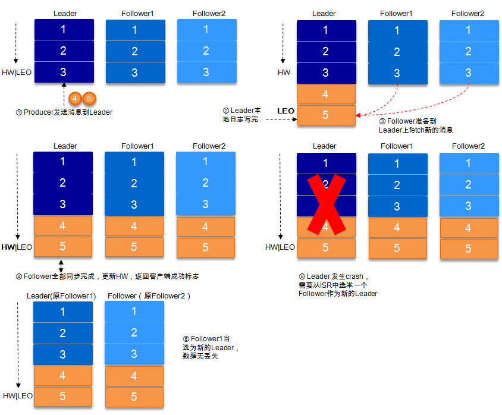

acks=-1的情况下，数据发送到leader后 ，部分ISR的副本同步，leader此时挂掉。比如follower1和follower2都有可能变成新的leader, producer端会得到返回异常，producer端会重新发送数据，数据可能会重复。

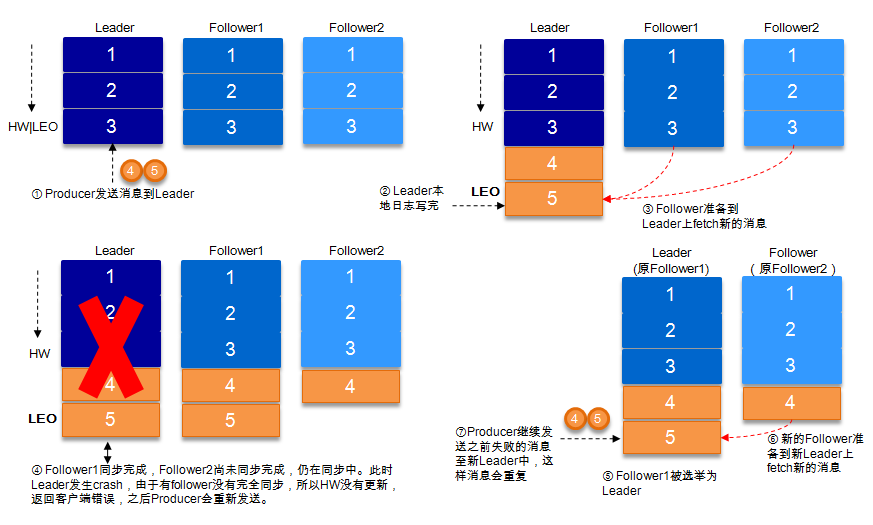


当然上图中如果在leader crash的时候，follower2还没有同步到任何数据，而且follower2被选举为新的leader的话，这样消息就不会重复。

> Kafka只处理fail/recover问题,不处理Byzantine问题。

### 关于HW的进一步探讨
考虑上图（即acks=-1,部分ISR副本同步）中的另一种情况，如果在Leader挂掉的时候，follower1同步了消息4,5，follower2同步了消息4，与此同时follower2被选举为leader，那么此时follower1中的多出的消息5该做如何处理呢？

这里就需要HW的协同配合了。如前所述，一个partition中的ISR列表中，leader的HW是所有ISR列表里副本中最小的那个的LEO。类似于木桶原理，水位取决于最低那块短板。


如上图，某个topic的某partition有三个副本，分别为A、B、C。A作为leader肯定是LEO最高，B紧随其后，C机器由于配置比较低，网络比较差，故而同步最慢。这个时候A机器宕机，这时候如果B成为leader，假如没有HW，在A重新恢复之后会做同步(makeFollower)操作，在宕机时log文件之后直接做追加操作，而假如B的LEO已经达到了A的LEO，会产生数据不一致的情况，所以使用HW来避免这种情况。
A在做同步操作的时候，先将log文件截断到之前自己的HW的位置，即3，之后再从B中拉取消息进行同步。

如果失败的follower恢复过来，它首先将自己的log文件截断到上次checkpointed时刻的HW的位置，之后再从leader中同步消息。leader挂掉会重新选举，新的leader会发送“指令”让其余的follower截断至自身的HW的位置然后再拉取新的消息。

> 当ISR中的个副本的LEO不一致时，如果此时leader挂掉，选举新的leader时并不是按照LEO的高低进行选举，而是按照ISR中的顺序选举。

### 消息投递语义

- At most once：最多一次，消息可能会丢失，但不会重复
- At least once：最少一次，消息不会丢失，可能会重复
- Exactly once：只且一次，消息不丢失不重复，只且消费一次（0.11中实现，仅限于下游也是kafka）


Kafka的消息传输保障机制非常直观。当producer向broker发送消息时，一旦这条消息被commit，由于副本机制（replication）的存在，它就不会丢失。但是如果producer发送数据给broker后，遇到的网络问题而造成通信中断，那producer就无法判断该条消息是否已经提交（commit）。虽然Kafka无法确定网络故障期间发生了什么，但是producer可以retry多次，确保消息已经正确传输到broker中，所以目前Kafka实现的是at least once。

consumer从broker中读取消息后，可以选择commit，该操作会在Zookeeper中存下该consumer在该partition下读取的消息的offset。该consumer下一次再读该partition时会从下一条开始读取。如未commit，下一次读取的开始位置会跟上一次commit之后的开始位置相同。当然也可以将consumer设置为autocommit，即consumer一旦读取到数据立即自动commit。如果只讨论这一读取消息的过程，那Kafka是确保了exactly once, 但是如果由于前面producer与broker之间的某种原因导致消息的重复，那么这里就是at least once。

考虑这样一种情况，当consumer读完消息之后先commit再处理消息，在这种模式下，如果consumer在commit后还没来得及处理消息就crash了，下次重新开始工作后就无法读到刚刚已提交而未处理的消息，这就对应于at most once了。

读完消息先处理再commit。这种模式下，如果处理完了消息在commit之前consumer crash了，下次重新开始工作时还会处理刚刚未commit的消息，实际上该消息已经被处理过了，这就对应于at least once。

要做到exactly once就需要引入消息去重机制。

在业务中，常常都是使用At least once的模型，如果需要可重入的话，往往是业务自己实现。

#### At least once
先获取数据，再进行业务处理，业务处理成功后commit offset。  
1. 生产者生产消息异常，消息是否成功写入不确定，重做，可能写入重复的消息  
1. 消费者处理消息，业务处理成功后，更新offset失败，消费者重启的话，会重复消费 

#### At most once
先获取数据，再commit offset，最后进行业务处理。  
1. 生产者生产消息异常，不管，生产下一个消息，消息就丢了  
1. 消费者处理消息，先更新offset，再做业务处理，做业务处理失败，消费者重启，消息就丢了  

#### Exactly once
思路是这样的，首先要保证消息不丢，再去保证不重复。所以盯着At least once的原因来搞。 首先想出来的：
1. 生产者重做导致重复写入消息----生产保证幂等性
1. 消费者重复消费---消灭重复消费，或者业务接口保证幂等性重复消费也没问题

由于业务接口是否幂等，不是kafka能保证的，所以kafka这里提供的exactly once是有限制的，消费者的下游也必须是kafka。所以一下讨论的，没特殊说明，消费者的下游系统都是kafka（注:使用kafka conector，它对部分系统做了适配，实现了exactly once）。

生产者幂等性好做，没啥问题。

解决重复消费有两个方法：
1. 下游系统保证幂等性，重复消费也不会导致多条记录。
1. 把commit offset和业务处理绑定成一个事务。

本来exactly once实现第1点就ok了。

但是在一些使用场景下，我们的数据源可能是多个topic，处理后输出到多个topic，这时我们会希望输出时要么全部成功，要么全部失败。这就需要实现事务性。既然要做事务，那么干脆把重复消费的问题从根源上解决，把commit offset和输出到其他topic绑定成一个事务。

### 生产幂等性
思路是这样的，为每个producer分配一个pid，作为该producer的唯一标识。producer会为每一个<topic,partition>维护一个单调递增的seq。类似的，broker也会为每个<pid,topic,partition>记录下最新的seq。当req_seq == broker_seq+1时，broker才会接受该消息。因为：

1. 消息的seq比broker的seq大超过时，说明中间有数据还没写入，即乱序了。
1. 消息的seq不比broker的seq小，那么说明该消息已被保存。

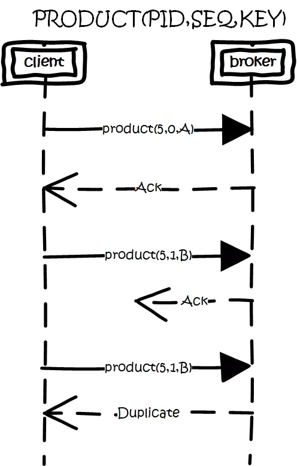

### 事务性/原子性广播
场景是这样的：

1. 先从多个源topic中获取数据。
1. 做业务处理，写到下游的多个目的topic。
1. 更新多个源topic的offset。

其中第2、3点作为一个事务，要么全成功，要么全失败。这里得益与offset实际上是用特殊的topic去保存，这两点都归一为写多个topic的事务性处理。

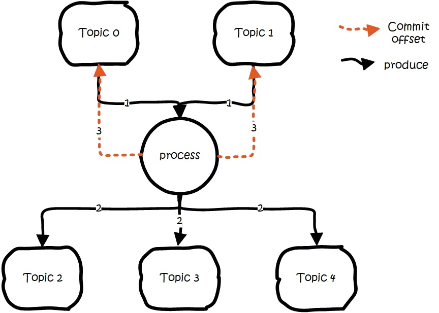

基本思路是这样的：
引入tid（transaction id），和pid不同，这个id是应用程序提供的，用于标识事务，和producer是谁并没关系。就是任何producer都可以使用这个tid去做事务，这样进行到一半就死掉的事务，可以由另一个producer去恢复。
同时为了记录事务的状态，类似对offset的处理，引入transaction coordinator用于记录transaction log。在集群中会有多个transaction coordinator，每个tid对应唯一一个transaction coordinator。
注：transaction log删除策略是compact，已完成的事务会标记成null，compact后不保留。

做事务时，先标记开启事务，写入数据，全部成功就在transaction log中记录为prepare commit状态，否则写入prepare abort的状态。之后再去给每个相关的partition写入一条marker（commit或者abort）消息，标记这个事务的message可以被读取或已经废弃。成功后在transaction log记录下commit/abort状态，至此事务结束。

数据流：

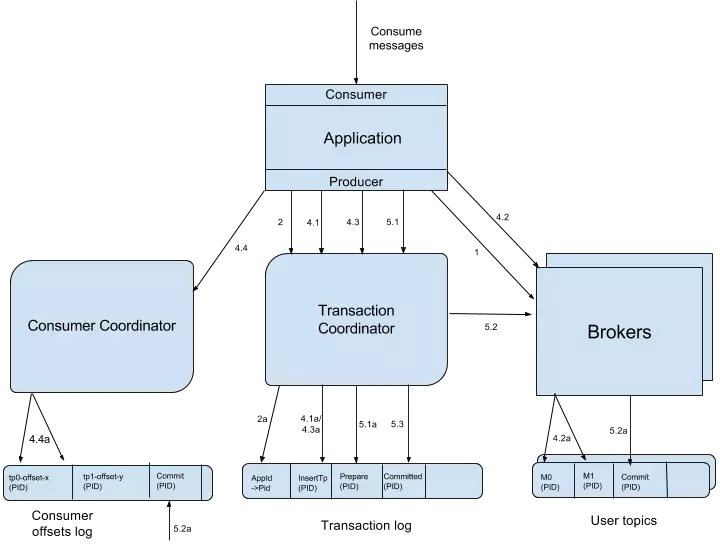

1. 首先使用tid请求任意一个broker（代码中写的是负载最小的broker），找到对应的transaction coordinator。 
1. 请求transaction coordinator获取到对应的pid，和pid对应的epoch，这个epoch用于防止僵死进程复活导致消息错乱，当消息的epoch比当前维护的epoch小时，拒绝掉。tid和pid有一一对应的关系，这样对于同一个tid会返回相同的pid。
1. client先请求transaction coordinator记录<topic,partition>的事务状态，初始状态是BEGIN，如果是该事务中第一个到达的<topic,partition>，同时会对事务进行计时；client输出数据到相关的partition中；client再请求transaction coordinator记录offset的<topic,partition>事务状态；client发送offset commit到对应offset partition。
1. client发送commit请求，transaction coordinator记录prepare commit/abort，然后发送marker给相关的partition。全部成功后，记录commit/abort的状态，最后这个记录不需要等待其他replica的ack，因为prepare不丢就能保证最终的正确性了。

这里prepare的状态主要是用于事务恢复，例如给相关的partition发送控制消息，没发完就宕机了，备机起来后，producer发送请求获取pid时，会把未完成的事务接着完成。

当partition中写入commit的marker后，相关的消息就可被读取。所以kafka事务在prepare commit到commit这个时间段内，消息是逐渐可见的，而不是同一时刻可见。

详细细节可看：https://cwiki.apache.org/confluence/display/KAFKA/KIP-98+-+Exactly+Once+Delivery+and+Transactional+Messaging#KIP-98-ExactlyOnceDeliveryandTransactionalMessaging-TransactionalGuarantees

### 消息去重
Kafka在producer端和consumer端都会出现消息的重复，这就需要去重处理。

Kafka文档中提及GUID(Globally Unique Identifier)的概念，通过客户端生成算法得到每个消息的unique id，同时可映射至broker上存储的地址，即通过GUID便可查询提取消息内容，也便于发送方的幂等性保证，需要在broker上提供此去重处理模块，目前版本尚不支持。

针对GUID, 如果从客户端的角度去重，那么需要引入集中式缓存，必然会增加依赖复杂度，另外缓存的大小难以界定。

不只是Kafka, 类似RabbitMQ以及RocketMQ这类商业级中间件也只保障at least once, 且也无法从自身去进行消息去重。所以我们建议业务方根据自身的业务特点进行去重，比如业务消息本身具备幂等性，或者借助Redis等其他产品进行去重处理。


## Consumer

订阅topic是以一个消费组来订阅的，一个消费组里面可以有多个消费者。同一个消费组中的两个消费者，不会同时消费一个partition。换句话来说，就是一个partition，只能被消费组里的一个消费者消费，但是可以同时被多个消费组消费。因此，如果消费组内的消费者如果比partition多的话，那么就会有个别消费者一直空闲。

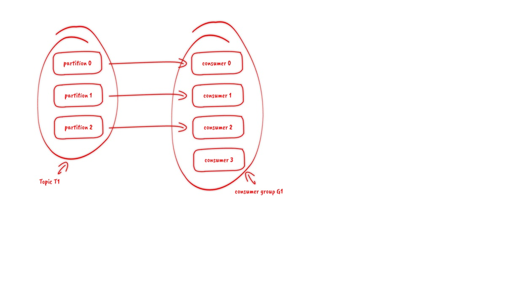

### API
订阅topic时，可以用正则表达式，如果有新topic匹配上，那能自动订阅上。

### offset的保存
一个消费组消费partition，需要保存offset记录消费到哪，以前保存在zk中，由于zk的写性能不好，以前的解决方法都是consumer每隔一分钟上报一次。这里zk的性能严重影响了消费的速度，而且很容易出现重复消费。
在0.10版本后，kafka把这个offset的保存，从zk总剥离，保存在一个名叫__consumeroffsets topic的topic中。写进消息的key由groupid、topic、partition组成，value是偏移量offset。topic配置的清理策略是compact。总是保留最新的key，其余删掉。一般情况下，每个key的offset都是缓存在内存中，查询的时候不用遍历partition，如果没有缓存，第一次就会遍历partition建立缓存，然后查询返回。

确定consumer group位移信息写入__consumers_offsets的哪个partition，具体计算公式：

```
__consumers_offsets partition =
           Math.abs(groupId.hashCode() % groupMetadataTopicPartitionCount)   
//groupMetadataTopicPartitionCount由offsets.topic.num.partitions指定，默认是50个分区。
```

思考：
如果正在跑的服务，修改了offsets.topic.num.partitions，那么offset的保存是不是就乱套了

### 分配partition--reblance
生产过程中broker要分配partition，消费过程这里，也要分配partition给消费者。类似broker中选了一个controller出来，消费也要从broker中选一个coordinator，用于分配partition。
下面从顶向下，分别阐述一下

- 怎么选coordinator。
- 交互流程。
- reblance的流程。

### 选coordinator
- 看offset保存在那个partition
- 该partition leader所在的broker就是被选定的coordinator
这里我们可以看到，consumer group的coordinator，和保存consumer group offset的partition leader是同一台机器。

### 交互流程
把coordinator选出来之后，就是要分配了
整个流程是这样的：

- consumer启动、或者coordinator宕机了，consumer会任意请求一个broker，发送ConsumerMetadataRequest请求，broker会按照上面说的方法，选出这个consumer对应coordinator的地址。
- consumer 发送heartbeat请求给coordinator，返回IllegalGeneration的话，就说明consumer的信息是旧的了，需要重新加入进来，进行reblance。返回成功，那么consumer就从上次分配的partition中继续执行。


### reblance流程
1. consumer给coordinator发送JoinGroupRequest请求。
1. 这时其他consumer发heartbeat请求过来时，coordinator会告诉他们，要reblance了。
1. 其他consumer发送JoinGroupRequest请求。
1. 所有记录在册的consumer都发了JoinGroupRequest请求之后，coordinator就会在这里consumer中随便选一个leader。然后回JoinGroupRespone，这会告诉consumer你是follower还是leader，对于leader，还会把follower的信息带给它，让它根据这些信息去分配partition
1. consumer向coordinator发送SyncGroupRequest，其中leader的SyncGroupRequest会包含分配的情况。
1. coordinator回包，把分配的情况告诉consumer，包括leader。

当partition或者消费者的数量发生变化时，都得进行reblance。
列举一下会reblance的情况：

1. 增加partition
1. 增加消费者
1. 消费者主动关闭
1. 消费者宕机了
1. coordinator自己也宕机了


### 消费事务
前面都是从生产的角度看待事务。还需要从消费的角度去考虑一些问题。

消费时，partition中会存在一些消息处于未commit状态，即业务方应该看不到的消息，需要过滤这些消息不让业务看到，kafka选择在消费者进程中进行过来，而不是在broker中过滤，主要考虑的还是性能。kafka高性能的一个关键点是zero copy，如果需要在broker中过滤，那么势必需要读取消息内容到内存，就会失去zero copy的特性。

## 高可靠性配置
Kafka提供了很高的数据冗余弹性，对于需要数据高可靠性的场景，我们可以增加数据冗余备份数（replication.factor），调高最小写入副本数的个数（min.insync.replicas）等等，但是这样会影响性能。反之，性能提高而可靠性则降低，用户需要自身业务特性在彼此之间做一些权衡性选择。

要保证数据写入到Kafka是安全的，高可靠的，需要如下的配置：

- topic的配置：replication.factor>=3,即副本数至少是3个；2<=min.insync.replicas<=replication.factor
- broker的配置：leader的选举条件unclean.leader.election.enable=false
- producer的配置：request.required.acks=-1(all)，producer.type=sync

   
## [KafkaBeanchMark](https://blog.csdn.net/u013256816/article/details/71091774)   

## 参考资料
https://www.zhihu.com/question/309414875/answer/576557880
https://www.jianshu.com/p/d3e963ff8b70
https://blog.csdn.net/u013256816/article/details/71091774
