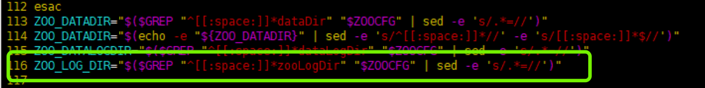

## 单机部署Zookeeper
## [版本列表](https://archive.apache.org/dist/zookeeper/)
2019年5月20日发行的3.5.5是3.5分支的第一个稳定版本。此版本被认为是3.4稳定分支的后续版本，可以用于生产。基于3.4它包含以下新功能
- 动态重新配置
- 本地会议
- 新节点类型：容器，TTL
- 原子广播协议的SSL支持
- 删除观察者的能力
- 多线程提交处理器
- 升级到Netty 4.1
- Maven构建
另请注意：建议的最低JDK版本为1.8
文件说明：
- apache-zookeeper-xxx-tar.gz 代表源代码
- apache-zookeeper-xxx-bin.tar.gz 运行版本

## 准备部署环境
- 使用root账号登录系统并[创建用户](../../../os/linux/SUMMARY.md)后完成如下配置
  ```
  cd /usr/local/bin
  mkdir zookeeper
  cd zookeeper
  curl -O https://archive.apache.org/dist/zookeeper/zookeeper-3.5.5-bin/apache-zookeeper-3.5.5-bin.tar.gz
  tar -zxvf apache-zookeeper-3.5.5-bin.tar.gz
  ln -s apache-zookeeper-3.5.5-bin zookeeper
  ```
  修改bin/zkServer.sh,添加变量ZOO_LOG_DIR，改变量体现在zoo.cfg配置文件中
  ```
  ZOO_LOG_DIR="$($GREP "^[[:space:]]*zooLogDir" "$ZOOCFG" | sed -e 's/.*=//')"
  ```
  
  
  在/etc/profile中配置
  ```
  export ZK_HOME=/usr/local/bin/zookeeper/zookeeper
  export PATH=$PATH:$ZK_HOME/bin
  ```
## 部署
- [切换回创建的账号](../../../os/linux/SUMMARY.md)并做如下配置
  ```
  cd /home/zookeeper
  mkdir stand_alone
  cd stand_alone
  mkdir data
  mkdir datalog
  mkdir conf
  mkdir logger
  mkdir zoolog
  ```
  从zookeeper的安装路径下的conf中复制一份配置文件到新建的conf目录中
  ```
   cp /usr/local/bin/zookeeper/zookeeper/conf/zoo_sample.cfg stand-alone/conf/zoo.cfg
   cp /usr/local/bin/zookeeper/zookeeper/conf/log4j.properties stand-alone/conf/.
  ```
  
  修改zoo.cfg中的相关配置为
  ```
  # The number of milliseconds of each tick
  tickTime=2000
  # The number of ticks that the initial 
  # synchronization phase can take
  initLimit=10
  # The number of ticks that can pass between 
  # sending a request and getting an acknowledgement
  syncLimit=5
  # the directory where the snapshot is stored.
  # do not use /tmp for storage, /tmp here is just 
  # example sakes.
  dataDir=/home/zookeeper/stand-alone/data
  dataLogDir=/home/zookeeper/stand-alone/datalog
  # 修改zkServer.sh文件中配置的路径
  zooLogDir=/home/zookeeper/stand-alone/zoo
  # the port at which the clients will connect
  clientPort=2181
  # the maximum number of client connections.
  # increase this if you need to handle more clients
  #maxClientCnxns=60
  #
  # Be sure to read the maintenance section of the 
  # administrator guide before turning on autopurge.
  #
  # http://zookeeper.apache.org/doc/current/zookeeperAdmin.html#sc_maintenance
  #
  # The number of snapshots to retain in dataDir
  #autopurge.snapRetainCount=3
  # Purge task interval in hours
  # Set to "0" to disable auto purge feature
  #autopurge.purgeInterval=1
  ```
  修改log4j.properties中的相关配置为
  ```
  zookeeper.log.dir=/home/zookeeper/stand-alone/logger
  zookeeper.root.logger=INFO, ROLLINGFILE
  log4j.appender.ROLLINGFILE=org.apache.log4j.DailyRollingFileAppender
  ```
  
  配置参数的含义：
  - clientPort：zk服务器监听的端口，客户端通过该端口建立连接，默认配置文件设定的是2181
  - dataDir：zk用于保存内存数据库的快照的目录，除非设置了dataLogDir，否则这个目录也用来保存更新数据库的事务日志。在生产环境使用的zk集群，强烈建议设置dataLogDir，让dataDir只存放快照，因为写快照的开销很低，这样dataDir就可以和其他日志目录的挂载点放在一起。
  - dataLogDir: zk的事务日志路径
  - tickTime：zk使用的基本时间单位是tick，这个参数用于配置一个tick的长度，单位为毫秒，默认配置文件设定的是2000
  - autopurge.snapRetainCount：3.4.0及之后版本zk提供了自动清理快照文件和事务日志文件的功能，该参数指定了保留文件的个数，默认为3
  - autopurge.purgeInterval：和上一个参数配合使用，设置自动清理的频率，单位为小时，默认为0表示不清理
  
  关于日志配置
  - zookeeper有三种日志：快照日志，事务日志，log4j日志
  - zoo.cfg中的dataDir是快照日志；dataLogDir是事务日志；
  - log4j配置了集群的服务器日志：该日志的配置地址在conf/目录下的log4j.properties文件中，该文件中有一个配置项为“zookeeper.log.dir=.”，表示log4j日志文件在与执行程序（zkServer.sh）在同一目录下。当执行zkServer.sh时，在该文件夹下会产生zookeeper.out日志文件。
  - zookeeper默认将事务日志文件和快照日志文件都存储在dataDir对应的目录下。建议将事务日志（dataLogDir）与快照日志（dataLog）单独配置，因为当zookeeper集群进行频繁的数据读写操作是，会产生大量的事务日志信息，将两类日志分开存储会提高系统性能，而且，可以允许将两类日志存在在不同的存储介质上，利用磁盘顺序写的特性，提高日志写入速度。
## 启动服务
尝试如下指令启动
```
zkServer.sh
```
输出日志信息如下
```
Using config: /usr/local/bin/zookeeper/zookeeper/bin/../conf/zoo.cfg
grep: /usr/local/bin/zookeeper/zookeeper/bin/../conf/zoo.cfg: No such file or directory
grep: /usr/local/bin/zookeeper/zookeeper/bin/../conf/zoo.cfg: No such file or directory
mkdir: cannot create directory ‘’: No such file or directory
mkdir: cannot create directory ‘/usr/local/bin/zookeeper/zookeeper/bin/../logs’: Permission denied
Usage: /usr/local/bin/zookeeper/zookeeper/bin/zkServer.sh [--config <conf-dir>] {start|start-foreground|stop|restart|status|print-cmd}
```
按照日志提示做如下启动
```
zkServer.sh --config /home/zookeeper/stand-alone/conf start
```
## 启动
```
zkServer.sh start
```
## 停止
```
zkServer.sh stop
```
## 重启
```
zkServer.sh restart
```
## 查看状态
```
zkServer.sh status
```
或者
```
zkServer.sh --config /home/zookeeper/stand-alone/conf status
```
##  查看zookeeper输出信息
```
tail -f /home/zookeeper/stand-alone/zoo/zookeeper.out
```
## 客户端连接
```
zkCli.sh -server 127.0.0.1:2181
```


