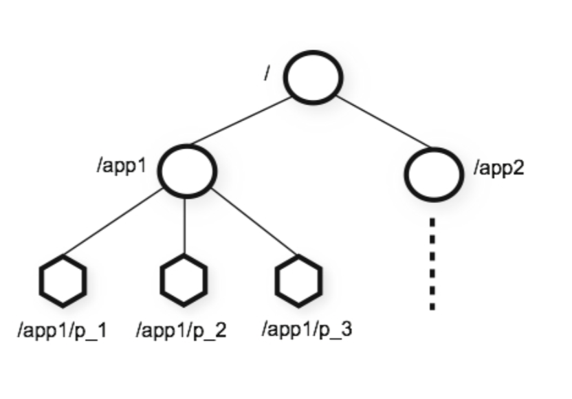

# 核心概念
## 数据日志
zookeeper服务器会产生三类日志：

- 事务日志（zoo.cfg dataLogDir）（相关读写的类可以见org.apache.zookeeper.server.persistence.FileTxnLog）

- 快照日志（zoo.cfg dataDir）（相关序列化和反序列化的类可以看org.apache.zookeeper.server.persistence.FileSnap）

- log4j日志（log4j.properties zookeeper.log.dir）

在zookeeper默认配置文件zoo.cfg（可以修改文件名）中有一个配置项dataDir，该配置项用于配置zookeeper快照日志和事务日志的存储地址。

在官方提供的默认参考配置文件zoo_sample.cfg中，只有dataDir配置项。其实在实际应用中，还可以为事务日志专门配置存储地址，配置项名称为dataLogDir，在zoo_sample.cfg中并未体现出来。

在没有dataLogDir配置项的时候，zookeeper默认将事务日志文件和快照日志文件都存储在dataDir对应的目录下。

建议将事务日志（dataLogDir）与快照日志（dataDir）单独配置，因为当zookeeper集群进行频繁的数据读写操作是，会产生大量的事务日志信息，将两类日志分开存储会提高系统性能，而且，可以允许将两类日志存在在不同的存储介质上，减少磁盘压力。

log4j用于记录zookeeper集群服务器运行日志，该日志的配置地址在conf/目录下的log4j.properties文件中，该文件中有一个配置项为“zookeeper.log.dir=.”，表示log4j日志文件在与执行程序（zkServer.sh）在同一目录下。当执行zkServer.sh 时，在该文件夹下会产生zookeeper.out日志文件。

下面主要介绍事务日志与快照日志。


### 事务日志
事务日志指zookeeper系统在正常运行过程中，针对所有的更新操作，在返回客户端“更新成功”的响应前，zookeeper会保证已经将本次更新操作的事务日志已经写到磁盘上，只有这样，整个更新操作才会生效。

日志文件的命名规则为log.**，默认文件大小为64MB，**表示写入该日志的第一个事务的ID，十六进制表示。

zookeeper的事务日志为二进制文件，不能通过vim等工具直接访问。其实可以通过zookeeper自带的jar包读取事务日志文件。

首先将libs中的slf4j-api-1.6.1.jar文件和zookeeper根目录下的zookeeper-3.4.9.jar文件复制到临时文件夹tmplibs中，然后执行如下命令：

```bash
java -classpath .:slf4j-api-1.6.1.jar:zookeeper-3.4.9.jar  org.apache.zookeeper.server.LogFormatter   ../Data/datalog/version-2/log.1
```

### 快照日志
zookeeper的数据在内存中是以树形结构进行存储的，而快照就是每隔一段时间就会把整个DataTree的数据序列化后存储在磁盘中，这就是zookeeper的快照文件。

zookeeper快照日志的存储路径同样可以在zoo.cfg中查看，访问dataDir路径可以看到version-2文件夹:

zookeeper快照文件的命名规则为snapshot.\*\*，其中\*\*表示zookeeper触发快照的那个瞬间，提交的最后一个事务的ID。

### 日志清理
在zookeeper 3.4.0以后，zookeeper提供了自动清理snapshot和事务日志功能，通过配置zoo.cfg下的autopurge.snapRetainCount和autopurge.purgeInterval这两个参数实现日志文件的定时清理。

autopurge.snapRetainCount这个参数指定了需要保留的文件数目，默认保留3个；

autopurge.purgeInterval这个参数指定了清理频率，单位是小时，需要填写一个1或者更大的数据，默认0表示不开启自动清理功能。

### zookeeper的数据恢复
当进行一次快照时，就会重新生成一个新的日志文件，对于每次的修改会有对应的事务日志。

二者结合可以把数据恢复(断点+动作重放)，启动时数据恢复的具体的逻辑在{org.apache.zookeeper.server.persistence.FileTxnSnapLog}中：代码中先读取快照数据生成断点映像，然后根据断点映像中最大zxid开始进行事务重放。

## Session会话

客户端会话，客户端和服务端建立一个 TCP 长连接

## 数据模型


### Znode 结构
```bash
stat 
```

|状态属性 | 说明|
|---|---| 
|czxid|节点创建时的 zxid|
|mzxid|节点最新一次更新发生时的 zxid|
|ctime|节点创建时的时间戳.|
|mtime|节点最新一次更新发生时的时间戳.|
|dataVersion|节点数据的更新次数.|
|cversion|其子节点的更新次数|
|aclVersion|节点 ACL(授权信息)的更新次数.|
|ephemeralOwner|如果该节点为 ephemeral 节点, ephemeralOwner 值表示与该节点绑定的 session id. 如果该节点不是ephemeral节点, ephemeralOwner 值为 0. 至于什么是 ephemeral 节点|
|dataLength|节点数据的字节数.|
|numChildren|子节点个数.|

## 节点类型:
- 两大类、四种类型 持久、临时、持久有序、临时有序
- PERSISTENT 持久类型，如果不手动删除 是一直存在的 PERSISTENT_SEQUENTIAL
- EPHEMERAL 临时 客户端 session 失效就会随着删除节点 没有子节点 EPHEMERAL_SEQUENTIAL 有序 自增

## 顺序号:
创建 znode 时设置顺序标识，znode 名称后会附加一个值 顺序号是一个单调递增的计数器，由父节点维护 在分布式系统中，顺序号可以被用于为所有的事件进行全局排序，这样客户端可以通过顺 序号推断事件的顺序

## Watcher:监听 
| KeeperState | EventType | 触发条件 | 说明 | 操作 |
|---|---|---|---|---|
|SyncConnected (3)|None (-1)|客户端与服务端 成功建立连接|此时客户端和服务器处于连接状态|-|
|SyncConnected (3)|NodeCreated (1)|Watcher 监听的 对应数据节点被 创建|此时客户端和服务器处于连接状态|Create|
|SyncConnected (3)|NodeDeleted (2)|Watcher 监听的 对应数据节点被 删除|此时客户端和服务器处于连接状态|Delete/znode|
|SyncConnected (3)|NodeDataChanged(3)|Watcher 监听的 对应数据节点的 数据内容发生变 更|-|setDate/znode|
|SyncConnected (3)|NodeChildChanged(4)|Wather 监听的 对应数据节点的 子节点列表发生 变更|-|Create/child|
|Disconnected (0)|None (-1)|客户端与 ZooKeeper 服务 器断开连接|此时客户端和服|-|
|Expired (-112)|None (-1)|会话超时|此时客户端会话 失效，通常同时 也会受到 务器处于断开连SessionExpiredEx ception 异常|-|
|AuthFailed (4)|None (-1)|通常有两种情 况，1:使用错 误的 schema 进接状态 行权限检查 2: SASL 权限检查 失败|通常同时也会收 到 AuthFailedExcept ion 异常|-|

## ACL(Access Control List)
org.apache.zookeeper.ZooDefs

内置的 ACL schemes
- world:默认方式，相当于全世界都能访问
- auth:代表已经认证通过的用户(cli中可以通过 addauth digest user:pwd来添加前上下文中的授权用户）
- digest:即用户名:密码这种方式认证，这也是业务系统中最常用的
- ip:使用Ip地址认证

ACL支持权限:
- CREATE:能创建子节点
- READ:能获取节点数据和列出其子节点
- WRITE:能设置节点数据
- DELETE:能删除子节点
- ADMIN:能设置权限

## 运维四字命令
| ZooKeeper四字命令 |	功能描述 |
|---|---|
| conf | 3.3.0版本引入的。打印出服务相关配置的详细信息。 |
| cons | 3.3.0版本引入的。列出所有连接到这台服务器的客户端全部连接/会话详细信息。包括"接受/发送"的包数量、会话id、操作延迟、最后的操作执行等等信息。 |
| crst | 3.3.0版本引入的。重置所有连接的连接和会话统计信息。 |
| dump | 列出那些比较重要的会话和临时节点。这个命令只能在leader节点上有用。 |
| envi | 打印出服务环境的详细信息。 |
| reqs | 列出未经处理的请求 |
| ruok | 测试服务是否处于正确状态。如果确实如此，那么服务返回"imok"，否则不做任何相应。 |
| stat | 输出关于性能和连接的客户端的列表。 |
| srst | 重置服务器的统计。 |
| srvr | 3.3.0版本引入的。列出连接服务器的详细信息 |
| wchs | 3.3.0版本引入的。列出服务器watch的详细信息。 |
| wchc | 3.3.0版本引入的。通过session列出服务器watch的详细信息，它的输出是一个与watch相关的会话的列表。 |
| wchp | 3.3.0版本引入的。通过路径列出服务器watch的详细信息。它输出一个与session相关的路径。 |
| mntr | 3.4.0版本引入的。输出可用于检测集群健康状态的变量列表 |


## 参考资料
https://www.cnblogs.com/jxwch/p/6526271.html
https://www.cnblogs.com/leesf456/p/6179118.html