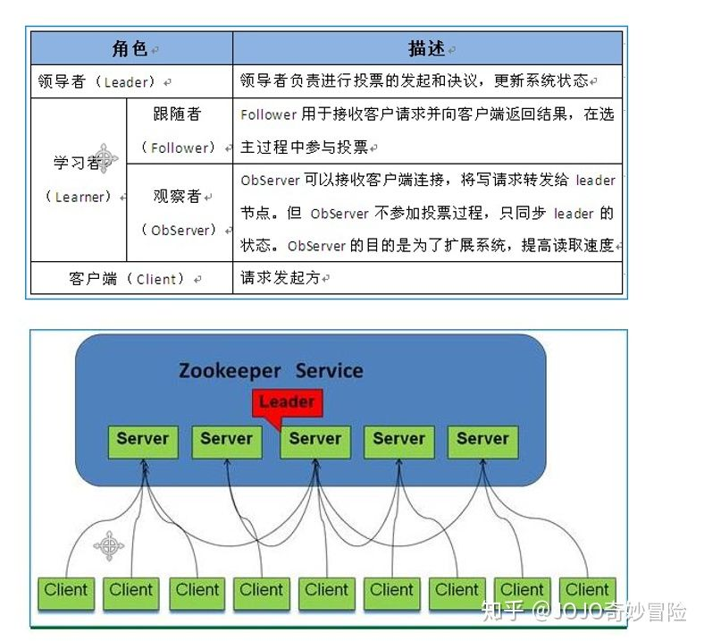

# 集群介绍
## 服务集群角色

Zookeeper 是一个由多个 server 组成的集群，一个 leader，多个 follower。每个 server 保存一份数据副本。全局数据强一致性。
- Leader：Leader作为整个ZooKeeper集群的主节点，负责响应所有对ZooKeeper状态变更的请求。它会将每个状态更新请求进行排序和编号，以便保证整个集群内部消息处理的FIFO，写操作都走leader，zk里面leader只有一个
- Follower ：Follower的逻辑就比较简单了。除了响应本服务器上的读请求外，follower还要处理leader的提议，并在leader提交该提议时在本地也进行提交。另外需要注意的是，leader和follower构成ZooKeeper集群的法定人数，也就是说，只有他们才参与新leader的选举、响应leader的提议。 帮助leader处理读请求，投票权
- Observer ：如果ZooKeeper集群的读取负载很高，或者客户端多到跨机房，可以设置一些observer服务器，以提高读取的吞吐量。Observer和Follower比较相似，只有一些小区别：首先observer不属于法定人数，即不参加选举也不响应提议；其次是observer不需要将事务持久化到磁盘，一旦observer被重启，需要从leader重新同步整个名字空间。 没有投票权利,可以处理读请求

### 设计目的
- 分布式更新由leader实施,更新请求转发由leader实施，读有follower和Observer承载
- 更新请求顺序进行，来自同一个 client 的更新请求按其发送顺序依次执行
- 数据更新原子性，一次数据更新要么成功，要么失败 全局唯一数据视图，client 无论连接到哪个 server，数据视图都是一致的，这是 zookeeper 最重要的功能。
- 可靠，具有简单、健壮、良好的性能，如果消息 m 被到一台服务器接受，那么它 将被所有的服务器接受。
- 实时性，Zookeeper 保证客户端将在一个时间间隔范围内获得服务器的更新信息，或者服务器失效的信息。但由于网络延时等原因，Zookeeper 不能保证两个客户端能同时得到刚更新的数据，如果需要最新数据，应该在读数据之前调用 sync()接口。
- 等待无关（wait-free）：慢的或者失效的 client 不得干预快速的 client 的请求，使得每 个 client 都能有效的等待。

## Leader选举
Leader选举是保证分布式数据一致性的关键所在。当Zookeeper集群中的一台服务器出现以下两种情况之一时，需要进入Leader选举。
- (1) 服务器初始化启动。
- (2) 服务器运行期间无法和Leader保持连接。

### 1. 服务器启动时期的Leader选举
若进行Leader选举，则至少需要两台机器，这里选取3台机器组成的服务器集群为例。在集群初始化阶段，当有一台服务器Server1启动时，其单独无法进行和完成Leader选举，当第二台服务器Server2启动时，此时两台机器可以相互通信，每台机器都试图找到Leader，于是进入Leader选举过程。选举过程如下

- (1) 每个Server发出一个投票。由于是初始情况，Server1和Server2都会将自己作为Leader服务器来进行投票，每次投票会包含所推举的服务器的myid和ZXID，使用(myid, ZXID)来表示，此时Server1的投票为(1, 0)，Server2的投票为(2, 0)，然后各自将这个投票发给集群中其他机器。
- (2) 接受来自各个服务器的投票。集群的每个服务器收到投票后，首先判断该投票的有效性，如检查是否是本轮投票、是否来自LOOKING状态的服务器。
- (3) 处理投票。针对每一个投票，服务器都需要将别人的投票和自己的投票进行PK，PK规则如下
    - 优先检查ZXID。ZXID比较大的服务器优先作为Leader。
    - 如果ZXID相同，那么就比较myid。myid较大的服务器作为Leader服务器。
    - 对于Server1而言，它的投票是(1, 0)，接收Server2的投票为(2, 0)，首先会比较两者的ZXID，均为0，再比较myid，此时Server2的myid最大，于是更新自己的投票为(2, 0)，然后重新投票，对于Server2而言，其无须更新自己的投票，只是再次向集群中所有机器发出上一次投票信息即可。
- (4) 统计投票。每次投票后，服务器都会统计投票信息，判断是否已经有过半机器接受到相同的投票信息，对于Server1、Server2而言，都统计出集群中已经有两台机器接受了(2, 0)的投票信息，此时便认为已经选出了Leader。
- (5) 改变服务器状态。一旦确定了Leader，每个服务器就会更新自己的状态，如果是Follower，那么就变更为FOLLOWING，如果是Leader，就变更为LEADING。

### 2. 服务器运行时期的Leader选举
在Zookeeper运行期间，Leader与非Leader服务器各司其职，即便当有非Leader服务器宕机或新加入，此时也不会影响Leader，但是一旦Leader服务器挂了，那么整个集群将暂停对外服务，进入新一轮Leader选举，其过程和启动时期的Leader选举过程基本一致。假设正在运行的有Server1、Server2、Server3三台服务器，当前Leader是Server2，若某一时刻Leader挂了，此时便开始Leader选举。选举过程如下
- (1) 变更状态。Leader挂后，余下的非Observer服务器都会讲自己的服务器状态变更为LOOKING，然后开始进入Leader选举过程。
- (2) 每个Server会发出一个投票。在运行期间，每个服务器上的ZXID可能不同，此时假定Server1的ZXID为123，Server3的ZXID为122；在第一轮投票中，Server1和Server3都会投自己，产生投票(1, 123)，(3, 122)，然后各自将投票发送给集群中所有机器。
- (3) 接收来自各个服务器的投票。与启动时过程相同。
- (4) 处理投票。与启动时过程相同，此时，Server1将会成为Leader。
- (5) 统计投票。与启动时过程相同。
- (6) 改变服务器的状态。与启动时过程相同。

在3.4.0后的Zookeeper的版本只保留了TCP版本的FastLeaderElection选举算法。当一台机器进入Leader选举时，当前集群可能会处于以下两种状态
- 集群中已经存在Leader。
- 集群中不存在Leader。

#### 集群中已经存在Leader。 
对于集群中已经存在Leader而言，此种情况一般都是某台机器启动得较晚，在其启动之前，集群已经在正常工作，对这种情况，该机器试图去选举Leader时，会被告知当前服务器的Leader信息，对于该机器而言，仅仅需要和Leader机器建立起连接，并进行状态同步即可。

#### 集群中不存在Leader。
在集群中不存在Leader情况下则会相对复杂，其步骤如下
- (1) 第一次投票。无论哪种导致进行Leader选举，集群的所有机器都处于试图选举出一个Leader的状态，即LOOKING状态，LOOKING机器会向所有其他机器发送消息，该消息称为投票。投票中包含了SID（服务器的唯一标识）和ZXID（事务ID），(SID, ZXID)形式来标识一次投票信息。假定Zookeeper由5台机器组成，SID分别为1、2、3、4、5，ZXID分别为9、9、9、8、8，并且此时SID为2的机器是Leader机器，某一时刻，1、2所在机器出现故障，因此集群开始进行Leader选举。在第一次投票时，每台机器都会将自己作为投票对象，于是SID为3、4、5的机器投票情况分别为(3, 9)，(4, 8)， (5, 8)。
- (2) 变更投票。每台机器发出投票后，也会收到其他机器的投票，每台机器会根据一定规则来处理收到的其他机器的投票，并以此来决定是否需要变更自己的投票，这个规则也是整个Leader选举算法的核心所在，其中术语描述如下
  - vote_sid：接收到的投票中所推举Leader服务器的SID。
  - vote_zxid：接收到的投票中所推举Leader服务器的ZXID。
  - self_sid：当前服务器自己的SID。
  - self_zxid：当前服务器自己的ZXID。

每次对收到的投票的处理，都是对(vote_sid, vote_zxid)和(self_sid, self_zxid)对比的过程。

  - 规则一：如果vote_zxid大于self_zxid，就认可当前收到的投票，并再次将该投票发送出去。
  - 规则二：如果vote_zxid小于self_zxid，那么坚持自己的投票，不做任何变更。
  - 规则三：如果vote_zxid等于self_zxid，那么就对比两者的SID，如果vote_sid大于self_sid，那么就认可当前收到的投票，并再次将该投票发送出去。
  - 规则四：如果vote_zxid等于self_zxid，并且vote_sid小于self_sid，那么坚持自己的投票，不做任何变更。

结合上面规则，给出下面的集群变更过程。

- (3) 确定Leader。经过第二轮投票后，集群中的每台机器都会再次接收到其他机器的投票，然后开始统计投票，如果一台机器收到了超过半数的相同投票，那么这个投票对应的SID机器即为Leader。此时Server3将成为Leader。

由上面规则可知，通常那台服务器上的数据越新（ZXID会越大），其成为Leader的可能性越大，也就越能够保证数据的恢复。如果ZXID相同，则SID越大机会越大。

## Leader选举实现细节
### 1. 服务器状态
服务器具有四种状态，分别是LOOKING、FOLLOWING、LEADING、OBSERVING。
1. LOOKING：寻找Leader状态。当服务器处于该状态时，它会认为当前集群中没有Leader，因此需要进入Leader选举状态。
1. FOLLOWING：跟随者状态。表明当前服务器角色是Follower。
1. LEADING：领导者状态。表明当前服务器角色是Leader。
1. OBSERVING：观察者状态。表明当前服务器角色是Observer。

### 2. 投票数据结构
每个投票中包含了两个最基本的信息，所推举服务器的SID和ZXID，投票（Vote）在Zookeeper中包含字段如下
- id：被推举的Leader的SID。
- zxid：被推举的Leader事务ID。
- electionEpoch：逻辑时钟，用来判断多个投票是否在同一轮选举周期中，该值在服务端是一个自增序列，每次进入新一轮的投票后，都会对该值进行加1操作。
- peerEpoch：被推举的Leader的epoch。
- state：当前服务器的状态。

### 3. QuorumCnxManager：网络I/O
每台服务器在启动的过程中，会启动一个QuorumPeerManager，负责各台服务器之间的底层Leader选举过程中的网络通信。
- (1) 消息队列。QuorumCnxManager内部维护了一系列的队列，用来保存接收到的、待发送的消息以及消息的发送器，除接收队列以外，其他队列都按照SID分组形成队列集合，如一个集群中除了自身还有3台机器，那么就会为这3台机器分别创建一个发送队列，互不干扰。
  - recvQueue：消息接收队列，用于存放那些从其他服务器接收到的消息。
  - queueSendMap：消息发送队列，用于保存那些待发送的消息，按照SID进行分组。
  - senderWorkerMap：发送器集合，每个SenderWorker消息发送器，都对应一台远程Zookeeper服务器，负责消息的发送，也按照SID进行分组。
  - lastMessageSent：最近发送过的消息，为每个SID保留最近发送过的一个消息。
- (2) 建立连接。为了能够相互投票，Zookeeper集群中的所有机器都需要两两建立起网络连接。QuorumCnxManager在启动时会创建一个ServerSocket来监听Leader选举的通信端口(默认为3888)。开启监听后，Zookeeper能够不断地接收到来自其他服务器的创建连接请求，在接收到其他服务器的TCP连接请求时，会进行处理。为了避免两台机器之间重复地创建TCP连接，Zookeeper只允许SID大的服务器主动和其他机器建立连接，否则断开连接。在接收到创建连接请求后，服务器通过对比自己和远程服务器的SID值来判断是否接收连接请求，如果当前服务器发现自己的SID更大，那么会断开当前连接，然后自己主动和远程服务器建立连接。一旦连接建立，就会根据远程服务器的SID来创建相应的消息发送器SendWorker和消息接收器RecvWorker，并启动。
- (3) 消息接收与发送。
  - 消息接收：由消息接收器RecvWorker负责，由于Zookeeper为每个远程服务器都分配一个单独的RecvWorker，因此，每个RecvWorker只需要不断地从这个TCP连接中读取消息，并将其保存到recvQueue队列中。
  - 消息发送：由于Zookeeper为每个远程服务器都分配一个单独的SendWorker，因此，每个SendWorker只需要不断地从对应的消息发送队列中获取出一个消息发送即可，同时将这个消息放入lastMessageSent中。在SendWorker中，一旦Zookeeper发现针对当前服务器的消息发送队列为空，那么此时需要从lastMessageSent中取出一个最近发送过的消息来进行再次发送，这是为了解决接收方在消息接收前或者接收到消息后服务器挂了，导致消息尚未被正确处理。同时，Zookeeper能够保证接收方在处理消息时，会对重复消息进行正确的处理。

### 4. FastLeaderElection：选举算法核心
- 外部投票：特指其他服务器发来的投票。
- 内部投票：服务器自身当前的投票。
- 选举轮次：Zookeeper服务器Leader选举的轮次，即logicalclock。
- PK：对内部投票和外部投票进行对比来确定是否需要变更内部投票。

#### (1) 选票管理
- sendqueue：选票发送队列，用于保存待发送的选票。
- recvqueue：选票接收队列，用于保存接收到的外部投票。
- WorkerReceiver：选票接收器。其会不断地从QuorumCnxManager中获取其他服务器发来的选举消息，并将其转换成一个选票，然后保存到recvqueue中，在选票接收过程中，如果发现该外部选票的选举轮次小于当前服务器的，那么忽略该外部投票，同时立即发送自己的内部投票。
- WorkerSender：选票发送器，不断地从sendqueue中获取待发送的选票，并将其传递到底层QuorumCnxManager中。

#### (2) 算法核心

上图展示了FastLeaderElection模块是如何与底层网络I/O进行交互的。Leader选举的基本流程如下
1. 自增选举轮次。Zookeeper规定所有有效的投票都必须在同一轮次中，在开始新一轮投票时，会首先对logicalclock进行自增操作。
2. 初始化选票。在开始进行新一轮投票之前，每个服务器都会初始化自身的选票，并且在初始化阶段，每台服务器都会将自己推举为Leader。
3. 发送初始化选票。完成选票的初始化后，服务器就会发起第一次投票。Zookeeper会将刚刚初始化好的选票放入sendqueue中，由发送器WorkerSender负责发送出去。
4. 接收外部投票。每台服务器会不断地从recvqueue队列中获取外部选票。如果服务器发现无法获取到任何外部投票，那么就会立即确认自己是否和集群中其他服务器保持着有效的连接，如果没有连接，则马上建立连接，如果已经建立了连接，则再次发送自己当前的内部投票。
5. 判断选举轮次。在发送完初始化选票之后，接着开始处理外部投票。在处理外部投票时，会根据选举轮次来进行不同的处理。
   - 外部投票的选举轮次大于内部投票。若服务器自身的选举轮次落后于该外部投票对应服务器的选举轮次，那么就会立即更新自己的选举轮次(logicalclock)，并且清空所有已经收到的投票，然后使用初始化的投票来进行PK以确定是否变更内部投票。最终再将内部投票发送出去。
   - 外部投票的选举轮次小于内部投票。若服务器接收的外选票的选举轮次落后于自身的选举轮次，那么Zookeeper就会直接忽略该外部投票，不做任何处理，并返回步骤4。
   - 外部投票的选举轮次等于内部投票。此时可以开始进行选票PK。
6. 选票PK。在进行选票PK时，符合任意一个条件就需要变更投票。
　　- 若外部投票中推举的Leader服务器的选举轮次大于内部投票，那么需要变更投票。
　　- 若选举轮次一致，那么就对比两者的ZXID，若外部投票的ZXID大，那么需要变更投票。
　　- 若两者的ZXID一致，那么就对比两者的SID，若外部投票的SID大，那么就需要变更投票。
7. 变更投票。经过PK后，若确定了外部投票优于内部投票，那么就变更投票，即使用外部投票的选票信息来覆盖内部投票，变更完成后，再次将这个变更后的内部投票发送出去。
8. 选票归档。无论是否变更了投票，都会将刚刚收到的那份外部投票放入选票集合recvset中进行归档。recvset用于记录当前服务器在本轮次的Leader选举中收到的所有外部投票（按照服务队的SID区别，如{(1, vote1), (2, vote2)...}）。
9. 统计投票。完成选票归档后，就可以开始统计投票，统计投票是为了统计集群中是否已经有过半的服务器认可了当前的内部投票，如果确定已经有过半服务器认可了该投票，则终止投票。否则返回步骤4。
10. 更新服务器状态。若已经确定可以终止投票，那么就开始更新服务器状态，服务器首选判断当前被过半服务器认可的投票所对应的Leader服务器是否是自己，若是自己，则将自己的服务器状态更新为LEADING，若不是，则根据具体情况来确定自己是FOLLOWING或是OBSERVING。

以上10个步骤就是FastLeaderElection的核心，其中步骤4-9会经过几轮循环，直到有Leader选举产生。

## zookeeper节点间的数据同步
当各个节点已经自我恢复并选举出leader后，leader就开始和follows进行数据同步了，具体的逻辑可以见{org.apache.zookeeper.server.quorum.LearnerHandler}中：

leader构建NEWLEADER包，内含leader最大数据的zxid, 广播给follows，然后leader根据follower数量为每个follower创建一个LearnerHandler线程来处理同步请求：leader主线程阻塞，等待超过半数follower同步完数据之后成为正式leader。

follower接收到NEWLEADER包后响应FOLLOWERINFO给leader，告知本方数据最大的zxid值； leader接收到回馈后开始判断：

如果follower和leader数据一致，则直接发送DIFF告知已经同步；判断这一阶段内有无已经北提交的决议值，如果有，那么
- a) 如果有部分数据没有同步，leader发送DIFF包将有差异的数据同步过去，同时将follower没有的数据逐个发送commit包给follower要求记录下来；
- b) 如果follower数据zxid更大，发送TRUNC包给follower要求删除多余数据

如果这一阶段没有提交的决议，直接发送SNAP包将快照同步给follower

以上消息完毕后，LEADER发送UPTODATE包告知follower当前数据已同步，等待follower的ACK完成同步过程。

## 一致性协议 :
BASE/Paxos/Raft/zab 等协议

## ZAB 协议（zookeeper选举协议）
Zookeeper 的核心是原子广播，这个机制保证了各个 server 之间的同步。实现这个机制的协议叫做 Zab 协议。

Zab 协议有两种模式，
- 恢复模式：当服务启动或者在领导者崩溃后，Zab 就进入了恢复模式，当领导者被选举出 来，且大多数 server 的完成了和 leader 的状态同步以后，恢复模式就结束了。状态同步保 证了 leader 和 server 具有相同的系统状态。一旦 leader 已经和多数的 follower 进行了状态 同步后，他就可以开始广播消息了，即进入广播状态。这时候当一个 server 加入 zookeeper 服务中，它会在恢复模式下启动，发现 leader，并和 leader 进行状态同步。待到同步结束，它也参与消息广播。
- 广播模式：服务一直维持在广播模式状态，直到 leader 崩溃了或者 leader 失去了大部分的 followers 支持。广播模式需要保证 proposal 被按顺序处理，因此 zk 采用了递增的事务 id 号(zxid)来保证。 所有的提议(proposal)都在被提出的时候加上了 zxid。

实现中 zxid 是一个 64 为的数字，它 高 32 位是 epoch 用来标识 leader 关系是否改变，每次一个 leader 被选出来，它都会有一 个新的 epoch。低 32 位是个递增计数。
当 leader 崩溃或者 leader 失去大多数的 follower，这时候 zk 进入恢复模式，恢复模式需要 重新选举出一个新的 leader，让所有的 server 都恢复到一个正确的状态。

## 参考资料
https://www.cnblogs.com/myseries/p/11285832.html