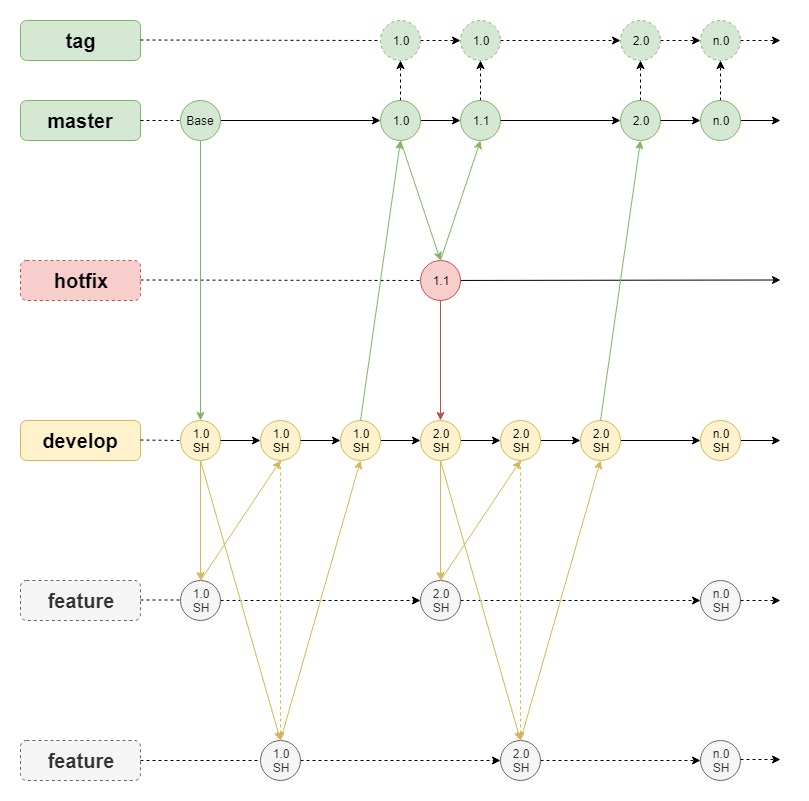

# git协同 

## 本地配置

1. 查看git配置信息
   > $ git config --list

1. 查看git用户名、密码、邮箱的配置
   > $ git config user.name
   
   > $ git config user.password
   
   > $ git config user.email
 
 
1. 设置git用户名、密码、邮箱的配置（工作空间）
   > $ git config user.name "DingPengwei"
   
   > $ git config user.password "123456"
   
   > $ git config user.email "www.dingpengwei@foxmail.com"
   
1. 设置git用户名、密码、邮箱的配置（全局配置）
   > $ git config --global user.name "DingPengwei"
   
   > $ git config --global user.password "123456"
   
   > $ git config --global user.email "www.dingpengwei@foxmail.com"

## 协同模型



- master -- 线上正在运行，可随时发版，受保护的分支。
- develop -- 测试环境或者开发环境正在运行，可随时发版，受保护的分支。
- feature -- 逻辑分支，本地开发自测，需从develop pull最新代码，开发完成后提交（或许伴随着变基以解决冲突），提交后发起MR到develop。
- hotfix -- 逻辑分支，线上bug修复，需从master pull最新代码，开发完成后提交（或许伴随着变基以解决冲突），提交后发起MR到master和develop。
- tag -- 可选项

## 提交规范
```
<type>(<scope>): <subject>
```
### type(必须)

用于说明git commit的类别，只允许使用下面的标识。

feat：新功能（feature）。

fix/to：修复bug，可以是QA发现的BUG，也可以是研发自己发现的BUG。

fix：产生diff并自动修复此问题。适合于一次提交直接修复问题
- to：只产生diff不自动修复此问题。适合于多次提交。最终修复问题提交时使用fix
- docs：文档（documentation）。

style：格式（不影响代码运行的变动）。

refactor：重构（即不是新增功能，也不是修改bug的代码变动）。

perf：优化相关，比如提升性能、体验。

test：增加测试。

chore：构建过程或辅助工具的变动。

revert：回滚到上一个版本。

merge：代码合并。

sync：同步主线或分支的Bug。

### scope(可选)

scope用于说明 commit 影响的范围，比如数据层、控制层、视图层等等，视项目不同而不同。

例如在Angular，可以是location，browser，compile，compile，rootScope， ngHref，ngClick，ngView等。如果你的修改影响了不止一个scope，你可以使用*代替。

### subject(必须)

subject是commit目的的简短描述，不超过50个字符。

建议使用中文（感觉中国人用中文描述问题能更清楚一些）。

- 结尾不加句号或其他标点符号。
- 根据以上规范git commit message将是如下的格式：
```
fix(DAO):用户查询缺少username属性 
feat(Controller):用户查询接口开发
```

## 参考资料
- https://zhuanlan.zhihu.com/p/182553920