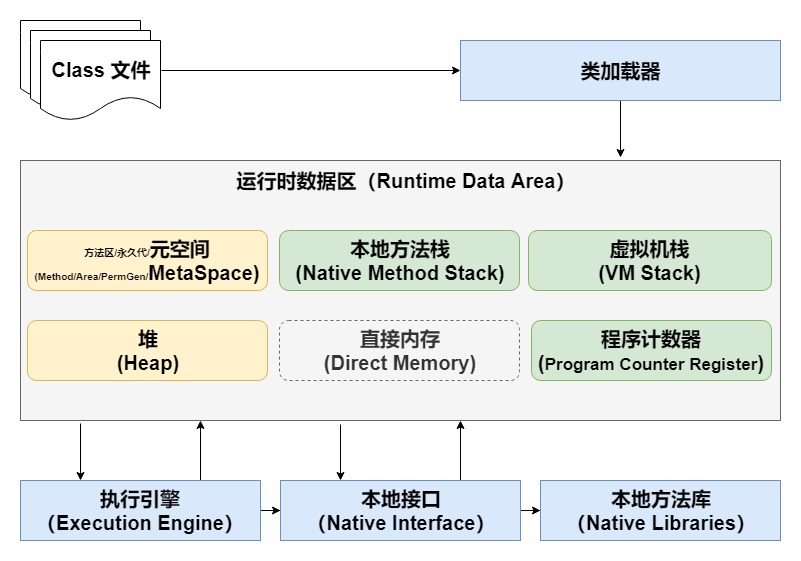

# HotSpot下的JVM结构

## Class文件

## 类加载器

## 运行时区

根据 JVM 规范，JVM 运行时区域大致分为 方法区、堆、虚拟机栈、本地方法栈、程序计数器 五个部分。

- JVM运行时区中虚拟机栈、本地方法栈、程序计数器为线程私有(绿色区域)，方法区和堆为线程共享区（黄色区域）。
- 不同区域的占用内存大小不同，一般情况下堆最大，程序计数器较小。
- 方法区逻辑上属于堆的一部分（如常量池就在堆中存放），但是为了与堆进行区分，通常又叫非堆。

### 1：[方法区](chapter1-02-00.md)
[方法区/永久代/元空间的演进](chapter1-02-00-01.md)

方法区存储的是已被虚拟机加载的类信息、常量、静态变量、即时编译器编译后的代码等数据。内存回收目标主要是针对常量池的回收和对类型的卸载，一般来说这个区域的回收“成绩”比较难以令人满意，尤其是类型的卸载，条件相当苛刻，但是回收确实是有必要的。

### [方法区](chapter1-02-00.md)

### 2：[堆](chapter1-02-01.md)
堆内存最大，堆是被线程共享，堆的目的就是存放对象。几乎所有的对象实例都在此分配。当然，随着优化技术的更新，某些数据也会被放在栈上等。堆也是Java垃圾回收的主要区域（重点对象），因此也称作“GC堆”（Garbage Collected Heap）。

### 3：[直接内存](chapter1-02-02.md)

### 4：[程序计数器](chapter1-02-03.md)

### 5：[虚拟机栈](chapter1-02-04.md)

### 6：[本地方法栈](chapter1-02-05.md)

## 执行器

