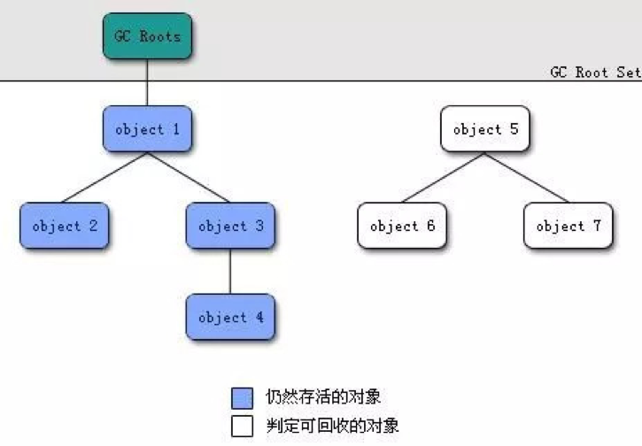

# 内存分配与回收
## 内存分配原则
### 对象优先在Eden区分配大对象直接进入老年代

大多数情况下，对象在新生代中 Eden 区分配。当 Eden 区没有足够空间进行分配时，虚拟机将发起一次Minor GC。我们来进行实际测试一下。

在测试之前我们先来看看 Minor Gc和Full GC 有什么不同呢？

-	新生代GC（Minor GC）:指发生新生代的的垃圾收集动作，Minor GC非常频繁，回收速度一般也比较快。
-	老年代GC（Major GC/Full GC）:指发生在老年代的GC，出现了Major GC经常会伴随至少一次的Minor GC（并非绝对），Major GC的速度一般会比Minor GC的慢10倍以上。并伴随着STW。

测试程序
```java
package pwd.java.gc;

/**
 * pwd.java.gc@gitbook
 *
 * <h1>TODO what you want to do?</h1>
 *
 * date 2020-03-13 17:56
 *
 * @author DingPengwei[www.dingpengwei@foxmail.com]
 * @version 1.0.0
 * @since DistributionVersion
 */
public class GCTest {

  public static void main(String[] args) {
    int size = 1024 * 1024 * 1; // 1M
//    int size = 1024 * 1024 * 1; // 10M
//    int size = 1024 * 1024 * 1; // 100M
    byte [] bytes1 = new byte[size];
  }
}

```

增加打印启动命令和打印内存详情参数如下
```bash
-XX:+PrintCommandLineFlags -XX:+PrintGCDetails 
```
- 申请1M内存的运行结果
```bash
-XX:InitialHeapSize=268435456 -XX:MaxHeapSize=4294967296 -XX:+PrintCommandLineFlags -XX:+PrintGCDetails -XX:+UseCompressedClassPointers -XX:+UseCompressedOops -XX:+UseParallelGC 
Heap
 PSYoungGen      total 76288K, used 4956K [0x000000076ab00000, 0x0000000770000000, 0x00000007c0000000)
  eden space 65536K, 7% used [0x000000076ab00000,0x000000076afd7250,0x000000076eb00000)
  from space 10752K, 0% used [0x000000076f580000,0x000000076f580000,0x0000000770000000)
  to   space 10752K, 0% used [0x000000076eb00000,0x000000076eb00000,0x000000076f580000)
 ParOldGen       total 175104K, used 0K [0x00000006c0000000, 0x00000006cab00000, 0x000000076ab00000)
  object space 175104K, 0% used [0x00000006c0000000,0x00000006c0000000,0x00000006cab00000)
 Metaspace       used 2665K, capacity 4486K, committed 4864K, reserved 1056768K
  class space    used 287K, capacity 386K, committed 512K, reserved 1048576K
```
- 申请10M内存的运行结果
```bash
-XX:InitialHeapSize=268435456 -XX:MaxHeapSize=4294967296 -XX:+PrintCommandLineFlags -XX:+PrintGCDetails -XX:+UseCompressedClassPointers -XX:+UseCompressedOops -XX:+UseParallelGC 
Heap
 PSYoungGen      total 76288K, used 14172K [0x000000076ab00000, 0x0000000770000000, 0x00000007c0000000)
  eden space 65536K, 21% used [0x000000076ab00000,0x000000076b8d7250,0x000000076eb00000)
  from space 10752K, 0% used [0x000000076f580000,0x000000076f580000,0x0000000770000000)
  to   space 10752K, 0% used [0x000000076eb00000,0x000000076eb00000,0x000000076f580000)
 ParOldGen       total 175104K, used 0K [0x00000006c0000000, 0x00000006cab00000, 0x000000076ab00000)
  object space 175104K, 0% used [0x00000006c0000000,0x00000006c0000000,0x00000006cab00000)
 Metaspace       used 2665K, capacity 4486K, committed 4864K, reserved 1056768K
  class space    used 287K, capacity 386K, committed 512K, reserved 1048576K
```

- 申请100M内存的运行结果
```bash
-XX:InitialHeapSize=268435456 -XX:MaxHeapSize=4294967296 -XX:+PrintCommandLineFlags -XX:+PrintGCDetails -XX:+UseCompressedClassPointers -XX:+UseCompressedOops -XX:+UseParallelGC 
Heap
 PSYoungGen      total 76288K, used 3932K [0x000000076ab00000, 0x0000000770000000, 0x00000007c0000000)
  eden space 65536K, 6% used [0x000000076ab00000,0x000000076aed7240,0x000000076eb00000)
  from space 10752K, 0% used [0x000000076f580000,0x000000076f580000,0x0000000770000000)
  to   space 10752K, 0% used [0x000000076eb00000,0x000000076eb00000,0x000000076f580000)
 ParOldGen       total 175104K, used 102400K [0x00000006c0000000, 0x00000006cab00000, 0x000000076ab00000)
  object space 175104K, 58% used [0x00000006c0000000,0x00000006c6400010,0x00000006cab00000)
 Metaspace       used 2665K, capacity 4486K, committed 4864K, reserved 1056768K
  class space    used 287K, capacity 386K, committed 512K, reserved 1048576K
```
简单解释一下为什么会出现这种情况： 因为给allocation2分配内存的时候eden区内存几乎已经被分配完了，我们刚刚讲了当Eden区没有足够空间进行分配时，虚拟机将发起一次Minor GC.GC期间虚拟机又发现allocation1无法存入Survior空间，所以只好通过 分配担保机制 把新生代的对象提前转移到老年代中去，老年代上的空间足够存放allocation1，所以不会出现Full GC。执行Minor GC后，后面分配的对象如果能够存在eden区的话，还是会在eden区分配内存。

为什么要这样呢？为了避免为大对象分配内存时由于分配担保机制带来的复制而降低效率。

### 长期存活的对象将进入老年代
既然虚拟机采用了分代收集的思想来管理内存，那么内存回收时就必须能识别那些对象应放在新生代，那些对象应放在老年代中。为了做到这一点，虚拟机给每个对象一个对象年龄（Age）计数器。
如果对象在 Eden 出生并经过第一次 Minor GC 后仍然能够存活，并且能被 Survivor 容纳的话，将被移动到 Survivor 空间中，并将对象年龄设为1.对象在 Survivor 中每熬过一次 MinorGC,年龄就增加1岁，当它的年龄增加到一定程度（默认为15岁），就会被晋升到老年代中。对象晋升到老年代的年龄阈值，可以通过如下参数来设置。 
```bash
-XX:MaxTenuringThreshold
```

### JVM进入老年代情况
#### 1.躲过15次GC之后进入老年代

默认的设置下，当对象的年龄达到15岁的时候，也就是躲过15次Gc的时候，他就会转移到老年代中去

这个具体是多少岁进入老年代，可以通过JVM参数 “-XX:MaxTenuringThreshold”来设置，默认情况是15岁

#### 2.动态对象年龄判断

假如说当前放对象的Survivor区域里一批对象的总大小大于了这块Survivor区域的内存大小的50%，那么此时大于等于这批对象年龄的对象，就可以直接进入老年代了

另外我们要理清楚一个概念，这个实际这个规则运行的时候是如下的逻辑：年龄1+年龄2+年龄n的多个年龄对象总和超过了Survivor区域的50%，此时就会把年龄n以上的对象都放入老年代

 
在没有回收的情况下 所有对象存活着
比如说一块s区块 100M 如果第一次有20M 不到老年代 第二次来了51M存活 如果之前的20M全部存活，那么这51M和20M将全部到老年代

另外一种情况 在这3次的对象都持续引用，不能回收的情况下，比如说一块s区块 100M 如果第一次有10M 不到老年代 第二次20M 第三次 31M 那么就会由于20+31>50了 那么第一次的10M就会到老年代了。

#### 3.大对象直接进入老年代

有一个JvM参数，就是 -XX:PretenureSizeThreshold“,可以把他的值设置为字节数，比如“1048576”，就是1M

如果你创建一个大于这个大小的对象，比如一个超大的数组，或者是别的啥东西，此时就直接把这个大对象放在老年代中，压根不会经过新生代，这样可以避免新生代出现那种大对象，然后在2个Survivor区域里回来复制多次之后才能进入老年代

#### 4.MinorGC后的对象太多无法放入Survivor区怎么办？

如果在Minor GC之后发现剩余的存活对象太多了，没办法放入另外一块Survivor，那么这个时候就必须得把这些对象直接转移到老年代中去

#### 5.老年代空间分配担保规则

在执行任何一次Minor GC之前，JVM会检查一下老年代可用的可用内存空间，是否大于新生代所有对象的总大小

为啥会检查这个呢？因为最极端的情况下，可能新生代的Minor GC过后，所有对象都存活下来了，那岂不是新生代所有对象全部都要进入老年代？

如果说发现老年代的内存大小是大于新生代所有对象的，此时就可以放心大胆的对新生代发起一次Minor GC了，也可以转移到老年代去。

但是假如执行Minor GC之前，发现老年代的可用内存已经小于了新生代的全部对象大小了，那么这个时候是不是有可能在Minor GC之后新生代的对象全部存活下来，然后全部需要转移到老年代去，但是老年代空间又不够？

所以假如Minor Gc之前，发现老年代的可用内存已经小于看新生代的全部对象大小了，就会看一个-XX:-HandlePromotionFailure的参数是否设置了，如果有这个参数，那么就会继续进行下一步判断，

下一步判断，就是看老年代的内存大小，是否大于之前每一次Minor GC后进入老年代的对象的平均大小。

举个例子，之前每次Minor GC后，平均都有10MB左右的对象会进入老年代，那么此时老年代可用内存大于10MB

这就说明很可能这次Minor GC过后也是差不多10MB左右的对象会进入老年代，此时老年代空间是够的

如果上面那个步骤判断失败了，或者是 -XX:-HandlePromotionFailure“参数没设置，此时就会直接触发一次Full GC,就是对老年代进行垃圾回收，尽量腾出来一些内存空间，然后再执行Minor GC 

如果上面2个步骤都判断成功了，那么就是说可以冒点风险尝试一下Minor GC 此时进行Minor GC,此时进行Minor GC有几种可能：

- （1）Minor GC过后，剩余的存活对象的大小，是小于Survivor区的大小的，那么此时存活对象进入Survicor区域即可

- （2）Minor GC过后，剩余的存活对象的大小是大于Survivor区域的大小，但是是小于老年代可用内存大小的，此时就直接进入老年代即可

- （3）Minor GC过后，剩余的存活对象的大小，大于了Survivor区域的大小，也大于了老年代可用内存的大小，此时老年代都放不下这些存活对象了，就会发生Handle Promotion Failure的情况，这个时候就会触发一次Full GC

Full GC就是对老年代进行垃圾回收，同时也一般会对新生代进行垃圾回收。

因为这个时候必须把老年代理的没人引用的对象给回收掉，然后才可能让Minor GC过后剩余的存活对象进入老年代里面

如果要Full GC过后，老年代还是没有足够的空间存放Minor GC过后的剩余存活对象，那么此时就会导致所谓的OOM内存溢出了

## 内存回收原则
### 如何判断对象可以被回收
堆中几乎放着所有的对象实例，对堆垃圾回收前的第一步就是要判断那些对象已经死亡（即不能再被任何途径使用的对象）。

#### 引用计数法识别死亡对象
给对象中添加一个引用计数器，每当有一个地方引用它，计数器就加1；当引用失效，计数器就减1；任何时候计数器为0的对象就是不可能再被使用的。
这个方法实现简单，效率高，但是目前主流的虚拟机中并没有选择这个算法来管理内存，其最主要的原因是它很难解决对象之间相互循环引用的问题。 所谓对象之间的相互引用问题，如下面代码所示：除了对象objA 和 objB 相互引用着对方之外，这两个对象之间再无任何引用。但是他们因为互相引用对方，导致它们的引用计数器都不为0，于是引用计数算法无法通知 GC 回收器回收他们。
```java
package pwd.java.gc;

/**
 * pwd.java.gc@gitbook
 *
 * <h1>TODO what you want to do?</h1>
 *
 * date 2020-03-13 18:14
 *
 * @author DingPengwei[www.dingpengwei@foxmail.com]
 * @version 1.0.0
 * @since DistributionVersion
 */
public class GCByCount1 {
  private GCByCount2 gcByCount2;

  public void setGcByCount2(GCByCount2 gcByCount2) {
    this.gcByCount2 = gcByCount2;
  }
}

```
```java
package pwd.java.gc;

/**
 *pwd.java.jvm.gc
 *
 * <h1>TODO what you want to do?</h1>
 *
 * date 2020-03-13 18:14
 *
 * @author DingPengwei[www.dingpengwei@foxmail.com]
 * @version 1.0.0
 * @since DistributionVersion
 */
public class GCByCount2 {

  private GCByCount1 gcByCount1;

  public void setGcByCount1(GCByCount1 gcByCount1) {
    this.gcByCount1 = gcByCount1;
  }
}
```
```java
package pwd.java.gc;

/**
 * pwd.java.gc@gitbook
 *
 * <h1>TODO what you want to do?</h1>
 *
 * date 2020-03-13 18:14
 *
 * @author DingPengwei[www.dingpengwei@foxmail.com]
 * @version 1.0.0
 * @since DistributionVersion
 */
public class GCByCountMain {

  public static void main(String[] args) {
    GCByCount1 gcByCount1 = new GCByCount1();
    GCByCount2 gcByCount2 = new GCByCount2();

    gcByCount1.setGcByCount2(gcByCount2);
    gcByCount2.setGcByCount1(gcByCount1);

    gcByCount1 = null;
    gcByCount2 = null;

  }
}
```


#### 可达性分析算法识别死亡对象
这个算法的基本思想就是通过一系列的称为 “GC Roots” 的对象作为起点，从这些节点开始向下搜索，节点所走过的路径称为引用链，当一个对象到 GC Roots 没有任何引用链相连的话，则证明此对象是不可用的。

GC Roots根节点：
- 类加载器、Thread、
- 虚拟机栈的本地变量表、
- static成员、
- 常量引用、
- 本地方法栈的变量等等



#### finalize()方法最终判定对象是否存活

即使在可达性分析算法中不可达的对象，也并非是“非死不可”的，这时候它们暂时处于“缓刑”阶段，要真正宣告一个对象死亡，至少要经历再次标记过程。
标记的前提是对象在进行可达性分析后发现没有与GC Roots相连接的引用链。
1. 第一次标记并进行一次筛选。
筛选的条件是此对象是否有必要执行finalize()方法。
当对象没有覆盖finalize方法，或者finzlize方法已经被虚拟机调用过，虚拟机将这两种情况都视为“没有必要执行”，对象被回收。
2. 第二次标记
如果这个对象被判定为有必要执行finalize（）方法，那么这个对象将会被放置在一个名为：F-Queue的队列之中，并在稍后由一条虚拟机自动建立的、低优先级的Finalizer线程去执行。这里所谓的“执行”是指虚拟机会触发这个方法，但并不承诺会等待它运行结束。这样做的原因是，如果一个对象finalize（）方法中执行缓慢，或者发生死循环（更极端的情况），将很可能会导致F-Queue队列中的其他对象永久处于等待状态，甚至导致整个内存回收系统崩溃。

finalize（）方法是对象脱逃死亡命运的最后一次可能的机会，稍后GC将对F-Queue中的对象进行第二次小规模标记，如果对象要在finalize（）中成功拯救自己，只要重新与引用链上的任何的一个对象建立关联即可，譬如把自己赋值给某个类变量或对象的成员变量，那在第二次标记时它将移除出“即将回收”的集合。如果对象这时候还没逃脱，那基本上它就真的被回收了。

### 如何判断一个常量是废弃常量
运行时常量池主要回收的是废弃的常量。那么，我们如何判断一个常量是废弃常量呢？

假如在常量池中存在字符串 "abc"，如果当前没有任何String对象引用该字符串常量的话，就说明常量 "abc" 就是废弃常量，如果这时发生内存回收的话而且有必要的话，"abc" 就会被系统清理出常量池。

### 如何判断一个类是无用的类
方法区主要回收的是无用的类，那么如何判断一个类是无用的类的呢？

判定一个常量是否是“废弃常量”比较简单，而要判定一个类是否是“无用的类”的条件则相对苛刻许多。类需要同时满足下面3个条件才能算是 “无用的类” ：

1. 该类所有的实例都已经被回收，也就是 Java 堆中不存在该类的任何实例。
1. 加载该类的 ClassLoader 已经被回收。
1. 该类对应的 java.lang.Class 对象没有在任何地方被引用，无法在任何地方通过反射访问该类的方法。

虚拟机可以对满足上述3个条件的无用类可以进行回收，这里说的仅仅是“可以”，而并不是和对象一样不使用了就会必然被回收。
