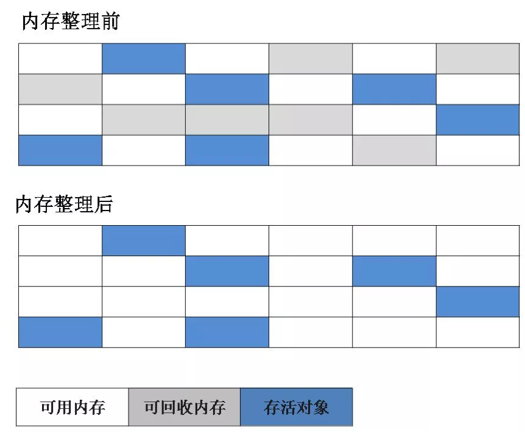
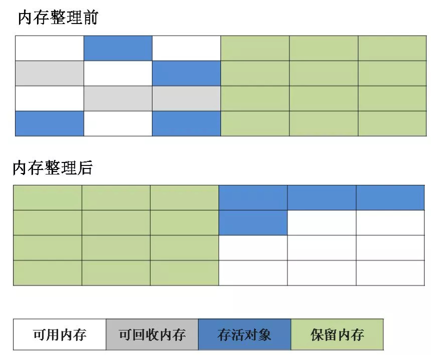
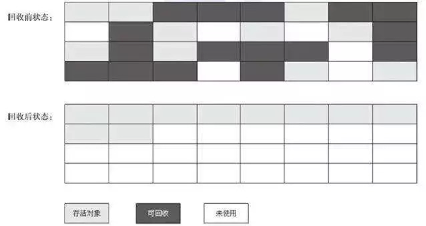
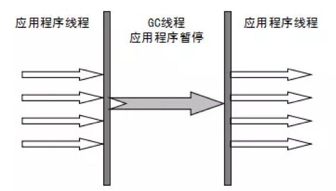
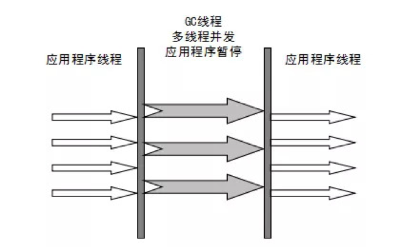
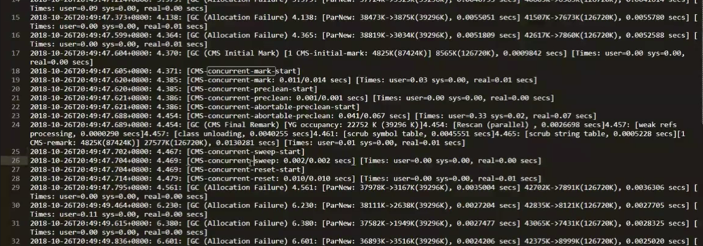
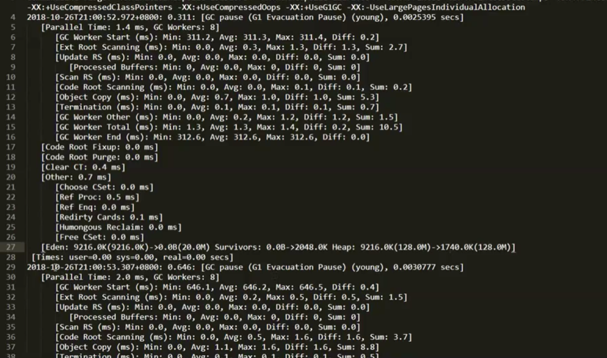
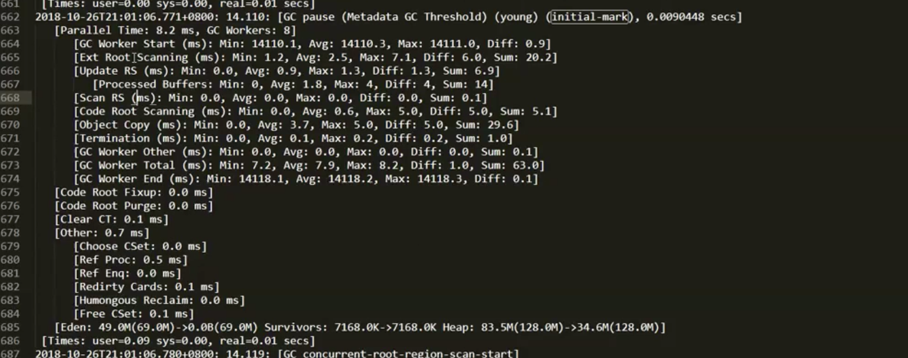
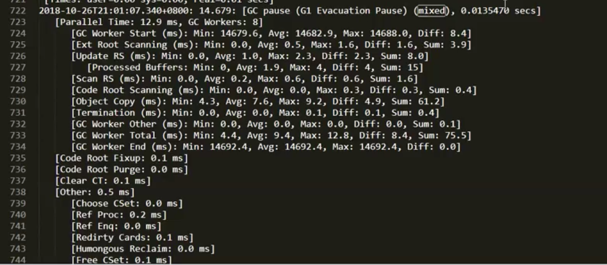
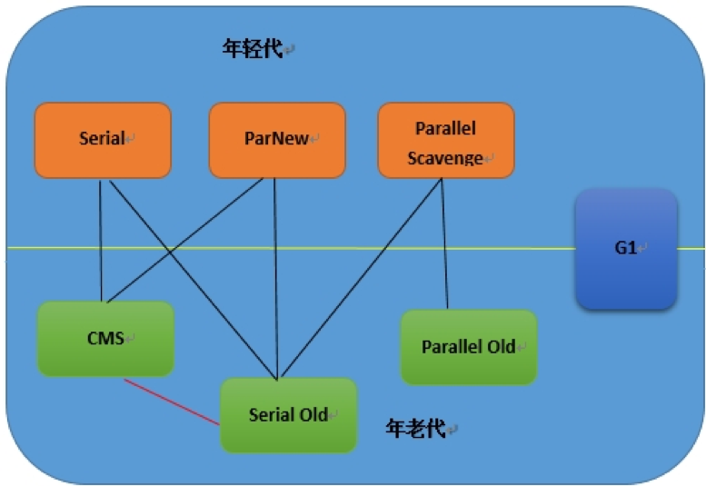

# 垃圾回收算法与垃圾收集器
## 垃圾回收算法
- 标记-清除算法
- 复制算法
- 标记-整理算法
- 分代收集算法

### 标记-清除算法
算法分为“标记”和“清除”阶段：首先标记出所有需要回收的对象，在标记完成后统一回收所有被标记的对象。它是最基础的收集算法，

效率也很高，但是会带来两个明显的问题：
1.	效率问题 (遍历标记每一个对象是否可以被清除)
2.	空间问题（标记清除后会产生大量不连续的碎片）

### 复制算法
为了解决效率问题，“复制”收集算法出现了。它可以将内存分为大小相同的两块，每次使用其中的一块。当这一块的内存使用完后，就将还存活的对象复制到另一块去，然后再把使用的空间一次清理掉。这样就使每次的内存回收都是对内存区间的一半进行回收。

### 标记-整理（标记-整理-清除）算法
根据老年代的特点特出的一种标记算法，标记过程仍然与“标记-清除”算法一样，但后续步骤不是直接对可回收对象回收，而是让所有存活的对象向一段移动，然后直接清理掉端边界以外的内存。

### 分代收集算法
当前虚拟机的垃圾收集都采用分代收集算法，这种算法是一种设计思想，没有新的算法设计，只是根据对象存活周期的不同将内存分为几块。一般将java堆分为新生代和老年代，这样我们就可以根据各个年代的特点选择合适的垃圾收集算法。

比如在新生代中，每次收集都会有大量对象死去，所以可以选择复制算法，只需要付出少量对象的复制成本就可以完成每次垃圾收集。而老年代的对象存活几率是比较高的，而且没有额外的空间对它进行分配担保，所以我们必须选择“标记-清除”或“标记-整理”算法进行垃圾收集。

## 垃圾收集器
- Serial收集器
- ParNew收集器
- Parallel Scavenge收集器
- CMS收集器
- G1收集器

|收集器名称|常用代际|常用搭档|线程数|新生代算法|老年代算法|
|---|---|---|---|---|---|
|Serial|新生代|Serial Old，CMS|1|复制|标记-整理|
|ParNew|新生代|Serial Old，CMS|N|复制|标记-整理|
|Parallel Scavenge|新生代|Parallel Old，Serial Old|N|复制|标记-整理|
|Serial Old|老生代|Serial，ParNew|1|-|-|
|Parallel Old|老生代|Parallel Scavenge|N|-|标记-整理|
|CMS|老生代|Serial，ParNew|N|-|标记-整理|
|G1|全部|-|N|-|-|

如果说收集算法是内存回收的方法论，那么垃圾收集器就是内存回收的具体实现。

虽然我们对各个收集器进行比较，但并非为了挑选出一个最好的收集器。因为直到现在为止还没有最好的垃圾收集器出现，更加没有万能的垃圾收集器，我们能做的就是根据具体应用场景选择适合自己的垃圾收集器。

### Serial收集器
Serial（串行）收集器收集器是最基本、历史最悠久的垃圾收集器了。大家看名字就知道这个收集器是一个单线程收集器了。它的 “单线程” 的意义不仅仅意味着它只会使用一条垃圾收集线程去完成垃圾收集工作，更重要的是它在进行垃圾收集工作的时候必须暂停其他所有的工作线程（ "Stop The World" ），直到它收集结束。

新生代采用复制算法，老年代采用标记-整理算法。

虚拟机的设计者们当然知道Stop The World带来的不良用户体验，所以在后续的垃圾收集器设计中停顿时间在不断缩短（仍然还有停顿，寻找最优秀的垃圾收集器的过程仍然在继续）。

但是Serial收集器有没有优于其他垃圾收集器的地方呢？当然有，它简单而高效（与其他收集器的单线程相比）。Serial收集器由于没有线程交互的开销，自然可以获得很高的单线程收集效率。

### ParNew收集器
ParNew收集器其实就是Serial收集器的多线程版本，除了使用多线程进行垃圾收集外，其余行为（控制参数、收集算法、回收策略等等）和Serial收集器完全一样。

新生代采用复制算法，老年代采用标记-整理算法。

它是许多运行在Server模式下的虚拟机的首要选择，除了Serial收集器外，只有它能与CMS收集器（真正意义上的并发收集器，后面会介绍到）配合工作。

GC收集器的并行和并发概念补充：
-	并行（Parallel） ：指多条垃圾收集线程并行工作，但此时用户线程仍然处于等待状态。适合科学计算、后台处理等弱交互场景。
-	并发（Concurrent）：指用户线程与垃圾收集线程同时执行（但不一定是并行，可能会交替执行），用户程序在继续运行，而垃圾收集器运行在另一个CPU上。适合Web应用。

### Parallel Scavenge收集器（JDK8默认收集器）
Parallel Scavenge 收集器类似于ParNew 收集器，是Server 模式（内存大于2G，2个cpu）下的默认收集器，那么它有什么特别之处呢？

Parallel Scavenge收集器关注点是吞吐量（高效率的利用CPU）。CMS等垃圾收集器的关注点更多的是用户线程的停顿时间（提高用户体验）。所谓吞吐量就是CPU中用于运行用户代码的时间与CPU总消耗时间的比值。 Parallel Scavenge收集器提供了很多参数供用户找到最合适的停顿时间或最大吞吐量，如果对于收集器运作不太了解的话，可以选择把内存管理优化交给虚拟机去完成也是一个不错的选择。

新生代采用复制算法，老年代采用标记-整理算法。

### Serial Old收集器
Serial收集器的老年代版本，它同样是一个单线程收集器。它主要有两大用途：一种用途是在JDK1.5以及以前的版本中与Parallel Scavenge收集器搭配使用，另一种用途是作为CMS收集器的后备方案。

### Parallel Old收集器
Parallel Scavenge收集器的老年代版本。使用多线程和“标记-整理”算法。在注重吞吐量以及CPU资源的场合，都可以优先考虑 Parallel Scavenge收集器和Parallel Old收集器。

### CMS收集器(主要是old区使用)
CMS（Concurrent Mark Sweep）收集器是一种以获取最短回收停顿时间为目标的收集器。它而非常符合在注重用户体验的应用上使用，它是HotSpot虚拟机第一款真正意义上的并发收集器，它第一次实现了让垃圾收集线程与用户线程（基本上）同时工作。
从名字中的Mark Sweep这两个词可以看出，CMS收集器是一种 “标记-清除”算法实现的，它的运作过程相比于前面几种垃圾收集器来说更加复杂一些。

整个过程分为四个步骤：
-	初始标记： 暂停所有的其他线程(STW)，并记录下直接与root相连的对象，速度很快 ；
-	并发标记： 同时开启GC和用户线程，用一个闭包结构去记录可达对象。但在这个阶段结束，这个闭包结构并不能保证包含当前所有的可达对象。因为用户线程可能会不断的更新引用域，所以GC线程无法保证可达性分析的实时性。所以这个算法里会跟踪记录这些发生引用更新的地方。
-	重新标记： 重新标记阶段就是为了修正并发标记期间因为用户程序继续运行而导致标记产生变动的那一部分对象的标记记录，这个阶段的停顿时间一般会比初始标记阶段的时间稍长，远远比并发标记阶段时间短
-	并发清除： 开启用户线程，同时GC线程开始对未标记的区域做清扫。

从它的名字就可以看出它是一款优秀的垃圾收集器，主要优点：并发收集、低停顿。

但是它有下面三个明显的缺点：
-	对CPU资源敏感（会和服务抢资源）；
-	无法处理浮动垃圾(在java业务程序线程与垃圾收集线程并发执行过程中又产生的垃圾，这种浮动垃圾只能等到下一次gc再清理了)；
-	它使用的回收算法-“标记-清除”算法会导致收集结束时会有大量空间碎片产生。

CMS的相关参数
1. -XX:+UseConcMarkSweepGC 启用cms 
1. -XX:ConcGCThreads:并发的GC线程数（并非STW时间，而是和服务一起执行的线程数）
1. -XX:+UseCMSCompactAtFullCollection:FullGC之后做压缩（减少碎片）
1. -XX:CMSFullGCsBeforeCompaction:多少次FullGC之后压缩一次（因压缩非常的消耗时间，所以不能每次FullGC都做）
1. -XX:CMSInitiatingOccupancyFraction:触发FulGC条件（默认是92）
1. -XX:+UseCMSInitiatingOccupancyOnly:是否动态调节
1. -XX:+CMSScavengeBeforeRemark:FullGC之前先做YGC（一般这个参数是打开的）
1. -XX:+CMSClassUnloadingEnabled:启用回收Perm区（jdk1.7及以前）

### G1收集器（JDK9默认收集器）
G1 (Garbage-First)是一款面向服务器的垃圾收集器,主要针对配备多颗处理器及大容量内存的机器. 以极高概率满足GC停顿时间要求的同时,还具备高吞吐量性能特征.（JDK1.7的时候G1已经出世，所以G1可用于1.7以及之后的JDK）

G1将Java堆划分为多个大小相等的独立区域（Region），虽保留新生代和老年代的概念，但不再是物理隔阂了，它们都是（可以不连续）Region的集合。
分配大对象（直接进Humongous区，专门存放短期巨型对象，不用直接进老年代，避免Full GC的大量开销）不会因为无法找到连续空间而提前触发下一次GC。
被视为JDK1.7中HotSpot虚拟机的一个重要进化特征。

它具备以下特点：
- 并行与并发：G1能充分利用CPU、多核环境下的硬件优势，使用多个CPU（CPU或者CPU核心）来缩短Stop-The-World停顿时间。部分其他收集器原本需要停顿Java线程来执行GC动作，G1收集器仍然可以通过并发的方式让java程序继续执行。
- 分代收集：虽然G1可以不需要其他收集器配合就能独立管理整个GC堆，但是还是保留了分代的概念。
- 空间整合：与CMS的“标记--清理”算法不同，G1从整体来看是基于“标记整理”算法实现的收集器；从局部上来看是基于“复制”算法实现的。
- 可预测的停顿：这是G1相对于CMS的另一个大优势，降低停顿时间是G1 和 CMS 共同的关注点，但G1 除了追求低停顿外，还能建立可预测的停顿时间模型，能让使用者明确指定在一个长度为M毫秒的时间片段内完成垃圾收集。

G1收集器的运作大致分为以下几个步骤：
1. 初始标记（initial mark，STW）：在此阶段，G1 GC 对根进行标记。该阶段与常规的 (STW) 年轻代垃圾回收密切相关。
1. 并发标记（Concurrent Marking）：G1 GC 在整个堆中查找可访问的（存活的）对象。
1. 最终标记（Remark，STW）：该阶段是 STW 回收，帮助完成标记周期。
1. 筛选回收（Cleanup，STW）：筛选回收阶段首先对各个Region的回收价值和成本进行排序，根据用户所期望的GC停顿时间来制定回收计划，这个阶段其实也可以做到与用户程序一起并发执行，但是因为只回收一部分Region，时间是用户可控制的，而且停顿用户线程将大幅提高收集效率。

G1收集器在后台维护了一个优先列表，每次根据允许的收集时间，优先选择回收价值最大的Region(这也就是它的名字Garbage-First的由来)。这种使用Region划分内存空间以及有优先级的区域回收方式，保证了GF收集器在有限时间内可以尽可能高的收集效率。

#### G1垃圾收集机制分类

##### YoungGC
1.	新对象进入Eden区
1.	存活对象拷贝到Survivor区
1.	存活时间达到年龄阈值时，对象晋升到Old区

##### MixedGC
1. 不是FullGC，回收所有的Young和部分Old(根据期望的GC停顿时间确定old区垃圾收集的优先顺序)
1. global concurrent marking （全局并发标记）
   -	Initial marking phase:标记GC Root，STW
   -	Root region scanning phase：标记存活Region
   -	Concurrent marking phase：标记存活的对象
   -	Remark phase :重新标记,STW
   -	Cleanup phase:部分STW
   
1. 相关参数
   -	G1MixedGCLiveThresholdPercent Old区的region被回收的时候的存活对象占比
   -	G1MixedGCCountTarget：一次global concurrent marking之后，最多执行Mixed GC的次数
   -	G1OldCSetRegionThresholdPercent  一次Mixed GC中能被选入CSet的最多old区的region数量

1. 触发的时机
   -	InitiatingHeapOccupancyPercent:堆占有率达到这个值则触发global concurrent marking，默认45%
   -	G1HeapWastePercent:在global concurrent marking结束之后，可以知道区有多少空间要被回收，在每次YGC之后和再次发生Mixed GC之前，会检查垃圾占比是否达到了此参数，只有达到了，下次才会发生Mixed GC

### 如何选择垃圾收集器
1. 优先调整堆的大小让服务器自己来选择
1. 如果内存小于100M，使用串行收集器
1. 如果是单核，并且没有停顿时间的要求，串行或JVM自己选择
1. 如果允许停顿时间超过1秒，选择并行或者JVM自己选
1. 如果响应时间最重要，并且不能超过1秒，使用并发收集器

下图有连线的可以搭配使用，官方推荐使用G1，因为性能高

## 实战调优
JVM调优主要就是调整下面两个指标
- 停顿时间:  垃圾收集器做垃圾回收中断应用执行的时间。-XX:MaxGCPauseMillis
- 吞吐量：花在垃圾收集的时间和花在应用时间的占比 -XX:GCTimeRatio=<n>,垃圾收集时间占比：1/(1+n)

### GC调优步骤
1. 打印GC日志 -XX:+PrintGCDetails  -XX:+PrintGCTimeStamps  -XX:+PrintGCDateStamps  -Xloggc:./gc.log
1. 分析日志得到关键性指标
1. 分析GC原因，调优JVM参数

#### Parallel Scavenge收集器(默认)
1. 分析parallel-gc.log
1. 第一次调优，设置Metaspace大小：增大元空间大小-XX:MetaspaceSize=64M  -XX:MaxMetaspaceSize=64M
1. 第二次调优，添加吞吐量和停顿时间参数：-XX:MaxGCPauseMillis=100   -XX:GCTimeRatio=99
1. 第三次调优，修改动态扩容增量：-XX:YoungGenerationSizeIncrement=30

#### 配置CMS收集器
 -XX:+UseConcMarkSweepGC
 
分析cms-gc.log

#### 配置G1收集器
-XX:+UseG1GC

分析g1-gc.log
 
查看发生MixedGC的阈值：jinfo -flag InitiatingHeapOccupancyPercent 进程id

分析工具：gceasy，GCViewer 

### G1调优相关
#### 常用参数
1. -XX:+UseG1GC 开启G1
1. -XX:G1HeapRegionSize=n,region的大小，1-32M，2048个
1. -XX:MaxGCPauseMillis=200 最大停顿时间
1. -XX:G1NewSizePercent   -XX:G1MaxNewSizePercent
1. -XX:G1ReservePercent=10 保留防止to space溢出（）
1. -XX:ParallelGCThreads=n SWT线程数（停止应用程序）
1. -XX:ConcGCThreads=n 并发线程数=1/4*并行

#### 最佳实践
1. 年轻代大小：避免使用-Xmn、-XX:NewRatio等显示设置Young区大小，会覆盖暂停时间目标（常用参数3）
1. 暂停时间目标：暂停时间不要太严苛，其吞吐量目标是90%的应用程序时间和10%的垃圾回收时间，太严苛会直接影响到吞吐量

#### 是否需要切换到G1
1. 50%以上的堆被存活对象占用
1. 对象分配和晋升的速度变化非常大
1. 垃圾回收时间特别长，超过1秒

#### G1调优目标
1. 6GB以上内存
1. 停顿时间是500ms以内
1. 吞吐量是90%以上

## GC常用参数
### 堆栈设置
1. -Xss:每个线程的栈大小
1. -Xms:初始堆大小，默认物理内存的1/64
1. -Xmx:最大堆大小，默认物理内存的1/4
1. -Xmn:新生代大小
1. -XX:NewSize:设置新生代初始大小
1. -XX:NewRatio:默认2表示新生代占年老代的1/2，占整个堆内存的1/3。
1. -XX:SurvivorRatio:默认8表示一个survivor区占用1/8的Eden内存，即1/10的新生代内存。
1. -XX:MetaspaceSize:设置元空间大小
1. -XX:MaxMetaspaceSize:设置元空间最大允许大小，默认不受限制，JVM Metaspace会进行动态扩展。
### 垃圾回收统计信息
1. -XX:+PrintGC
1. -XX:+PrintGCDetails
1. -XX:+PrintGCTimeStamps 
1. -Xloggc:filename
### 收集器设置
1. -XX:+UseSerialGC:设置串行收集器
1. -XX:+UseParallelGC:设置并行收集器
1. -XX:+UseParallelOldGC:老年代使用并行回收收集器
1. -XX:+UseParNewGC:在新生代使用并行收集器
1. -XX:+UseParalledlOldGC:设置并行老年代收集器
1. -XX:+UseConcMarkSweepGC:设置CMS并发收集器
1. -XX:+UseG1GC:设置G1收集器
1. -XX:ParallelGCThreads:设置用于垃圾回收的线程数
### 并行收集器设置
1. -XX:ParallelGCThreads:设置并行收集器收集时使用的CPU数。并行收集线程数。
1. -XX:MaxGCPauseMillis:设置并行收集最大暂停时间
1. -XX:GCTimeRatio:设置垃圾回收时间占程序运行时间的百分比。公式为1/(1+n)
### CMS收集器设置
1. -XX:+UseConcMarkSweepGC:设置CMS并发收集器
1. -XX:+CMSIncrementalMode:设置为增量模式。适用于单CPU情况。
1. -XX:ParallelGCThreads:设置并发收集器新生代收集方式为并行收集时，使用的CPU数。并行收集线程数。
1. -XX:CMSFullGCsBeforeCompaction:设定进行多少次CMS垃圾回收后，进行一次内存压缩
1. -XX:+CMSClassUnloadingEnabled:允许对类元数据进行回收
1. -XX:UseCMSInitiatingOccupancyOnly:表示只在到达阀值的时候，才进行CMS回收
1. -XX:+CMSIncrementalMode:设置为增量模式。适用于单CPU情况
1. -XX:ParallelCMSThreads:设定CMS的线程数量
1. -XX:CMSInitiatingOccupancyFraction:设置CMS收集器在老年代空间被使用多少后触发
1. -XX:+UseCMSCompactAtFullCollection:设置CMS收集器在完成垃圾收集后是否要进行一次内存碎片的整理	
### G1收集器设置 
1. -XX:+UseG1GC:使用G1收集器
1. -XX:ParallelGCThreads:指定GC工作的线程数量
1. -XX:G1HeapRegionSize:指定分区大小(1MB~32MB，且必须是2的幂)，默认将整堆划分为2048个分区
1. -XX:GCTimeRatio:吞吐量大小，0-100的整数(默认9)，值为n则系统将花费不超过1/(1+n)的时间用于垃圾收集
1. -XX:MaxGCPauseMillis:目标暂停时间(默认200ms)
1. -XX:G1NewSizePercent:新生代内存初始空间(默认整堆5%)
1. -XX:G1MaxNewSizePercent:新生代内存最大空间
1. -XX:TargetSurvivorRatio:Survivor填充容量(默认50%)
1. -XX:MaxTenuringThreshold:最大任期阈值(默认15)
1. -XX:InitiatingHeapOccupancyPercen:老年代占用空间超过整堆比IHOP阈值(默认45%),超过则执行混合收集
1. -XX:G1HeapWastePercent:堆废物百分比(默认5%)
1. -XX:G1MixedGCCountTarget:参数混合周期的最大总次数(默认8)
