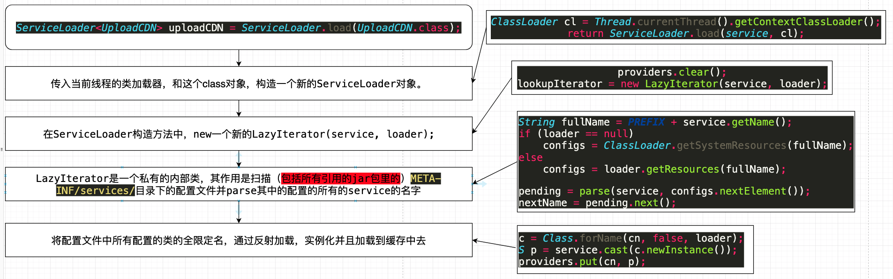

# Java SPI机制
SPI全称为Service Provider Interface，是JDK内置的一种服务提供发现机制。简单来说，它就是一种动态替换发现机制。例如：有个接口想在运行时才发现具体的实现类，那么你只需要在程序运行前添加一个实现即可，并把新加的实现描述给JDK即可。此外，在程序的运行过程中，也可以随时对该描述进行修改，完成具体实现的替换。

Java提供了很多服务提供者接口（Service Provider Interface，SPI），允许第三方为这些接口提供实现。常见的SPI有JDBC、JCE、JNDI、JAXP和JBI等。

这些SPI的接口是由Java核心库来提供，而SPI的实现则是作为Java应用所依赖的jar包被包含进类路径（CLASSPATH）中。例如：JDBC的实现mysql就是通过maven被依赖进来。

那么问题来了，SPI的接口是Java核心库的一部分，是由引导类加载器(Bootstrap Classloader)来加载的。SPI的实现类是由系统类加载器(System ClassLoader)来加载的。

引导类加载器在加载时是无法找到SPI的实现类的，因为双亲委派模型中规定，引导类加载器BootstrapClassloader无法委派系统类加载器AppClassLoader来加载。这时候，该如何解决此问题？

线程上下文类加载由此诞生，它的出现也破坏了类加载器的双亲委派模型，使得程序可以进行逆向类加载。

下面，我们就用具体的代码来说明逆向类加载。不过，在距离之前，还是想对spi的使用进行一个简单的说明。

## spi使用
### 1.代码编写
既然是spi，那么就必须先定义好接口。其次，就是定义好接口的实现类。

### 2.创建一个文件夹
在项目的\src\main\resources\下创建\META-INF\services目录

### 3.文件夹下增加配置文件
在上面META-INF\services的目录下再增加一个配置文件，这个文件必须以接口的全限定类名保持一致，例如：com.xxx.xxx.HelloService

### 4.配置文件增加描述
上面介绍spi时说道，除了代码上的接口实现之外，你还需要把该实现的描述提供给JDK。那么，此步骤就是在配置文件中撰写接口实现描述。很简单，就是在配置文件中写入具体实现类的全限定类名，如有多个便换行写入。

### 5.使用JDK来载入
编写main()方法，输出测试接口。使用JDK提供的ServiceLoader.load()来加载配置文件中的描述信息，完成类加载操作。

## SPI原理解析
ServiceLoader这个类
```java
public final class ServiceLoader<S> implements Iterable<S> {


    //扫描目录前缀
    private static final String PREFIX = "META-INF/services/";

    // 被加载的类或接口
    private final Class<S> service;

    // 用于定位、加载和实例化实现方实现的类的类加载器
    private final ClassLoader loader;

    // 上下文对象
    private final AccessControlContext acc;

    // 按照实例化的顺序缓存已经实例化的类
    private LinkedHashMap<String, S> providers = new LinkedHashMap<>();

    // 懒查找迭代器
    private java.util.ServiceLoader.LazyIterator lookupIterator;

    // 私有内部类，提供对所有的service的类的加载与实例化
    private class LazyIterator implements Iterator<S> {
        Class<S> service;
        ClassLoader loader;
        Enumeration<URL> configs = null;
        String nextName = null;

        //...
        private boolean hasNextService() {
            if (configs == null) {
                try {
                    //获取目录下所有的类
                    String fullName = PREFIX + service.getName();
                    if (loader == null)
                        configs = ClassLoader.getSystemResources(fullName);
                    else
                        configs = loader.getResources(fullName);
                } catch (IOException x) {
                    //...
                }
                //....
            }
        }

        private S nextService() {
            String cn = nextName;
            nextName = null;
            Class<?> c = null;
            try {
                //反射加载类
                c = Class.forName(cn, false, loader);
            } catch (ClassNotFoundException x) {
            }
            try {
                //实例化
                S p = service.cast(c.newInstance());
                //放进缓存
                providers.put(cn, p);
                return p;
            } catch (Throwable x) {
                //..
            }
            //..
        }
    }
}
```

spi加载的主要流程供参考



## spi能带来的好处
- 不需要改动源码就可以实现扩展，解耦。
- 实现扩展对原来的代码几乎没有侵入性。
- 只需要添加配置就可以实现扩展，符合开闭原则。

## 参考资料
https://www.jianshu.com/p/e4262536000d
https://www.cnblogs.com/jy107600/p/11464985.html