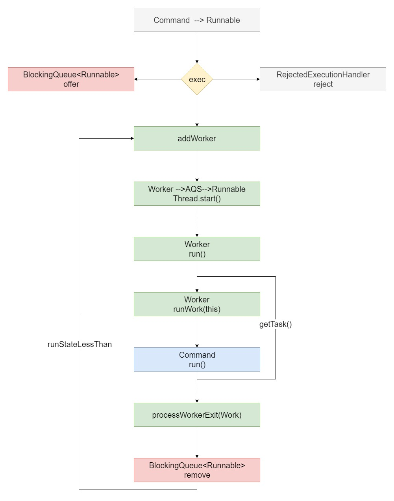

# Java中的线程池

## 八种线程池创建方式：

1. ExecutorService threadPool = Executors.newSingleThreadExecutor();//单线程的线程池，只有一个线程在工作
2. ExecutorService threadPool = Executors.newSingleThreadScheduledExecutor();//单线程的线程池，只有一个线程在工作
3. ExecutorService threadPool = Executors.newCachedThreadPool();//有缓冲的线程池，线程数 JVM 控制
4. ExecutorService threadPool = Executors.newFixedThreadPool(3);//固定大小的线程池
5. ExecutorService threadPool = Executors.newScheduledThreadPool(2);
6. ExecutorService threadPool = Executors.newWorkStealingPool(2);

## 两种底层实现

1.ExecutorService threadPool = new ThreadPoolExecutor();//默认线程池，可控制参数比较多 1.ExecutorService threadPool = new ForkJoinPool();//newWorkStealingPool的底层实现

## 三种阻塞队列：

1. BlockingQueue workQueue workQueue = new ArrayBlockingQueue<>(5);//基于数组的先进先出队列，有界
2. BlockingQueue workQueue workQueue = new LinkedBlockingQueue<>();//基于链表的先进先出队列，无界
3. BlockingQueue workQueue workQueue = new SynchronousQueue<>();//无缓冲的等待队列，无界
4.  SynchronousQueue

    > SynchronousQueue没有容量，是无缓冲等待队列，是一个不存储元素的阻塞队列，会直接将任务交给消费者，必须等队列中的添加元素被消费后才能继续添加新的元素。 拥有公平（FIFO）和非公平(LIFO)策略，非公平侧罗会导致一些数据永远无法被消费的情况？ 使用SynchronousQueue阻塞队列一般要求maximumPoolSizes为无界，避免线程拒绝执行操作。
5.  LinkedBlockingQueue

    > LinkedBlockingQueue是一个无界缓存等待队列。当前执行的线程数量达到corePoolSize的数量时，剩余的元素会在阻塞队列里等待。（所以在使用此阻塞队列时maximumPoolSizes就相当于无效了），每个线程完全独立于其他线程。生产者和消费者使用独立的锁来控制数据的同步，即在高并发的情况下可以并行操作队列中的数据。
6.  ArrayBlockingQueue

    > ArrayBlockingQueue是一个有界缓存等待队列，可以指定缓存队列的大小，当正在执行的线程数等于corePoolSize时，多余的元素缓存在ArrayBlockingQueue队列中等待有空闲的线程时继续执行，当ArrayBlockingQueue已满时，加入ArrayBlockingQueue失败，会开启新的线程去执行，当线程数已经达到最大的maximumPoolSizes时，再有新的元素尝试加入ArrayBlockingQueue时会报错。

## 四种拒绝策略：

1. RejectedExecutionHandler rejected = new ThreadPoolExecutor.AbortPolicy();//默认，队列满了丢任务抛出异常
2. RejectedExecutionHandler rejected = new ThreadPoolExecutor.DiscardPolicy();//队列满了丢任务不异常
3. RejectedExecutionHandler rejected = new ThreadPoolExecutor.DiscardOldestPolicy();//将最早进入队列的任务删，之后再尝试加入队列
4. RejectedExecutionHandler rejected = new ThreadPoolExecutor.CallerRunsPolicy();//如果添加到线程池失败，那么主线程会自己去执行该任务

## 同一个世界同一个梦想

java.util.concurrent.ThreadPoolExecutor.execute 

java.util.concurrent.ForkJoinPool.execute
