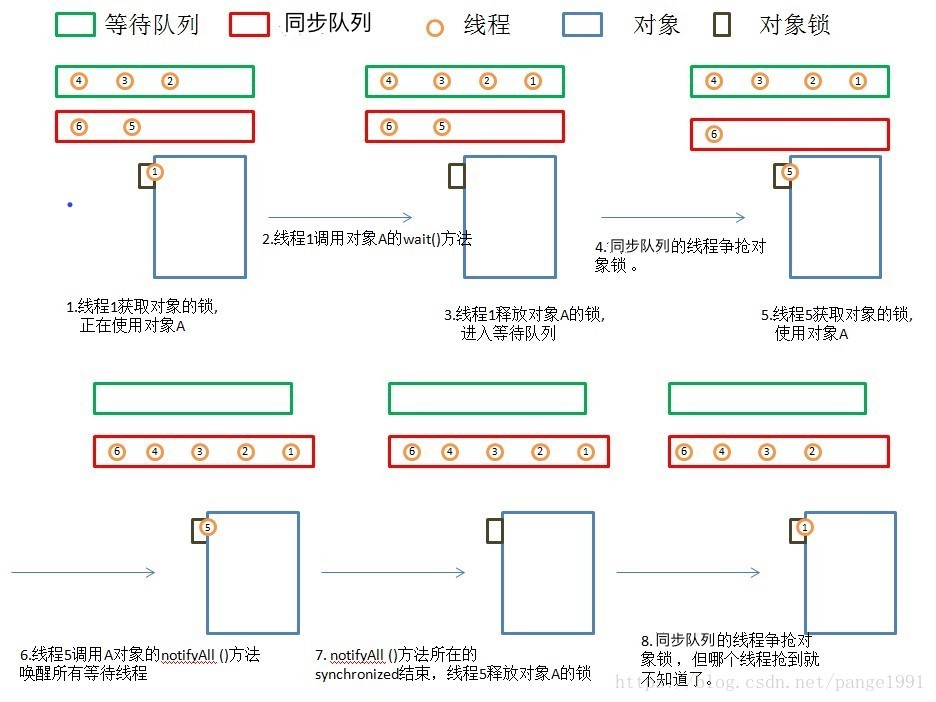

# Java中的线程同步

* 调用obj的wait(), notify()方法前，必须获得obj锁，也就是必须写在synchronized(obj) 代码段内。
* 与等待队列和同步队列相关的步骤和图 
* 线程1获取对象A的锁，正在使用对象A。
* 线程1调用对象A的wait()方法。
* 线程1释放对象A的锁，并马上进入等待队列。
* 锁池里面的对象争抢对象A的锁。
* 线程5获得对象A的锁，进入synchronized块，使用对象A。
* 线程5调用对象A的notifyAll()方法，唤醒所有线程，所有线程进入同步队列。若线程5调用对象A的notify()方法，则唤醒一个线程，不知道会唤醒谁，被唤醒的那个线程进入同步队列。
* notifyAll()方法所在synchronized结束，线程5释放对象A的锁。
* 同步队列的线程争抢对象锁，但线程1什么时候能抢到就不知道了。 

注意：等待队列里许许多多的线程都wait()在一个对象上，此时某一线程调用了对象的notify()方法，那唤醒的到底是哪个线程？随机？队列FIFO？or sth else？java文档就简单的写了句：选择是任意性的（The choice is arbitrary and occurs at the discretion of the implementation）。

同步队列状态

1. 当前线程想调用对象A的同步方法时，发现对象A的锁被别的线程占有，此时当前线程进入同步队列。简言之，同步队列里面放的都是想争夺对象锁的线程。
2. 当一个线程1被另外一个线程2唤醒时，1线程进入同步队列，去争夺对象锁。
3. 同步队列是在同步的环境下才有的概念，一个对象对应一个同步队列。
