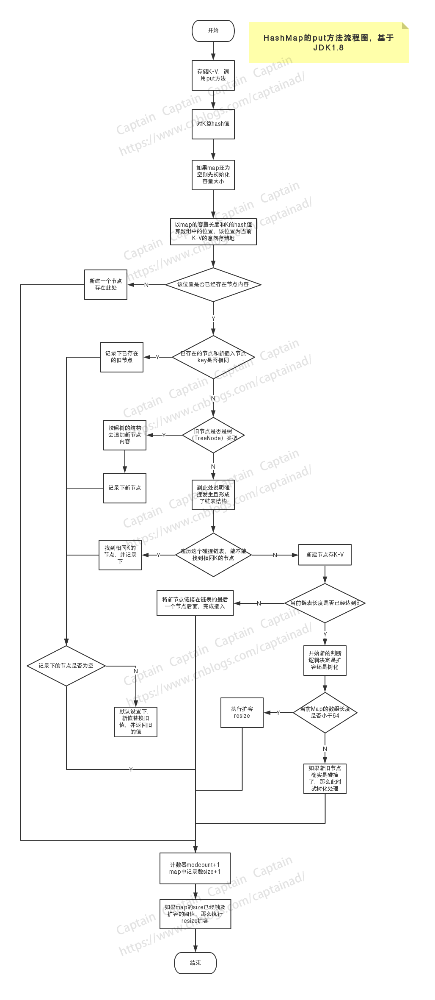

# HashMap

## HashMap

### HashMap之put方法流程解读

说明：本文中所谈论的HashMap基于JDK 1.8版本源码进行分析和说明。

HashMap的put方法算是HashMap中比较核心的功能了，复杂程度高但是算法巧妙，同时在上一版本的基础之上优化了存储结构，从链表逐步进化成了红黑树，以满足存取性能上的需要。本文逐行分析了put方法的执行流程，重点放在了对整个流程的把握，对于红黑树的执行逻辑只是点到为止，其实HashMap中还有很多细节算法值得分析和学习，本文没有涉及，算是抛砖引玉吧，后面抽空把其他的地方分析一番。

#### HashMap的put方法：

```java
/**
 * Associates the specified value with the specified key in this map.
 * If the map previously contained a mapping for the key, the old
 * value is replaced.
 *
 * @param key key with which the specified value is to be associated
 * @param value value to be associated with the specified key
 * @return the previous value associated with <tt>key</tt>, or
 *         <tt>null</tt> if there was no mapping for <tt>key</tt>.
 *         (A <tt>null</tt> return can also indicate that the map
 *         previously associated <tt>null</tt> with <tt>key</tt>.)
 */
public V put(K key, V value) {
    return putVal(hash(key), key, value, false, true);
}
```

大意为：将指定的值与此映射中的指定键相关联，如果Map中已经包含了该键的映射，那么旧的映射值将会被替代，也就是说在put时，如果map中已经包含有key所关联的键值对，那么后续put进来的键值对，将会以相同key为准替换掉原来的那一对键值对。

返回的值则将是之前在map中实际与key相关联的Value值（也就是旧的值），如果key没有实际映射值的话那就返回null。

put方法作为对外暴露的方法，在内部实现时则立马调用了其内部putVal方法，并将put进去（覆盖）之前的结果k-v中的v进行了返回，但map中最新绑定的那一对k-v中的v已经是最新put的了。

#### 紧接着调用内部方法putVal：

**putVal方法中的第一个参数hash**

```java
    /**
     * Computes key.hashCode() and spreads (XORs) higher bits of hash
     * to lower.  Because the table uses power-of-two masking, sets of
     * hashes that vary only in bits above the current mask will
     * always collide. (Among known examples are sets of Float keys
     * holding consecutive whole numbers in small tables.)  So we
     * apply a transform that spreads the impact of higher bits
     * downward. There is a tradeoff between speed, utility, and
     * quality of bit-spreading. Because many common sets of hashes
     * are already reasonably distributed (so don't benefit from
     * spreading), and because we use trees to handle large sets of
     * collisions in bins, we just XOR some shifted bits in the
     * cheapest possible way to reduce systematic lossage, as well as
     * to incorporate impact of the highest bits that would otherwise
     * never be used in index calculations because of table bounds.
     */
    static final int hash(Object key) {
        int h;
        return (key == null) ? 0 : (h = key.hashCode()) ^ (h >>> 16);
    }
```

大意为：将key的hashcode值（由native方法计算得到）再与该值的高16位进行异或运算得到最终的hash值。这样做的目的作者也给出了解释，就是通常的hash算法都总是碰撞，我们这样做的目的尽量使得hash值较为分散。（大概理解）

**putVal里面的方法**

```java
final V putVal(int hash, K key, V value, boolean onlyIfAbsent,
               boolean evict) {
    Node<K,V>[] tab; Node<K,V> p; int n, i;
    // 如果map还是空的，则先开始初始化，table是map中用于存放索引的表
    if ((tab = table) == null || (n = tab.length) == 0) {
        n = (tab = resize()).length;
    }
    // 使用hash与数组长度减一的值进行异或得到分散的数组下标，预示着按照计算现在的
    // key会存放到这个位置上，如果这个位置上没有值，那么直接新建k-v节点存放
    // 其中长度n是一个2的幂次数
    if ((p = tab[i = (n - 1) & hash]) == null) {
        tab[i] = newNode(hash, key, value, null);
    } 
    // 如果走到else这一步，说明key索引到的数组位置上已经存在内容，即出现了碰撞
    // 这个时候需要更为复杂处理碰撞的方式来处理，如链表和树
    else {
        Node<K,V> e; K k;
        // 其中p已经在上面通过计算索引找到了，即发生碰撞那一个节点
        // 比较，如果该节点的hash和当前的hash相等，而且key也相等或者
        // 在key不等于null的情况下key的内容也相等，则说明两个key是
        // 一样的，则将当前节点p用临时节点e保存
        if (p.hash == hash &&
            ((k = p.key) == key || (key != null && key.equals(k)))) {
            e = p;
        }
        // 如果当前节点p是（红黑）树类型的节点，则需要特殊处理
        // 如果是树，则说明碰撞已经开始用树来处理，后续的数据结构都是树而非
        // 列表了
        else if (p instanceof TreeNode) {
            // 其中this表示当前HashMap, tab为map中的数组
            e = ((TreeNode<K,V>)p).putTreeVal(this, tab, hash, key, value);
        }
        else {
            for (int binCount = 0; ; ++binCount) {
                // 如果当前碰撞到的节点没有后续节点，则直接新建节点并追加
                if ((e = p.next) == null) {
                    p.next = newNode(hash, key, value, null);
                    // TREEIFY_THRESHOLD = 8
                    // 从0开始的，如果到了7则说明满8了，这个时候就需要转
                    // 重新确定是否是扩容还是转用红黑树了
                    if (binCount >= TREEIFY_THRESHOLD - 1) // -1 for 1st
                        treeifyBin(tab, hash);
                    break;
                }
                // 找到了碰撞节点中，key完全相等的节点，则用新节点替换老节点
                if (e.hash == hash &&
                    ((k = e.key) == key || (key != null && key.equals(k))))
                    break;
                p = e;
            }
        }
        // 此时的e是保存的被碰撞的那个节点，即老节点
        if (e != null) { // existing mapping for key
            V oldValue = e.value;
            // onlyIfAbsent是方法的调用参数，表示是否替换已存在的值，
            // 在默认的put方法中这个值是false，所以这里会用新值替换旧值
            if (!onlyIfAbsent || oldValue == null)
                e.value = value;
            // Callbacks to allow LinkedHashMap post-actions
            afterNodeAccess(e);
            return oldValue;
        }
    }
    // map变更性操作计数器
    // 比如map结构化的变更像内容增减或者rehash，这将直接导致外部map的并发
    // 迭代引起fail-fast问题，该值就是比较的基础
    ++modCount;
    // size即map中包括k-v数量的多少
    // 当map中的内容大小已经触及到扩容阈值时，则需要扩容了
    if (++size > threshold)
        resize();
    // Callbacks to allow LinkedHashMap post-actions
    afterNodeInsertion(evict);
    return null;
}
```

**当存储值发生碰撞，解决的方法已经转换为红黑树时，先看下红黑树的数据结构：**

```java
/**
 * Entry for Tree bins. Extends LinkedHashMap.Entry (which in turn
 * extends Node) so can be used as extension of either regular or
 * linked node.
 */
static final class TreeNode<K,V> extends LinkedHashMap.Entry<K,V> {
    TreeNode<K,V> parent;  // red-black tree links
    TreeNode<K,V> left;
    TreeNode<K,V> right;
    TreeNode<K,V> prev;    // needed to unlink next upon deletion
    boolean red;
}
```

**当存储值发生碰撞，并在当前节点已经延申到树时，将执行putTreeVal方法：**

```java
/**
 * Tree version of putVal.
 */
final TreeNode<K,V> putTreeVal(HashMap<K,V> map, Node<K,V>[] tab,
                               int h, K k, V v) {
    Class<?> kc = null;
    boolean searched = false;
    TreeNode<K,V> root = (parent != null) ? root() : this;
    for (TreeNode<K,V> p = root;;) {
        int dir, ph; K pk;
        if ((ph = p.hash) > h)
            dir = -1;
        else if (ph < h)
            dir = 1;
        else if ((pk = p.key) == k || (k != null && k.equals(pk)))
            return p;
        else if ((kc == null &&
                  (kc = comparableClassFor(k)) == null) ||
                 (dir = compareComparables(kc, k, pk)) == 0) {
            if (!searched) {
                TreeNode<K,V> q, ch;
                searched = true;
                if (((ch = p.left) != null &&
                     (q = ch.find(h, k, kc)) != null) ||
                    ((ch = p.right) != null &&
                     (q = ch.find(h, k, kc)) != null))
                    return q;
            }
            dir = tieBreakOrder(k, pk);
        }

        TreeNode<K,V> xp = p;
        if ((p = (dir <= 0) ? p.left : p.right) == null) {
            Node<K,V> xpn = xp.next;
            TreeNode<K,V> x = map.newTreeNode(h, k, v, xpn);
            if (dir <= 0)
                xp.left = x;
            else
                xp.right = x;
            xp.next = x;
            x.parent = x.prev = xp;
            if (xpn != null)
                ((TreeNode<K,V>)xpn).prev = x;
            moveRootToFront(tab, balanceInsertion(root, x));
            return null;
        }
    }
}
```

这里面大概是一个红黑树的储值计算方法，需要有数据结构的理论知识加持，初看有点晦涩难懂。

**在值发生碰撞并需要延续追加时，如果追加的链表长度大于8，那么需要重新评估当前是扩充数组还是将链表转换为红黑树来存储。**

```java
/**
 * Replaces all linked nodes in bin at index for given hash unless
 * table is too small, in which case resizes instead.
 */
final void treeifyBin(Node<K,V>[] tab, int hash) {
    int n, index; Node<K,V> e;
    // MIN_TREEIFY_CAPACITY = 64
    // 如果当前map的数组为空，或者数组长度还小于64，则选择扩充数组长度
    if (tab == null || (n = tab.length) < MIN_TREEIFY_CAPACITY) {
        // 扩充数组长度涉及到原内容的重新散列再存储
        resize();
    }
    // 如果执行else if则说明数组长度已经大于64了，这个时候就使用了
    // 红黑树来处理
    else if ((e = tab[index = (n - 1) & hash]) != null) {
        TreeNode<K,V> hd = null, tl = null;
        do {
            TreeNode<K,V> p = replacementTreeNode(e, null);
            if (tl == null)
                hd = p;
            else {
                p.prev = tl;
                tl.next = p;
            }
            tl = p;
        } while ((e = e.next) != null);
        if ((tab[index] = hd) != null)
            // table表从此节点链接成树
            hd.treeify(tab);
    }
}
```

**扩充数组长度方法resize，会将整个map中的k-v对重新散列存储，会消耗性能。**

```java
/**
 * Initializes or doubles table size.  If null, allocates in
 * accord with initial capacity target held in field threshold.
 * Otherwise, because we are using power-of-two expansion, the
 * elements from each bin must either stay at same index, or move
 * with a power of two offset in the new table.
 *
 * @return the table
 */
final Node<K,V>[] resize() {
    Node<K,V>[] oldTab = table;
    int oldCap = (oldTab == null) ? 0 : oldTab.length;
    int oldThr = threshold;
    int newCap, newThr = 0;
    if (oldCap > 0) {
        // MAXIMUM_CAPACITY = 1 << 30 = 1073741824
        // Integer.MAX_VALUE = (1 << 31) - 1 = 2147483647
        // 如果已经到了最大容量了，那么就调整扩容的threshold阈值
        if (oldCap >= MAXIMUM_CAPACITY) {
            threshold = Integer.MAX_VALUE;
            return oldTab;
        }
        // DEFAULT_INITIAL_CAPACITY = 1 << 4
        // 否则的话，如果将目前的容量扩充2倍还在允许范围之内，则将容量
        // 扩充为原来的两倍，并且阈值也为原来的两倍
        else if ((newCap = oldCap << 1) < MAXIMUM_CAPACITY &&
                 oldCap >= DEFAULT_INITIAL_CAPACITY)
            newThr = oldThr << 1; // double threshold
    }
    // 如果原始（或者初始）容量不大于0，且之前的阈值大于0，则将容量初始化为
    // 之前阈值的大小
    else if (oldThr > 0) // initial capacity was placed in threshold
        newCap = oldThr;
    else {               // zero initial threshold signifies using defaults
        // 执行这里的方法说明，初始参数中容量大小和阈值都不大于0，那么就用
        // map中的缺省值
        // DEFAULT_INITIAL_CAPACITY = 1 << 4 = 16
        // DEFAULT_LOAD_FACTOR = 0.75f
        newCap = DEFAULT_INITIAL_CAPACITY;
        newThr = (int)(DEFAULT_LOAD_FACTOR * DEFAULT_INITIAL_CAPACITY);
    }
    // 如果新的阈值没有重新计算，那么先用加载因子计算出值
    // 如果新的容量大小和阈值大小都未超过限定值，则计算出的值可用，否则
    // 阈值就限定为容量真正允许的上限即Integer.MAX_VALUE
    if (newThr == 0) {
        float ft = (float)newCap * loadFactor;
        newThr = (newCap < MAXIMUM_CAPACITY && ft < (float)MAXIMUM_CAPACITY ?
                  (int)ft : Integer.MAX_VALUE);
    }
    threshold = newThr;
    @SuppressWarnings({"rawtypes","unchecked"})
        Node<K,V>[] newTab = (Node<K,V>[])new Node[newCap];
    // table已经是扩容好的新table了
    // 老的table存在了oldTab中
    table = newTab;
    // 以下就是一个重新散列存储的过程了
    // 将老的tab中的node，按照key重新散列得到新得存储地址来存储，
    // 以此来完成扩充
    if (oldTab != null) {
        for (int j = 0; j < oldCap; ++j) {
            Node<K,V> e;
            if ((e = oldTab[j]) != null) {
                oldTab[j] = null;
                if (e.next == null)
                    newTab[e.hash & (newCap - 1)] = e;
                else if (e instanceof TreeNode)
                    ((TreeNode<K,V>)e).split(this, newTab, j, oldCap);
                else { // preserve order
                    Node<K,V> loHead = null, loTail = null;
                    Node<K,V> hiHead = null, hiTail = null;
                    Node<K,V> next;
                    do {
                        next = e.next;
                        if ((e.hash & oldCap) == 0) {
                            if (loTail == null)
                                loHead = e;
                            else
                                loTail.next = e;
                            loTail = e;
                        }
                        else {
                            if (hiTail == null)
                                hiHead = e;
                            else
                                hiTail.next = e;
                            hiTail = e;
                        }
                    } while ((e = next) != null);
                    if (loTail != null) {
                        loTail.next = null;
                        newTab[j] = loHead;
                    }
                    if (hiTail != null) {
                        hiTail.next = null;
                        newTab[j + oldCap] = hiHead;
                    }
                }
            }
        }
    }
    return newTab;
}
```

#### HashMap的put方法流程总结

1、put(key, value)中直接调用了内部的putVal方法，并且先对key进行了hash操作；

2、putVal方法中，先检查HashMap数据结构中的索引数组表是否位空，如果是的话则进行一次resize操作；

3、以HashMap索引数组表的长度减一与key的hash值进行与运算，得出在数组中的索引，如果索引指定的位置值为空，则新建一个k-v的新节点；

4、如果不满足的3的条件，则说明索引指定的数组位置的已经存在内容，这个时候称之碰撞出现；

5、在上面判断流程走完之后，计算HashMap全局的modCount值，以便对外部并发的迭代操作提供修改的Fail-fast判断提供依据，于此同时增加map中的记录数，并判断记录数是否触及容量扩充的阈值，触及则进行一轮resize操作；

6、在步骤4中出现碰撞情况时，从步骤7开始展开新一轮逻辑判断和处理；

7、判断key索引到的节点（暂且称作被碰撞节点）的hash、key是否和当前待插入节点（新节点）的一致，如果是一致的话，则先保存记录下该节点；如果新旧节点的内容不一致时，则再看被碰撞节点是否是树（TreeNode）类型，如果是树类型的话，则按照树的操作去追加新节点内容；如果被碰撞节点不是树类型，则说明当前发生的碰撞在链表中（此时链表尚未转为红黑树），此时进入一轮循环处理逻辑中；

8、循环中，先判断被碰撞节点的后继节点是否为空，为空则将新节点作为后继节点，作为后继节点之后并判断当前链表长度是否超过最大允许链表长度8，如果大于的话，需要进行一轮是否转树的操作；如果在一开始后继节点不为空，则先判断后继节点是否与新节点相同，相同的话就记录并跳出循环；如果两个条件判断都满足则继续循环，直至进入某一个条件判断然后跳出循环；

9、步骤8中转树的操作treeifyBin，如果map的索引表为空或者当前索引表长度还小于64（最大转红黑树的索引数组表长度），那么进行resize操作就行了；否则，如果被碰撞节点不为空，那么就顺着被碰撞节点这条树往后新增该新节点；

10、最后，回到那个被记住的被碰撞节点，如果它不为空，默认情况下，新节点的值将会替换被碰撞节点的值，同时返回被碰撞节点的值（V）。

#### put方法流程图



#### 思考与优化

resize操作在当前索引表容量不足时发生，这个操作对put性能有一定的冲击（据说还会引起死循环），但是能够自行避免，如果在我们使用map的时候能够知道需要存入的记录数，则可以通过【 (记录数 / threshold) + 1 】的方式计算出一个map的初始容量，并在声明HashMap时将初始容量指定为这个计算值。多提一句，尽管我们按照这种方式计算出了一个能够最大包容我们预期k-v键值对的容量值，但是HashMap为了性能考虑，在我们初始化容量之后，其内部又使用了一个tableSizeFor的方法将这个值转换成了一个大于等于该值的最近的一个2次幂的数值，以方便后续其他的位操作，这个方法很巧妙，可以自行研究一下。但这个内部方法我们是不需要考虑和深究的，按照上面这个方法计算并初始化使用就行了。

## 参考

[https://www.cnblogs.com/captainad/p/10905184.html](https://www.cnblogs.com/captainad/p/10905184.html)
