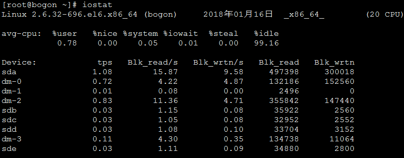
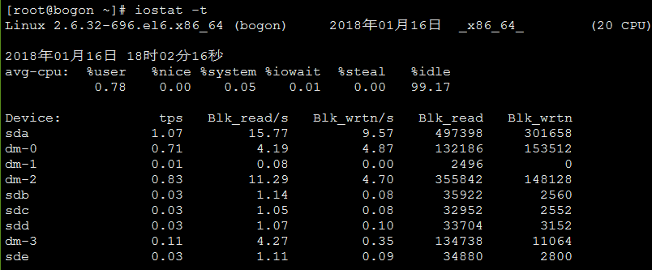
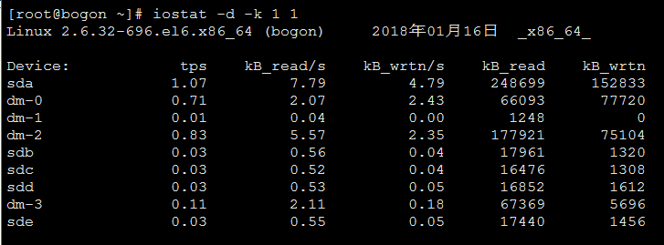

# 磁盘IO状态监控

## 概述

iostat 主要用于输出磁盘IO 和 CPU的统计信息。

iostat属于sysstat软件包。可以用yum install sysstat 直接安装。

iostat 用法

用法：iostat \[选项] \[<时间间隔>] \[<次数>]

命令参数：

* \-c： 显示CPU使用情况
* \-d： 显示磁盘使用情况
* \-N： 显示磁盘阵列(LVM) 信息
* \-n： 显示NFS 使用情况
* \-k： 以 KB 为单位显示
* \-m： 以 M 为单位显示
* \-t： 报告每秒向终端读取和写入的字符数和CPU的信息
* \-V： 显示版本信息
* \-x： 显示详细信息
* \-p：\[磁盘] 显示磁盘和分区的情况

## 示例

### iostat

显示所有设备负载情况

#### cpu属性值说明：

* %user：CPU处在用户模式下的时间百分比。
* %nice：CPU处在带NICE值的用户模式下的时间百分比。
* %system：CPU处在系统模式下的时间百分比。
* %iowait：CPU等待输入输出完成时间的百分比。
* %steal：管理程序维护另一个虚拟处理器时，虚拟CPU的无意识等待时间百分比。
*   %idle：CPU空闲时间百分比。

    > 备注：如果%iowait的值过高，表示硬盘存在I/O瓶颈，%idle值高，表示CPU较空闲，如果%idle值高但系统响应慢时，有可能是CPU等待分配内存，此时应加大内存容量。%idle值如果持续低于10，那么系统的CPU处理能力相对较低，表明系统中最需要解决的资源是CPU。

#### disk属性值说明：

* device:磁盘名称
* tps:每秒钟发送到的I/O请求数.
* Blk_read/s:每秒读取的block数.
* Blk_wrtn/s:每秒写入的block数.
* Blk_read:读入的block总数.
* Blk_wrtn:写入的block总数.

#### 参数

1. iostat 1 5:间隔1秒，总共显示5次
2. iostat -d 2:每隔2秒,显示一次设备统计信息.
3. iostat -d 2 3:每隔2秒,显示一次设备统计信息.总共输出3次.
4. iostat -x sda sdb 2 3:每隔2秒显示一次sda, sdb两个设备的扩展统计信息,共输出3次.
5. iostat -p sda 2 3:每隔2秒显示一次sda及上面所有分区的统计信息,共输出3次.
6.  iostat -m:以M为单位显示所有信息

    
7.  iostat -d sda:显示指定硬盘信息

    
8.  iostat -t:报告每秒向终端读取和写入的字符数。

    
9.  iostat -d -k 1 1:查看TPS和吞吐量信息

    
10. iostat -d -x -k 1 1:查看设备使用率（%util）、响应时间（await）

    

说明：

* rrqm/s: 每秒进行 merge 的读操作数目。即 rmerge/s
* wrqm/s: 每秒进行 merge 的写操作数目。即 wmerge/s
* r/s: 每秒完成的读 I/O 设备次数。即 rio/s
* w/s: 每秒完成的写 I/O 设备次数。即 wio/s
* rkB/s: 每秒读K字节数。是 rsect/s 的一半，因为每扇区大小为512字节。
* wkB/s: 每秒写K字节数。是 wsect/s 的一半。
* avgrq-sz: 平均每次设备I/O操作的数据大小 (扇区)。
* avgqu-sz: 平均I/O队列长度。
* rsec/s: 每秒读扇区数。即 rsect/s
* wsec/s: 每秒写扇区数。即 wsect/s
* r_await:每个读操作平均所需的时间
* 不仅包括硬盘设备读操作的时间，还包括了在kernel队列中等待的时间。
* w_await:每个写操作平均所需的时间
* 不仅包括硬盘设备写操作的时间，还包括了在kernel队列中等待的时间。
* await: 平均每次设备I/O操作的等待时间 (毫秒)。
* svctm: 平均每次设备I/O操作的服务时间 (毫秒)。
*   %util: 一秒中有百分之多少的时间用于 I/O 操作，即被io消耗的cpu百分比

    > 备注：如果 %util 接近 100%，说明产生的I/O请求太多，I/O系统已经满负荷，该磁盘可能存在瓶颈。如果 svctm 比较接近 await，说明 I/O 几乎没有等待时间；如果 await 远大于 svctm，说明I/O 队列太长，io响应太慢，则需要进行必要优化。如果avgqu-sz比较大，也表示有当量io在等待。
* iostat -c 1 2：查看cpu状态，间隔1秒显示一次，总共显示2次

[JVM状态监控](https://github.com/QQ1350995917/gitbook/tree/1301eb5173842b2e1ed6ae91795462f32063b906/jvm/README.md)
