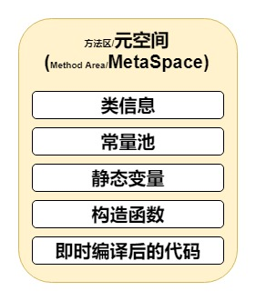
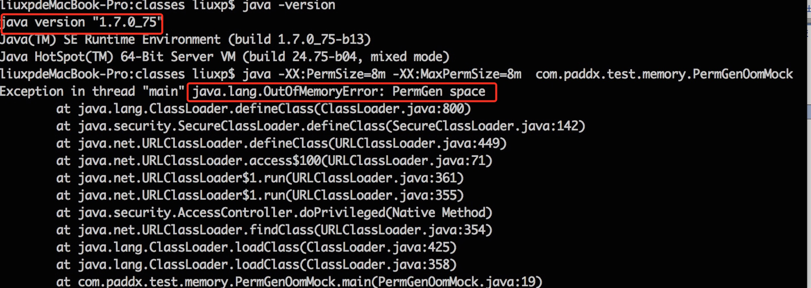
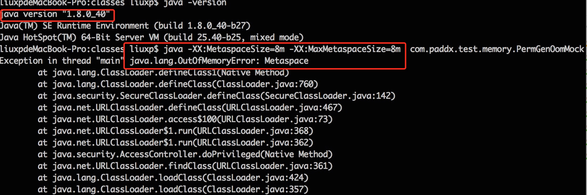

# 方法区/永久代/元空间演进



## Method Area（方法区）

方法区是JVM 所有线程共享。主要用于存储类的信息、常量池、方法数据、方法代码等。方法区逻辑上属于堆的一部分，但是为了与 堆 进行区分，通常又叫 非堆。

## PermGen（永久代）

PermGen：就是 PermGen space，全称是Permanent Generation space，是指内存的永久保存区域。这块内存主要是被JVM存放Class和Meta信息的， Class 在被Loader时就会被放到PermGen space中。

绝大部分 Java 程序员应该都见过 java.lang.OutOfMemoryError: PermGen space 这个异常。 这里的 PermGen space 其实指的就是发生在方法区 。不过方法区和PermGen space又有一定的区别。

* 方法区 是 JVM 的规范，所有虚拟机 必须遵守的。常见的JVM 虚拟机 Hotspot 、 JRockit（Oracle）、J9（IBM）
* PermGen space 则是 HotSpot 虚拟机 基于 JVM 规范对 方法区 的一个落地实现， 并且只有 HotSpot 才有 PermGen space。而如 JRockit（Oracle）、J9（IBM） 虚拟机有 方法区 ，但是就没有 PermGen space。
* PermGen space 是 JDK7及之前， HotSpot 虚拟机 对 方法区 的一个落地实现。在JDK8被移除。
* Metaspace（元空间）是 JDK8及之后， HotSpot 虚拟机 对 方法区 的新的实现。  

由于方法区 主要存储类的相关信息，所以对于动态生成类的情况比较容易出现永久代的内存溢出。实例如下

```java
package com.aop8.jvm.test;

import java.io.File;
import java.net.URL;
import java.net.URLClassLoader;
import java.util.ArrayList;
import java.util.List;

public class PermGenOomMock{

    List<ClassLoader> classLoaderList = new ArrayList<ClassLoader>();
    public static void main(String[] args) {
        URL url = null;       
        try {
            url = new File("/tmp").toURI().toURL();
            URL[] urls = {url};
            while (true){
                ClassLoader loader = new URLClassLoader(urls);
                classLoaderList.add(loader);
                loader.loadClass("com.aop8.jvm.test.TestDemo");
            }
        } catch (Exception e) {
            e.printStackTrace();
        }
    }
}
```

运行结果如下： 

本例中使用的 JDK 版本是7，指定的 PermGen 区的大小为 8M。通过每次生成不同URLClassLoader对象来加载Test类，从而生成不同的类对象，这样就能看到我们熟悉的 java.lang.OutOfMemoryError: PermGen space 异常了。

从此例子中得出：

* JDK6 、JDK7 存在 PermGen space；
* JDK8 中， Hotspot 已经没有 PermGen space ，取而代之是一个叫做 Metaspace（元空间） 。

下面我们就来看看 Metaspace 与 PermGen space 的区别

## Metaspace（元空间）

Metaspace（元空间）和 PermGen（永久代）类似，都是对 JVM规范中方法区的一种落地实现。不过元空间与永久代之间最大的区别在于：元空间并不在虚拟机中，而是使用本地内存。

Oracle 移除PermGen（永久代）从从JDK7 就开始。例如，字符串内部池，已经在JDK7 中从永久代中移除。直到JDK8 的发布将宣告 PermGen（永久代）的终结。

其实，移除 PermGen 的工作从 JDK7 就开始，永久代的部分数据就已经转移到了 Java Heap 或者是 Native Heap。

但永久代仍存在于JDK7 中，并没完全移除，比如：

* 字面量 （interned strings）转移到 Java heap；
* 类的静态变量（class statics）转移到Java heap ；
* 符号引用（Symbols） 转移到 Native heap ；

必须知道的是 JDK6 、JDK7 依然存在 PermGen space；

我们可以通过一段程序来比较 JDK6 、 JDK7 和 JDK8 的区别，以字符串常量为例：

程序示例如下

```java
import java.util.ArrayList;
import java.util.List;

public class StringOomMock {

    static String  base = "string";

    public static void main(String[] args) {
        List<String> list = new ArrayList<String>();
        for (int i=0;i< Integer.MAX_VALUE;i++){
            String str = base + base;
            base = str;
            list.add(str.intern());
        }
    }
}
```

JDK6 的运行结果：


JDK7 的运行结果：


JDK8 的运行结果：


从运行结果可以得出：

* 运行时常量池 ：
  * 在 JDK6 ，抛出永久代（PermGen space）异常，说明 运行时常量池 存在于 方法区；
  * 在 JDK7、JDK8 抛出堆（Java heap space）异常，说明 运行时常量池 此时在 Java堆 中；
* 方法区（永久代 、元空间）：
  * JDK8 打印ignoring option PermSize=10M; support was removed in 8.0 ... 警告的原因，JDK8时，永久代已被移除，所以不支持 -XX:PermSize=10M -XX:MaxPermSize=10M 永久代的参数设置。
  * JDK8 的方法区是 元空间，其参数设置是 -XX:MetaspaceSize=N -XX:MaxMetaspaceSize=N 。
  * 反推证出 JDK6 、 JDK7 时，永久代 还是存在的，否则打印不支持参数设置的警告。

知识扩展：

| JDK版本 | 方法区的实现             | 运行时常量池所在的位置        |
| ----- | ------------------ | ------------------ |
| JDK6  | PermGen space（永久代） | PermGen space（永久代） |
| JDK7  | PermGen space（永久代） | Heap（堆）            |
| JDK8  | Metaspace（元空间）     | Heap（堆）            |

## 元空间与本地内存

元空间与永久代之间最大的区别在于：元空间并不在虚拟机中，而是使用 本地内存。默认情况下，元空间的大小仅受 本地内存 限制，但可以通过以下参数来指定元空间的大小：

* \-XX:MetaspaceSize ，初始空间大小：达到该值就会触发垃圾收集进行类型卸载，同时GC会对该值进行调整：如果释放了大量的空间，就适当降低该值；如果释放了很少的空间，那么在不超过MaxMetaspaceSize时，适当提高该值。
* \-XX:MaxMetaspaceSize，最大空间：默认是没有限制的。

除了上面两个指定大小的选项以外，还有两个与 GC 相关的属性：

* \-XX:MinMetaspaceFreeRatio，在GC之后，最小的Metaspace剩余空间容量的百分比，减少为分配空间所导致的垃圾收集；
* \-XX:MaxMetaspaceFreeRatio ，在GC之后，最大的Metaspace剩余空间容量的百分比，减少为释放空间所导致的垃圾收集；

现在我们在 JDK8 下重新运行一下上面的代码，不过这次不再指定 PermSize 和 MaxPermSize。而是指定 -XX:MetaspaceSize 和 -XX:MaxMetaspaceSize 的大小。输出结果如下：



从输出结果，我们可以看出，这次不再出现永久代溢出，而是出现了元空间的溢出。

## 总结

Metaspace（元空间）和 PermGen（永久代）类似，都是对 JVM规范中方法区的一种落地实现。

PermGen space 则是 HotSpot 虚拟机 基于 JVM 规范对 方法区 的一个落地实现， 并且只有 HotSpot 才有 PermGen space。而如 JRockit（Oracle）、J9（IBM） 虚拟机有 方法区 ，但是就没有 PermGen space。

PermGen space 是 JDK7及之前， HotSpot 虚拟机 对 方法区 的一个落地实现。在JDK8被移除。

Metaspace（元空间）是 JDK8及之后， HotSpot 虚拟机 对 方法区 的新的实现。

元空间与永久代之间最大的区别在于：元空间并不在虚拟机中，而是使用本地内存。但是其中的常量池依然在堆中。

通过上面分析，大家应该大致了解了 JVM 的内存划分，也清楚了 JDK8 中永久代 向 元空间的转换。不过大家应该都有一个疑问，就是为什么要做这个转换？所以，最后给大家总结以下几点原因：

1）字符串存在永久代中，容易出现性能问题和内存溢出。

2）类及方法的信息等比较难确定其大小，因此对于永久代的大小指定比较困难，太小容易出现永久代溢出，太大则容易导致老年代溢出。

3）永久代会为 GC 带来不必要的复杂度，并且回收效率偏低。

4）Oracle 可能会将HotSpot 与 JRockit 合二为一。

## 参考资料

[https://blog.csdn.net/xiaojin21cen/article/details/104267301](https://blog.csdn.net/xiaojin21cen/article/details/104267301)
