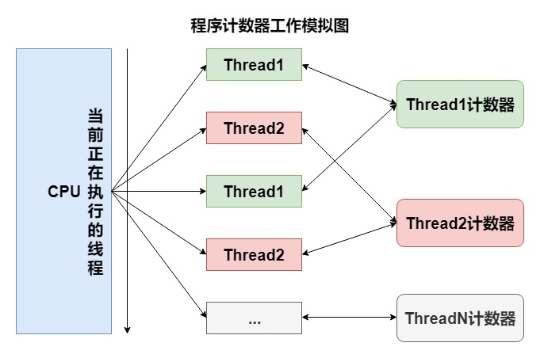

# 程序计数器

关于程序计数器我们已经得知：占用内存较小，现成私有。它是唯一没有OutOfMemoryError异常的区域。

程序计数器的作用可以看做是当前线程所执行的字节码的行号指示器，字节码解释器工作时就是通过改变计数器的值来选取下一条字节码指令。其中，分支、循环、跳转、异常处理、线程恢复等基础功能都需要依赖计数器来完成。

Java虚拟机的多线程是通过线程轮流切换并分配处理器执行时间的方式来实现的，在任何一个确定的时刻，一个处理器（对于多核处理器来说是一个内核）只会执行一条线程中的指令。

因此，为了线程切换后能恢复到正确的执行位置，每条线程都需要有一个独立的程序计数器，各条线程之间的计数器互不影响，独立存储，我们称这类内存区域为“线程私有”的内存。

如果线程正在执行的是一个Java方法，这个计数器记录的是正在执行的虚拟机字节码指令的地址；如果正在执行的是Natvie方法，这个计数器值则为空（Undefined）。
