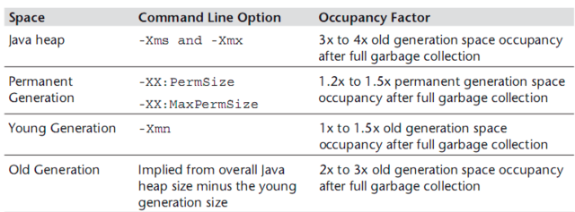

# JAVA内存实践

## 内存设置方略
新上线一个java服务，或者是RPC或者是WEB站点， 内存的设置该怎么设置呢？设置成多大比较合适，既不浪费内存，又不影响性能呢？

依据的原则是根据Java Performance里面的推荐公式来进行设置。



### 首先确认老年代存活对象大小
1. 方式1（推荐/比较稳妥)

JVM参数中添加GC日志
```bash
 -XX:+PrintGCDetails -XX:+PrintGCTimeStamps -XX:+PrintGCDateStamps -Xloggc:./gc.log
```
GC日志中会记录每次FullGC之后各代的内存大小，观察老年代GC之后的空间大小。可观察一段时间内（比如2天）的FullGC之后的内存情况，根据多次的FullGC之后的老年代的空间大小数据来预估FullGC之后老年代的存活对象大小（可根据多次FullGC之后的内存大小取平均值）
### 堆栈信息设置
#### 堆设置
- 年轻代Xmn的设置为老年代存活对象的1-1.5倍。
- 老年代的内存大小设置为老年代存活对象的2-3倍。
- 堆大小设置（年轻代+老年代）:Xmx和Xms设置为老年代存活对象的3-4倍，即FullGC之后的老年代内存占用的3-4倍

堆设置过大：浪费资源，GC时间长；堆设置过小：频繁的FullGC

#### 栈设置
```bash
-Xss128k
```

#### 元空间
- 永久代:PermSize和MaxPermSize设置为老年代存活对象的1.2-1.5倍。
- jvm自动调整扩展

## 问题排查
1. 先用top命令找出占用资源比较多的java进程id
1. 使用top -h -p pid 查看特定进程的线程资源占用情况
1. 使用jmap -histo:live查看具体占用资源的类型或者类
1. 结合访问日志定位代码实现

## 参考资料
https://blog.csdn.net/liao0801_123/article/details/83022647
https://www.jianshu.com/p/d23e7197d3fa
https://www.bbsmax.com/A/lk5aQo7451/
