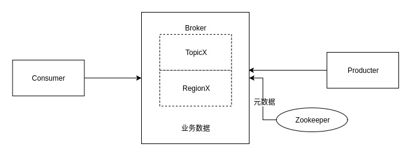

Kafka高可用集群

1：kafka使用磁盘顺序写入，要比内存随机写入高性能

2：kafaka消息无状态，不判断是否要删除消息。

kafka选举是发生在切片之间的，依托的是Zookeeper分布式锁实现，故分片在ZK中的注册都是临时节点，以保证不会在选举时候产生死锁。

3：Topic是Kafka数据写入操作的基本单元，可以指定副本

4：一个Topic包含一个或多个Partition，建Topic的时候可以手动指定Partition个数，个数与服务器个数相当

5：每条消息属于且仅属于一个Topic

6：每个Partition只会在一个Broker上，物理上每个Partition对应的是一个文件夹

7：Partition包含多个Segment，每个Segment对应一个文件，Segment可以手动指定大小，当Segment达到阈值时，将不再写数据，每个Segment都是大小相同的

8：Segment由多个不可变的记录组成，记录只会被append到Segment中，不会被单独删除或者修改，每个Segment中的Message数量不一定相等

9：Kafka默认使用的是hash进行分区，所以会出现不同的分区数据不一样的情况，但是partitioner是可以override的

10：Region = Partition

11：清除过期日志时，支持删除一个或多个Segment，默认保留7天的数据

12：Kafka实际是用先写内存映射的文件，磁盘顺序读写的技术来提高性能的。Producer生产的消息按照一定的分组策略被发送到broker中的partition中的时候，这些消息如果在内存中放不下了，就会放在partition目录下的文件中，partition目录名是topic的名称加上一个序号。在这个目录下有两类文件，一类是以log为后缀的文件，另一类是以index为后缀的文件，每一个log文件和一个index文件相对应，这一对文件就是一个Segment File，其中的log文件就是数据文件，里面存放的就是Message，而index文件是索引文件。Index文件记录了元数据信息，指向对应的数据文件中Message的物理偏移量。

13：LogSegment文件命名的规则是，partition全局的第一个Segment从0（20个0）开始，后续的每一个文件的文件名是上一个文件的最后一条消息的offset值，这样命名的好处是什么呢？假如我们有一个Consumer已经消费到了offset=x，那么如果要继续消费的话，就可以使用二分查找法来进行查找，对LogSegment文件进行查找，就可以定位到某个文件，然后拿x值去对应的index文件中去找第x条数据所在的位置。Consumer读数据的时候，实际是读Index的offset，并且会记录上次读到哪里。

