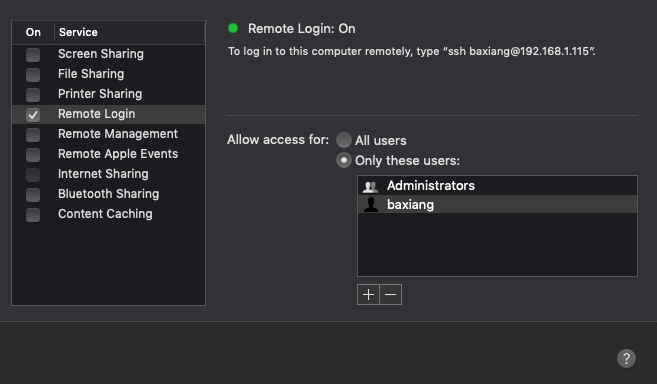
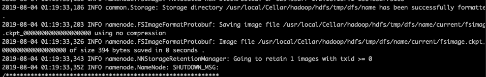
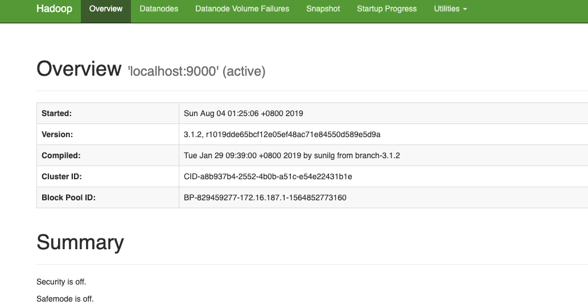

# Hadoop环境搭建
## Mac的Hadoop开发环境搭建
 
- JAVA环境配置
```bash
$ java -version
java version "1.8.0_121"
Java(TM) SE Runtime Environment (build 1.8.0_121-b13)
Java HotSpot(TM) 64-Bit Server VM (build 25.121-b13, mixed mode)
```

- mac查看Java的安装位置信息
```bash
$  /usr/libexec/java_home
/Library/Java/JavaVirtualMachines/jdk1.8.0_121.jdk/Contents/Home
```

- SSH配置
文件和目录的权限千万别设置成chmod 777.这个权限太大了，不安全
```bash
cat ~/.ssh/id_rsa.pub >> ~/.ssh/authorized_keys
chmod 0600 ~/.ssh/authorized_keys
```

- 如果没有ssh公钥,执行下面命令
```bash
ssh-keygen -t rsa
```

- 开启远程登录以及测试远程登录是否开启



```bash
ssh localhost
```

- 安装hadoop
```bash
$ brew install hadoop
Updating Homebrew...
==> Downloading https://www.apache.org/dyn/closer.cgi?path=hadoop/common/hadoop-3.1.2/hadoop-3.1.2.tar.gz
==> Downloading from http://mirrors.tuna.tsinghua.edu.cn/apache/hadoop/common/hadoop-3.1.2/hadoop-3.1.2.tar.gz
######################################################################## 100.0%
🍺  /usr/local/Cellar/hadoop/3.1.2: 21,686 files, 774.1MB, built in 10 minutes 1 second
```
最终的安装目录在/usr/local/Cellar/hadoop/ 安装的版本是3.1.2

- 配置
需要修改配置文件都在/usr/local/Cellar/hadoop/3.1.2/libexec/etc/hadoop这个目录下
```bash
$ vim hadoop-env.sh
$ vim core-site.xml
$ vim hdfs-site.xml
```

- hadoop-env.sh 配置JAVA_HOME


将/usr/libexec/java_home查到的 Java 路径，记得去掉注释 #。

```bash
export JAVA_HOME=/Library/Java/JavaVirtualMachines/jdk1.8.0_121.jdk/Contents/Home
```

core-site.xml

修改core-site.xml 文件参数,配置NameNode的主机名和端口号
```xml
<configuration>
    <property>
        <name>hadoop.tmp.dir</name>
        <value>/usr/local/Cellar/hadoop/hdfs/tmp</value>
        <description>A base for other temporary directories</description>
    </property>
    <property>
        <name>fs.default.name</name>
        <value>hdfs://localhost:9000</value>
    </property>
</configuration>
```

hdfs-site.xml

变量dfs.replication指定了每个HDFS数据库的复制次数。 通常为3, 由于我们只有一台主机和一个伪分布式模式的DataNode，将此值修改为1
```xml
<configuration>
 <property>
 <name>dfs.replication</name>
 <value>1</value>
 </property>
</configuration>
```

格式化

格式化hdfs操作只要第一次才使用，否则会造成数据全部丢失
```bash
hdfs namenode -format
```



启动 NameNode 和 DataNode：

```bash
$ cd /usr/local/Cellar/hadoop/3.1.2/sbin
$ ./start-dfs.sh
Starting namenodes on [localhost]
Starting datanodes
Starting secondary namenodes [baxiangs-Mac-mini.local]
baxiangs-Mac-mini.local: Warning: Permanently added 'baxiangs-mac-mini.local,192.168.1.115' (ECDSA) to the list of known hosts.
2019-08-04 01:25:14,753 WARN util.NativeCodeLoader: Unable to load native-hadoop library for your platform... using builtin-java classes where applicable
```

http://localhost:9870/



```bash
$ jps
5665 DataNode
5890 Jps
5797 SecondaryNameNode
1274 Launcher
317
5566 NameNode

```

YARN服务

```bash
./start-yarn.sh
./stop-yarn.sh
```

http://localhost:8088/cluster


启动/关闭Hadoop服务(等效上面两个)
```bash
./start-all.sh
./stop-all.sh
```

## 参考资料
https://www.jianshu.com/p/3f1e0a93c679


