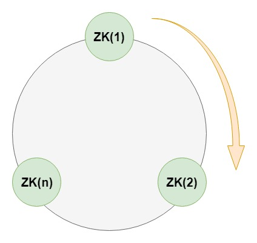
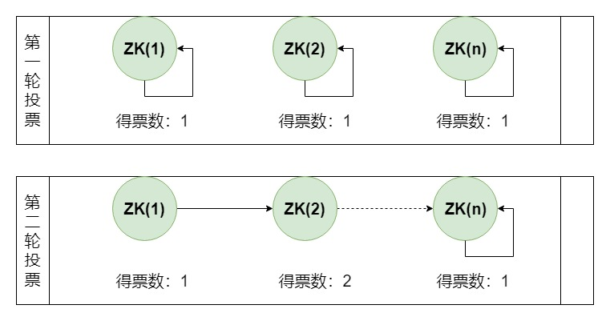
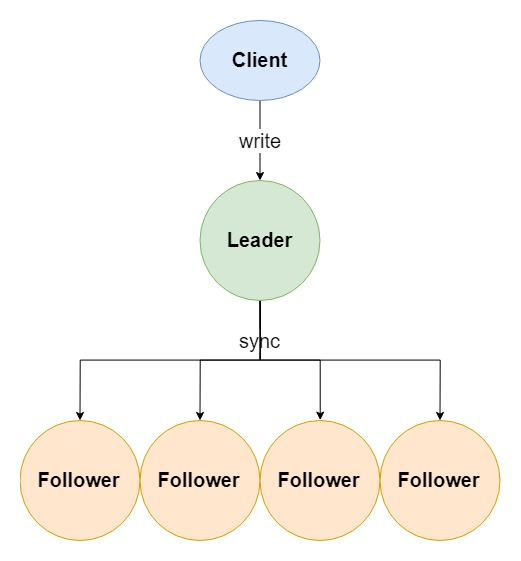
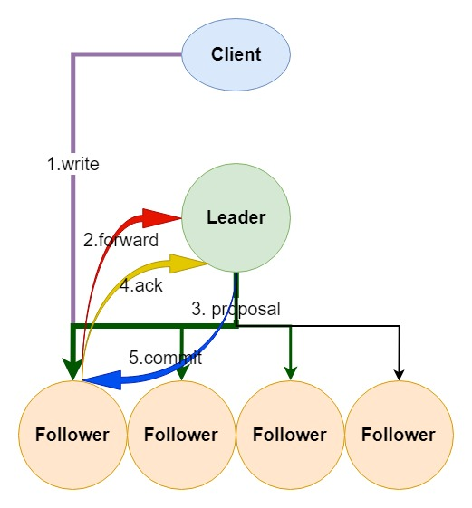

## 选举机制选举机制

### 投票机制说明：
- 第一轮投票全部投给自己
- 第二轮投票给myid比自己大的相邻节点，投票之前先判断自身的票数和其他节点的票数，如果得票超过半数，则选举结束，否则往下投票继续进行。

## 选举触发
当集群中的服务器出现已下两种情况时会进行Leader的选举
1.	服务节点初始化启动
> 当节点初始起动时会在集群中寻找Leader节点，如果找到则与Leader建立连接，其自身状态变化follower或observer。如果没有找到Leader，当前节点状态将变化LOOKING，进入选举流程。
2.	半数以上的节点无法和Leader建立连接
> 在集群运行其间如果有follower或observer节点宕机只要不超过半数并不会影响整个集群服务的正常运行。但如果leader宕机，将暂停对外服务，所有follower将进入LOOKING 状态，进入选举流程。

## 数据同步机制
zookeeper 的数据同步是为了保证各节点中数据的一至性，同步时涉及两个流程:
- 一个是正常的客户端数据提交
- 一个是集群某个节点宕机在恢复后的数据同步。

写入请求的大至流程是，收leader接收客户端写请求，并同步给各个子节点（如上图）。但实际情况要复杂的多，比如client 它并不知道哪个节点是leader 有可能写的请求会发给follower ，由follower在转发给leader进行同步处理（如下图）。

1.	client向zk中的server发送写请求到达follower，follower则会将该写请求转发给leader，leader将请求事务以proposal形式分发给follower；
2.	当follower收到收到leader的proposal时，根据接收的先后顺序处理proposal；
3.	当Leader收到follower针对某个proposal过半的ack后，则发起事务提交，重新发起一个commit的proposal
4.	Follower收到commit的proposal后，记录事务提交，并把数据更新到内存数据库；
5.	当写成功后，反馈给client。

## 服务节点初始化以及同步
在集群运行过程当中如果有一个follower节点宕机，由于宕机节点没过半，集群仍然能正常服务。当leader 收到新的客户端请求，此时无法同步给宕机的节点。造成数据不一至。为了解决这个问题，当节点启动时，第一件事情就是找当前的Leader，比对数据是否一至。不一至则开始同步,同步完成之后在进行对外提供服务。
如何比对Leader的数据版本呢，这里通过ZXID事务ID来确认。

- ZXID是一个长度64位的数字，其中低32位是按照数字递增，任何数据的变更都会导致,低32位的数字简单加1。高32位是leader周期编号，每当选举出一个新的leader时，新的leader就从本地事物日志中取出ZXID,然后解析出高32位的周期编号，进行加1，再将低32位的全部设置为0。这样就保证了每次新选举的leader后，保证了ZXID的唯一性而且是保证递增的。 

## 四字运维命令
ZooKeeper响应少量命令。每个命令由四个字母组成。可通过telnet或nc向ZooKeeper发出命令。
这些命令默认是关闭的，需要配置4lw.commands.whitelist来打开，可打开部分或全部示例如下：
#打开指定命令
4lw.commands.whitelist=stat, ruok, conf, isro
#打开全部
4lw.commands.whitelist=*

安装Netcat工具，已使用nc命令 
#安装Netcat 工具
yum install -y nc
#查看服务器及客户端连接状态
echo stat | nc localhost 2181
命令列表
1.	conf：3.3.0中的新增功能：打印有关服务配置的详细信息。
2.	缺点：3.3.0中的新增功能：列出了连接到该服务器的所有客户端的完整连接/会话详细信息。包括有关已接收/已发送的数据包数量，会话ID，操作等待时间，最后执行的操作等信息。
3.	crst：3.3.0中的新增功能：重置所有连接的连接/会话统计信息。
4.	dump：列出未完成的会话和临时节点。这仅适用于领导者。
5.	envi：打印有关服务环境的详细信息
6.	ruok：测试服务器是否以非错误状态运行。如果服务器正在运行，它将以imok响应。否则，它将完全不响应。响应“ imok”不一定表示服务器已加入仲裁，只是服务器进程处于活动状态并绑定到指定的客户端端口。使用“ stat”获取有关状态仲裁和客户端连接信息的详细信息。
7.	srst：重置服务器统计信息。
8.	srvr：3.3.0中的新功能：列出服务器的完整详细信息。
9.	stat：列出服务器和连接的客户端的简要详细信息。
10.	wchs：3.3.0中的新增功能：列出有关服务器监视的简要信息。
11.	wchc：3.3.0中的新增功能：按会话列出有关服务器监视的详细信息。这将输出具有相关监视（路径）的会话（连接）列表。请注意，根据手表的数量，此操作可能会很昂贵（即影响服务器性能），请小心使用。
12.	dirs：3.5.1中的新增功能：以字节为单位显示快照和日志文件的总大小
13.	wchp：3.3.0中的新增功能：按路径列出有关服务器监视的详细信息。这将输出具有关联会话的路径（znode）列表。请注意，根据手表的数量，此操作可能会很昂贵（即影响服务器性能），请小心使用。
14.	mntr：3.4.0中的新增功能：输出可用于监视集群运行状况的变量列表。

ZK
选举协议：ZAB，是选举过程和数据写入过程的基石。
ZAB的理解：所有事务请求是由一个全局唯一的服务器来协调处理，这个的服务器就是Leader服务器，
其它服务器都是Follower服务器或Observer服务器。Leader服务器负责将一个客户端的请求转换成那个一个事务Proposalͧ(提议)，将该Proposal分发给集群中所有的Follower服务器。然后Leader服务器需要等待所有Follower服务器的应答，当Leader服务器收到超过半数的Follower服务器进行了明确的应答后，Leader会再次向所有的Follower服务器分发Commit消息，要求其将前一个Proposal进行提交。

涉及到客户端对zk集群数据改变的行为都先由Leader统一响应，然后再把请求转换为事务转发给其他所有的Follower，Follower应答并处理事务，最后再反馈。如果客户端只是读请求，那么zk集群所有的节点都可以响应这个请求

ZAB协议三个阶段

1.发现(选举Leader过程)
2.同步(选出Leader后，Follower和Observer需进行数据同步)
3.广播(同步之后，集群对外工作响应请求，并进行消息广播，实现数据在集群节点的副本存储)

zk服务器角色

Leader
事务请求的唯一调度和处理者，保证集群事务处理的顺序序性
集群内部各服务器的调度者
Follower
处理客户端非事务请求，转发事务请求给Leader服务器
参与事务请求Proposal的投票
参与Leader的选举投票
Observer
处理客户端非事务请求，转发事务请求给Leader服务器
不参加任何形式的投票，包括选举和事务投票(超过半数确认)
Observer的存在是为了提高zk集群对外提供读性能的能力

zk服务器状态ServerState 类中定义ZK四种状态。
LOOKING
寻找Leader状态
当服务器处于这种状态时，表示当前没有Leader，需要进入选举流程
FOLLOWING
从机状态，表明当前服务器角色是Follower
OBSERVING
观察者状态，表明当前服务器角色是Observer
LEADING
领导者状态，表明当前服务器角色是Leader

集群机制：
zk集群的tcp连接顺序是1向2发起TCP连接，2向3发起TCP连接。

选举机制：

临时节点失效：可以设置timeout时期
