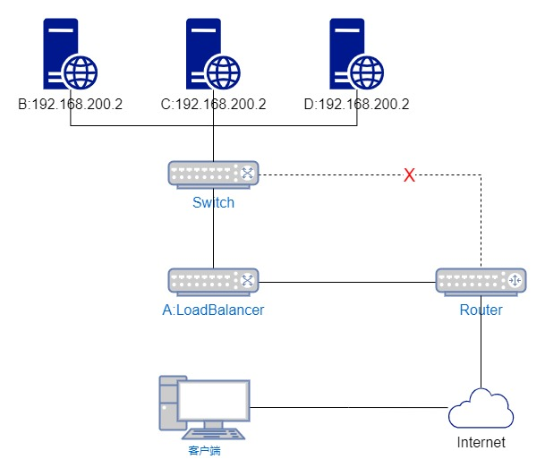
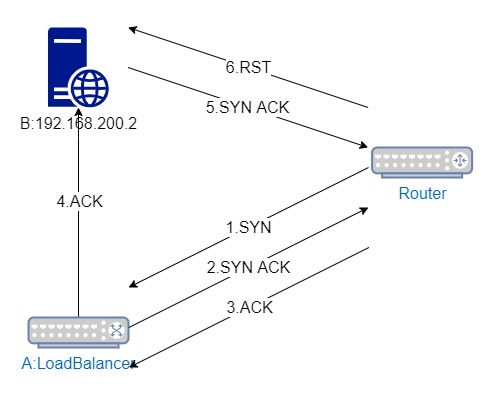
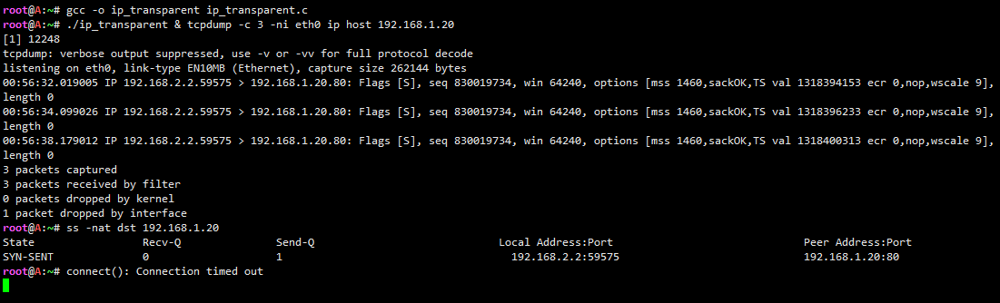
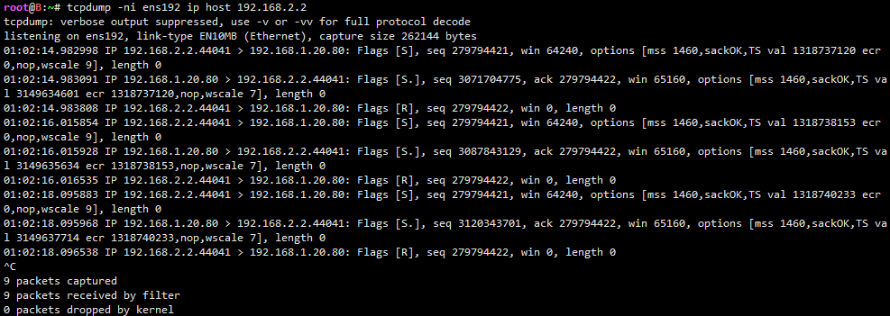
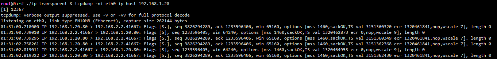
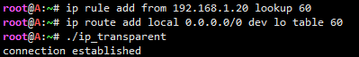
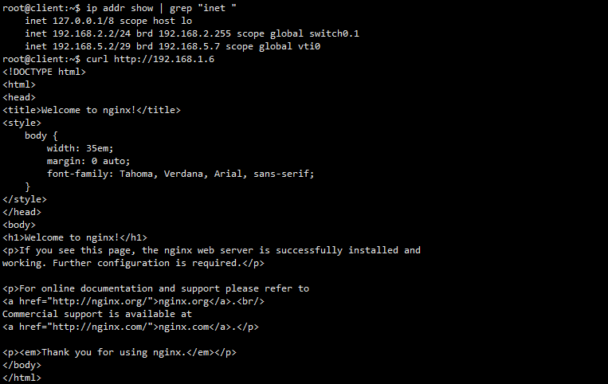
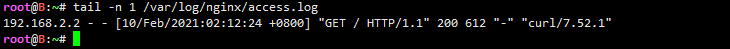
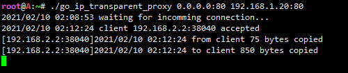

# IP透传 L4透明反向代理的实现传递客户端真实IP
这种需求，一般来说，会在应用层加个标记标明客户端的IP，例如说HTTP，就是添加个请求头的事情。但并不是所有服务器程序、协议你都能这样下手。所以能不能在不对协议和服务器程序本身做任何改动的情况下，传递客户端的IP呢？

最直接的方法应该就是，把L3的源IP改掉，没对协议进行任何改动，对上层完全透明。先来看看改了L3的source IP会出现什么问题：



上图中的A是个L4负载均衡，Router会把来自Internet的客户端请求转发给A，A再根据策略转发到B、C或D。

假设这时A选择了B，A把请求转发给B时，把L3的源IP改成了客户端的IP，那B收到数据包后，根据B系统上的路由表，回复的包会直接经switch交给router送出Internet，也就是说响应的内容不会经过A送回给客户端。听起来好像没什么问题，还省得A耗费资源转发响应内容，不过TCP需要三次握手，客户端跟A握手成功后，A还需要跟B握手：A这时以客户端的IP向B发出SYN，B收到的SYN后，响应一个目的地IP是客户端的SYN ACK，这个SYN ACK是直接由router送出Internet的，根本不会送到A，所以A跟B是无法成功握手的，那客户端的请求也自然无法送达B。



UDP虽然不用握手，但A转发到B用的UDP源端口不一定跟客户端到A的一样，所以客户端不一定能正常接收到B响应的UDP包。要解决这个问题，就要做到请求从哪转发过来的，响应就得送回哪去，既然是从A来的，就送回给A。

A虽然改了送往B的包的源IP，但即使B把响应送回A了，默认情况下，A收到数据包的目的地IP不是系统已绑定的IP时，也就是非送往本地的数据包，kernel只会选择转发或者丢弃，这种情况下，A跟B也是无法握手成功的，所以，这里还要解决的就是，让A对来自B的非本地数据包，当作本地数据包处理。

到这里，实现这个L4 IP透明代理要解决的问题就很清晰了：

- 反向代理服务器修改L3源IP
- 被代理服务器把响应转发回给反向代理服务器
- 反向代理服务器处理来自被代理服务器的非本地数据包

## 1. 修改L3源IP
Linux的kernel，有一个IP_TRANSPARENT的选项：
```text
       IP_TRANSPARENT (since Linux 2.6.24)
              Setting this boolean option enables transparent proxying
              on this socket.  This socket option allows the calling
              application to bind to a nonlocal IP address and operate
              both as a client and a server with the foreign address as
              the local endpoint.  NOTE: this requires that routing be
              set up in a way that packets going to the foreign address
              are routed through the TProxy box (i.e., the system
              hosting the application that employs the IP_TRANSPARENT
              socket option).  Enabling this socket option requires
              superuser privileges (the CAP_NET_ADMIN capability).

              TProxy redirection with the iptables TPROXY target also
              requires that this option be set on the redirected socket.
```
简单来说，这个选项允许应用程序的socket，绑定一个操作系统没有绑定的IP，并且以那个IP对外通讯。

所以，A的反向代理程序，通过这个选项让socket绑定客户端的IP，就能以客户端的IP与B进行通讯：

```text
#include <sys/socket.h>
#include <netinet/in.h>
#include <arpa/inet.h>
#include <memory.h>

static const int one = 1;

int main(int argc, char *argv[]) {
    int socket_fd = socket(AF_INET, SOCK_STREAM, 0);
    setsockopt(socket_fd, SOL_IP, IP_TRANSPARENT, &one, sizeof(one));

    // 以IP 192.168.2.2作为本地IP绑定socket，端口自动分配
    struct sockaddr_in bind_addr;
    bzero(&bind_addr, sizeof(bind_addr));
    bind_addr.sin_family = AF_INET;
    bind_addr.sin_port = htons(0);
    inet_pton(AF_INET, "192.168.2.2", &bind_addr.sin_addr);
    bind(socket_fd, (void *) &bind_addr, sizeof(bind_addr));

    // 连接到192.168.1.20:80
    struct sockaddr_in server_addr;
    bzero(&server_addr, sizeof(server_addr));
    server_addr.sin_family = AF_INET;
    server_addr.sin_port = htons(80);
    inet_pton(AF_INET, "192.168.1.20", &server_addr.sin_addr);
    if (connect(socket_fd, (void *) &server_addr, sizeof(server_addr)) < 0) {
        close(socket_fd);
        perror("connect()");
        return 1;
    }
    printf("connection established\n");
    close(socket_fd);

    return 0;
}
```
在A上编译运行上面的源码，抓包可以看到A在以192.168.2.2作为源IP向192.168.1.20:80发送SYN，ss或者netstat也可以看到程序的local IP是192.168.2.2，而A系统本身是没有绑定192.168.2.2的：



目前来说A还是无法与B成功握手的，抓包也只会抓到A一直在向B发送SYN，晚一点还会输出”connect(): Connection timed out”。

## 2. 让B把响应送回给A
在B上抓包，可以看到B会收到来自2.2的SYN，也会响应SYN ACK，但是会收到2.2的RST：



如何让B辨别来自A的包，并把响应送回A呢？

### 2.1 选择一：根据B的源IP和端口做策略路由
给B分配多个IP，例如默认用1.19出网，1.20专门给A访问用，可以用这种方法。如果只有一个IP，不建议用这种方法，因为这样B会把所有从被代理的端口发出的数据包都交给A，如果请求不是转发自A的，就无法正常处理。

```text
# 以192.168.1.20:80发出的数据包，使用路由表60的规则
root@B:~# ip rule add from 192.168.1.20 sport 80 lookup 60
# 默认转发给192.168.1.6，也就是A
root@B:~# ip route add default via 192.168.1.6 table 60
```
因为A向B发出的请求的目的IP是1.20，所以B发出响应的源IP一定是1.20。而不是对A的响应，B默认使用1.19，不会发送给A。

### 2.2 选择二：通过mark做策略路由
例如可以通过mac地址识别来自A的包，并且做个标记：
```text
# 查看A的mac地址
root@B:~# cat /proc/net/arp | grep "192.168.1.6"
192.168.1.6      0x1         0x2         52:54:00:91:33:33     *        ens192

# 把来自52:54:00:91:33:33的地址标记为60
root@B:~# iptables -t mangle -A INPUT -m mac --mac-source 52:54:00:91:33:33 -j MARK --set-mark 60
root@B:~# iptables -t mangle -A INPUT -j CONNMARK --save-mark
# 重新标记响应数据包
root@B:~# iptables -t mangle -A OUTPUT -j CONNMARK --restore-mark

# 根据mark做策略路由
root@B:~# ip rule add fwmark 60 lookup 60
root@B:~# ip route add default via 192.168.1.6 table 60
```

## 3. 让A处理非本地数据包
第二步的策略路由做好后，A上抓包，可以看到B的SYN ACK送回来了，但是A没有响应ACK：



因为A没有绑定192.168.2.2这个IP，前面提到过kernel是不会对非本地的数据包做出响应的。

哪些目的地IP作为要本地IP处理，是可以在路由表上指定的，可以把0.0.0.0/0，也就是任何IP都视为本地IP处理，当然不能加在默认路由表上，这样就无法对外通讯了，需要做策略路由。

```text
# 匹配来自B，且源端口是80的数据包
root@A:~# ip rule add from 192.168.1.20 sport 80 lookup 60
root@A:~# ip route add local 0.0.0.0/0 dev lo table 60
```

上面有一个路由规则：“local 0.0.0.0/0”，意思是任何IP都作为本地IP处理，注意规则是加在表60的，符合条件的数据包，才会应用这个表。

第三步的规则做好后，再次运行ip_transparent，就可以看到立刻输出“connection established”了：



## 4. IP透明反向代理
上面的ip_transparent只是测试A和B之间的握手，并不能作为客户端与B之间通讯的代理，这里用Go实现了一个比较简单的反向代理：

```text
package main

import (
	"fmt"
	"io"
	"log"
	"net"
	"os"
	"strconv"
	"syscall"
)

const network = "tcp"
const bufferSize = 4096

var destinationIP *[4]byte
var destinationPort int

func main() {
	parseDestination()
	listen, err := net.Listen(network, os.Args[1])
	if err != nil {
		log.Println(err)
		os.Exit(1)
	}
	log.Printf("waiting for incomming connection...")
	defer listen.Close()

	for {
		conn, err := listen.Accept()
		if err != nil {
			log.Println(err)
			continue
		}
		log.Printf("client %s accepted", conn.RemoteAddr().String())
		go clientHandler(conn, log.New(os.Stdout, "[" + conn.RemoteAddr().String() + "]", log.Ldate | log.Ltime))
	}
}

func clientHandler(client net.Conn, logger *log.Logger) {
	defer client.Close()
	server, err := createTransparentSocket(client, os.Args[2])
	if err != nil {
		logger.Println(err)
		return
	}
	defer server.Close()

	streamCopy := func(dst io.Writer, src io.Reader, direction string, logger *log.Logger) {
		n, _ := read2Write(dst, src)
		logger.Printf("%s %d bytes copied", direction, n)
		client.Close()
		server.Close()
	}

	go streamCopy(client, server, "to client", logger)
	streamCopy(server, client, "from client", logger)
}

func createTransparentSocket(client net.Conn, destination string) (net.Conn, error) {
	var socketFD int
	var file *os.File
	var server net.Conn
	var errorPrefix string
	var clientIP *net.TCPAddr
	var clientIPBytes [4]byte
	var err error
	var ok bool

	// Create transparent socket
	if socketFD, err = syscall.Socket(syscall.AF_INET, syscall.SOCK_STREAM, syscall.IPPROTO_TCP); err != nil {
		errorPrefix = "syscall.socket()"
		goto ReturnError
	}
	if err = syscall.SetsockoptInt(socketFD, syscall.SOL_IP, syscall.IP_TRANSPARENT, 1); err != nil {
		errorPrefix = "syscall.SetsockoptInt()"
		goto CloseSocket
	}

	if clientIP, ok = client.RemoteAddr().(*net.TCPAddr); ok == false {
		err = fmt.Errorf("unsupport client type")
		errorPrefix = "client.RemoteAddr().(*net.IPAddr)"
		goto CloseSocket
	}
	copy(clientIPBytes[:], clientIP.IP.To4())

	// Use client's IP address as socket local address
	if err = syscall.Bind(socketFD, &syscall.SockaddrInet4{
		Port: 0, // Port auto assignment
		Addr: clientIPBytes,
	}); err != nil {
		errorPrefix = "syscall.Bind()"
		goto CloseSocket
	}

	// Connect to server
	if err = syscall.Connect(socketFD, &syscall.SockaddrInet4{
		Port: destinationPort,
		Addr: *destinationIP,
	}); err != nil && err.Error() != "operation now in progress" {
		errorPrefix = "syscall.Connect()"
		goto CloseSocket
	}

	file = os.NewFile(uintptr(socketFD), destination)
	server, err = net.FileConn(file)
	if err == nil {
		syscall.Close(socketFD) // net.FileConn() has already duplicated this file descriptor
		return server, nil
	}
	errorPrefix = "net.FileConn()"
CloseSocket:
	syscall.Close(socketFD)
ReturnError:
	return nil, fmt.Errorf("%s: %s", errorPrefix, err)
}

func parseDestination() {
	var err error
	var host, port string
	if host, port, err = net.SplitHostPort(os.Args[2]); err != nil {
		println(err)
		os.Exit(1)
	}
	ip := net.ParseIP(host).To4()
	destinationIP = &[4]byte{ip[0], ip[1], ip[2], ip[3]}
	destinationPort, err = strconv.Atoi(port)
	if err != nil {
		println(err)
		os.Exit(1)
	}
}

/**
from: https://github.com/xtaci/kcptun/blob/master/generic/copy.go
*/
func read2Write(dst io.Writer, src io.Reader) (written int64, err error) {
	// If the reader has a WriteTo method, use it to do the copy.
	// Avoids an allocation and a copy.
	if wt, ok := src.(io.WriterTo); ok {
		return wt.WriteTo(dst)
	}
	// Similarly, if the writer has a ReadFrom method, use it to do the copy.
	if rt, ok := dst.(io.ReaderFrom); ok {
		return rt.ReadFrom(src)
	}

	// fallback to standard io.CopyBuffer
	buf := make([]byte, bufferSize)
	return io.CopyBuffer(dst, src, buf)
}
```
上面核心的部分是函数func createTransparentSocket(client net.Conn, destination string) (net.Conn, error)，简单来说，就是获取客户端的IP，然后通过bind()绑定为socket的本地IP，再向B发出构建连接的请求。

通过第一个运行参数指定本地监听的IP和端口，第二个运行参数指定被代理服务器的IP和端口：

```text
root@A:~# ./go_ip_transparent_proxy 0.0.0.0:80 192.168.1.20:80
2021/02/10 02:08:53 waiting for incomming connection...
```

从client向A发出请求：



B上查看Nginx的访问日志，可以看到记录的IP是client的：



A上的反向代理程序的输出：



这个程序只实现了IPv4 TCP的IP透明反向代理，UDP以及IPv6的实现也同理。

除了反向代理，其实正向代理也是可以通过IP_TRANSPARENT实现，配合iptables的TPROXY模块即可发挥作用，本文的目的只是反向代理，正向代理具体细节就不在本文介绍了。

## 参考
https://www.jianshu.com/p/0a975a997063
https://zhensheng.im/2021/02/10/layer4-reverse-transport-proxy-implement.meow
https://blog.csdn.net/dog250/article/details/7518054/


