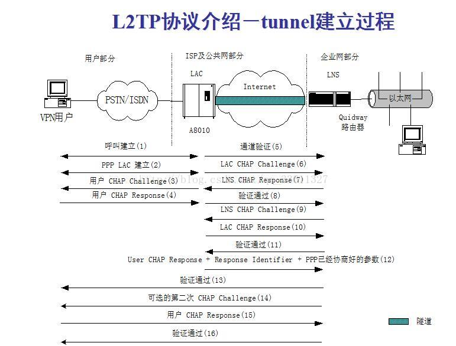

# 网络安全

## 隧道技术（Tunneling）
隧道技术的基本过程是在源局域网与公网的接口处将数据(可以是ISO 七层模型中的数据链路层或网络层数据)作为负载封装在一种可以在公网上传输的数据格式中，在目的局域网与公网的接口处将数据解封装，取出负载。被封装的数据包在互联网上传递时所经过的逻辑路径被称为“隧道”（Tunnel）。

要使数据顺利地被封装、传送及解封装，通信协议是保证的核心。目前VPN隧道协议主要有4种：点到点隧道协议PPTP、第二层隧道协议L2TP、网络层隧道协议IPSec以及SOCKS v5协议。其中，PPTP和L2TP工作在数据链路层，IPSec工作在网络层，SOCK v5工作在会话层。各协议工作在不同层次，我们应该注意，不同的网络环境适合不同的协议，在选择VPN产品时，应该注意选择。IPSec协议是一个范围广泛、开放的VPN安全协议，工作在OSI模型中的第三层——网络层。IPSec协议实际上是一套协议而不是一个单个的协议。

### PPTP(Point to Point Tunneling Protocol)

### L2TP(Layer 2 Tunneling Protocol)
L2TP是一种工业标准的Internet隧道协议，功能大致和PPTP协议类似，比如同样可以对网络数据流进行加密。不过也有不同之处，比如PPTP要求网络为IP网络，L2TP要求面向数据包的点对点连接；PPTP使用单一隧道，L2TP使用多隧道；L2TP提供包头压缩、隧道验证，而PPTP不支持。

L2TP中存在两种消息：控制消息和数据消息。控制消息用于隧道和会话连接的建立、维护以及传输控制；数据消息则用于封装PPP帧并在隧道上传输。控制消息的传输 是可靠传输，并且支持对控制消息的流量控制和拥塞控制；而数据消息的传输是不可靠传输，若数据报文丢失，不予重传，不支持对数据消息的流量控制和拥塞控制。
控制消息和数据消息共享相同的报文头。L2TP报文头中包含隧道标识符（Tunnel ID）和会话标识符（Session ID）信息，用来标识不同的隧道和会话。隧道标识相同、会话标识不同的报文将被复用在一个隧道上，报文头中的隧道标识符与会话标识符由对端分配。
    

