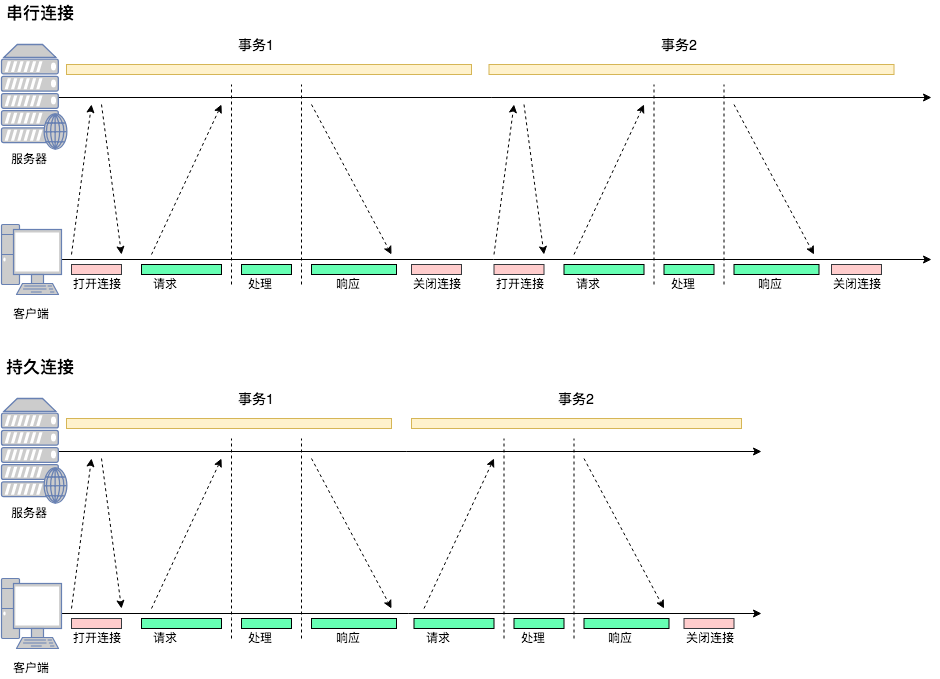
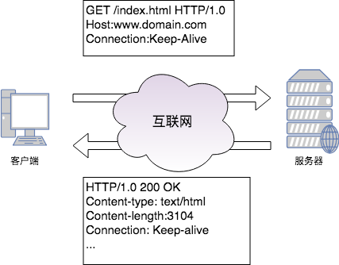

## 背景
HTTP协议是无状态的协议，即每一次请求都是互相独立的。因此它的最初实现是，每一个http请求都会打开一个tcp socket连接，当交互完毕后会关闭这个连接。

HTTP协议是全双工的协议，所以建立连接与断开连接是要经过三次握手与四次挥手的。显然在这种设计中，每次发送Http请求都会消耗很多的额外资源，即连接的建立与销毁。

于是，HTTP协议的也进行了发展，通过持久连接的方法来进行socket连接复用。

从图中可以看到：

在串行连接中，每次交互都要打开关闭连接
在持久连接中，第一次交互会打开连接，交互结束后连接并不关闭，下次交互就省去了建立连接的过程。
持久连接的实现有两种：HTTP/1.0+的keep-alive与HTTP/1.1的持久连接。

## HTTP/1.0+的Keep-Alive

从1996年开始，很多HTTP/1.0浏览器与服务器都对协议进行了扩展，那就是“keep-alive”扩展协议。

注意，这个扩展协议是作为1.0的补充的“实验型持久连接”出现的。keep-alive已经不再使用了，最新的HTTP/1.1规范中也没有对它进行说明，只是很多应用延续了下来。

使用HTTP/1.0的客户端在首部中加上"Connection:Keep-Alive"，请求服务端将一条连接保持在打开状态。服务端如果愿意将这条连接保持在打开状态，就会在响应中包含同样的首部。如果响应中没有包含"Connection:Keep-Alive"首部，则客户端会认为服务端不支持keep-alive，会在发送完响应报文之后关闭掉当前连接。

通过keep-alive补充协议，客户端与服务器之间完成了持久连接，然而仍然存在着一些问题：

- 在HTTP/1.0中keep-alive不是标准协议，客户端必须发送Connection:Keep-Alive来激活keep-alive连接。

- 代理服务器可能无法支持keep-alive，因为一些代理是"盲中继"，无法理解首部的含义，只是将首部逐跳转发。所以可能造成客户端与服务端都保持了连接，但是代理不接受该连接上的数据。

## HTTP/1.1的持久连接

HTTP/1.1采取持久连接的方式替代了Keep-Alive。

HTTP/1.1的连接默认情况下都是持久连接。如果要显式关闭，需要在报文中加上Connection:Close首部。即在HTTP/1.1中，所有的连接都进行了复用。

然而如同Keep-Alive一样，空闲的持久连接也可以随时被客户端与服务端关闭。不发送Connection:Close不意味着服务器承诺连接永远保持打开。

## [HTTPClient中的持久连接](../httpclient/http-connect-polling.md)
