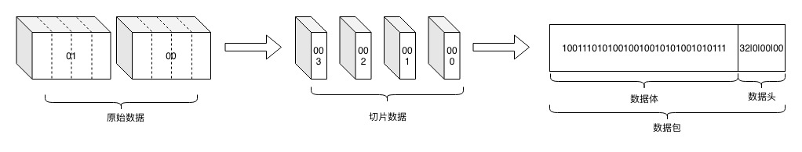

# UDP自定义私有协议栈

## 协议设计示意图

## Message
名称|类型|长度|描述
-|-|-|-
header|Header|定长|对于请求，作为请求消息头；对于响应消息，作为响应消息头。
body|Body|变长|对于请求，作为请求体，可用作请求参数；对于响应，作为响应体，可用作返回值。

## Header
名称|类型|长度(bit)|描述
-|-|-|-
CRCCode|int|32|1：0-15，固定值；2：16-23，主版本号；3：24~31，次版本号
session|long|64|id
type|Byte|8|0：业务请求；1：业务响应；2：心跳请求；3：心跳响应；
index|int|32|1:0-15位,数据块顺序，从1开始，为0标记无序;16-31数据块总数，从1开始，为0标记无限大
index|int|32|1:0-15位,数据片顺序，从1开始，为0标记无序;16-31数据片顺序，从1开始，为0标记无限大
length|int|32|消息体长度，最大不超过[548字节~1472字节](protocol.md)减去消息头的长度

计算该协议的最大负载：

## Body
名称|类型|长度(bit)|描述
-|-|-|-
data|byte[]|变长|数据体

## 协议设计原则
- 灵活的扩展性
- 有效载荷

## 和TCP协议差异
区别|TCP|UDP
-|-|-
协议设计目的|安全、垄断|避免传输层二次分包减少丢包几率
协议头长度|可变长|应固定，防止协议头容量超出范围
心跳|需要，防止空闲状态端口老化，物理断线等情况|不需要，本身面向无连接，可以根据超时机制做出识别

## 协议编解码
### JDK自带序列化
使用ObjectOutputStream和ObjectInputStream结合ByteArrayOutputStream和ByteArrayInputStream进行读写操作;
- 无法跨语言操作
- 码流大
- 效率低

### Google Protobuf

### Facebook Thrift

### JBoss Marshalling
