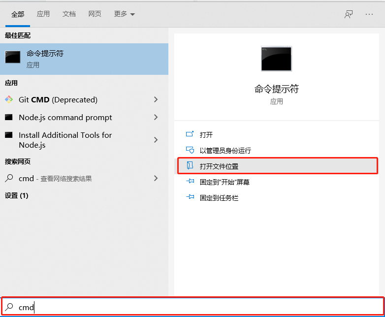
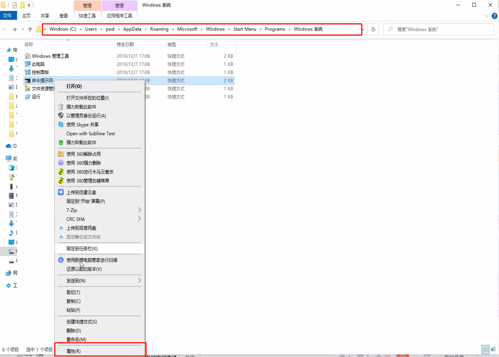
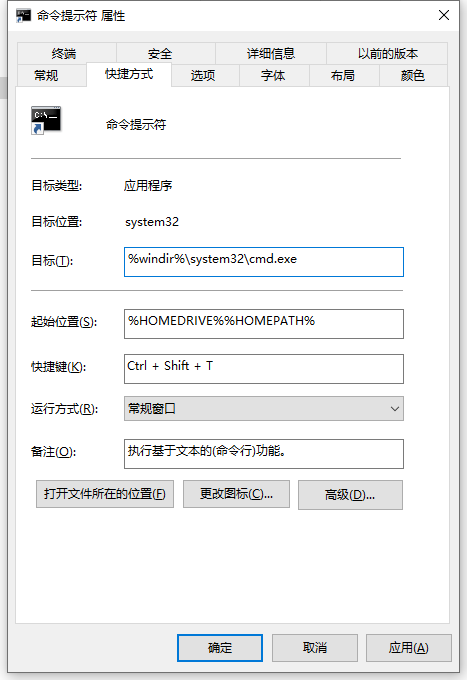
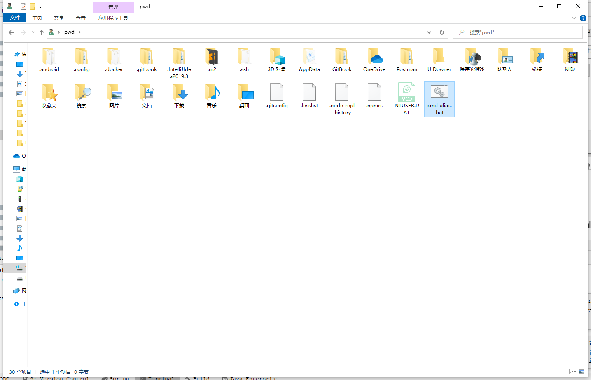
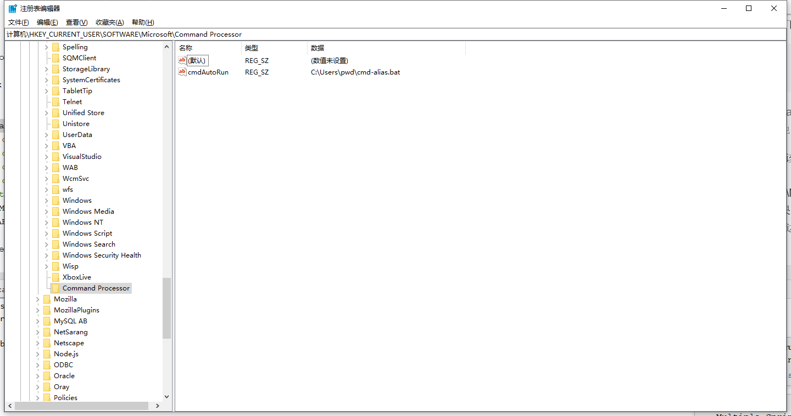
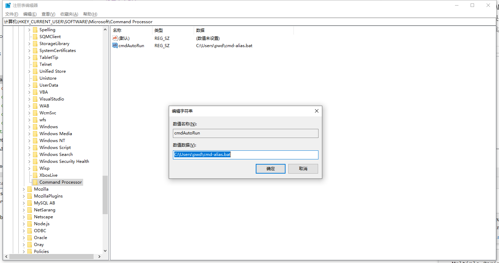

# Windows 类linux设置
## 快捷键打开Terminal
1. 点击win键，弹出如下图

底部输入cmd,点击打开文件位置，如下图

右键命令提示符，点击属性，如下图

设置自己习惯的快捷键

## 设置命令别名
在用户根目录下设置cmd-alias.bat,如下图

文本编辑cmd-alias.bat文件，保存如下内容
```text
@echo off
doskey ll=dir /b $*
```
> 说明：
  doskey相当于Linux中的alias，等号左边是右边的别名；
  $*表示这个命令还可能有其他参数；

修改注册表，使cmd启动时自动执行该bat文件
win+r，键入 regedit，进入地址：
计算机\HKEY_CURRENT_USER\Software\Microsoft\Command Processor
Command Processor 如果没有，则在上级目录上右键，新建项
Command Processor 右边空白处右键新建->字符串值,输入名称。

右键，点击修改

数值数为cmd-alias.bat全路径

重启cmd即可

## windows vim
https://github.com/vim/vim-win32-installer/releases/tag/v8.2.3358

安装后添加环境变量


 