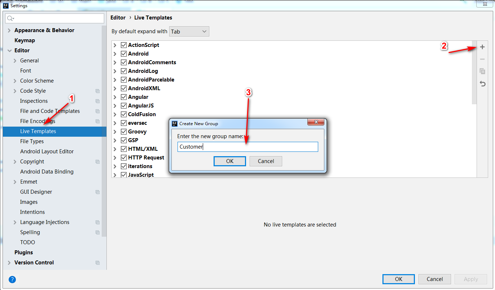
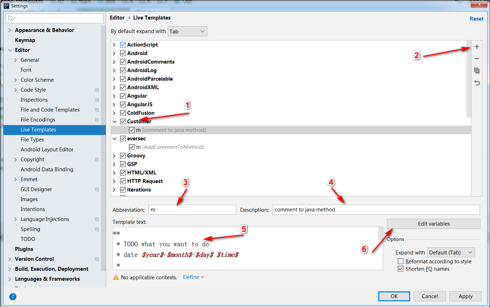

# JavaStandard

## 类头注释

```
/**
 * ${PACKAGE_NAME}@${PROJECT_NAME}
 *
 * <h1>TODO what you want to do?</h1>
 *
 * date ${YEAR}-${MONTH}-${DAY} ${TIME}
 *
 * @author DingPengwei[www.dingpengwei@foxmail.com]
 * @since DistributionVersion
 * @version 1.0.0
 */
```

## 方法注释

注释内容

```
**
 * <h2>TODO what you want to do</h2>
 * date $year$-$month$-$day$ $time$   
 *
$params$
$return$
 * @author DingPengwei[www.dingpengwei@foxmail.com]
 * @since DistributionVersion
 */
```

参数脚本

```
groovyScript("if(\"${_1}\".length() == 2) {return '';} else {def result=''; def params=\"${_1}\".replaceAll('[\\\\[|\\\\]|\\\\s]', '').split(',').toList();for(i = 0; i < params.size(); i++) {if(i<(params.size()-1)){result+=' * @param ' + params[i] + ' ' + '\\n'}else{result+=' * @param ' + params[i] + ' '}}; return result;}", methodParameters());
```

返回值脚本

```
groovyScript("def returnType = \"${_1}\"; def result = ' * @return ' + returnType; return result;", methodReturnType());
```

操作过程  
  
  


## CodeStyle

[Google规范仓库](https://github.com/google/styleguide)  
导入即可


## 我的快捷键设置

* DefaultForXWin
* MacOSX10.5+


其他

[http://developer.51cto.com/art/201906/597685.htm](http://developer.51cto.com/art/201906/597685.htm)

