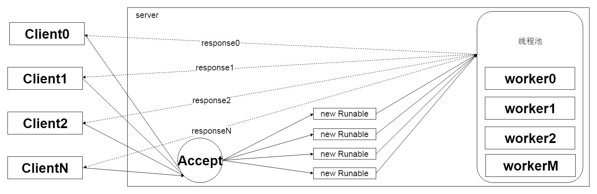

# IO

* ## Linux中的IO基本流程

## 

* ## 同步阻塞IO\(BIO\)

### BIO通讯模型图  该模型的通讯过程：

* #### 服务端有独立的accept线程负责监听客户端的链接；
* #### Accept线程接收到客户端的链接后开启新的工作线程进行链接处理；
* #### 新的工作线程处理完毕后并响应给客户端，然后线程销毁；

### 该模型下的问题：

* #### 服务端的工作线程数和客户端的连接数1:1；
* #### 当访问量增大，工作线程膨胀，系统内存飙升；
* #### 线程大量的销毁和重建，系统性能急剧下降；
* #### 最终导致进程僵死或系统宕机；
* ## 伪异步IO\(BIO\)

### BIO通讯模型图  该模型的改良之处：

* #### 采用了线程池，不在反复的创建销毁线程；
* #### 一定层度上提升了吞吐量和系统效率；

### BIO的同步和阻塞

#### java.io.InputStream中的read方法以及重载都会block。

```
/**
 * Reads the next byte of data from the input stream. The value byte is
 * returned as an <code>int</code> in the range <code>0</code> to
 * <code>255</code>. If no byte is available because the end of the stream
 * has been reached, the value <code>-1</code> is returned. This method
 * blocks until input data is available, the end of the stream is detected,
 * or an exception is thrown.
 *
 * <p> A subclass must provide an implementation of this method.
 *
 * @return     the next byte of data, or <code>-1</code> if the end of the
 *             stream is reached.
 * @exception  IOException  if an I/O error occurs.
 */
public abstract int read() throws IOException;
```

#### 对于read，除非遇到如下三种情况，其余情况都会阻塞：

* #### 有数据可读
* #### 且可读数据读取完毕
* #### 发生异常

#### 对于write，同样是写入到输出流完毕，或者发生异常之前被阻塞。

#### 这说明当写入一方缓慢将会导致读取的一方将会被阻塞,当读取一方缓慢也会导致写入的阻塞，而网络传输缓慢也是导致双方共同缓慢的原因。在网络抖动时候，TCP中的信令通道将会调整window size，直到为0，此时双方将会处于Keep-Alive状态，发送方不能再向TCP缓冲区写入，写入操作将会无限期阻塞，直到TCPwindow size大于0或者发生异常。 BIO中阻塞的具体含义就是消息（线程）读取或者写入的阻塞，阻塞期间其他消息（线程）将会在队列缓冲区中排队。这个排队指的就是BIO中的同步的具体含义。由于在具体场景中单个消息（线程）操作的阻塞，导致在全局中出现多个消息（线程）同步的现象。

#### BIO模型简单，编程复杂度低，适用于低并发,低负载的应用程序。

## 同步非阻塞IO\(NIO\)

### NIO通讯模型图 !\[NIO通讯模型图\]\(images/xxx.png,'待补充'\)

### NIO关键概念

* Buffer
* Channel
* Selector

## 异步非阻塞IO


