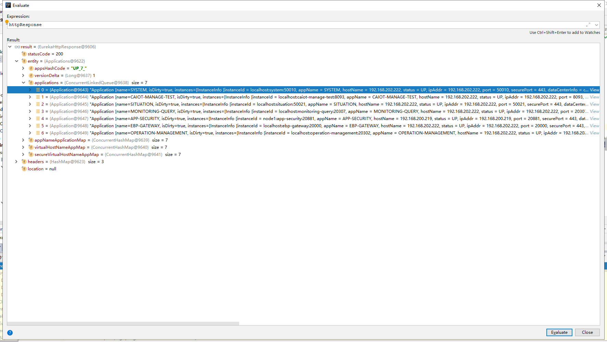

## 客户端分析
根据Eureka的应用介绍，其应该为一个CS结构的应用，那么客户端和服务端则存在通讯，使用抓包工具抓取数据为


### com.netflix.discovery.shared.transport.EurekaHttpClient
```java
package com.netflix.discovery.shared.transport;

import com.netflix.appinfo.InstanceInfo;
import com.netflix.appinfo.InstanceInfo.InstanceStatus;
import com.netflix.discovery.shared.Application;
import com.netflix.discovery.shared.Applications;

/**
 * Low level Eureka HTTP client API.
 *
 * @author Tomasz Bak
 */
public interface EurekaHttpClient {

    EurekaHttpResponse<Void> register(InstanceInfo info);

    EurekaHttpResponse<Void> cancel(String appName, String id);

    EurekaHttpResponse<InstanceInfo> sendHeartBeat(String appName, String id, InstanceInfo info, InstanceStatus overriddenStatus);

    EurekaHttpResponse<Void> statusUpdate(String appName, String id, InstanceStatus newStatus, InstanceInfo info);

    EurekaHttpResponse<Void> deleteStatusOverride(String appName, String id, InstanceInfo info);

    EurekaHttpResponse<Applications> getApplications(String... regions);

    EurekaHttpResponse<Applications> getDelta(String... regions);

    EurekaHttpResponse<Applications> getVip(String vipAddress, String... regions);

    EurekaHttpResponse<Applications> getSecureVip(String secureVipAddress, String... regions);

    EurekaHttpResponse<Application> getApplication(String appName);

    EurekaHttpResponse<InstanceInfo> getInstance(String appName, String id);

    EurekaHttpResponse<InstanceInfo> getInstance(String id);

    void shutdown();
}
```
其实现类如下图


运行时主要使用到了com.netflix.discovery.shared.transport.jersey.AbstractJerseyEurekaHttpClient

### com.netflix.discovery.shared.transport.jersey.AbstractJerseyEurekaHttpClient

#### register

```java
package com.netflix.discovery.shared.transport.jersey;
/**
 * @author Tomasz Bak
 */
public abstract class AbstractJerseyEurekaHttpClient implements EurekaHttpClient {
     @Override
     public EurekaHttpResponse<Void> register(InstanceInfo info) {
         String urlPath = "apps/" + info.getAppName();
         ClientResponse response = null;
         try {
             Builder resourceBuilder = jerseyClient.resource(serviceUrl).path(urlPath).getRequestBuilder();
             addExtraHeaders(resourceBuilder);
             response = resourceBuilder
                     .header("Accept-Encoding", "gzip")
                     .type(MediaType.APPLICATION_JSON_TYPE)
                     .accept(MediaType.APPLICATION_JSON)
                     .post(ClientResponse.class, info);
             return anEurekaHttpResponse(response.getStatus()).headers(headersOf(response)).build();
         } finally {
             if (logger.isDebugEnabled()) {
                 logger.debug("Jersey HTTP POST {}/{} with instance {}; statusCode={}", serviceUrl, urlPath, info.getId(),
                         response == null ? "N/A" : response.getStatus());
             }
             if (response != null) {
                 response.close();
             }
         }
     } 
}
```
#### cancel
```java
package com.netflix.discovery.shared.transport.jersey;
/**
 * @author Tomasz Bak
 */
public abstract class AbstractJerseyEurekaHttpClient implements EurekaHttpClient {
      @Override
      public EurekaHttpResponse<Void> cancel(String appName, String id) {
          String urlPath = "apps/" + appName + '/' + id;
          ClientResponse response = null;
          try {
              Builder resourceBuilder = jerseyClient.resource(serviceUrl).path(urlPath).getRequestBuilder();
              addExtraHeaders(resourceBuilder);
              response = resourceBuilder.delete(ClientResponse.class);
              return anEurekaHttpResponse(response.getStatus()).headers(headersOf(response)).build();
          } finally {
              if (logger.isDebugEnabled()) {
                  logger.debug("Jersey HTTP DELETE {}/{}; statusCode={}", serviceUrl, urlPath, response == null ? "N/A" : response.getStatus());
              }
              if (response != null) {
                  response.close();
              }
          }
      }
}
```

#### sendHeartBeat
```java
package com.netflix.discovery.shared.transport.jersey;
/**
 * @author Tomasz Bak
 */
public abstract class AbstractJerseyEurekaHttpClient implements EurekaHttpClient {
      @Override
      public EurekaHttpResponse<InstanceInfo> sendHeartBeat(String appName, String id, InstanceInfo info, InstanceStatus overriddenStatus) {
          String urlPath = "apps/" + appName + '/' + id;
          ClientResponse response = null;
          try {
              WebResource webResource = jerseyClient.resource(serviceUrl)
                      .path(urlPath)
                      .queryParam("status", info.getStatus().toString())
                      .queryParam("lastDirtyTimestamp", info.getLastDirtyTimestamp().toString());
              if (overriddenStatus != null) {
                  webResource = webResource.queryParam("overriddenstatus", overriddenStatus.name());
              }
              Builder requestBuilder = webResource.getRequestBuilder();
              addExtraHeaders(requestBuilder);
              response = requestBuilder.put(ClientResponse.class);
              EurekaHttpResponseBuilder<InstanceInfo> eurekaResponseBuilder = anEurekaHttpResponse(response.getStatus(), InstanceInfo.class).headers(headersOf(response));
              if (response.hasEntity()) {
                  eurekaResponseBuilder.entity(response.getEntity(InstanceInfo.class));
              }
              return eurekaResponseBuilder.build();
          } finally {
              if (logger.isDebugEnabled()) {
                  logger.debug("Jersey HTTP PUT {}/{}; statusCode={}", serviceUrl, urlPath, response == null ? "N/A" : response.getStatus());
              }
              if (response != null) {
                  response.close();
              }
          }
      }
}
```
#### statusUpdate
```java
package com.netflix.discovery.shared.transport.jersey;
/**
 * @author Tomasz Bak
 */
public abstract class AbstractJerseyEurekaHttpClient implements EurekaHttpClient {
      @Override
      public EurekaHttpResponse<Void> statusUpdate(String appName, String id, InstanceStatus newStatus, InstanceInfo info) {
          String urlPath = "apps/" + appName + '/' + id + "/status";
          ClientResponse response = null;
          try {
              Builder requestBuilder = jerseyClient.resource(serviceUrl)
                      .path(urlPath)
                      .queryParam("value", newStatus.name())
                      .queryParam("lastDirtyTimestamp", info.getLastDirtyTimestamp().toString())
                      .getRequestBuilder();
              addExtraHeaders(requestBuilder);
              response = requestBuilder.put(ClientResponse.class);
              return anEurekaHttpResponse(response.getStatus()).headers(headersOf(response)).build();
          } finally {
              if (logger.isDebugEnabled()) {
                  logger.debug("Jersey HTTP PUT {}/{}; statusCode={}", serviceUrl, urlPath, response == null ? "N/A" : response.getStatus());
              }
              if (response != null) {
                  response.close();
              }
          }
      }
}
```
#### deleteStatusOverride
```java
package com.netflix.discovery.shared.transport.jersey;
/**
 * @author Tomasz Bak
 */
public abstract class AbstractJerseyEurekaHttpClient implements EurekaHttpClient {
      @Override
      public EurekaHttpResponse<Void> deleteStatusOverride(String appName, String id, InstanceInfo info) {
          String urlPath = "apps/" + appName + '/' + id + "/status";
          ClientResponse response = null;
          try {
              Builder requestBuilder = jerseyClient.resource(serviceUrl)
                      .path(urlPath)
                      .queryParam("lastDirtyTimestamp", info.getLastDirtyTimestamp().toString())
                      .getRequestBuilder();
              addExtraHeaders(requestBuilder);
              response = requestBuilder.delete(ClientResponse.class);
              return anEurekaHttpResponse(response.getStatus()).headers(headersOf(response)).build();
          } finally {
              if (logger.isDebugEnabled()) {
                  logger.debug("Jersey HTTP DELETE {}/{}; statusCode={}", serviceUrl, urlPath, response == null ? "N/A" : response.getStatus());
              }
              if (response != null) {
                  response.close();
              }
          }
      }
}
```
#### getApplications getDelta getVip getSecureVip
```java
package com.netflix.discovery.shared.transport.jersey;
/**
 * @author Tomasz Bak
 */
public abstract class AbstractJerseyEurekaHttpClient implements EurekaHttpClient {
      @Override
      public EurekaHttpResponse<Applications> getApplications(String... regions) {
          return getApplicationsInternal("apps/", regions);
      }
  
      @Override
      public EurekaHttpResponse<Applications> getDelta(String... regions) {
          return getApplicationsInternal("apps/delta", regions);
      }
  
      @Override
      public EurekaHttpResponse<Applications> getVip(String vipAddress, String... regions) {
          return getApplicationsInternal("vips/" + vipAddress, regions);
      }
  
      @Override
      public EurekaHttpResponse<Applications> getSecureVip(String secureVipAddress, String... regions) {
          return getApplicationsInternal("svips/" + secureVipAddress, regions);
      }
      
      private EurekaHttpResponse<Applications> getApplicationsInternal(String urlPath, String[] regions) {
        ClientResponse response = null;
        String regionsParamValue = null;
        try {
            WebResource webResource = jerseyClient.resource(serviceUrl).path(urlPath);
            if (regions != null && regions.length > 0) {
                regionsParamValue = StringUtil.join(regions);
                webResource = webResource.queryParam("regions", regionsParamValue);
            }
            Builder requestBuilder = webResource.getRequestBuilder();
            addExtraHeaders(requestBuilder);
            response = requestBuilder.accept(MediaType.APPLICATION_JSON_TYPE).get(ClientResponse.class);

            Applications applications = null;
            if (response.getStatus() == Status.OK.getStatusCode() && response.hasEntity()) {
                applications = response.getEntity(Applications.class);
            }
            return anEurekaHttpResponse(response.getStatus(), Applications.class)
                    .headers(headersOf(response))
                    .entity(applications)
                    .build();
        } finally {
            if (logger.isDebugEnabled()) {
                logger.debug("Jersey HTTP GET {}/{}?{}; statusCode={}",
                        serviceUrl, urlPath,
                        regionsParamValue == null ? "" : "regions=" + regionsParamValue,
                        response == null ? "N/A" : response.getStatus()
                );
            }
            if (response != null) {
                response.close();
            }
        }
    }      
}
```
#### getApplication

```java
package com.netflix.discovery.shared.transport.jersey;
/**
 * @author Tomasz Bak
 */
public abstract class AbstractJerseyEurekaHttpClient implements EurekaHttpClient {
      @Override
      public EurekaHttpResponse<Application> getApplication(String appName) {
          String urlPath = "apps/" + appName;
          ClientResponse response = null;
          try {
              Builder requestBuilder = jerseyClient.resource(serviceUrl).path(urlPath).getRequestBuilder();
              addExtraHeaders(requestBuilder);
              response = requestBuilder.accept(MediaType.APPLICATION_JSON_TYPE).get(ClientResponse.class);
  
              Application application = null;
              if (response.getStatus() == Status.OK.getStatusCode() && response.hasEntity()) {
                  application = response.getEntity(Application.class);
              }
              return anEurekaHttpResponse(response.getStatus(), Application.class)
                      .headers(headersOf(response))
                      .entity(application)
                      .build();
          } finally {
              if (logger.isDebugEnabled()) {
                  logger.debug("Jersey HTTP GET {}/{}; statusCode={}", serviceUrl, urlPath, response == null ? "N/A" : response.getStatus());
              }
              if (response != null) {
                  response.close();
              }
          }
      }
}
```

####  getInstance
```java
package com.netflix.discovery.shared.transport.jersey;
/**
 * @author Tomasz Bak
 */
public abstract class AbstractJerseyEurekaHttpClient implements EurekaHttpClient {
      @Override
      public EurekaHttpResponse<InstanceInfo> getInstance(String id) {
          return getInstanceInternal("instances/" + id);
      }
  
      @Override
      public EurekaHttpResponse<InstanceInfo> getInstance(String appName, String id) {
          return getInstanceInternal("apps/" + appName + '/' + id);
      }
      
      private EurekaHttpResponse<InstanceInfo> getInstanceInternal(String urlPath) {
        ClientResponse response = null;
        try {
            Builder requestBuilder = jerseyClient.resource(serviceUrl).path(urlPath).getRequestBuilder();
            addExtraHeaders(requestBuilder);
            response = requestBuilder.accept(MediaType.APPLICATION_JSON_TYPE).get(ClientResponse.class);

            InstanceInfo infoFromPeer = null;
            if (response.getStatus() == Status.OK.getStatusCode() && response.hasEntity()) {
                infoFromPeer = response.getEntity(InstanceInfo.class);
            }
            return anEurekaHttpResponse(response.getStatus(), InstanceInfo.class)
                    .headers(headersOf(response))
                    .entity(infoFromPeer)
                    .build();
        } finally {
            if (logger.isDebugEnabled()) {
                logger.debug("Jersey HTTP GET {}/{}; statusCode={}", serviceUrl, urlPath, response == null ? "N/A" : response.getStatus());
            }
            if (response != null) {
                response.close();
            }
        }
    }      
}
```

执行顺序为
- getApplications
- register
- getDelta
- sendHeartBeat
- getDelta
- sendHeartBeat
- ...

在AbstractJerseyEurekaHttpClient中以上方法返回的数据为压缩后的数据在entity中存储。在上层用可以看到返回数据结构如下图




Applications接口定义在com.netflix.discovery.shared.Applications中。

org.apache.http.impl.client.AbstractHttpClient
GET ttp://192.168.202.222:51000/eureka/apps/


com.netflix.discovery.shared.transport.EurekaHttpClient
