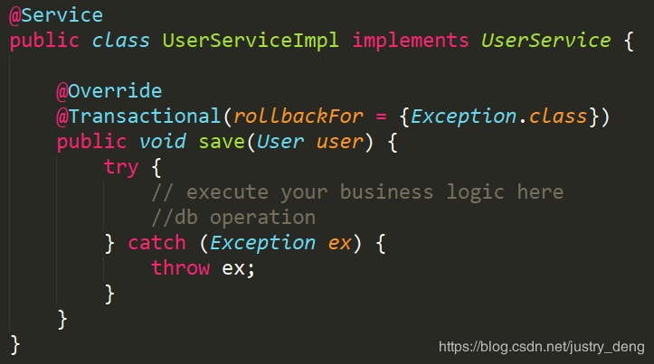
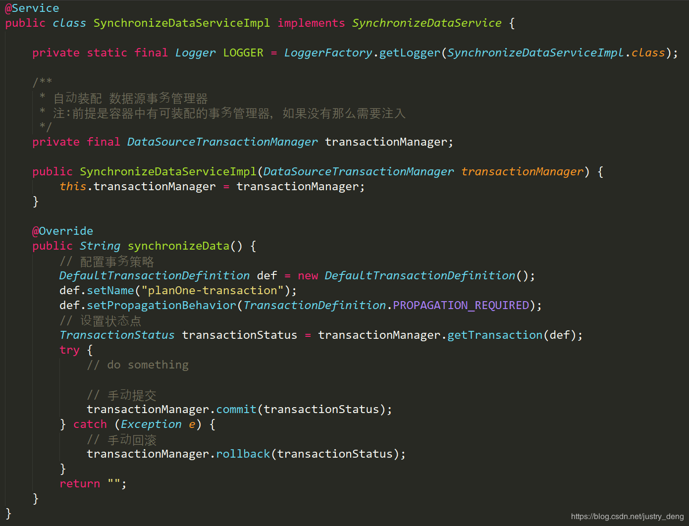

## SpringBoot声明式事务的简单运用
### SpringBoot使用事物的步骤：
第一步：在启动类上开启事物支持
```
@SpringBootApplication
@EnableTransactionManagement
public class TransactionApplication {

}
```
提示：

@EnableTransactionManagement注解其实在大多数情况下，不是必须的，因为SpringBoot在TransactionAutoConfiguration类里为我们自动配置启用了@EnableTransactionManagement注解。不过自动启用该注解有两个前提条件，分别是：
- @ConditionalOnBean(PlatformTransactionManager.class)
- @ConditionalOnMissingBean(AbstractTransactionManagementConfiguration.class)

而一般情况下，这两个条件都是满足的，所以一般的，我们在启动类上写不写@EnableTransactionManagement都行。这里还是建议写出来。

第二步：在业务逻辑层接口的实现类中的相关方法上声明事物
```
@Transactional(propagation = Propagation.REQUIRED,readOnly = false)
public void test(){

}
```

Transactional 注解的常用属性表

|属性|说明| 
|---|---|
|propagation|事务的传播行为，默认值为 REQUIRED。| 
|isolation|事务的隔离度，默认值采用 DEFAULT|
|timeout|事务的超时时间，默认值为-1，不超时。如果设置了超时时间(单位秒)，那么如果超过该时间限制了但事务还没有完成，则自动回滚事务。|
|read-only|指定事务是否为只读事务，默认值为 false；为了忽略那些不需要事务的方法，比如读取数据，可以设置 read-only 为 true。|
|rollbackFor|用于指定能够触发事务回滚的异常类型，如果有多个异常类型需要指定，各类型之间可以通过逗号分隔。{xxx1.class, xxx2.class,……}|
|noRollbackFor|抛出 no-rollback-for 指定的异常类型，不回滚事务。{xxx1.class, xxx2.class,……}|

最佳实践
- service实现类(一般不建议在接口上)上添加@Transactional，可以将整个类纳入spring事务管理，在每个业务方法执行时都会开启一个事务，不过这些事务采用相同的管理方式。
- Transactional 注解只能应用到 public 可见度的方法上。 如果应用在protected、private或者 package可见度的方法上，也不会报错，不过事务设置不会起作用。
- 默认情况下，Transactional 注解的事物所管理的方法中，如果方法抛出运行时异常或error，那么会进行事务回滚；如果方法抛出的是非运行时异常，那么不会回滚。
  - 注：SQL异常属于检查异常（有的框架将SQL异常重写为了运行时异常），但是有时我们写SQL时，检查异常并不会提示；而默认情况下，事物对检查异常不会作出回滚处理。
  - 注：在很多时候，我们除了catch一般的异常或自定义异常外，我们还习惯于catch住Exception异常；然后再抛出Exception异常。但是Exception异常属于非运行时异常(即：检查异常)，因为默认是运行时异常时事物才进行回滚，那么这种情况下，是不会回滚的。我们可以在@Transacional注解中，通过rollbackFor = {Exception.class} 来解决这个问题。即：设置当Exception异常或Exception的所有任意子类异常时事物会进行回滚。
  - 注：被catch处理了的异常，不会被事物作为判断依据；如果异常被catch 了，但是又在catch中抛出了新的异常，那么事物会以这个新的异常作 为是否进行回滚的判断依据。

阿里规范推荐:事务场景中，抛出异常被catch后，如果需要回滚，一定要手动回滚事务。错误使用方式

正确使用方式

阿里推荐的方式属于自动提交/手动回滚，那如果我们想要手动提交、手动回滚的话，可参考（注：不需要@Transactional注解。）:



## spring事务管理(详解和实例)
### 1 初步理解
理解事务之前，先讲一个你日常生活中最常干的事：取钱。 
比如你去ATM机取1000块钱，大体有两个步骤：首先输入密码金额，银行卡扣掉1000元钱；然后ATM出1000元钱。这两个步骤必须是要么都执行要么都不执行。如果银行卡扣除了1000块但是ATM出钱失败的话，你将会损失1000元；如果银行卡扣钱失败但是ATM却出了1000块，那么银行将损失1000元。所以，如果一个步骤成功另一个步骤失败对双方都不是好事，如果不管哪一个步骤失败了以后，整个取钱过程都能回滚，也就是完全取消所有操作的话，这对双方都是极好的。 
事务就是用来解决类似问题的。事务是一系列的动作，它们综合在一起才是一个完整的工作单元，这些动作必须全部完成，如果有一个失败的话，那么事务就会回滚到最开始的状态，仿佛什么都没发生过一样。 
在企业级应用程序开发中，事务管理必不可少的技术，用来确保数据的完整性和一致性。 
事务有四个特性：ACID
- 原子性（Atomicity）：事务是一个原子操作，由一系列动作组成。事务的原子性确保动作要么全部完成，要么完全不起作用。
- 一致性（Consistency）：一旦事务完成（不管成功还是失败），系统必须确保它所建模的业务处于一致的状态，而不会是部分完成部分失败。在现实中的数据不应该被破坏。
- 隔离性（Isolation）：可能有许多事务会同时处理相同的数据，因此每个事务都应该与其他事务隔离开来，防止数据损坏。
- 持久性（Durability）：一旦事务完成，无论发生什么系统错误，它的结果都不应该受到影响，这样就能从任何系统崩溃中恢复过来。通常情况下，事务的结果被写到持久化存储器中。

### 2 核心接口
Spring事务管理的实现有许多细节，如果对整个接口框架有个大体了解会非常有利于我们理解事务，下面通过讲解Spring的事务接口来了解Spring实现事务的具体策略。 
Spring事务管理涉及的接口的联系如下：

#### 2.1 事务管理器 
Spring并不直接管理事务，而是提供了多种事务管理器，他们将事务管理的职责委托给Hibernate或者JTA等持久化机制所提供的相关平台框架的事务来实现。 
Spring事务管理器的接口是org.springframework.transaction.PlatformTransactionManager，通过这个接口，Spring为各个平台如JDBC、Hibernate等都提供了对应的事务管理器，但是具体的实现就是各个平台自己的事情了。此接口的内容如下：
```
Public interface PlatformTransactionManager()...{  
    // 由TransactionDefinition得到TransactionStatus对象
    TransactionStatus getTransaction(TransactionDefinition definition) throws TransactionException; 
    // 提交
    Void commit(TransactionStatus status) throws TransactionException;  
    // 回滚
    Void rollback(TransactionStatus status) throws TransactionException;  
    } 
```
从这里可知具体的具体的事务管理机制对Spring来说是透明的，它并不关心那些，那些是对应各个平台需要关心的，所以Spring事务管理的一个优点就是为不同的事务API提供一致的编程模型，如JTA、JDBC、Hibernate、JPA。下面分别介绍各个平台框架实现事务管理的机制。

#### 2.1.1 JDBC事务 
如果应用程序中直接使用JDBC来进行持久化，DataSourceTransactionManager会为你处理事务边界。为了使用DataSourceTransactionManager，你需要使用如下的XML将其装配到应用程序的上下文定义中：
```
<bean id="transactionManager" class="org.springframework.jdbc.datasource.DataSourceTransactionManager">
    <property name="dataSource" ref="dataSource" />
</bean>
```
实际上，DataSourceTransactionManager是通过调用java.sql.Connection来管理事务，而后者是通过DataSource获取到的。通过调用连接的commit()方法来提交事务，同样，事务失败则通过调用rollback()方法进行回滚。
#### 2.1.2 Hibernate事务
如果应用程序的持久化是通过Hibernate实习的，那么你需要使用HibernateTransactionManager。对于Hibernate3，需要在Spring上下文定义中添加如下的<bean>声明：
<bean id="transactionManager" class="org.springframework.orm.hibernate3.HibernateTransactionManager">
    <property name="sessionFactory" ref="sessionFactory" />
</bean>
sessionFactory属性需要装配一个Hibernate的session工厂，HibernateTransactionManager的实现细节是它将事务管理的职责委托给org.hibernate.Transaction对象，而后者是从Hibernate Session中获取到的。当事务成功完成时，HibernateTransactionManager将会调用Transaction对象的commit()方法，反之，将会调用rollback()方法。
#### 2.1.3 Java持久化API事务（JPA）
Hibernate多年来一直是事实上的Java持久化标准，但是现在Java持久化API作为真正的Java持久化标准进入大家的视野。如果你计划使用JPA的话，那你需要使用Spring的JpaTransactionManager来处理事务。你需要在Spring中这样配置JpaTransactionManager：
```
<bean id="transactionManager" class="org.springframework.orm.jpa.JpaTransactionManager">
    <property name="sessionFactory" ref="sessionFactory" />
</bean>
```
JpaTransactionManager只需要装配一个JPA实体管理工厂（javax.persistence.EntityManagerFactory接口的任意实现）。JpaTransactionManager将与由工厂所产生的JPA EntityManager合作来构建事务。
#### 2.1.4 Java原生API事务
如果你没有使用以上所述的事务管理，或者是跨越了多个事务管理源（比如两个或者是多个不同的数据源），你就需要使用JtaTransactionManager:
```
<bean id="transactionManager" class="org.springframework.transaction.jta.JtaTransactionManager">
    <property name="transactionManagerName" value="java:/TransactionManager" />
</bean>
```
JtaTransactionManager将事务管理的责任委托给javax.transaction.UserTransaction和javax.transaction.TransactionManager对象，其中事务成功完成通过UserTransaction.commit()方法提交，事务失败通过UserTransaction.rollback()方法回滚。
### 2.2 基本事务属性的定义
上面讲到的事务管理器接口PlatformTransactionManager通过getTransaction(TransactionDefinition definition)方法来得到事务，这个方法里面的参数是TransactionDefinition类，这个类就定义了一些基本的事务属性。 
那么什么是事务属性呢？事务属性可以理解成事务的一些基本配置，描述了事务策略如何应用到方法上。事务属性包含了5个方面，如图所示：


而TransactionDefinition接口内容如下：
```
public interface TransactionDefinition {
    int getPropagationBehavior(); // 返回事务的传播行为
    int getIsolationLevel(); // 返回事务的隔离级别，事务管理器根据它来控制另外一个事务可以看到本事务内的哪些数据
    int getTimeout();  // 返回事务必须在多少秒内完成
    boolean isReadOnly(); // 事务是否只读，事务管理器能够根据这个返回值进行优化，确保事务是只读的
} 
```
我们可以发现TransactionDefinition正好用来定义事务属性，下面详细介绍一下各个事务属性。
 
#### 2.2.1 传播行为
事务的第一个方面是传播行为（propagation behavior）。当事务方法被另一个事务方法调用时，必须指定事务应该如何传播。例如：方法可能继续在现有事务中运行，也可能开启一个新事务，并在自己的事务中运行。Spring定义了七种传播行为：

|传播行为	|    含义|
|---|---|
|PROPAGATION_NEVER	|表示当前方法不应该运行在事务上下文中。如果当前正有一个事务在运行，则会抛出异常|
|PROPAGATION_NOT_SUPPORTED	|表示该方法不应该运行在事务中。如果存在当前事务，在该方法运行期间，当前事务将被挂起。如果使用JTATransactionManager的话，则需要访问TransactionManager|
|PROPAGATION_SUPPORTS	|表示当前方法不需要事务上下文，但是如果存在当前事务的话，那么该方法会在这个事务中运行|
|PROPAGATION_REQUIRED	|表示当前方法必须运行在事务中。如果当前事务存在，方法将会在该事务中运行。否则，会启动一个新的事务|
|PROPAGATION_MANDATORY |表示该方法必须在事务中运行，如果当前事务不存在，则会抛出一个异常|
|PROPAGATION_REQUIRED_NEW	|表示当前方法必须运行在它自己的事务中。一个新的事务将被启动。如果存在当前事务，在该方法执行期间，当前事务会被挂起。如果使用JTATransactionManager的话，则需要访问TransactionManager|
|PROPAGATION_NESTED	|表示如果当前已经存在一个事务，那么该方法将会在嵌套事务中运行。嵌套的事务可以独立于当前事务进行单独地提交或回滚。如果当前事务不存在，那么其行为与PROPAGATION_REQUIRED一样。注意各厂商对这种传播行为的支持是有所差异的。可以参考资源管理器的文档来确认它们是否支持嵌套事务| 


## 参考
https://blog.csdn.net/justry_deng/article/details/80828180
