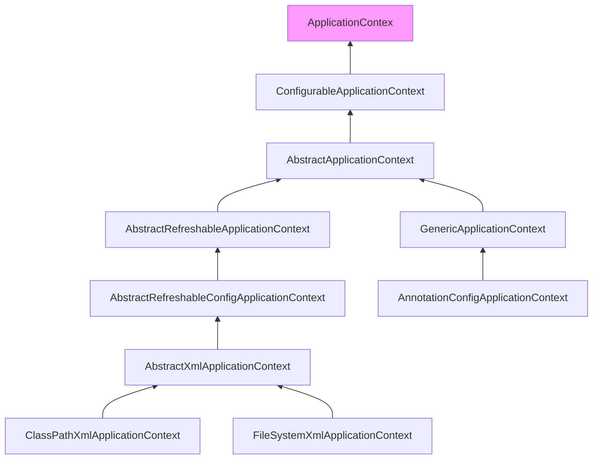

<<<<<<< HEAD
# ApplicationContext类关系图

```mermaid
graph BT

ApplicationContext[ApplicationContext]
ConfigurableApplicationContext[ConfigurableApplicationContext]
AbstractApplicationContext[AbstractApplicationContext]
AbstractRefreshableApplicationContext[AbstractRefreshableApplicationContext]
GenericApplicationContext[GenericApplicationContext]
AnnotationConfigApplicationContext[AnnotationConfigApplicationContext]
AbstractRefreshableConfigApplicationContext[AbstractRefreshableConfigApplicationContext]
AbstractXmlApplicationContext[AbstractXmlApplicationContext]
ClassPathXmlApplicationContext[ClassPathXmlApplicationContext]
FileSystemXmlApplicationContext[FileSystemXmlApplicationContext]


ConfigurableApplicationContext --> ApplicationContext
AbstractApplicationContext --> ConfigurableApplicationContext
AbstractRefreshableApplicationContext --> AbstractApplicationContext
GenericApplicationContext --> AbstractApplicationContext
AbstractRefreshableConfigApplicationContext--> AbstractRefreshableApplicationContext
AnnotationConfigApplicationContext --> GenericApplicationContext
AbstractXmlApplicationContext--> AbstractRefreshableConfigApplicationContext
ClassPathXmlApplicationContext --> AbstractXmlApplicationContext
FileSystemXmlApplicationContext --> AbstractXmlApplicationContext

style ApplicationContext fill:#f9f
```

参考[BeanFactory类关系图](ioc-bean-factory.md)
=======
# ApplicationContext类关系图

```mermaid
graph BT

ApplicationContext[ApplicationContex]
ConfigurableApplicationContext[ConfigurableApplicationContext]
AbstractApplicationContext[AbstractApplicationContext]
AbstractRefreshableApplicationContext[AbstractRefreshableApplicationContext]
GenericApplicationContext[GenericApplicationContext]
AnnotationConfigApplicationContext[AnnotationConfigApplicationContext]
AbstractRefreshableConfigApplicationContext[AbstractRefreshableConfigApplicationContext]
AbstractXmlApplicationContext[AbstractXmlApplicationContext]
ClassPathXmlApplicationContext[ClassPathXmlApplicationContext]
FileSystemXmlApplicationContext[FileSystemXmlApplicationContext]


ConfigurableApplicationContext --> ApplicationContext
AbstractApplicationContext --> ConfigurableApplicationContext
AbstractRefreshableApplicationContext --> AbstractApplicationContext
GenericApplicationContext --> AbstractApplicationContext
AbstractRefreshableConfigApplicationContext--> AbstractRefreshableApplicationContext
AnnotationConfigApplicationContext --> GenericApplicationContext
AbstractXmlApplicationContext--> AbstractRefreshableConfigApplicationContext
ClassPathXmlApplicationContext --> AbstractXmlApplicationContext
FileSystemXmlApplicationContext --> AbstractXmlApplicationContext

style ApplicationContext fill:#f9f
```

参考[BeanFactory类关系图](ioc-bean-factory.md)
>>>>>>> Track 1 files into repository.
