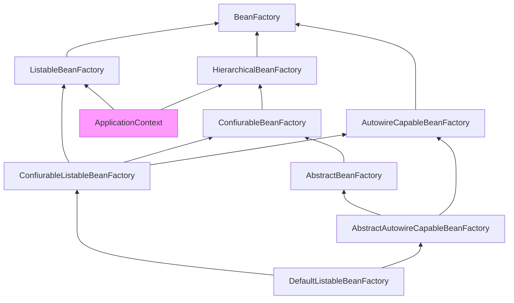

# BeanFactory类关系图

```mermaid

graph BT
BeanFactory[BeanFactory]
ListableBeanFactory[ListableBeanFactory]
HierarchicalBeanFactory[HierarchicalBeanFactory]
AutowireCapableBeanFactory[AutowireCapableBeanFactory]
ApplicationContext[ApplicationContext]
ConfiurableListableBeanFactory[ConfiurableListableBeanFactory]
ConfiurableBeanFactory[ConfiurableBeanFactory]
AbstractBeanFactory[AbstractBeanFactory]
AbstractAutowireCapableBeanFactory[AbstractAutowireCapableBeanFactory]
DefaultListableBeanFactory[DefaultListableBeanFactory]

ListableBeanFactory --> BeanFactory
HierarchicalBeanFactory --> BeanFactory
AutowireCapableBeanFactory --> BeanFactory
ApplicationContext --> ListableBeanFactory
ApplicationContext --> HierarchicalBeanFactory
ConfiurableListableBeanFactory --> ListableBeanFactory
ConfiurableListableBeanFactory --> ConfiurableBeanFactory
ConfiurableListableBeanFactory --> AutowireCapableBeanFactory
ConfiurableBeanFactory --> HierarchicalBeanFactory
AbstractBeanFactory --> ConfiurableBeanFactory
AbstractAutowireCapableBeanFactory --> AbstractBeanFactory
AbstractAutowireCapableBeanFactory --> AutowireCapableBeanFactory
DefaultListableBeanFactory --> ConfiurableListableBeanFactory
DefaultListableBeanFactory --> AbstractAutowireCapableBeanFactory

style ApplicationContext fill:#f9f
```
参考[ApplicationContext类关系图](ioc-application-context.md)
