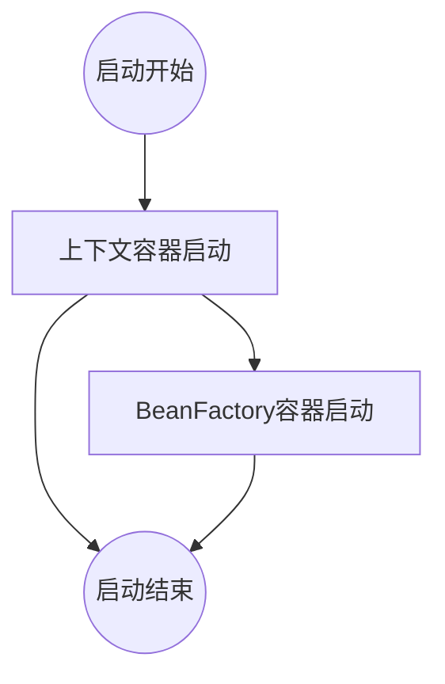
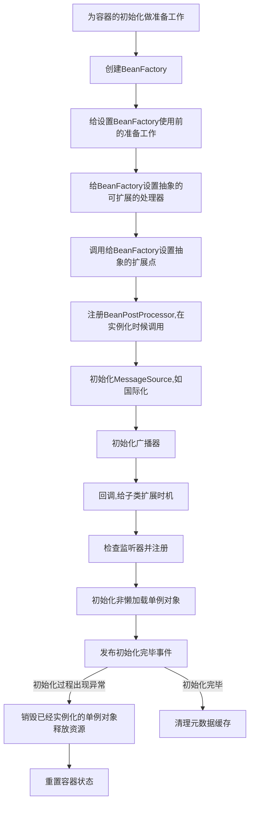

<<<<<<< HEAD
# IOC（Inversion of Control）
IOC（控制反转）,目的为了解决对象的初始化以及依赖,其实现手段为DI（依赖注入）。
SpringIOC的核心就是描述bean以及bean生命周期管理。
Spring没有IOC的时候，如果A对象调用B对象可以通过外部传入，内部创建方式，通过new关键字或者手动的反射方式获取对象实例，如果对象依赖很复杂，则创建对象时候要构建整个依赖关系。
SpringIOC中bean的创建方式有四种：
- 基于Class构建：使用<bean>标签，基于反射实现；
- 构造方法创建：使用<bean>标签，并配置构造器参数，基于ASM获取字节码中方法的参数实现；
- 静态工厂创建：静态工厂就是在类中静态化一个方法，方法内new出对象，供加载初始化，在AB测试过程中使用，其他不常用；
- FactoryBean：自定义类实现FactoryBean，并配置在<bean>标签上，在配置中可以设置属性参数。运行时获取到的bean并不是自定义的FactoryBean的实例，而是其中的真正返回的bean的实例。

SpringDI是解决了对象创建时候的依赖关系，是SpringIOC的实现手段。
SpringDI有四种方式：
- Set方法注入
- 构造方法注入
- 自动注入(byName,byType,constructor)：默认的方式收到全局配置的影响。
- 方法注入（lookup-method）静态单例依赖动态实例，每次都要创建新的动态实例时候使用，前提是创建一个无需实现的抽象类，给定一个抽象方法，返回值是动态类，有Spring使用CGlib实现抽象类。另外也可以使用实现BeanFactoryAware类实现。

Bean在SpringIoC中的特性
- 作用范围：很多的bean在Spring中是无状态的，scope是singleton（默认），如果有状态则使用prototype表示多例模式
- 生命周期：类中可配置init以及destroy的方法，并配置到<bean>，即可得到响应的回调，也可实现InitBean和DestroyBean的接口依托Sring容器周期自动实现。
- 装载机制：配置bean是否是懒加载。如果想尽早发现bug，则使用非懒加载方式。

Bean工厂和上下文的区别:BeanFactory是ApplicationContext的顶级借口，BeanFacotry默认懒加载，ApplicationContext在启动就加载所以可以检测配置文件错误，ApplicationContext有多重实现表示不同层次的上下文，ApplicationContext支持国际化，ApplicationContext支持事件机制

# SpringIOC 两种容器

- [上下文容器](ioc-application-context.md)：一般由ClassPathXmlApplicationContext或者AnnotationConfigApplicationContext担任。
- [Bean工厂容器](ioc-bean-factory.md)：一般由DefaultListableBeanFactory担任。

上下文容器持有了Bean工厂容器。通过父类的getBeanFactory方法获取Bean工厂的实现类的实例。

# SpringIOC 启动流程

# ApplicationContext类关系图
[上下文容器](ioc-application-context.md)

# BeanFactory类关系图
[Bean工厂容器](ioc-bean-factory.md)

# ApplicationContext和BeanFactory关系
org.springframework.context.support.AbstractRefreshableApplicationContext#getBeanFactory

# SpringIOC容器启动流程

=======
# IOC（Inversion of Control）
IOC（控制反转）,目的为了解决对象的初始化以及依赖,其实现手段为DI（依赖注入）。
SpringIOC的核心就是描述bean以及bean生命周期管理。
Spring没有IOC的时候，如果A对象调用B对象可以通过外部传入，内部创建方式，通过new关键字或者手动的反射方式获取对象实例，如果对象依赖很复杂，则创建对象时候要构建整个依赖关系。
SpringIOC中bean的创建方式有四种：
- 基于Class构建：使用<bean>标签，基于反射实现；
- 构造方法创建：使用<bean>标签，并配置构造器参数，基于ASM获取字节码中方法的参数实现；
- 静态工厂创建：静态工厂就是在类中静态化一个方法，方法内new出对象，供加载初始化，在AB测试过程中使用，其他不常用；
- FactoryBean：自定义类实现FactoryBean，并配置在<bean>标签上，在配置中可以设置属性参数。运行时获取到的bean并不是自定义的FactoryBean的实例，而是其中的真正返回的bean的实例。

SpringDI是解决了对象创建时候的依赖关系，是SpringIOC的实现手段。
SpringDI有四种方式：
- Set方法注入
- 构造方法注入
- 自动注入(byName,byType,constructor)：默认的方式收到全局配置的影响。
- 方法注入（lookup-method）静态单例依赖动态实例，每次都要创建新的动态实例时候使用，前提是创建一个无需实现的抽象类，给定一个抽象方法，返回值是动态类，有Spring使用CGlib实现抽象类。另外也可以使用实现BeanFactoryAware类实现。

Bean在SpringIoC中的特性
- 作用范围：很多的bean在Spring中是无状态的，scope是singleton（默认），如果有状态则使用prototype表示多例模式
- 生命周期：类中可配置init以及destroy的方法，并配置到<bean>，即可得到响应的回调，也可实现InitBean和DestroyBean的接口依托Sring容器周期自动实现。
- 装载机制：配置bean是否是懒加载。如果想尽早发现bug，则使用非懒加载方式。

Bean工厂和上下文的区别:BeanFactory是ApplicationContext的顶级借口，BeanFacotry默认懒加载，ApplicationContext在启动就加载所以可以检测配置文件错误，ApplicationContext有多重实现表示不同层次的上下文，ApplicationContext支持国际化，ApplicationContext支持事件机制

# SpringIOC 两种容器

- [上下文容器](ioc-application-context.md)：一般由ClassPathXmlApplicationContext或者AnnotationConfigApplicationContext担任。
- [Bean工厂容器](ioc-bean-factory.md)：一般由DefaultListableBeanFactory担任。

上下文容器持有了Bean工厂容器。通过父类的getBeanFactory方法获取Bean工厂的实现类的实例。

# ApplicationContext类关系图
[上下文容器](ioc-application-context.md)

# BeanFactory类关系图
[Bean工厂容器](ioc-bean-factory.md)

# ApplicationContext和BeanFactory关系
org.springframework.context.support.AbstractRefreshableApplicationContext#getBeanFactory

# SpringIOC容器启动流程

>>>>>>> Track 1 files into repository.
