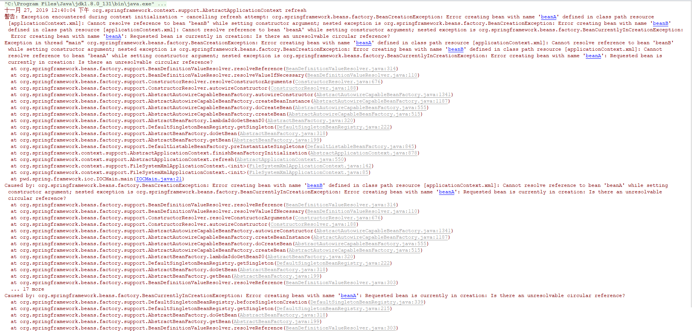

## IOC（Inversion of Control）（控制反转）和DI（依赖注入）
IOC和DI是一种编程需求，要解决的问题有两个：
- 对象初始化（IOC目标）
- 对象之间的依赖关系（DI目标）

没有IOC和DI的时候，在程序中如果A对象调用B对象，对于A来说B对象是如何初始化的呢？A是如何依赖B的呢？
- A关注B的实例化：在A的内部通过new关键字或者手动通过反射方式创建一个B的实例；
- A忽视B的实例化：可以在实例化A的时候，把B的实例通过参数传入到A的构造器中（至于谁实例化B，则是调用方的事情，不是A关注的事情）；

在上述实例化中如果B对象的依赖很复杂，比如B依赖了C，C依赖了D，则创建B对象时候要构建整个依赖关系。而IOC和DI的出现就是为了自动化上述场景中实例化对象以及解决对象依赖的一种编程方式。


## SpringIOC 和 SpringDI
SpringIOC，SpringDI是IOC，DI思想在Spring的实现，核心就是描述Bean以及对Bean生命周期管理以及解决对象创建时候的依赖关系。

```java
@AllArgsConstructor
@NoArgsConstructor
@Setter
@Getter
public class BeanA {
  private Long id;
  private String name;
  private BeanB beanB;
  
  public static BeanA getBean(String flag) {
    if ("a".equals(flag)) {
      // Do something
    } else {
      // Do something
    }
    return new BeanA();
  }
}
```
```java
@AllArgsConstructor
@NoArgsConstructor
@Setter
@Getter
public class BeanB {
  private Long id;
  private String name;
  private BeanA beanA;
}
```
### SpringIOC中定义了Bean的创建方式有四种：
- 基于Class构建：使用<bean>标签，基于反射实现；
- 构造方法创建：使用<bean>标签，并配置构造器参数，基于ASM获取字节码中方法的参数实现；
- 静态工厂创建：静态工厂就是在类中静态化一个方法，方法内new出对象，供加载初始化，在AB测试过程中使用，其他不常用；
- FactoryBean：自定义类实现FactoryBean，并配置在<bean>标签上，在配置中可以设置属性参数。运行时获取到的bean并不是自定义的FactoryBean的实例，而是其中的真正返回的bean的实例。
#### 基于Class构建实例
```xml
<?xml version="1.0" encoding="UTF-8"?>
<beans xmlns:xsi="http://www.w3.org/2001/XMLSchema-instance"
  xmlns="http://www.springframework.org/schema/beans"
  xsi:schemaLocation="http://www.springframework.org/schema/beans http://www.springframework.org/schema/beans/spring-beans.xsd">
  <!--根据默认构造函数构建-->
  <bean class="pwd.spring.framework.ioc.BeanA"></bean>
</beans>
```
#### 基于构造方法创建实例
```xml
<?xml version="1.0" encoding="UTF-8"?>
<beans xmlns:xsi="http://www.w3.org/2001/XMLSchema-instance"
  xmlns="http://www.springframework.org/schema/beans"
  xsi:schemaLocation="http://www.springframework.org/schema/beans http://www.springframework.org/schema/beans/spring-beans.xsd">
  <!--根据默认构造函数构建-->
  <bean id="beanA" class="pwd.spring.framework.ioc.BeanA">
    <constructor-arg index="0" value="123"></constructor-arg>
    <constructor-arg index="1" value="abc"></constructor-arg>
    <constructor-arg index="2" ref="beanB"></constructor-arg>
  </bean>
  
  <bean id="beanB"  class="pwd.spring.framework.ioc.BeanB">
    <constructor-arg index="0" value="123"></constructor-arg>
    <constructor-arg index="1" value="abc"></constructor-arg>
    <constructor-arg index="2" ref="beanA"></constructor-arg>
  </bean>
</beans>
```
#### 基于静态工厂创建实例
```xml
<?xml version="1.0" encoding="UTF-8"?>
<beans xmlns:xsi="http://www.w3.org/2001/XMLSchema-instance"
  xmlns="http://www.springframework.org/schema/beans"
  xsi:schemaLocation="http://www.springframework.org/schema/beans http://www.springframework.org/schema/beans/spring-beans.xsd">
  <bean class="pwd.spring.framework.ioc.BeanA" factory-method="getBean">
    <constructor-arg name="flag" value="a"></constructor-arg>
  </bean>
</beans>
```
#### 基于FactoryBean实例
Mybatis、JDBC等集成在Spring中的实现均采用该方式
```java
package pwd.spring.framework.ioc;

import lombok.Getter;
import lombok.Setter;
import org.springframework.beans.factory.FactoryBean;

/**
 * pwd.spring.framework.ioc@gitbook
 *
 * <h1>TODO what you want to do?</h1>
 *
 * date 2019-11-27 14:11
 *
 * @author DingPengwei[dingpengwei@eversec.com]
 * @version 1.0.0
 * @since DistributionVersion
 */
@Getter
@Setter
public class BeanAFactoryBean implements FactoryBean {
  
  private Long id;
  private String name;
  
  @Override
  public boolean isSingleton() {
    // false 每次创建都要调用getObject()
    return true;
  }

  @Override
  public Object getObject() throws Exception {
    return new BeanA();
  }

  @Override
  public Class<?> getObjectType() {
    return BeanA.class;
  }
}
```
```xml
<?xml version="1.0" encoding="UTF-8"?>
<beans xmlns:xsi="http://www.w3.org/2001/XMLSchema-instance"
  xmlns="http://www.springframework.org/schema/beans"
  xsi:schemaLocation="http://www.springframework.org/schema/beans http://www.springframework.org/schema/beans/spring-beans.xsd">
  <bean class="pwd.spring.framework.ioc.BeanAFactoryBean">
    <property name="id" value="123"></property>
    <property name="name" value="abc"></property>
  </bean>
</beans>
```

### Bean在SpringIoC中的特性
- 作用范围scope：
  + singleton(默认)：在spring容器中只存在一个实例，所有对象的引用将共享这个实例。（注：不要和单例模式搞混）
  + prototype：容器每次都会生成一个新的对象实例给请求方。
  + request （限定在web应用中使用）：为每个http请求创建一个全新的request-processor对象供当前请求使用，请求结束，实例生命周期即结束。
  + session （限定在web应用中使用）：为每个独立的session创建一个全新的UserPreference对象实例。
  + global session （限定在web应用中使用）：只有应用在基于portlet的Web应用程序中才有意义，它映射到portlet的global范围的session。如果在普通的基于servlet的Web应用中使用了这个类型的scope，容器会将其作为普通的session类型的scope对待。
  
- 生命周期：类中可配置init以及destroy的方法，并配置到<bean>，即可得到响应的回调，也可实现InitBean和DestroyBean的接口依托Spring容器周期自动实现。
- 装载机制：配置bean是否是懒加载。如果想尽早发现bug，则使用非懒加载方式。

### SpringDI通过四种方式产生Bean的依赖：
如果没有DI产生依赖，以及解决循环依赖问题，则IOC的应用场景则一无是处。
- 构造方法注入
```xml

```
- Set方法注入
```xml

```
- 自动注入(byName,byType,constructor)：默认的方式收到全局配置的影响。
```xml

```
- 方法注入（lookup-method）静态单例依赖动态实例，每次都要创建新的动态实例时候使用，前提是创建一个无需实现的抽象类，给定一个抽象方法，返回值是动态类，有Spring使用CGlib实现抽象类。另外也可以使用实现BeanFactoryAware类实现。
```xml

```
#### 构造方法注入产生的循环依赖无法解除，造成容器初始化失败
```xml
<?xml version="1.0" encoding="UTF-8"?>
<beans xmlns:xsi="http://www.w3.org/2001/XMLSchema-instance"
  xmlns="http://www.springframework.org/schema/beans"
  xsi:schemaLocation="http://www.springframework.org/schema/beans http://www.springframework.org/schema/beans/spring-beans.xsd">
  <bean class="pwd.spring.framework.ioc.BeanA" id="beanA">
    <constructor-arg name="beanB" ref="beanB"></constructor-arg>
  </bean>
  <bean class="pwd.spring.framework.ioc.BeanB" id="beanB">
    <constructor-arg name="beanA" ref="beanA"></constructor-arg>
  </bean>
</beans>
```


#### Set方法注入产生的循环依赖scope为singleton，容器可以解除循环依赖
```xml
<?xml version="1.0" encoding="UTF-8"?>
<beans xmlns:xsi="http://www.w3.org/2001/XMLSchema-instance"
  xmlns="http://www.springframework.org/schema/beans"
  xsi:schemaLocation="http://www.springframework.org/schema/beans http://www.springframework.org/schema/beans/spring-beans.xsd">
  <bean class="pwd.spring.framework.ioc.BeanA" id="beanA">
    <property name="beanB" ref="beanB"></property>
  </bean>
  <bean class="pwd.spring.framework.ioc.BeanB" id="beanB">
    <property name="beanA" ref="beanA"></property>
  </bean>
</beans>
```

IOC 容器在读到上面的配置时，会按照顺序，先去实例化 beanA。然后发现 beanA 依赖于 beanB，接在又去实例化 beanB。实例化 beanB 时，发现 beanB 又依赖于 beanA。
如果容器不处理循环依赖的话，容器会无限执行上面的流程，直到内存溢出，程序崩溃。当然，Spring 是不会让这种情况发生的。在容器再次发现 beanB 依赖于 beanA 时，
容器会获取 beanA 对象的一个早期的引用（early reference），并把这个早期引用注入到 beanB 中，让 beanB 先完成实例化。
beanB 完成实例化，beanA 就可以获取到 beanB 的引用，beanA 随之完成实例化。所谓的”早期引用“是指向原始对象的引用。所谓的原始对象是指刚创建好的对象，但还未填充属性。

Spring 容器对缓存的定义
```java
/** Cache of singleton objects: bean name --> bean instance */
//用于存放完全初始化好的 bean，从该缓存中取出的 bean 可以直接使用
private final Map<String, Object> singletonObjects = new ConcurrentHashMap<String, Object>(256);

/** Cache of singleton factories: bean name --> ObjectFactory */
//存放原始的 bean 对象（尚未填充属性），用于解决循环依赖
private final Map<String, ObjectFactory<?>> singletonFactories = new HashMap<String, ObjectFactory<?>>(16);

/** Cache of early singleton objects: bean name --> bean instance */
// 存放 bean 工厂对象，用于解决循环依赖
private final Map<String, Object> earlySingletonObjects = new HashMap<String, Object>(16);
```
#### Set方法注入产生的循环依赖scope都为prototype，容器无法解除循环解除，依赖链上有一个singleton则可以解除循环依赖

```xml
<?xml version="1.0" encoding="UTF-8"?>
<beans xmlns:xsi="http://www.w3.org/2001/XMLSchema-instance"
  xmlns="http://www.springframework.org/schema/beans"
  xsi:schemaLocation="http://www.springframework.org/schema/beans http://www.springframework.org/schema/beans/spring-beans.xsd">
  <bean class="pwd.spring.framework.ioc.BeanA" id="beanA" scope="prototype">
    <property name="beanB" ref="beanB"></property>
  </bean>
  <bean class="pwd.spring.framework.ioc.BeanB" id="beanB" scope="prototype">
    <property name="beanA" ref="beanA"></property>
  </bean>
</beans>
```

对于prototype作用域bean，spring容器无法完成依赖注入，因为spring容器不进行缓存prototype作用域的bean，因此无法提前暴露一个正在创建中的bean。

## SpringIOC是如何实例化Bean的？
Spring读取配置文件中的<bean>节点，在加载后都会对应一个BeanDefinition类,通过BeanDefinitionReader读取后注册到BeanDefinitionRegistry。然后进入BeanFactory创建。
### // TODO 


Bean工厂和上下文的区别:BeanFactory是ApplicationContext的顶级借口，BeanFacotry默认懒加载，ApplicationContext在启动就加载所以可以检测配置文件错误，ApplicationContext有多重实现表示不同层次的上下文，ApplicationContext支持国际化，ApplicationContext支持事件机制


# SpringIOC 两种容器

- [上下文容器](ioc-application-context.md)：一般由ClassPathXmlApplicationContext或者AnnotationConfigApplicationContext担任。
- [Bean工厂容器](ioc-bean-factory.md)：一般由DefaultListableBeanFactory担任。

上下文容器持有了Bean工厂容器。通过父类的getBeanFactory方法获取Bean工厂的实现类的实例。

# ApplicationContext类关系图
[上下文容器](ioc-application-context.md)

# BeanFactory类关系图
[Bean工厂容器](ioc-bean-factory.md)

# ApplicationContext和BeanFactory关系
org.springframework.context.support.AbstractRefreshableApplicationContext#getBeanFactory

# SpringIOC容器启动流程

