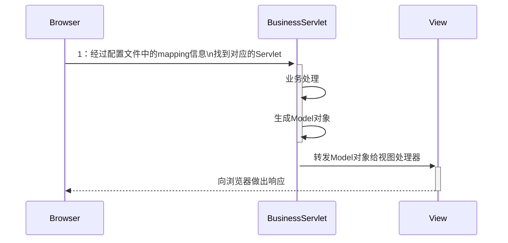
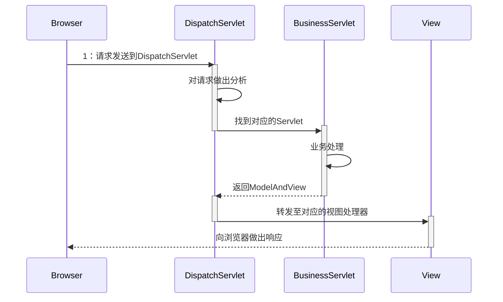
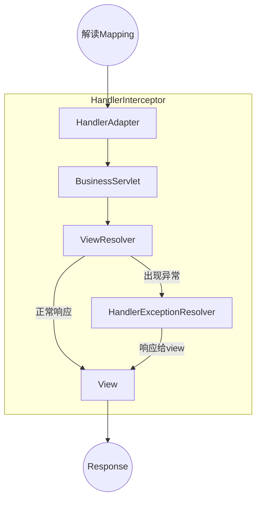

# SpringMVC

## JSP-Servlet工作时序图

从客户端发起的请求到Servlet(C)，经过处理Model(M)，转发至视图View(V)

## SpringMVC工作时序图
SpringMVC实现并没有脱离上述核心过程，只不过对JSP-Servlet进行了封装，简化开发流程，提供了额外的基于注解的url映射，http表单参数转换，全局异常处理，拦截器实现等。
SpringMVC提供了统一的请求入口DispatchServlet，识别请求由那个Servlet处理业务，业务Servlet处理完成后返回处理结果，DispatchServlet转发至视图处理器形成View，响应给客户端

## SpringMVC工作流程图
几个关键类
- HandlerMapping：configure中的映射，一个DispatchServlet中可配置多个HandlerMapping，请求到来，通过doHandler遍历HandlerMapping并返回HandlerExecuteChain（包含了拦截器）。
- HandlerAdapter：适配器模式，声明支持的Handler，通过调用handler方法，适配到业务Servlet，
- BusinessServlet处理完成后返回ModelAndView对象
- ViewResolver：处理返回的ModelAndView，返回View name
- View：返回response
- HandlerExceptionResolver：处理异常
- HandlerInterceptor：拦截器（和AOP，过滤器重复，在开发中用一种即可，否则容易迷惑）

