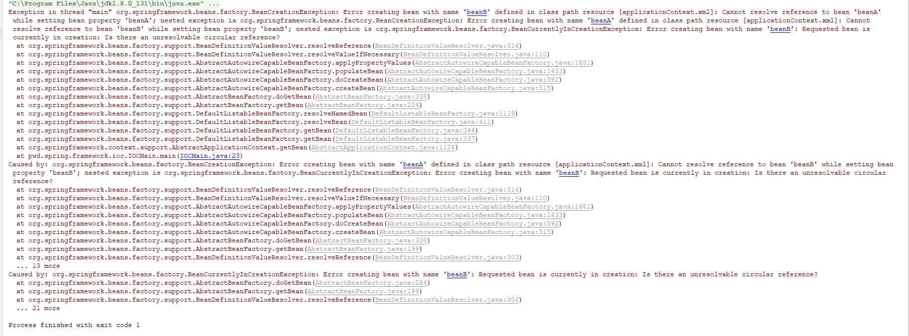
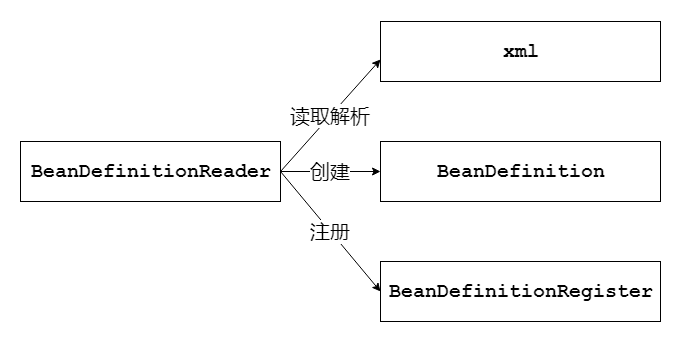
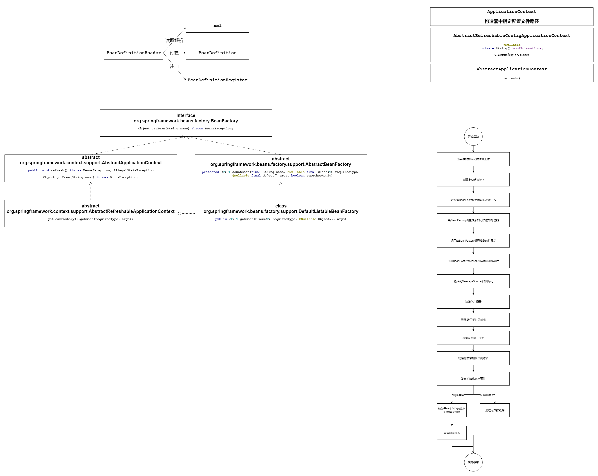
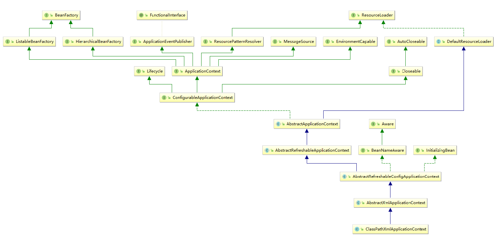
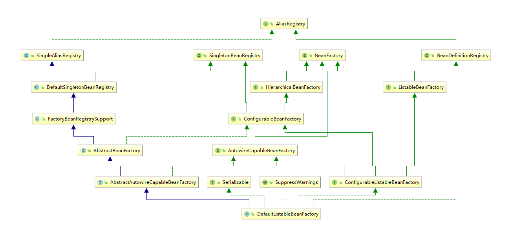
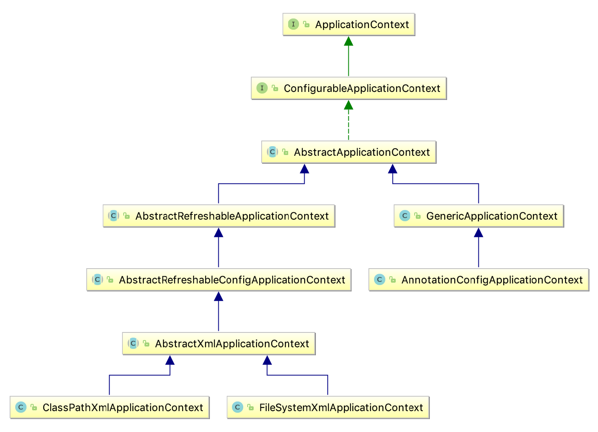
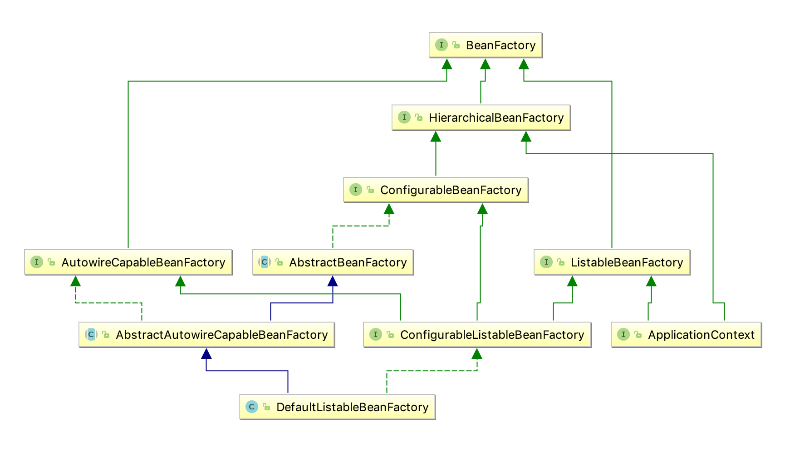
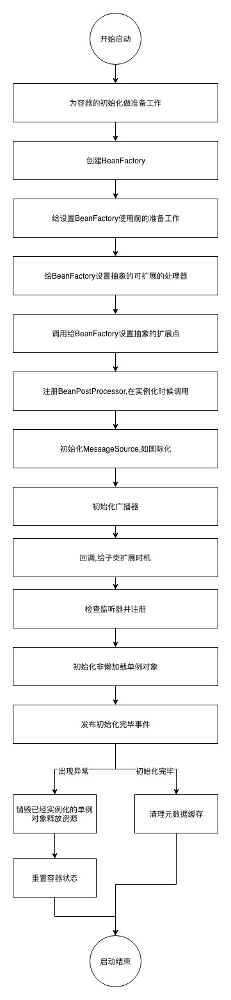

## IOC（Inversion of Control）（控制反转）和DI（依赖注入）
IOC和DI是一种编程需求，要解决的问题有两个：
- 对象初始化（IOC目标）
- 对象之间的依赖关系（DI目标）

没有IOC和DI的时候，在程序中如果A对象调用B对象，对于A来说B对象是如何初始化的呢？A是如何依赖B的呢？
- A关注B的实例化：在A的内部通过new关键字或者手动通过反射方式创建一个B的实例；
- A忽视B的实例化：可以在实例化A的时候，把B的实例通过参数传入到A的构造器中（至于谁实例化B，则是调用方的事情，不是A关注的事情）；

在上述实例化中如果B对象的依赖很复杂，比如B依赖了C，C依赖了D，则创建B对象时候要构建整个依赖关系。而IOC和DI的出现就是为了自动化上述场景中实例化对象以及解决对象依赖的一种编程方式。


## SpringIOC 和 SpringDI
SpringIOC，SpringDI是IOC，DI思想在Spring的实现，核心就是描述Bean以及对Bean生命周期管理以及解决对象创建时候的依赖关系。

```java
@AllArgsConstructor
@NoArgsConstructor
@Setter
@Getter
public class BeanA {
  private Long id;
  private String name;
  private BeanB beanB;
  
  public static BeanA getBean(String flag) {
    if ("a".equals(flag)) {
      // Do something
    } else {
      // Do something
    }
    return new BeanA();
  }
}
```
```java
@AllArgsConstructor
@NoArgsConstructor
@Setter
@Getter
public class BeanB {
  private Long id;
  private String name;
  private BeanA beanA;
}
```
### SpringIOC中定义了Bean的创建方式有四种：
- 基于Class构建：使用<bean>标签，基于反射实现；
- 构造方法创建：使用<bean>标签，并配置构造器参数，基于ASM获取字节码中方法的参数实现；
- 静态工厂创建：静态工厂就是在类中静态化一个方法，方法内new出对象，供加载初始化，在AB测试过程中使用，其他不常用；
- FactoryBean：自定义类实现FactoryBean，并配置在<bean>标签上，在配置中可以设置属性参数。运行时获取到的bean并不是自定义的FactoryBean的实例，而是其中的真正返回的bean的实例。
#### 基于Class构建实例
```xml
<?xml version="1.0" encoding="UTF-8"?>
<beans xmlns:xsi="http://www.w3.org/2001/XMLSchema-instance"
  xmlns="http://www.springframework.org/schema/beans"
  xsi:schemaLocation="http://www.springframework.org/schema/beans http://www.springframework.org/schema/beans/spring-beans.xsd">
  <!--根据默认构造函数构建-->
  <bean class="pwd.spring.mybatis.ioc.BeanA"></bean>
</beans>
```
#### 基于构造方法创建实例
```xml
<?xml version="1.0" encoding="UTF-8"?>
<beans xmlns:xsi="http://www.w3.org/2001/XMLSchema-instance"
  xmlns="http://www.springframework.org/schema/beans"
  xsi:schemaLocation="http://www.springframework.org/schema/beans http://www.springframework.org/schema/beans/spring-beans.xsd">
  <!--根据默认构造函数构建-->
  <bean id="beanA" class="pwd.spring.mybatis.ioc.BeanA">
    <constructor-arg index="0" value="123"></constructor-arg>
    <constructor-arg index="1" value="abc"></constructor-arg>
    <constructor-arg index="2" ref="beanB"></constructor-arg>
  </bean>
  
  <bean id="beanB"  class="pwd.spring.mybatis.ioc.BeanB">
    <constructor-arg index="0" value="123"></constructor-arg>
    <constructor-arg index="1" value="abc"></constructor-arg>
    <constructor-arg index="2" ref="beanA"></constructor-arg>
  </bean>
</beans>
```
#### 基于静态工厂创建实例
```xml
<?xml version="1.0" encoding="UTF-8"?>
<beans xmlns:xsi="http://www.w3.org/2001/XMLSchema-instance"
  xmlns="http://www.springframework.org/schema/beans"
  xsi:schemaLocation="http://www.springframework.org/schema/beans http://www.springframework.org/schema/beans/spring-beans.xsd">
  <bean class="pwd.spring.mybatis.ioc.BeanA" factory-method="getBean">
    <constructor-arg name="flag" value="a"></constructor-arg>
  </bean>
</beans>
```
#### 基于FactoryBean实例
Mybatis、JDBC等集成在Spring中的实现均采用该方式
```java
package pwd.spring.mybatis.ioc;

import lombok.Getter;
import lombok.Setter;
import org.springframework.beans.factory.FactoryBean;

/**
 * pwd.spring.mybatis.ioc@gitbook
 *
 * <h1>TODO what you want to do?</h1>
 *
 * date 2019-11-27 14:11
 *
 * @author DingPengwei[dingpengwei@foxmail.com]
 * @version 1.0.0
 * @since DistributionVersion
 */
@Getter
@Setter
public class BeanAFactoryBean implements FactoryBean {
  
  private Long id;
  private String name;
  
  @Override
  public boolean isSingleton() {
    // false 每次创建都要调用getObject()
    return true;
  }

  @Override
  public Object getObject() throws Exception {
    return new BeanA();
  }

  @Override
  public Class<?> getObjectType() {
    return BeanA.class;
  }
}
```

```xml
<?xml version="1.0" encoding="UTF-8"?>
<beans xmlns:xsi="http://www.w3.org/2001/XMLSchema-instance"
  xmlns="http://www.springframework.org/schema/beans"
  xsi:schemaLocation="http://www.springframework.org/schema/beans http://www.springframework.org/schema/beans/spring-beans.xsd">
  <bean id="beanA" class="pwd.spring.mybatis.ioc.BeanAFactoryBean">
    <property name="id" value="123"></property>
    <property name="name" value="abc"></property>
  </bean>
</beans>

```

### Bean在SpringIoC中的特性
- 作用范围scope：
  + singleton(默认)：在spring容器中只存在一个实例，所有对象的引用将共享这个实例。（注：不要和单例模式搞混）
  + prototype：容器每次都会生成一个新的对象实例给请求方。
  + request （限定在web应用中使用）：为每个http请求创建一个全新的request-processor对象供当前请求使用，请求结束，实例生命周期即结束。
  + session （限定在web应用中使用）：为每个独立的session创建一个全新的UserPreference对象实例。
  + global session （限定在web应用中使用）：只有应用在基于portlet的Web应用程序中才有意义，它映射到portlet的global范围的session。如果在普通的基于servlet的Web应用中使用了这个类型的scope，容器会将其作为普通的session类型的scope对待。
  
- 生命周期：类中可配置init以及destroy的方法，并配置到<bean>，即可得到响应的回调，也可实现InitBean和DestroyBean的接口依托Spring容器周期自动实现。
- 装载机制：配置bean是否是懒加载。如果想尽早发现bug，则使用非懒加载方式。

### SpringDI通过四种方式产生Bean的依赖：
如果没有DI产生依赖，以及解决循环依赖问题，则IOC的应用场景则一无是处。
- 构造方法注入

见上述IOC创建对象的构造器方法
- Set方法注入

见上述IOC创建对象的Set方法

- 自动注入(byName,byType,constructor,default)：默认按照byName创建依赖，默认的方式受到全局配置的影响。

   - byName  
    配置autowire="byName",则BeanA在初始化后根据属性的名称在配置中寻找名称和ID一致的Bean
      ```xml
      <?xml version="1.0" encoding="UTF-8"?>
      <beans xmlns:xsi="http://www.w3.org/2001/XMLSchema-instance"
        xmlns="http://www.springframework.org/schema/beans"
        xsi:schemaLocation="http://www.springframework.org/schema/beans http://www.springframework.org/schema/beans/spring-beans.xsd">
        <bean id="beanA" class="pwd.spring.mybatis.ioc.BeanA" autowire="byName"></bean>
        <bean id="beanB" class="pwd.spring.mybatis.ioc.BeanB"></bean>
        <bean id="beanBxxx" class="pwd.spring.mybatis.ioc.BeanB"></bean>
      </beans>
      
      ```  
   - byType  
    配置autowire="byType",则BeanA在初始化后自动读取配置中的BeanB的配置，如果多个Bean的配置，这应指定一个primary。
      ```xml
      <?xml version="1.0" encoding="UTF-8"?>
      <beans xmlns:xsi="http://www.w3.org/2001/XMLSchema-instance"
        xmlns="http://www.springframework.org/schema/beans"
        xsi:schemaLocation="http://www.springframework.org/schema/beans http://www.springframework.org/schema/beans/spring-beans.xsd">
        <bean id="beanA" class="pwd.spring.mybatis.ioc.BeanA" autowire="byType"></bean>
        <bean class="pwd.spring.mybatis.ioc.BeanB" primary="true"></bean>
        <bean class="pwd.spring.mybatis.ioc.BeanB"></bean>
      </beans>
      ```

  - constructor  
    配置autowire="constructor",在BeanA中构建一个以BeanB为参数的构造器。
      ```xml
      <?xml version="1.0" encoding="UTF-8"?>
      <beans xmlns:xsi="http://www.w3.org/2001/XMLSchema-instance"
        xmlns="http://www.springframework.org/schema/beans"
        xsi:schemaLocation="http://www.springframework.org/schema/beans http://www.springframework.org/schema/beans/spring-beans.xsd">
        <bean id="beanA" class="pwd.spring.mybatis.ioc.BeanA" autowire="constructor"></bean>
      </beans>
      ```
  - 修该全局配置
    ```xml
    <?xml version="1.0" encoding="UTF-8"?>
    <beans xmlns:xsi="http://www.w3.org/2001/XMLSchema-instance"
      xmlns="http://www.springframework.org/schema/beans"
      xsi:schemaLocation="http://www.springframework.org/schema/beans http://www.springframework.org/schema/beans/spring-beans.xsd"
      default-autowire="byType">
      <bean id="beanA" class="pwd.spring.mybatis.ioc.BeanA"></bean>
    </beans>
    ```    
- 方法注入（lookup-method）  
在单例A依赖多例B，且需要每次调用A都要创建新B的场景中使用；过程是是创建一个无需实现的抽象类，给定一个抽象方法，返回值是动态类;
实现原理是Spring使用CGlib实现抽象类，使用到了动态字节码增强技术。另外也可以使用实现BeanFactoryAware类实现。这种设计不常见。
```xml
package pwd.spring.mybatis.ioc;

/**
 * pwd.spring.mybatis.ioc@gitbook
 *
 * <h1>TODO what you want to do?</h1>
 *
 * date 2019-11-27 19:06
 *
 * @author DingPengwei[dingpengwei@foxmail.com]
 * @version 1.0.0
 * @since DistributionVersion
 */
public abstract class A {

  public void refreshBeanB() {
    BeanB beanB = getBeanB();
    // newest bean instance 
  }

  public abstract BeanB getBeanB();
}
```
```xml
<?xml version="1.0" encoding="UTF-8"?>
<beans xmlns:xsi="http://www.w3.org/2001/XMLSchema-instance"
  xmlns="http://www.springframework.org/schema/beans"
  xsi:schemaLocation="http://www.springframework.org/schema/beans http://www.springframework.org/schema/beans/spring-beans.xsd">
  <bean class="pwd.spring.mybatis.ioc.A">
    <lookup-method name="getBeanB"></lookup-method>
  </bean>
</beans>
```
#### 构造方法注入产生的循环依赖无法解除，造成容器初始化失败
```xml
<?xml version="1.0" encoding="UTF-8"?>
<beans xmlns:xsi="http://www.w3.org/2001/XMLSchema-instance"
  xmlns="http://www.springframework.org/schema/beans"
  xsi:schemaLocation="http://www.springframework.org/schema/beans http://www.springframework.org/schema/beans/spring-beans.xsd">
  <bean class="pwd.spring.mybatis.ioc.BeanA" id="beanA">
    <constructor-arg name="beanB" ref="beanB"></constructor-arg>
  </bean>
  <bean class="pwd.spring.mybatis.ioc.BeanB" id="beanB">
    <constructor-arg name="beanA" ref="beanA"></constructor-arg>
  </bean>
</beans>
```


#### Set方法注入产生的循环依赖scope为singleton，容器可以解除循环依赖
```xml
<?xml version="1.0" encoding="UTF-8"?>
<beans xmlns:xsi="http://www.w3.org/2001/XMLSchema-instance"
  xmlns="http://www.springframework.org/schema/beans"
  xsi:schemaLocation="http://www.springframework.org/schema/beans http://www.springframework.org/schema/beans/spring-beans.xsd">
  <bean class="pwd.spring.mybatis.ioc.BeanA" id="beanA">
    <property name="beanB" ref="beanB"></property>
  </bean>
  <bean class="pwd.spring.mybatis.ioc.BeanB" id="beanB">
    <property name="beanA" ref="beanA"></property>
  </bean>
</beans>
```

IOC 容器在读到上面的配置时，会按照顺序，先去实例化 beanA。然后发现 beanA 依赖于 beanB，接在又去实例化 beanB。实例化 beanB 时，发现 beanB 又依赖于 beanA。
如果容器不处理循环依赖的话，容器会无限执行上面的流程，直到内存溢出，程序崩溃。当然，Spring 是不会让这种情况发生的。在容器再次发现 beanB 依赖于 beanA 时，
容器会获取 beanA 对象的一个早期的引用（early reference），并把这个早期引用注入到 beanB 中，让 beanB 先完成实例化。
beanB 完成实例化，beanA 就可以获取到 beanB 的引用，beanA 随之完成实例化。所谓的”早期引用“是指向原始对象的引用。所谓的原始对象是指刚创建好的对象，但还未填充属性。

org.springframework.beans.factory.support.DefaultSingletonBeanRegistry 对缓存的定义
```java
public class DefaultSingletonBeanRegistry extends SimpleAliasRegistry implements SingletonBeanRegistry {
/** Cache of singleton objects: bean name --> bean instance */
//用于存放完全初始化好的 bean，从该缓存中取出的 bean 可以直接使用
private final Map<String, Object> singletonObjects = new ConcurrentHashMap<String, Object>(256);

/** Cache of singleton factories: bean name --> ObjectFactory */
//存放原始的 bean 对象（尚未填充属性），用于解决循环依赖
private final Map<String, ObjectFactory<?>> singletonFactories = new HashMap<String, ObjectFactory<?>>(16);

/** Cache of early singleton objects: bean name --> bean instance */
// 存放 bean 工厂对象，用于解决循环依赖
private final Map<String, Object> earlySingletonObjects = new HashMap<String, Object>(16);  
}
```
#### Set方法注入产生的循环依赖scope都为prototype，容器无法解除循环解除，依赖链上有一个singleton则可以解除循环依赖

```xml
<?xml version="1.0" encoding="UTF-8"?>
<beans xmlns:xsi="http://www.w3.org/2001/XMLSchema-instance"
  xmlns="http://www.springframework.org/schema/beans"
  xsi:schemaLocation="http://www.springframework.org/schema/beans http://www.springframework.org/schema/beans/spring-beans.xsd">
  <bean class="pwd.spring.mybatis.ioc.BeanA" id="beanA" scope="prototype">
    <property name="beanB" ref="beanB"></property>
  </bean>
  <bean class="pwd.spring.mybatis.ioc.BeanB" id="beanB" scope="prototype">
    <property name="beanA" ref="beanA"></property>
  </bean>
</beans>
```

对于prototype作用域bean，spring容器无法完成依赖注入，因为spring容器不进行缓存prototype作用域的bean，因此无法提前暴露一个正在创建中的bean。

## SpringIOC是如何实例化Bean的？
Spring读取配置文件中的<bean>节点，在加载后都会对应一个BeanDefinition类,或者一个BeanDefinition子类。
通过BeanDefinitionReader读取后注册到BeanDefinitionRegistry。然后进入BeanFactory创建。
一个id可以对应一个bean实例，一个bean可以对应多个id。



在org.springframework.beans.factory.support.DefaultListableBeanFactory中保存了BeanDefinition
```java
	/** Map of bean definition objects, keyed by bean name. */
	private final Map<String, BeanDefinition> beanDefinitionMap = new ConcurrentHashMap<>(256);
```
// TODO 代码模拟一下BeanDefinitionReader在上图中的三个过程。

## BeanFactory和ApplicationContext的区别

BeanFactory：是Spring里面最低层的接口，提供了最简单的容器的功能，只提供了实例化对象和获取对象以及依赖注入的功能；BeanFactory默认懒加载，在启动的时候不会去实例化Bean，中有从容器中拿Bean的时候才会去实例化；
ApplicationContext：继承BeanFactory接口，它是Spring的一各更高级的容器，提供了更多的有用的功能；
1) 国际化（MessageSource）
2) 访问资源，如URL和文件（ResourceLoader）
3) 载入多个（有继承关系）上下文 ，使得每一个上下文都专注于一个特定的层次，比如应用的web层  
4) 事件机制消息发送、响应机制（ApplicationEventPublisher）
5) AOP（拦截器）  
ApplicationContext在启动的时候就把所有的Bean全部实例化了。它还可以为Bean配置lazy-init=true来让Bean延迟实例化； 
ApplicationContext有多重实现表示不同层次的上下文ApplicationContext支持事件机制

该用BeanFactory还是ApplicationContent

延迟实例化的优点：（BeanFactory）

应用启动的时候占用资源很少；对资源要求较高的应用，比较有优势； 

不延迟实例化的优点： （ApplicationContext）

1. 所有的Bean在启动的时候都加载，系统运行的速度快； 

2. 在启动的时候所有的Bean都加载了，我们就能在系统启动的时候，尽早的发现系统中的配置问题 

3. 建议web应用，在启动的时候就把所有的Bean都加载了。（把费时的操作放到系统启动中完成）

### BeanFactory和ApplicationContext和BeanDefinitionRegistry的结合





```java
public class BeanFactoryMain {
  public static void main(String[] args) throws Throwable{
    ResourcePatternResolver resolver = new PathMatchingResourcePatternResolver();
    Resource res = resolver.getResource("classpath:applicationContext.xml");
    System.out.println(res.getURL());
    BeanFactory beanFactory = new XmlBeanFactory(res);
    BeanA bean = beanFactory.getBean(BeanA.class);
  }
}
```
```java
public class IOCMain {

  public static void main(String[] args) {
    ApplicationContext fileSystemXmlApplicationContext = new FileSystemXmlApplicationContext(
        "classpath:applicationContext.xml");
    BeanA bean = fileSystemXmlApplicationContext.getBean(BeanA.class);
  }
}
```
 ApplicationContext的初始化和BeanFactory有一个重大的区别:BeanFactory在初始化容器时，并未实例化Bean,直到第一次访问某个Bean时才实例目标Bean;而ApplicationContext则在初始化应用上下文时就实例化所有的单实例的Bean。因此ApplicationContext的初始化时间会比BeanFactory稍长一些.


-  ApplicationContext(上下文容器)：一般由ClassPathXmlApplicationContext或者AnnotationConfigApplicationContext担任。


- BeanFactory：一般由DefaultListableBeanFactory担任。


上下文容器持有了Bean工厂容器。通过父类的getBeanFactory方法获取Bean工厂的实现类的实例。


org.springframework.context.support.AbstractRefreshableApplicationContext#getBeanFactory

# SpringIOC容器启动流程，refresh()接口中的实现逻辑


## ApplicationContext启动流程
   
 ```
   sequenceDiagram
   ClassPathXmlApplicationContext ->>+ AbstractRefreshableConfigApplicationContext: setConfigLocations
   AbstractRefreshableConfigApplicationContext ->> AbstractRefreshableConfigApplicationContext: 给变量configLocations赋值
   AbstractRefreshableConfigApplicationContext -->>- ClassPathXmlApplicationContext:void
   activate AbstractApplicationContext
   ClassPathXmlApplicationContext ->> AbstractApplicationContext: refresh
   AbstractApplicationContext ->> AbstractApplicationContext: 加锁
   AbstractApplicationContext ->> AbstractApplicationContext: prepareRefresh：\n为容器记录启动时间和启动状态\n初始化配置文件占位符\n
   AbstractApplicationContext ->> AbstractApplicationContext: obtainFreshBeanFactory：
   AbstractApplicationContext ->> AbstractApplicationContext: refreshBeanFactory
   AbstractApplicationContext ->> AbstractRefreshableApplicationContext: refreshBeanFactory：为了生成DefaultListableBeanFactory类型的BeanFactory
   deactivate AbstractApplicationContext
   activate AbstractRefreshableApplicationContext
   AbstractRefreshableApplicationContext ->> AbstractRefreshableApplicationContext: 工厂已初始化就销毁并重建
   AbstractRefreshableApplicationContext ->> AbstractRefreshableApplicationContext: 设置工厂的ID等信息
   AbstractRefreshableApplicationContext ->> AbstractRefreshableApplicationContext: loadBeanDefinitions
   AbstractRefreshableApplicationContext ->> AbstractXmlApplicationContext: loadBeanDefinitions
   deactivate AbstractRefreshableApplicationContext
   activate AbstractXmlApplicationContext
   AbstractXmlApplicationContext ->> AbstractXmlApplicationContext: 初始化XmlBeanDefinitionReader
   AbstractXmlApplicationContext ->> AbstractXmlApplicationContext: 给XmlBeanDefinitionReader设置环境等
   AbstractXmlApplicationContext ->> AbstractXmlApplicationContext: 给XmlBeanDefinitionReader配置xml解析器
   AbstractXmlApplicationContext ->> AbstractXmlApplicationContext: loadBeanDefinitions
   AbstractXmlApplicationContext ->> AbstractBeanDefinitionReader: loadBeanDefinitions
   deactivate AbstractXmlApplicationContext
   activate AbstractBeanDefinitionReader
   AbstractBeanDefinitionReader ->> AbstractBeanDefinitionReader: for循环执行loadBeanDefinitions
   AbstractBeanDefinitionReader ->> XmlBeanDefinitionReader: loadBeanDefinitionst,同步IO加载配置文件进行解读
   deactivate AbstractBeanDefinitionReader
   activate XmlBeanDefinitionReader
   XmlBeanDefinitionReader ->> XmlBeanDefinitionReader: doLoadBeanDefinitions,形成文档对象
   XmlBeanDefinitionReader ->> XmlBeanDefinitionReader: registerBeanDefinitions,
   XmlBeanDefinitionReader ->> DefaultBeanDefinitionDocumentReader: doRegisterBeanDefinitions,
   deactivate XmlBeanDefinitionReader
   activate DefaultBeanDefinitionDocumentReader
   DefaultBeanDefinitionDocumentReader ->> DefaultBeanDefinitionDocumentReader: 创建BeanDefinitionParserDelegate,
   DefaultBeanDefinitionDocumentReader ->> DefaultBeanDefinitionDocumentReader: 前置preProcessXml空实现
   DefaultBeanDefinitionDocumentReader ->> DefaultBeanDefinitionDocumentReader: parseBeanDefinitions,
   DefaultBeanDefinitionDocumentReader ->> DefaultBeanDefinitionDocumentReader: parseDefaultElement,
   DefaultBeanDefinitionDocumentReader ->> DefaultBeanDefinitionDocumentReader: processBeanDefinition,
   DefaultBeanDefinitionDocumentReader ->> BeanDefinitionReaderUtils: registerBeanDefinition
   deactivate DefaultBeanDefinitionDocumentReader
   
   BeanDefinitionReaderUtils ->> BeanDefinitionRegistry: registerBeanDefinition
   
   BeanDefinitionRegistry ->>+ DefaultListableBeanFactory: registerBeanDefinition
   DefaultListableBeanFactory ->> DefaultListableBeanFactory: 把BeanDefinition注册到持有的ConcurrentHashMap<String, BeanDefinition>中
   DefaultListableBeanFactory -->>- AbstractApplicationContext: 注册完毕尚未实例化
   
   DefaultBeanDefinitionDocumentReader --> DefaultBeanDefinitionDocumentReader: 后置preProcessXml空实现
   activate AbstractApplicationContext
   AbstractApplicationContext ->> AbstractApplicationContext: getBeanFactory，检测AbstractRefreshableApplicationContext\n中新建的BeanFactory对象是否成功
   AbstractApplicationContext ->> AbstractApplicationContext: prepareBeanFactory，给BeaFactory配置加载器，BeanPostProcessor等属性
   AbstractApplicationContext ->> AbstractBeanFactory: addBeanPostProcessor\n把BeanPostProcessor实例存入List集合，\n比较奇怪的是首先从集合中移除该实例,\n然后再添加， 如果为了排重为何不使用set呢？
   deactivate AbstractApplicationContext
   
   activate AbstractApplicationContext
   AbstractApplicationContext ->> AbstractApplicationContext: postProcessBeanFactory: \n空实现，给子类处理机会，如注册request/session域
   AbstractApplicationContext ->> AbstractApplicationContext: invokeBeanFactoryPostProcessors,BeanFactoryPostProcessor对象处理，类似于BeanPostProcessor。
   AbstractApplicationContext ->> AbstractApplicationContext: registerBeanPostProcessors:对添加的BeanPostProcessor进行注册，进行排序等操作后还是对AbstractBeanFactory: addBeanPostProcessor的操作。
   AbstractApplicationContext ->> AbstractApplicationContext: initMessageSource，初始化MessageSource如国际化等信息
   AbstractApplicationContext ->> AbstractApplicationContext: initApplicationEventMulticaster，初始化当前 ApplicationContext 的事件广播器
   AbstractApplicationContext ->> AbstractApplicationContext: onRefresh，钩子方法，供子类扩展使用
   AbstractApplicationContext ->> AbstractApplicationContext: registerListeners，检查并注册监听器，监听器就是注册到上一步中初始化的广播器中
   AbstractApplicationContext ->> AbstractApplicationContext: finishBeanFactoryInitialization，实例化已经注册的bean
   AbstractApplicationContext ->> AbstractApplicationContext: finishRefresh，for循环广播出事件
   AbstractApplicationContext ->> AbstractApplicationContext: resetCommonCaches:
   deactivate activate AbstractApplicationContext   
  ```
