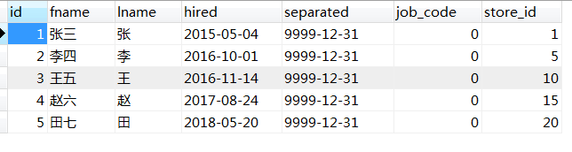
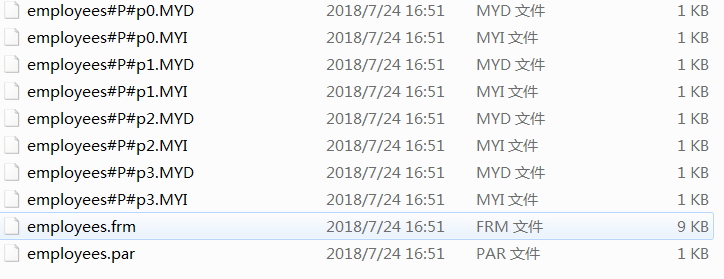
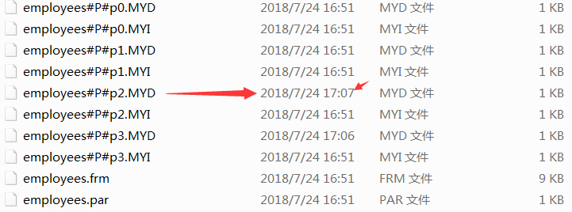

# MySQL数据库表分区功能详解

1、什么是表分区？

mysql数据库中的数据是以文件的形势存在磁盘上的，默认放在/mysql/data下面（可以通过my.cnf中的datadir来查看），一张表主要对应着三个文件，一个是frm存放表结构的，一个是myd存放表数据的，一个是myi存表索引的。如果一张表的数据量太大的话，那么myd,myi就会变的很大，查找数据就会变的很慢，这个时候我们可以利用mysql的分区功能，在物理上将这一张表对应的三个文件，分割成许多个小块，这样呢，我们查找一条数据时，就不用全部查找了，只要知道这条数据在哪一块，然后在那一块找就行了。如果表的数据太大，可能一个磁盘放不下，这个时候，我们可以把数据分配到不同的磁盘里面去。

表分区，是指根据一定规则，将数据库中的一张表分解成多个更小的，容易管理的部分。从逻辑上看，只有一张表，但是底层却是由多个物理分区组成。

2、表分区与分表的区别

分表：指的是通过一定规则，将一张表分解成多张不同的表。比如将用户订单记录根据时间成多个表。 分表与分区的区别在于：分区从逻辑上来讲只有一张表，而分表则是将一张表分解成多张表。

3、表分区有什么好处？

（1）、与单个磁盘或文件系统分区相比，可以存储更多的数据。

（2）、对于那些已经失去保存意义的数据，通常可以通过删除与那些数据有关的分区，很容易地删除那些数据。相反地，在某些情况下，添加新数据的过程又可以通过为那些新数据专门增加一个新的分区，来很方便地实现。

（3）、一些查询可以得到极大的优化，这主要是借助于满足一个给定WHERE语句的数据可以只保存在一个或多个分区内，这样在查找时就不用查找其他剩余的分区。因为分区可以在创建了分区表后进行修改，所以在第一次配置分区方案时还不曾这么做时，可以重新组织数据，来提高那些常用查询的效率。

（4）、涉及到例如SUM()和COUNT()这样聚合函数的查询，可以很容易地进行并行处理。这种查询的一个简单例子如 “SELECT salesperson_id, COUNT (orders) as order_total FROM sales GROUP BY salesperson_id；”。通过“并行”，这意味着该查询可以在每个分区上同时进行，最终结果只需通过总计所有分区得到的结果。

5）、通过跨多个磁盘来分散数据查询，来获得更大的查询吞吐量。

4、分区表的限制因素

（1）、一个表最多只能有1024个分区。

（2）、 MySQL5.1中，分区表达式必须是整数，或者返回整数的表达式。在MySQL5.5中提供了非整数表达式分区的支持。

（3）、如果分区字段中有主键或者唯一索引的列，那么多有主键列和唯一索引列都必须包含进来。即：分区字段要么不包含主键或者索引列，要么包含全部主键和索引列。

（4）、分区表中无法使用外键约束。

（5）、MySQL的分区适用于一个表的所有数据和索引，不能只对表数据分区而不对索引分区，也不能只对索引分区而不对表分区，也不能只对表的一部分数据分区。

5、如何判断当前MySQL是否支持分区？
```
mysql> show variables like '%partition%';
+-------------------+-------+
| Variable_name     | Value |
+-------------------+-------+
| have_partitioning | YES   |
+-------------------+-------+
row in set (0.00 sec)
```
have_partintioning 的值为YES，表示支持分区。

 6、MySQL支持的分区类型有哪些？

（1）、RANGE分区：基于属于一个给定连续区间的列值，把多行分配给分区。

（2）、LIST分区：类似于按RANGE分区，区别在于LIST分区是基于列值匹配一个离散值集合中的某个值来进行选择。

（3）、HASH分区：基于用户定义的表达式的返回值来进行选择的分区，该表达式使用将要插入到表中的这些行的列值进行计算。这个函数可以包含MySQL 中有效的、产生非负整数值的任何表达式。

（4）、KEY分区：类似于按HASH分区，区别在于KEY分区只支持计算一列或多列，且MySQL服务器提供其自身的哈希函数。必须有一列或多列包含整数值。

说明：在MySQL5.1版本中，RANGE,LIST,HASH分区要求分区键必须是INT类型，或者通过表达式返回INT类型。但KEY分区的时候，可以使用其他类型的列(BLOB，TEXT类型除外)作为分区键。

6.1、RANGE分区

根据范围分区，范围应该连续但是不重叠，使用PARTITION BY RANGE, VALUES LESS THAN关键字。不使用COLUMNS关键字时RANGE括号内必须为整数字段名或返回确定整数的函数。

6.1.1、根据数值范围
```
drop table if exists employees;
create table employees(
    id int not null,
    fname varchar(30),
    lname varchar(30),
    hired date not null default '1970-01-01',
    separated date not null default '9999-12-31',
    job_code int not null default 0,
    store_id int not null default 0
)engine=myisam default charset=utf8
partition by range(store_id)(
    partition p0 values less than (6),
    partition p1 values less than (11),
    partition p2 values less than (16),
    partition p3 values less than (21)
);
```
```
insert into employees (id,fname,lname,hired,store_id) values(1,'张三','张','2015-05-04',1);
insert into employees (id,fname,lname,hired,store_id) values(2,'李四','李','2016-10-01',5);
insert into employees (id,fname,lname,hired,store_id) values(3,'王五','王','2016-11-14',10);
insert into employees (id,fname,lname,hired,store_id) values(4,'赵六','赵','2017-08-24',15);
insert into employees (id,fname,lname,hired,store_id) values(5,'田七','田','2018-05-20',20);
```




按照这种分区方案，在商店1到5工作的雇员相对应的所有行被保存在分区P0中，商店6到10的雇员保存在P1中，依次类推。注意，每个分区都是按顺序进行定义，从最低到最高。这是PARTITION BY RANGE 语法的要求。

对于包含数据(6,'亢八','亢','2018-06-24',13)的一个新行，可以很容易地确定它将插入到p2分区中。

```
insert into employees (id,fname,lname,hired,store_id) values(6,'亢八','亢','2018-06-24',13);
```



但是如果增加了一个编号为第21的商店(7,'周九','周','2018-07-24',21)，将会发生什么呢？在这种方案下，由于没有规则把store_id大于20的商店包含在内，服务器将不知道把该行保存在何处，将会导致错误。

```
insert into employees (id,fname,lname,hired,store_id) values(7,'周九','周','2018-07-24',21);

ERROR 1526 (HY000): Table has no partition for value 21
```
要避免这种错误，可以通过在CREATE TABLE语句中使用一个“catchall” VALUES LESS THAN子句，该子句提供给所有大于明确指定的最高值的值：
```
create table employees(
    id int not null,
    fname varchar(30),
    lname varchar(30),
    hired date not null default '1970-01-01',
    separated date not null default '9999-12-31',
    job_code int not null default 0,
    store_id int not null default 0
)engine=myisam default charset=utf8
partition by range(store_id)(
    partition p0 values less than (6),
    partition p1 values less than (11),
    partition p2 values less than (16),
    partition p3 values less than (21),
  partition p4 values less than MAXVALUE 
);
``` 

6.1.2、根据TIMESTAMP范围
```
drop table if exists quarterly_report_status;
create table quarterly_report_status(
  report_id int not null,
  report_status varchar(20) not null,
  report_updated timestamp not null default current_timestamp on update current_timestamp
)
partition by range(unix_timestamp(report_updated))(
  partition p0 values less than (unix_timestamp('2008-01-01 00:00:00')),
  partition p1 values less than (unix_timestamp('2008-04-01 00:00:00')),
  partition p2 values less than (unix_timestamp('2008-07-01 00:00:00')),
  partition p3 values less than (unix_timestamp('2008-10-01 00:00:00')),
  partition p4 values less than (unix_timestamp('2009-01-01 00:00:00')),
  partition p5 values less than (unix_timestamp('2009-04-01 00:00:00')),
  partition p6 values less than (unix_timestamp('2009-07-01 00:00:00')),
  partition p7 values less than (unix_timestamp('2009-10-01 00:00:00')),
  partition p8 values less than (unix_timestamp('2010-01-01 00:00:00')),
  partition p9 values less than maxvalue
);
```

6.1.3、根据DATE、DATETIME范围

添加COLUMNS关键字可定义非integer范围及多列范围，不过需要注意COLUMNS括号内只能是列名，不支持函数；多列范围时，多列范围必须呈递增趋势：
```
drop table if exists member;
create table member(
  firstname varchar(25) not null,
  lastname varchar(25) not null,
  username varchar(16) not null,
  email varchar(35),
  joined date not null
)
partition by range columns(joined)(
  partition p0 values less than ('1960-01-01'),
  partition p1 values less than ('1970-01-01'),
  partition p2 values less than ('1980-01-01'),
  partition p3 values less than ('1990-01-01'),
  partition p4 values less than maxvalue
)
``` 

6.1.4、根据多列范围
```
drop table if exists rc3;
create table rc3(
  a int,
  b int
)
partition by range columns(a,b)(
  partition p0 values less than (0,10),
  partition p1 values less than (10,20),
  partition p2 values less than (20,30),
  partition p3 values less than (30,40),
  partition p4 values less than (40,50),
  partition p5 values less than (maxvalue,maxvalue)
)
```

6.1.5、RANGE分区在如下场合特别有用
```
drop table if exists staff;
create table staff(
  id int not null,
  fname varchar(30),
  lname varchar(30),
  hired date not null default '1970-01-01',
  separated date not null default '9999-12-31',
  job_code int not null default 0,
  store_id int not null default 0
)engine=myisam default charset=utf8
partition by range(year(separated))(
  partition p0 values less than (1991),
  partition p1 values less than (1996),
  partition p2 values less than (2001),
  partition p4 values less than MAXVALUE
);
```

（1）、当需要删除一个分区上的“旧的”数据时，只删除分区即可。如果你使用上面最近的那个例子给出的分区方案，你只需简单地使用”alter table staff drop partition p0;”来删除所有在1991年前就已经停止工作的雇员相对应的所有行。对于有大量行的表，这比运行一个如”delete from staff WHERE year(separated) <= 1990;”这样的一个DELETE查询要有效得多。

（2）、想要使用一个包含有日期或时间值，或包含有从一些其他级数开始增长的值的列。

（3）、经常运行直接依赖于用于分割表的列的查询。例如，当执行一个如”select count(*) from staff where year(separated) = 200 group by store_id;”这样的查询时，MySQL可以很迅速地确定只有分区p2需要扫描，这是因为余下的分区不可能包含有符合该WHERE子句的任何记录。

6.2、LIST分区

根据具体数值分区，每个分区数值不重叠，使用PARTITION BY LIST、VALUES IN关键字。跟Range分区类似，不使用COLUMNS关键字时List括号内必须为整数字段名或返回确定整数的函数。

类似于按RANGE分区，区别在于LIST分区是基于列值匹配一个离散值集合中的某个值来进行选择。

LIST分区通过使用“PARTITION BY LIST(expr)”来实现，其中“expr”是某列值或一个基于某个列值、并返回一个整数值的表达式，然后通过“VALUES IN (value_list)”的方式来定义每个分区，其中“value_list”是一个通过逗号分隔的整数列表。

假定有20个音像店，分布在4个有经销权的地区，如下表所示：

====================

地区      商店ID 号

北区      3, 5, 6, 9, 17

东区      1, 2, 10, 11, 19, 20

西区      4, 12, 13, 14, 18

中心区   7, 8, 15, 16

```
drop table if exists staff;
create table staff(
  id int not null,
  fname varchar(30),
  lname varchar(30),
  hired date not null default '1970-01-01',
  separated date not null default '9999-12-31',
  job_code int not null default 0,
  store_id int not null default 0
)
partition by list(store_id)(
  partition pNorth values in (3,5,6,9,17),
  partition pEast values in (1,2,10,11,19,20),
  partition pWest values in (4,12,13,14,18),
  partition pCentral values in (7,8,15,16)
);
```

这使得在表中增加或删除指定地区的雇员记录变得容易起来。例如，假定西区的所有音像店都卖给了其他公司。那么与在西区音像店工作雇员相关的所有记录（行）可以使用查询“ALTER TABLE staff DROP PARTITION pWest；”来进行删除，它与具有同样作用的DELETE（删除）“DELETE FROM staff WHERE store_id IN (4,12,13,14,18)；”比起来，要有效得多。

如果试图插入列值（或分区表达式的返回值）不在分区值列表中的一行时，那么“INSERT”查询将失败并报错。

当插入多条数据出错时，如果表的引擎支持事务（Innodb），则不会插入任何数据；如果不支持事务，则出错前的数据会插入，后面的不会执行。

与Range分区相同，添加COLUMNS关键字可支持非整数和多列。

6.3、HASH分区

 Hash分区主要用来确保数据在预先确定数目的分区中平均分布，Hash括号内只能是整数列或返回确定整数的函数，实际上就是使用返回的整数对分区数取模。

要使用HASH分区来分割一个表，要在CREATE TABLE 语句上添加一个“PARTITION BY HASH (expr)”子句，其中“expr”是一个返回一个整数的表达式。它可以仅仅是字段类型为MySQL整型的一列的名字。此外，你很可能需要在后面再添加一个“PARTITIONS num”子句，其中num是一个非负的整数，它表示表将要被分割成分区的数量。

如果没有包括一个PARTITIONS子句，那么分区的数量将默认为1

```
drop table if exists staff;
create table staff(
  id int not null,
  fname varchar(30),
  lname varchar(30),
  hired date not null default '1970-01-01',
  separated date not null default '9999-12-31',
  job_code int not null default 0,
  store_id int not null default 0
)
partition by hash(store_id)
partitions 4;
``` 

```
drop table if exists staff;
create table staff(
  id int not null,
  fname varchar(30),
  lname varchar(30),
  hired date not null default '1970-01-01',
  separated date not null default '9999-12-31',
  job_code int not null default 0,
  store_id int not null default 0
)
partition by hash(year(hired))
partitions 4;
```

Hash分区也存在与传统Hash分表一样的问题，可扩展性差。MySQL也提供了一个类似于一致Hash的分区方法－线性Hash分区，只需要在定义分区时添加LINEAR关键字。

```
drop table if exists staff;
create table staff(
  id int not null,
  fname varchar(30),
  lname varchar(30),
  hired date not null default '1970-01-01',
  separated date not null default '9999-12-31',
  job_code int not null default 0,
  store_id int not null default 0
)
partition by linear hash(year(hired))
partitions 4;
```

线性哈希功能，它与常规哈希的区别在于，线性哈希功能使用的一个线性的2的幂（powers-of-two）运算法则，而常规哈希使用的是求哈希函数值的模数。

6.4、KEY分区

Key分区与Hash分区很相似，只是Hash函数不同，定义时把Hash关键字替换成Key即可，同样Key分区也有对应与线性Hash的线性Key分区方法。

```
drop table if exists staff;
create table staff(
  id int not null,
  fname varchar(30),
  lname varchar(30),
  hired date not null default '1970-01-01',
  separated date not null default '9999-12-31',
  job_code int not null default 0,
  store_id int not null default 0
)
partition by key(store_id)
partitions 4;
```

在KEY分区中使用关键字LINEAR和在HASH分区中使用具有同样的作用，分区的编号是通过2的幂（powers-of-two）算法得到，而不是通过模数算法。

另外，当表存在主键或唯一索引时可省略Key括号内的列名，Mysql将按照主键－唯一索引的顺序选择，当找不到唯一索引时报错。

##  如何使用分区表 


## 参考
https://www.cnblogs.com/zhouguowei/p/9360136.html
https://blog.csdn.net/yongqi_wang/article/details/86576006
