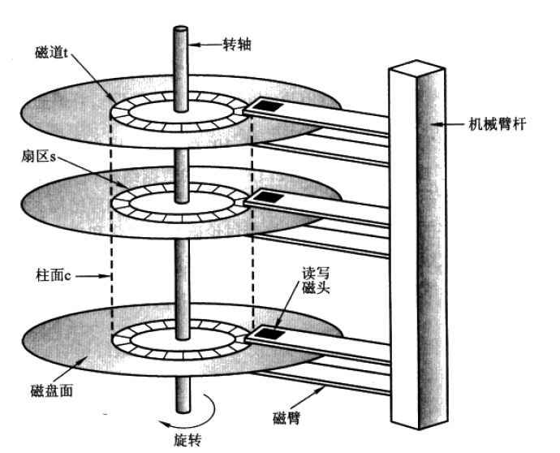
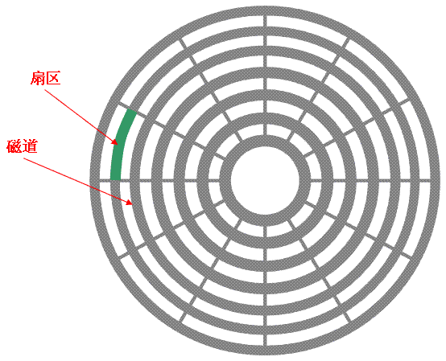
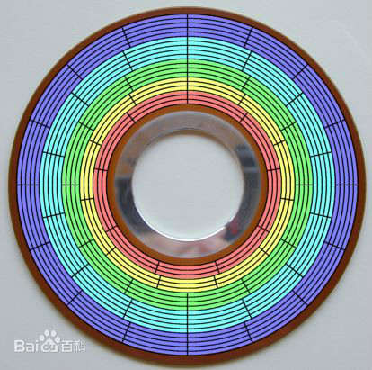
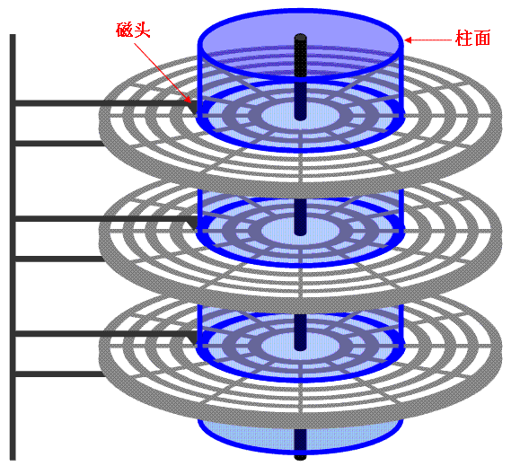

# 磁盘
## 机械磁盘
### 概述
- 盘片（platter）
- 盘面
- 磁头（head）
- 磁道（track）
- 扇区（sector）
- 柱面（cylinder）

### 盘片&片面&磁头
硬盘中一般会有多个盘片组成，每个盘片包含两个面，每个盘面都对应地有一个读/写磁头。受到硬盘整体体积和生产成本的限制，盘片数量都受到限制，一般都在5片以内。盘片的编号自下向上从0开始，如最下边的盘片有0面和1面，再上一个盘片就编号为2面和3面。
如下图：

### 磁道&扇区
下图显示的是一个盘面，盘面中一圈圈灰色同心圆为一条条磁道，从圆心向外画直线(新硬盘不是画直线)，可以将磁道划分为若干个弧段，每个磁道上一个弧段被称之为一个扇区（图践绿色部分）。扇区是磁盘的最小组成单元，通常是512字节。（由于不断提高磁盘的大小，部分厂商设定每个扇区的大小是4096字节）

每个磁道的扇区数一样是说的老的硬盘，外圈的密度小，内圈的密度大，每圈可存储的数据量是一样的。

新的硬盘数据的密度都一致，这样磁道的周长越长，扇区就越多，存储的数据量就越大。

因此磁道上扇区的划分不是简单的画直线，而是根容量据规范进行划分的，每个磁道上的扇区数量是不一样的。

磁盘的每一面被分为很多条磁道，即表面上的一些同心圆，越接近中心，圆就越小。而每一个磁道又按512个字节为单位划分为等分，叫做扇区，在一些硬盘的参数列表上你可以看到描述每个磁道的扇区数的参数，它通常用一个范围标识，例如373～746，这表示，最外圈的磁道有746个扇区，而最里面的磁道有373个扇区，因此可以算出来，磁道的容量分别是从186.5KB到373KB(190976B--381952B)。

磁盘驱动器在向磁盘读取和写入数据时，要以扇区为单位。在磁盘上，DOS操作系统是以“簇”为单位为文件分配磁盘空间的。硬盘的簇通常为多个扇区，与磁盘的种类、DOS 版本及硬盘分区的大小有关。每个簇只能由一个文件占用，即使这个文件中有几个字节，决不允许两个以上的文件共用一个簇，否则会造成数据的混乱。这种以簇为最小分配单位的机制，使硬盘对数据的管理变得相对容易，但也造成了磁盘空间的浪费，尤其是小文件数目较多的情况下，一个上千兆的大硬盘，其浪费的磁盘空间可达上百兆字节。

为了对扇区进行查找和管理，需要对扇区进行编号，扇区的编号从0磁道开始，起始扇区为1扇区，其后为2扇区、3扇区……，0磁道的扇区编号结束后，1磁道的起始扇区累计编号，直到最后一个磁道的最后一个扇区（n扇区）。例如，某个硬盘有1024个磁道，每个磁道划分为63个扇区，则0磁道的扇区号为1~63，1磁道的起始扇区号为64最后一个磁道的最后一个扇区号为64512。

硬盘在进行扇区编号时与软盘有一些区别，在软盘的一个磁道中，扇区号一次编排，即1、2、3……n扇区。由于硬盘的转速较高，磁头在完成某个扇区数据的读写后，必须将数据传输到微机，这需要一个时间，但是这时硬盘在继续高速旋转，当数据传输完成后，磁头读写第二个扇区时，磁盘已经旋转到了另外一个扇区。因此在早期硬盘中，扇区号是按照某个间隔系数跳跃编排的。

### 柱面

硬盘通常由重叠的一组盘片构成，每个盘面都被划分为数目相等的磁道，并从外缘的“0”开始编号，具有相同编号的磁道形成一个圆柱，称之为磁盘的柱面。磁盘的柱面数与一个盘面上的磁道数是相等的。由于每个盘面都有自己的磁头，因此，盘面数等于总的磁头数。 如下图

### 磁盘容量计算

存储容量 ＝ 磁头数 × 磁道(柱面)数 × 每道扇区数 × 每扇区字节数

图3中磁盘是一个 3个圆盘6个磁头，7个柱面（每个盘片7个磁道） 的磁盘，图3中每条磁道有12个扇区，所以此磁盘的容量为：

存储容量 6 * 7 * 12 * 512 = 258048

### 磁盘读取响应时间
- 寻道时间：磁头从开始移动到数据所在磁道所需要的时间，寻道时间越短，I/O操作越快，目前磁盘的平均寻道时间一般在3－15ms，一般都在10ms左右。
- 旋转延迟：盘片旋转将请求数据所在扇区移至读写磁头下方所需要的时间，旋转延迟取决于磁盘转速。普通硬盘一般都是7200rpm，慢的5400rpm。
- 数据传输时间：完成传输所请求的数据所需要的时间。

从上面的指标来看、其实最重要的、或者说、我们最关心的应该只有两个：寻道时间；旋转延迟。

读写一次磁盘信息所需的时间可分解为：寻道时间、延迟时间、传输时间。为提高磁盘传输效率，软件应着重考虑减少寻道时间和延迟时间。

## 固态磁盘

## 块/簇/页

### 块/簇

磁盘块/簇（虚拟出来的）。 块是操作系统中最小的逻辑存储单位。操作系统与磁盘打交道的最小单位是磁盘块。

通俗的来讲，在Windows下如NTFS等文件系统中叫做簇；在Linux下如Ext4等文件系统中叫做块（block）。每个簇或者块可以包括2、4、8、16、32、64…2的n次方个扇区。

为什么存在磁盘块？

读取方便：由于扇区的数量比较小，数目众多在寻址时比较困难，所以操作系统就将相邻的扇区组合在一起，形成一个块，再对块进行整体的操作。

分离对底层的依赖：操作系统忽略对底层物理存储结构的设计。通过虚拟出来磁盘块的概念，在系统中认为块是最小的单位。

### 页
操作系统经常与内存和硬盘这两种存储设备进行通信，类似于“块”的概念，都需要一种虚拟的基本单位。所以，与内存操作，是虚拟一个页的概念来作为最小单位。与硬盘打交道，就是以块为最小单位。

x86的linux中一个标准页面大小是4KB

#### pageCache

系统的所有文件I/O请求，操作系统都是通过page cache机制实现的。对于操作系统来说，磁盘文件都是由一系列的数据块顺序组成，数据块的大小由操作系统本身而决定，x86的linux中一个标准页面大小是4KB。操作系统内核在处理文件I/O请求时，首先到page cache中查找（page cache中的每一个数据块都设置了文件以及偏移量地址信息），如果未命中，则启动磁盘I/O，将磁盘文件中的数据块加载到page cache中的一个空闲块，然后再copy到用户缓冲区中。

page cache本身也会对数据文件进行预读取，对于每个文件的第一个读请求操作，系统在读入所请求页面的同时会读入紧随其后的少数几个页面。因此，想要提高page cache的命中率（尽量让访问的页在物理内存中），从硬件的角度来说肯定是物理内存越大越好。从操作系统层面来说，访问page cache时，即使只访问1k的消息，系统也会提前预读取更多的数据，在下次读取消息时, 就很可能可以命中内存。

在page cache机制的预读取作用下，磁盘读性能会比较高近乎内存，即使在有消息堆积情况下也不会影响性能。如果选择合适的系统IO调度算法，比如设置调度算法为“Noop”（此时块存储采用SSD的话），随机读的性能也会有所提升。

JAVA NIO中的FileChannel模型直接将磁盘上的物理文件直接映射到用户态的内存地址中（这种Mmap的方式减少了传统IO将磁盘文件数据在操作系统内核地址空间的缓冲区和用户应用程序地址空间的缓冲区之间来回进行拷贝的性能开销），将对文件的操作转化为直接对内存地址进行操作，从而极大地提高了文件的读写效率（这里需要注意的是，采用MappedByteBuffer这种内存映射的方式有几个限制，其中之一是一次只能映射1.5~2G 的文件至用户态的虚拟内存）。

### 扇区、块/簇、page的关系

扇区： 硬盘的最小读写单元

块/簇： 是操作系统针对硬盘读写的最小单元

page： 是内存与操作系统之间操作的最小单元。

扇区 <= 块/簇 <= page

## 参考资料
https://www.cnblogs.com/jswang/p/9071847.html
https://baike.baidu.com/item/%E7%A1%AC%E7%9B%98%E6%89%87%E5%8C%BA/9751828?fr=aladdin
