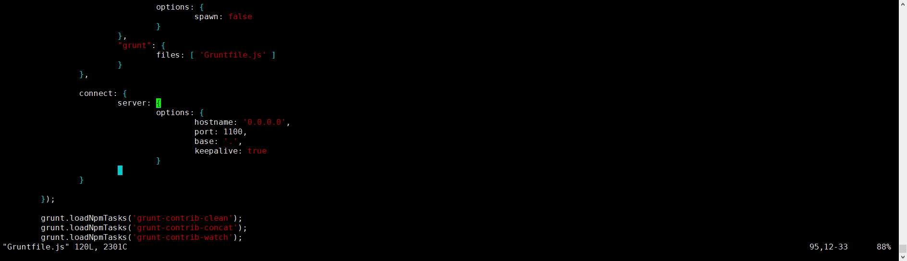
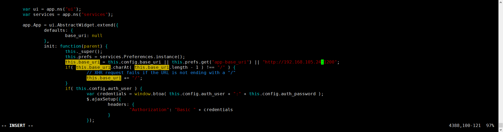

# 单机部署
[镜像地址](https://repo.huaweicloud.com/elasticsearch/)

## 部署
```text
# ======================== Elasticsearch Configuration =========================
#
# NOTE: Elasticsearch comes with reasonable defaults for most settings.
#       Before you set out to tweak and tune the configuration, make sure you
#       understand what are you trying to accomplish and the consequences.
#
# The primary way of configuring a node is via this file. This template lists
# the most important settings you may want to configure for a production cluster.
#
# Please consult the documentation for further information on configuration options:
# https://www.elastic.co/guide/en/elasticsearch/reference/index.html
#
# ---------------------------------- Cluster -----------------------------------
#
# Use a descriptive name for your cluster:
#
cluster.name: cnvd-es
#
# ------------------------------------ Node ------------------------------------
#
# Use a descriptive name for the node:
#
node.name: node-24
#
# Add custom attributes to the node:
#
#node.attr.rack: r1
#
# ----------------------------------- Paths ------------------------------------
#
# Path to directory where to store the data (separate multiple locations by comma):
#
path.data: /home/es/data
#
# Path to log files:
#
path.logs: /home/es/logs
#
# ----------------------------------- Memory -----------------------------------
#
# Lock the memory on startup:
#
#bootstrap.memory_lock: true
#
# Make sure that the heap size is set to about half the memory available
# on the system and that the owner of the process is allowed to use this
# limit.
#
# Elasticsearch performs poorly when the system is swapping the memory.
#
# ---------------------------------- Network -----------------------------------
#
# Set the bind address to a specific IP (IPv4 or IPv6):
#
network.host: 192.168.105.24
#
# Set a custom port for HTTP:
#
http.port: 1200
#
# For more information, consult the network module documentation.
#
# --------------------------------- Discovery ----------------------------------
#
# Pass an initial list of hosts to perform discovery when this node is started:
# The default list of hosts is ["127.0.0.1", "[::1]"]
#
# discovery.seed_hosts: ["192.168.105.25"]
#
# Bootstrap the cluster using an initial set of master-eligible nodes:
#
#cluster.initial_master_nodes: ["node-1", "node-2"]
#
# For more information, consult the discovery and cluster formation module documentation.
#
# ---------------------------------- Gateway -----------------------------------
#
# Block initial recovery after a full cluster restart until N nodes are started:
#
#gateway.recover_after_nodes: 3
#
# For more information, consult the gateway module documentation.
#
# ---------------------------------- Various -----------------------------------
#
# Require explicit names when deleting indices:
#
#action.destructive_requires_name: true

http.cors.enabled: true
http.cors.allow-origin: "*"
```

## 调整系统参数

```text
ERROR: [1] bootstrap checks failed
[1]: max virtual memory areas vm.max_map_count [65530] is too low, increase to at least [262144]
```
解决如上述启动错误

```text
sudo vi /etc/sysctl.conf
# 添加下面配置
vm.max_map_count=262144
# 保存退出后执行
sysctl -p

```

## 启动
非root启动
```text
./bin/elasticsearch -d
```

解决不能使用root启动问题
```text
./bin/elasticsearch -d -Des.insecure.allow.root=true
```

默认以root账号启动，修改/bin/elasticsearch

修改
```text
exec"$JAVA"$JAVA_OPTS$ES_JAVA_OPTS -Des.path.home="$ES_HOME" -cp "$ES_CLASSPATH" \
```
成为
```text
exec"$JAVA"$JAVA_OPTS$ES_JAVA_OPTS -Des.path.home="$ES_HOME" -Des.insecure.allow.root=true -cp "$ES_CLASSPATH"
```

## 验证

http://192.168.105.24:1200

## header 插件

安装nodejs

```text
cd /usr/local/bin
mkdir node
curl -O https://npm.taobao.org/mirrors/node/v10.14.1/node-v10.14.1-linux-x64.tar.gz
tar -xvf  node-v10.14.1-linux-x64.tar.gz
ln -s node-v10.14.1-linux-x64 node
vi /etc/profile
export NODE_HOME=/usr/local/bin/node/node  
export PATH=$NODE_HOME/bin:$PATH
source /etc/profile
node -v
npm -v
npm install -g grunt-cli
```

安装header
```text
cd /home/es/elasticsearch-plugins
curl -O https://codeload.github.com/mobz/elasticsearch-head/zip/master
mv master master.zip
unzip master.zip
cd elasticsearch-head-master
```
修改Gruntfile.js如下图



修改_site/app.js如下图



启动
```text
yum -y install bzip2
npm install
npm run start           
nohup npm run start
```

访问
ip:port


https://www.orchome.com/462
