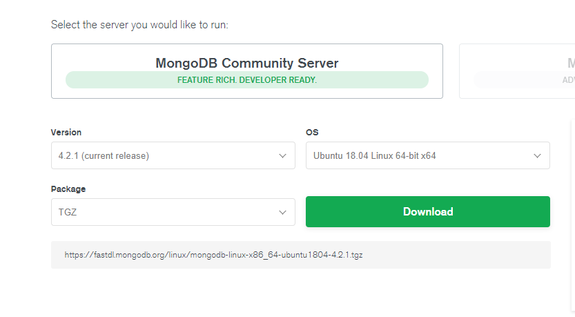

# MongoDB单机部署

## CentOS7.5部署
### 配置程序包管理系统（yum）
创建一个/etc/yum.repos.d/mongodb-org-4.2.repo文件，以便您可以使用yum以下命令直接安装MongoDB ：
```text
[mongodb-org-4.2]
name=MongoDB Repository
baseurl=https://repo.mongodb.org/yum/redhat/$releasever/mongodb-org/4.2/x86_64/
gpgcheck=1
enabled=1
gpgkey=https://www.mongodb.org/static/pgp/server-4.2.asc
```
### 安装MongoDB软件包

要安装最新的稳定版MongoDB，请发出以下命令：

```bash
sudo yum install -y mongodb-org
```

或者，要安装特定版本的MongoDB，请分别指定每个组件软件包，并将版本号附加到软件包名称中，如以下示例所示：

```bash
sudo yum install -y mongodb-org-4.2.5 mongodb-org-server-4.2.5 mongodb-org-shell-4.2.5 mongodb-org-mongos-4.2.5 mongodb-org-tools-4.2.5
```

您可以指定任何可用的MongoDB版本。但是yum ，当有新版本可用时，将升级软件包。为防止意外升级，请固定包装。要固定包，exclude请在/etc/yum.conf文件中添加以下指令：

```text
exclude=mongodb-org,mongodb-org-server,mongodb-org-shell,mongodb-org-mongos,mongodb-org-tools
```

### 安装完成之后，即可使用以下命令查看状态：
```text
systemctl status mongod.service　　# 查看mongod状态
systemctl start mongod.service　　# 启动
systemctl stop mongod.service 　　# 停止
systemctl enable mongod.service 　　# 自启
```

## 通用安装
### 准备工作

- 首先查看系统信息
```
cat /proc/cpuinfo | grep name | cut -f2 -d: | uniq -c
cat /proc/version
```
- [去官网](https://www.mongodb.com/download-center/community)下载和系统信息对应的版本，选择TGZ格式。


- 添加系统mongodb用户

[添加用户操作参考](../../os/linux/SUMMARY.md)

在用户目录下添加工作空间
```bash
mkdir -p /home/mongodb/stand-alone/data
mkdir -p /home/mongodb/stand-alone/log
cd /home/mongodb/stand-alone/log
touch log.log
```    
    
### 安装部署
- 安装部署
```bash
cd /usr/local/bin
mkdir mongodb
cd mongodb
curl -O https://fastdl.mongodb.org/linux/mongodb-linux-x86_64-ubuntu1804-4.2.1.tgz
tar -xzvf mongodb-linux-x86_64-ubuntu1804-4.2.1.tgz
ln -s mongodb-linux-x86_64-ubuntu1804-4.2.1 mongodb
```
- 环境配置

```bash
vim /etc/profile
export MONGODB_HOME=/usr/local/bin/mongodb/mongodb
export PATH=$PATH:$MONGODB_HOME/bin
```

### 启动方式一
- 启动服务
```bash
mongod --dbpath=/home/mongodb/stand-alone/data --logpath=/home/mongodb/stand-alone/log/log.log --logappend  
mongod --dbpath=/home/mongodb/stand-alone/data --logpath=/home/mongodb/stand-alone/log/log.log --logappend --bind_ip_all --port=27017 
mongod --dbpath=/home/mongodb/stand-alone/data --logpath=/home/mongodb/stand-alone/log/log.log --logappend --bind_ip_all --port=27017 --fork 
mongod --dbpath=/home/mongodb/stand-alone/data --logpath=/home/mongodb/stand-alone/log/log.log --logappend --bind_ip_all --port=27017 --fork --auth 
```
- 设置服务开机启动
```bash
echo "mongod --dbpath=/home/mongodb/stand-alone/data –logpath=/home/mongodb/stand-alone/log/log.log –logappend --bind_ip_all -–port=27017 --fork" >> /etc/rc.local
```
- 关闭服务
```bash
mongod  --shutdown  --dbpath=/home/mongodb/stand-alone/data
```
- 启动客户端
```bash
mongo
mongo --host=127.0.0.1 --port=27017
```

### 启动方式二  
- 在实例目录下编制配置文件，如命名为/home/mongodb/stand-alone/mongod.config，保存为utf8格式
- 添加如下配置信息到文件中
```bash
dbpath=/home/mongodb/stand-alone/data
logpath=/home/mongodb/stand-alone/log/log.log
logappend = true
port=27017 
fork=true 
#bind_ip = 0.0.0.0
journal=true 
quiet=true
```
- 启动服务
```bash
mongod -f /home/mongodb/stand-alone/mongod.config
```
  
### 其他配置信息可以参考 mongo -h
  
|参数|含义|
|---|---|
|quiet                |                安静输出                                                     |
|port arg             |                   指定服务端口号，默认端口27017                                     |
|bind_ip arg          |                      绑定服务IP，若绑定127.0.0.1，则只能本机访问，不指定默认本地所有IP            |
|logpath arg          |                      指定MongoDB日志文件，注意是指定文件不是目录                          |
|logappend            |                    使用追加的方式写日志                                           |
|pidfilepath arg      |                          PID File 的完整路径，如果没有设置，则没有PID文件                 |
|keyFile arg          |                      集群的私钥的完整路径，只对于Replica Set 架构有效                     |
|unixSocketPrefix arg |                               UNIX域套接字替代目录,(默认为 /tmp)                   |
|fork                 |               以守护进程的方式运行MongoDB，创建服务器进程                                 |
|auth                 |               启用验证                                                      |
|cpu                  |              定期显示CPU的CPU利用率和iowait                                      |
|dbpath arg           |                     指定数据库路径                                             |
|diaglog arg          |                      diaglog选项 0=off 1=W 2=R 3=both 7=W+some reads      |
|directoryperdb       |                         设置每个数据库将被保存在一个单独的目录                             |
|journal              |                  启用日志选项，MongoDB的数据操作将会写入到journal文件夹的文件里                 |
|journalOptions arg   |                             启用日志诊断选项                                    |
|ipv6                 |               启用IPv6选项                                                  |
|jsonp                |                允许JSONP形式通过HTTP访问（有安全影响）                                 |
|maxConns arg         |                       最大同时连接数 默认2000                                    |
|noauth               |                 不启用验证                                                   |
|nohttpinterface      |                          关闭http接口，默认关闭27018端口访问                         |
|noprealloc           |                     禁用数据文件预分配(往往影响性能)                                   |
|noscripting          |                      禁用脚本引擎                                             |
|notablescan          |                      不允许表扫描                                             |
|nounixsocket         |                       禁用Unix套接字监听                                       |
|nssize arg (=16)     |                           设置信数据库.ns文件大小(MB)                             |
|objcheck             |                   在收到客户数据,检查的有效性，                                       |
|profile arg          |                      档案参数 0=off 1=slow, 2=all                           |
|quota                |                限制每个数据库的文件数，设置默认为8                                       |
|quotaFiles arg       |                         number of files allower per db, requires --quota|
|rest                 |               开启简单的rest API                                             |
|repair               |                 修复所有数据库run repair on all dbs                            |
|repairpath arg       |                         修复库生成的文件的目录,默认为目录名称dbpath                       |
|slowms arg (=100)    |                            value of slow for profile and console log    |
|smallfiles           |                     使用较小的默认文件                                           |
|syncdelay arg (=60)  |                              数据写入磁盘的时间秒数(0=never,不推荐)                   |
|sysinfo              |                  打印一些诊断系统信息                                             |
|upgrade              |                  如果需要升级数据库                                              |

### 非正常关闭后重启
MongoDB非正常关闭会自动被锁上了，再次启动会报错，需要进入mongodb数据库文件所在的目录删除mongodb.lock文件
```
about to fork child process, waiting until server is ready for connections.
forked process: 2340
ERROR: child process failed, exited with error number 1
```
```
cd data
rm mongod.lock
mongod --repair --dbpath=/usr/local/mongodb/data  
```

## 客户端连接
```
mongo 
或者
mongo --host=127.0.0.1 --port=27017
```

## 参考资料
https://www.cnblogs.com/blackmanzhang/p/12677538.html
