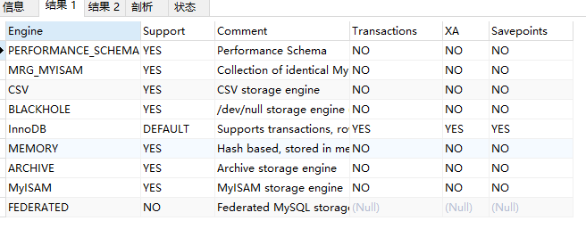

## 引擎信息查看
查询当前MySQL服务支持从引擎
> show engines;

- Engine：存储引擎的名称。

- Support：服务器对存储引擎的支持级别，如下表所示。

  |值|	含义|
  |---|---|
  |YES|	引擎受支持且处于活动状态|
  |DEFAULT|	就像一样YES，这是默认引擎|
  |NO|	不支持引擎|
  |DISABLED|	支持引擎，但已将其禁用|
 
 
- Comment：存储引擎的简要说明。

- Transactions：存储引擎是否支持事务。

- XA：存储引擎是否支持XA事务。

- Savepoints：存储引擎是否支持事务保存点。

查询当前MySQL服务默认的引擎
> show variables like '%storage_engine%';

查询指定的表使用的引擎
> show create table tableName;

## MyISAM

## Merge

## InnoDB

## Memory

## Mrg_Myisam

## Blackhole
